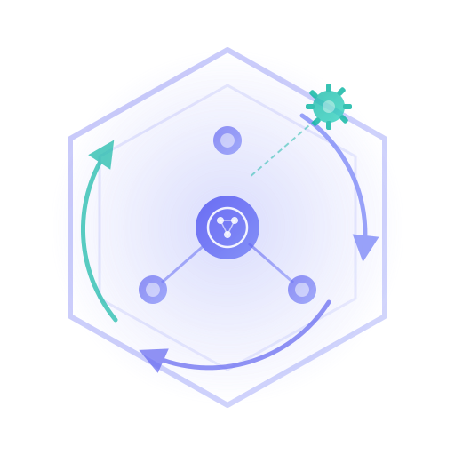
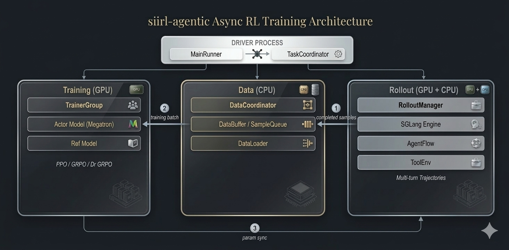

<div align="center">
  <h1>siirl-agentic</h1>
  <p><strong>Async Multi-Turn Reinforcement Learning for LLM Agents</strong></p>
  <p>Purpose-built for agent-tool interaction training. PPO & GRPO on SWE-style tasks<br/>with non-blocking async rollout and elastic tool infrastructure.</p>
</div>

<p align="center">
  <a href="https://github.com/sii-research/siirl-agentic/blob/main/LICENSE"></a>
  <a href="https://www.python.org/downloads/"></a>
  <a href="https://pytorch.org/"></a>
  <a href="https://github.com/sgl-project/sglang"></a>
  <a href="https://github.com/sii-research/siirl-agentic"></a>
</p>

---

## Table of Contents

- [Highlights](#highlights)
- [News](#news)
- [Architecture Overview](#architecture-overview)
- [Supported Algorithms](#supported-algorithms)
- [Quickstart](#quickstart)
- [Examples](#examples)
- [Documentation](#documentation)
- [Roadmap](#roadmap)
- [Contributing](#contributing)

---

## 🚀 Highlights

Training LLM agents to use tools requires **multi-turn interaction** — the model generates, the environment responds, repeat. Existing RL frameworks treat this as an afterthought. siirl-agentic solves it at the architecture level:

| Challenge                   | Existing frameworks          | siirl-agentic                                                           |
| --------------------------- | ---------------------------- | ----------------------------------------------------------------------- |
| **Multi-turn trajectories** | Manual state management      | NaiveFlow state machine — tracks turns, tokens, loss masks per step     |
| **Tool I/O blocking GPU**   | Synchronous, GPU waits       | Async MPMD — rollout and training are independent, GPU never waits      |
| **Tool environment scaling** | No built-in orchestration   | AIO 3-tier scheduler with Holt-Winters auto-scaling                     |
| **Loss contamination**      | Uniform mask across sequence | Per-turn masking — only model tokens contribute to gradients            |
| **Reward granularity**      | Single scalar per episode    | Per-turn `EnvResponse.rewards` + outcome reward from `AgentFlow.reward()` |

**Core capabilities:**

- **Native Agentic Trajectory Training** — Multi-turn tool calls, environment feedback, and per-token reward/logprob signals as first-class training primitives.

- **Pluggable AgentFlow Protocol** — Three-method contract (`preprocess`, `generate`, `reward`) with runtime injection via config. Switch domains with only a YAML update.

- **MPMD Async Execution Engine** — Trainer and Rollout as independent Ray actors, exchanging trajectories through a DataCoordinator buffer. No pipeline stalls.

- **AIO Elastic Tool Infrastructure** — Three-tier scheduler (Proxy → ResourcePool → WorkerManager) with Holt-Winters auto-scaling for tool environments.

---

## 📰 News

- **[2026/03]** First public release — async multi-turn agentic RL with PPO/GRPO, SGLang rollout, AIO tool infrastructure, SWE-bench agent.

---

## 🏗️ Architecture Overview

siirl-agentic uses a **Multi-Program Multi-Data (MPMD)** architecture where each major component runs as an independent Ray actor:

<div align="center">
  
  <p><i>Figure 1: siirl-agentic Architecture Overview (Disaggregated Mode)</i></p>
</div>

- **DataCoordinator** — Manages the sample lifecycle: loads Parquet datasets, distributes prompts, and buffers completed rollout samples for training.
- **RolloutManager** — Drives multi-turn agentic rollouts via SGLang inference engines and NaiveFlow state machine, with tool interaction through ToolEnv or AIO infrastructure.
- **TrainerGroup** — Runs distributed PPO/GRPO training (Actor, Reference, Critic models) on Megatron backend and synchronizes updated weights back to rollout engines.

---

## 📊 Supported Algorithms

| Algorithm         | Estimator                | Critic | Best for                              |
| ----------------- | ------------------------ | ------ | ------------------------------------- |
| **Dual-clip PPO** | GAE                      | Yes    | Dense rewards, fine-grained shaping   |
| **GRPO**          | Group-relative           | No     | Pass/fail rewards, memory-constrained |
| **Dr.GRPO**       | Group-relative (unnorm.) | No     | Absolute-scale rewards                |

**Supported models:** Any HuggingFace model that SGLang can serve — Qwen 2/2.5/3, LLaMA 3/3.1, DeepSeek V2/R1, Mistral/Mixtral, and more.

---

## ⚡ Quickstart

**Prerequisites:** Python 3.10+, 8x A100 80GB (recommended), CUDA 12.4+

```bash
# Install
git clone https://github.com/sii-research/siirl-agentic.git
cd siirl-agentic
pip install -e ".[gpu]"

# Set paths
export MODEL_PATH=/path/to/Qwen3-8B
export TRAIN_DATA_PATH=/path/to/deepscaler/train.parquet
export TEST_DATA_PATH=/path/to/deepscaler/test.parquet

# Run GRPO training (colocate mode, 8 GPUs shared)
bash examples/grpo_train/run_qwen3_8b_colocate.sh

# Or separated mode (4 train + 4 rollout)
bash examples/grpo_train/run_qwen3_8b_separated.sh
```

<details>
<summary><b>Expected output</b></summary>

```
INFO  | Ray is initialized. Time cost: 150.23 ms
INFO  | MainRunner started. Beginning workflow setup...
SUCCESS | DataCoordinator initialized: 2 batches/epoch, 60 total steps
SUCCESS | RolloutManager initialized. Router at: http://10.0.0.1:30000
SUCCESS | TrainerGroup initialized with 4 trainers
INFO  | Starting async training loop...
```

</details>

---

## 📦 Examples

All example scripts are in [`examples/`](examples/):

| Script                                  | Description                                  |
| --------------------------------------- | -------------------------------------------- |
| `grpo_train/run_qwen3_8b_colocate.sh`  | GRPO training, colocate mode (8 GPUs shared) |
| `grpo_train/run_qwen3_8b_separated.sh` | GRPO training, separated mode (4+4 GPUs)     |
| `ppo_train/run_qwen3_8b_colocate.sh`   | PPO training with critic, colocate mode      |
| `ppo_train/run_qwen3_8b_separated.sh`  | PPO training with critic, separated mode     |
| `AIO/run_qwen3_8b.sh`                  | Multi-turn agentic training with tool env    |

---

## 📚 Documentation

Full documentation with i18n (English + Chinese) is available as a MkDocs Material site:

```bash
cd docs/mkdocs
pip install mkdocs-material mkdocs-glightbox mkdocs-static-i18n
mkdocs serve
```

| Section      | Contents                                                                                                  |
| ------------ | --------------------------------------------------------------------------------------------------------- |
| Get Started  | [Installation](docs/mkdocs/docs/en/get_started/installation.md) · [Quickstart](docs/mkdocs/docs/en/get_started/quickstart.md) · [First Agentic Job](docs/mkdocs/docs/en/get_started/first_agentic_training_job.md) |
| Tutorials    | [DeepScaleR GRPO](docs/mkdocs/docs/en/tutorials/deepscaler_grpo.md) · [SWE Agent Training](docs/mkdocs/docs/en/tutorials/swe_agent_training.md) |
| Guides       | [Configuration](docs/mkdocs/docs/en/guides/configuration_system.md) · [Data Preparation](docs/mkdocs/docs/en/guides/data_preparation.md) · [Custom Rewards](docs/mkdocs/docs/en/guides/custom_rewards.md) · [PPO](docs/mkdocs/docs/en/guides/ppo_training.md) · [GRPO](docs/mkdocs/docs/en/guides/grpo_training.md) · [Multi-Turn](docs/mkdocs/docs/en/guides/agentic_multiturn.md) · [Tool Env](docs/mkdocs/docs/en/guides/tool_env_and_swe.md) · [Deployment](docs/mkdocs/docs/en/guides/deployment_modes.md) · [Debugging](docs/mkdocs/docs/en/guides/debugging.md) · [OOM](docs/mkdocs/docs/en/guides/handling_oom.md) |
| Concepts     | [How It Works](docs/mkdocs/docs/en/concepts/how_it_works.md) · [Architecture](docs/mkdocs/docs/en/concepts/architecture_overview.md) · [Algorithm Theory](docs/mkdocs/docs/en/concepts/algorithm_theory.md) · [AgentFlow](docs/mkdocs/docs/en/concepts/agentflow_protocol.md) |
| Reference    | [Config Reference](docs/mkdocs/docs/en/reference/config_reference.md) · [Algorithm Baselines](docs/mkdocs/docs/en/reference/algorithm_baselines.md) · [FAQ](docs/mkdocs/docs/en/reference/faq.md) · [Troubleshooting](docs/mkdocs/docs/en/reference/troubleshooting.md) · [Changelog](docs/mkdocs/docs/en/reference/changelog.md) |
| Contributing | [Code Structure](docs/mkdocs/docs/en/contributing/code_structure.md) · [Adding Flows](docs/mkdocs/docs/en/contributing/adding_new_executor_or_flow.md) · [Contributing Guide](docs/mkdocs/docs/en/contributing/contributing.md) |

---

## 🗺️ Roadmap

**Foundation**
- [ ] Algorithm plugin system — registry-based advantage/loss extensibility (DAPO, REINFORCE++, etc.)
- [ ] FSDP training backend alongside Megatron
- [ ] Reward system redesign — multi-reward composition and plugin architecture

**Capability**
- [ ] Online RL mode — passive rollout, session management, on-policy distillation
- [ ] Combined loss path — advantage composer for mixed RL + distillation objectives
- [ ] Multi-agent collaborative RL

**Performance**
- [ ] Async double-buffer pipeline (~30% throughput improvement)
- [ ] NCCL hybrid weight sync for multi-node scaling
- [ ] Colocate dynamic memory management and activation selective offload

---

## 🤝 Contributing

We welcome contributions! See the [Contributing Guide](docs/mkdocs/docs/en/contributing/contributing.md) for development setup, code style, and PR process.

```bash
# Development setup
git clone https://github.com/sii-research/siirl-agentic.git
cd siirl-agentic
pip install -e ".[dev]"
pre-commit install
```

---

## 📄 License

[Apache 2.0](LICENSE)

## 🙏 Acknowledgement

siirl-agentic is developed by **Shanghai Innovation Institute**. It builds on:

- [Ray](https://github.com/ray-project/ray) — Distributed computing
- [SGLang](https://github.com/sgl-project/sglang) — Inference engine
- [Megatron-LM](https://github.com/NVIDIA/Megatron-LM) — Training backend
