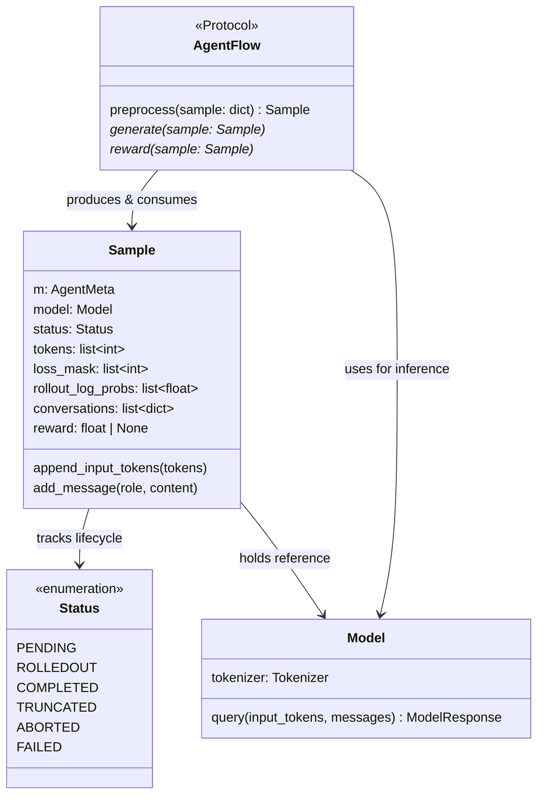
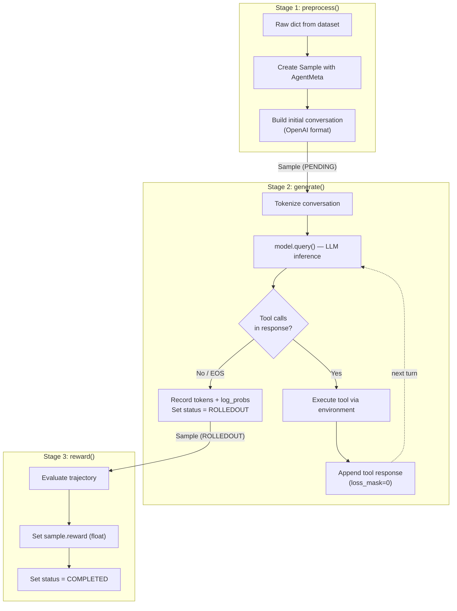

# AgentFlow Protocol

The AgentFlow Protocol is a three-method contract (`preprocess → generate → reward`) that decouples task-specific logic from the rollout engine, letting you swap or override any stage via YAML configuration without modifying framework internals.

!!! abstract "The key insight"
    AgentFlow is a three-method contract: `preprocess()`, `generate()`, `reward()`.
    If your task can be expressed as these three steps, you can plug it in without
    modifying any framework code. Think of it as a plugin interface for training tasks.

## Protocol Overview



*Figure 1: AgentFlow Protocol class diagram*

## Method Signatures

Every AgentFlow implementation provides exactly three methods:

```python
class AgentFlow(Protocol):
    def preprocess(self, sample: dict) -> Sample:
        """Convert a raw dataset dict into a Sample object ready for generation."""
        ...

    async def generate(self, sample: Sample):
        """Run model inference, optionally looping with tool/environment interaction."""
        ...

    async def reward(self, sample: Sample):
        """Compute a scalar reward for the completed trajectory."""
        ...
```

The `generate` and `reward` methods are `async` — the rollout engine awaits them concurrently across many samples.

## The Sample Object

`Sample` is a generic dataclass that carries the trajectory through all three stages. It lives in `siirl/execution/rollout/agentflow/base.py`:

| Field               | Type                  | Description                                                       |                                 |
| ------------------- | --------------------- | ----------------------------------------------------------------- | ------------------------------- |
| `m`                 | `AgentMeta` (generic) | Task-specific metadata defined by your flow                       |                                 |
| `model`             | `Model`               | Reference to the language model                                   |                                 |
| `status`            | `Sample.Status`       | Lifecycle state (see below)                                       |                                 |
| `tokens`            | `list[int]`           | Full token sequence (prompt + all response turns)                 |                                 |
| `loss_mask`         | `list[int]`           | `1` for model-generated tokens, `0` for environment/prompt tokens |                                 |
| `rollout_log_probs` | `list[float]`         | Token-level log-probabilities from the rollout policy             |                                 |
| `conversations`     | `list[dict]`          | Full conversation history in OpenAI format                        |                                 |
| `reward`            | `float \              | None`                                                             | Scalar reward set by `reward()` |

!!! note "Two Sample Classes"
    The `Sample` here (AgentFlow, `list` fields) is not the same as the `Sample` in `siirl/data_coordinator/sample.py` (NaiveFlow, `np.ndarray` fields). See [Two Sample classes](../concepts/architecture_overview.md#two-sample-classes) for details.

### Sample Status Lifecycle

```
PENDING → (after generate) → ROLLEDOUT → (after reward) → COMPLETED
                                       ↘ TRUNCATED  (max turns hit)
                                       ↘ ABORTED    (unrecoverable error)
                                       ↘ FAILED     (reward computation failed)
```

## Three-Stage Pipeline



*Figure 2: The three-stage AgentFlow pipeline*

## Registering a Flow

### Option A: Full Python Path (Recommended)

Reference the flow class directly in your training config using a `module:class` path:

```yaml
rollout:
  agentflow:
    name: "my_project.flows.my_task_flow:MyTaskFlow"
    python_path: ["/root/my_project"]   # add to sys.path if outside the package
```

The `load_agentflow(config, model)` function dynamically imports and instantiates the class with `(config, model)`.

### Option B: Built-in Registry Alias

Add an entry in `siirl/execution/rollout/agentflow/__init__.py`:

```python
BUILTIN_FLOW = {
    "swe": ".swe:agentflow",
    "my_task": ".my_task_flow:MyTaskFlow",  # add your flow here
}
```

Then reference by alias:

```yaml
rollout:
  agentflow:
    name: "my_task"
```

## Dynamic Function Injection via YAML

Instead of subclassing, you can override individual stages by pointing to Python functions in your config. This is useful when you want to reuse a built-in flow but customize only the reward logic:

```yaml
rollout:
  agentflow:
    name: "swe"                                              # use built-in SWE flow
    preprocess_fn: "my_project.preprocess:custom_preprocess" # override preprocess
    reward_fn: "my_project.rewards:custom_reward"            # override reward
    generate_fn: "my_project.generate:custom_generate"       # override generate (optional)
    python_path: ["/root/my_project"]
```

The injected functions are bound to the flow instance via `MethodType`, so `self` refers to the AgentFlow instance:

```python
# my_project/rewards.py
async def custom_reward(self, sample):
    """
    'self' is the AgentFlow instance — access self.config, self.model, etc.
    """
    assistant_response = sample.conversations[-1]["content"]
    sample.reward = my_scoring_function(assistant_response)
    sample.status = sample.Status.COMPLETED
```

## Custom Reward Example

The reward function receives a `Sample` after `generate()` completes. You assign a float to `sample.reward` and set the status:

```python
async def custom_reward(self, sample: Sample) -> None:
    """Example: exact-match reward against a reference answer."""
    # Get the final assistant message
    response = next(
        m["content"] for m in reversed(sample.conversations)
        if m["role"] == "assistant"
    )
    reference = sample.m.reference_answer   # stored in AgentMeta by preprocess()

    # Normalize and compare
    sample.reward = 1.0 if reference.strip().lower() in response.strip().lower() else 0.0
    sample.status = sample.Status.COMPLETED
```

For multi-turn trajectories, you can inspect `sample.conversations` to evaluate intermediate steps, or use `sample.tokens` and `sample.loss_mask` to work at the token level.

## Flow Selection via Config

The active flow for a training run is selected by `config.rollout.flow_function`:

- **`"naive"`** — Uses `NaiveFlow` directly (the production multi-turn state machine). This is the default path for tool-interaction training. NaiveFlow further reads `config.rollout.executor_module` to instantiate the right executor (e.g., `"naive"` → `NaiveExecutor`).
- **Custom module path** — Any value other than `"naive"` is interpreted as a Python path (`"module.path:ClassName"`) and loaded as an AgentFlow implementation via `load_agentflow(config, model)`.

```yaml
# Use the built-in NaiveFlow state machine (default)
rollout:
  flow_function: naive
  executor_module: naive    # loads NaiveExecutor inside NaiveFlow

# Use a custom AgentFlow implementation
rollout:
  flow_function: my_project.flows:MyTaskFlow
  agentflow:
    python_path: ["/root/my_project"]
```

NaiveFlow and the AgentFlow protocol are therefore **not competing** — NaiveFlow is the framework's built-in implementation, while AgentFlow is the interface for user-defined alternatives.

## Relationship to NaiveFlow

AgentFlow and NaiveFlow are **parallel systems** — not an inheritance hierarchy:

|                  | AgentFlow                                  | NaiveFlow                                          |
| ---------------- | ------------------------------------------ | -------------------------------------------------- |
| Purpose          | Pluggable task pipeline via Protocol       | Production multi-turn state machine                |
| Location         | `siirl/execution/rollout/agentflow/`       | `siirl/execution/rollout/agent_flow/naive_flow.py` |
| Sample type      | `agentflow/base.py::Sample` (Python lists) | `data_coordinator/sample.py::Sample` (np.ndarray)  |
| Configured via   | `rollout.agentflow.name`                   | `rollout.flow_function: naive`                     |
| Tool interaction | Via custom `generate()` logic              | Built-in state machine                             |

Use AgentFlow when you need a fully custom pipeline. Use NaiveFlow when you want the built-in multi-turn tool interaction loop.

## Next steps

- [Adding a New Executor or AgentFlow](../contributing/adding_new_executor_or_flow.md) — Follow the step-by-step tutorial to implement and register your own AgentFlow
- [Agentic Multi-Turn](../guides/agentic_multiturn.md) — Configure NaiveFlow for multi-turn tool-interaction training without writing a custom flow
- [Architecture Overview](architecture_overview.md) — Understand how AgentFlow fits into the broader component architecture and data flow
