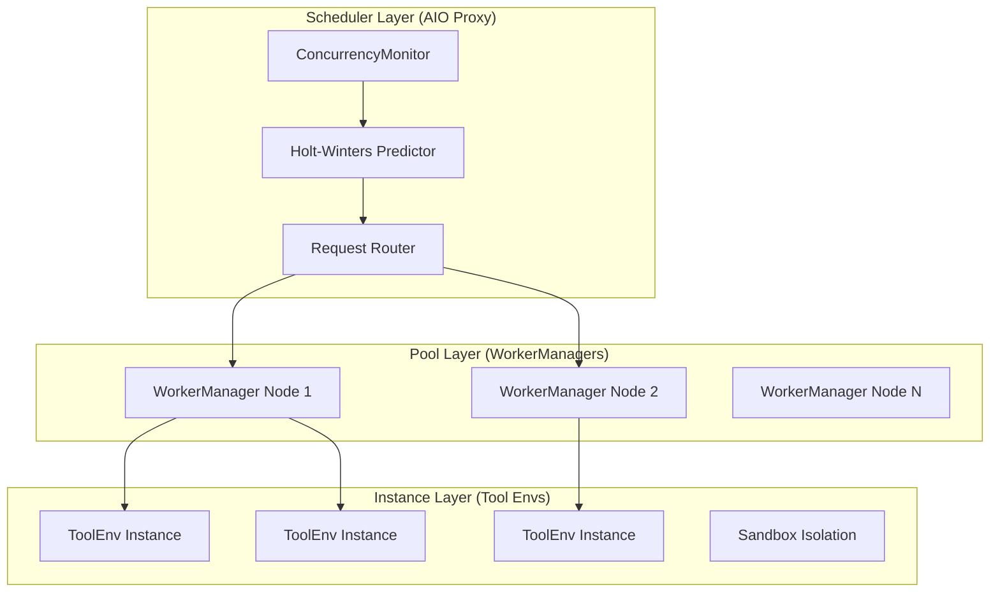
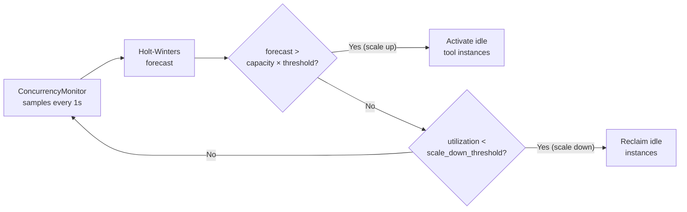

# AIO Infrastructure

AIO (Agentic I/O) is a three-layer distributed tool scheduling infrastructure that solves the throughput bottleneck caused by high-concurrency tool calls in long-horizon agentic rollout.

!!! abstract "The key insight"
    Tool instances are like cloud functions — AIO auto-scales them based on demand
    prediction (Holt-Winters forecasting). You declare what tools you need;
    AIO handles how many instances to run and where.

## The Tool Bottleneck Problem

Standard RL rollout assumes each sample has a single inference step: prompt in, response out. Agentic rollout is different — a single trajectory may trigger 5–50 tool calls, each taking anywhere from 100 ms (local search) to 30 s (web retrieval, code sandbox). At scale, 1,000 concurrent rollouts generating up to 50,000 tool calls per step overwhelm any single-node tool server, causing cascading timeouts that halt training.

AIO solves this by distributing tool execution across a dynamic pool of workers and using demand prediction to scale capacity ahead of load spikes.

## Three-Layer Architecture



*Figure 1: AIO three-layer architecture*

### Scheduler Layer (AIO Proxy)

The **Proxy** is the single entry point for all tool calls from rollout workers. It:

- Routes requests to available WorkerManagers using load-aware dispatch
- Runs `ConcurrencyMonitor` which samples active call counts every second
- Feeds measurements to the **Holt-Winters predictor** for demand forecasting
- Triggers scale-up/down events based on forecast vs. current capacity

The Proxy exposes a REST API: `POST /call`, `GET /status`, `GET /health`, `GET /metrics`.

### Pool Layer (WorkerManagers)

Each **WorkerManager** runs on a dedicated tool node and:

- Maintains a fixed pool of tool `ToolEnv` instances
- Auto-registers with the Proxy on startup
- Reports capacity and active call count for load balancing

You scale the pool horizontally by adding WorkerManager nodes without changing the Proxy or rollout worker configuration.

### Instance Layer (Tool Environments)

Each **ToolEnv Instance** is an isolated execution context for one tool type. Isolation can be process-level or container-level depending on the tool's security requirements.

Tool instances are allocated from the pool on `create()` and returned on `release()`. A single WorkerManager can host multiple tool types and multiple instances of each type.

## Demand Prediction with Holt-Winters

AIO uses **double exponential smoothing (Holt-Winters)** — a classical time-series method — to predict tool demand one time window ahead:

```
Level(t)  = α × observed(t)  + (1 - α) × (Level(t-1) + Trend(t-1))
Trend(t)  = β × (Level(t) - Level(t-1)) + (1 - β) × Trend(t-1)
Forecast  = Level(t) + Trend(t)
```

Where:
- `α` (default: 0.3) controls how quickly the level adapts to new observations
- `β` (default: 0.1) controls how quickly the trend component adapts

Holt-Winters is chosen over simpler moving-average methods because agentic rollout has a predictable trend: tool call demand rises sharply when a new rollout batch starts and falls at the end. Trend-aware forecasting scales up capacity before saturation, not after.

## Auto-Scaling Behavior



*Figure 2: Auto-scaling decision loop*

Configuration:

```yaml
auto_scaling:
  enabled: true
  algorithm: holt_winters
  scale_up_threshold: 0.8     # scale up when utilization > 80%
  scale_down_threshold: 0.3   # scale down when utilization < 30%
  min_instances: 1            # minimum instances per WorkerManager
  max_instances: 20           # maximum instances per WorkerManager
  alpha: 0.3                  # Holt-Winters level smoothing
  beta: 0.1                   # Holt-Winters trend smoothing
```

## Tool Instance Management

### Lifecycle

Each tool call goes through a three-phase lifecycle managed by NaiveFlow:

```
create(create_kwargs) → step(action) → release(instance_id)
```

1. **`create()`** — allocates an instance from the WorkerManager's pool and returns `(instance_id, EnvResponse)`
2. **`step()`** — executes the tool action within the allocated instance
3. **`release()`** — returns the instance to the pool for reuse

This lifecycle ensures that stateful tools (e.g., a browser session, a running sandbox) remain associated with the correct rollout sample across multiple turns.

### Parallel Execution

When `max_parallel_calls > 1`, NaiveFlow dispatches multiple tool calls within a single turn using `asyncio.gather()`. Each call follows the full `create → step → release` lifecycle independently:

```python
results = await asyncio.gather(*[
    self._step(agent_data, call) for call in tool_calls[:max_parallel_calls]
])
```

This means a single rollout sample can exercise up to `max_parallel_calls` tool instances simultaneously, multiplying effective throughput when tools are IO-bound.

## Concurrency Resolution

Before AIO launches, siirl-agentic resolves the effective concurrency for both the training server and rollout requests. This is handled in `siirl/execution/rollout/concurrency.py`:

- **`resolve_train_server_concurrency(config)`** — Determines how many concurrent requests the SGLang server accepts. Derived from `rollout.train_server_concurrency` if set; otherwise auto-computed from available GPU memory and model size.
- **`resolve_rollout_concurrency(config)`** — Determines the number of in-flight rollout requests per SGLang engine. The effective value is `min(train_server_concurrency, rollout_batch_size × n)`, preventing the request queue from growing unboundedly when rollout is faster than training.

!!! warning "Tool call queue behavior"
    Tool calls beyond `max_parallel_calls` within a single rollout sample are **queued by `asyncio.gather()`**, not silently discarded. Only the first `max_parallel_calls` calls in a single turn are executed concurrently; extras in that turn are dropped. Calls across turns are unaffected — each turn dispatches up to `max_parallel_calls` independently. Set `max_parallel_calls: 1` (default) unless you have verified your tool environment handles concurrent access correctly.

## Integration with siirl-agentic

Configure rollout to route tool calls through AIO:

```yaml
rollout:
  multiturn:
    env_type: tool_env
    env_kwargs:
      tool_format: hermes
      aio_proxy_url: http://proxy-host:8080
```

Or via environment variable:

```bash
export AIO_PROXY_URL=http://proxy-host:8080
```

The `AIOSearchEnv` class (`siirl/environment/tool_env/aio_search_env.py`) translates `FunctionCall` objects from the tool parser into HTTP requests to the Proxy's `/call` endpoint.

## Key Design Decisions

### Centralized Proxy, Distributed Workers

The Proxy is a lightweight coordinator — it holds no tool state. All execution happens in WorkerManagers. This means you can restart or upgrade WorkerManagers without touching the Proxy, and you can run the Proxy on a CPU-only node.

### Pull vs. Push Scaling

WorkerManagers do not push their status — the Proxy polls them for capacity metrics. This avoids the thundering-herd problem where many WorkerManagers simultaneously flood the Proxy with heartbeats during high-load periods.

### Forecast Over Reactive

Reactive autoscalers (scale when saturated) cause training stalls while new instances warm up. AIO's forecast-based approach scales ahead of demand using the predictable rhythm of rollout batches, keeping queue depth near zero under normal conditions.

## Next steps

- [AIO Tool Infrastructure Guide](../guides/aio_tool_infrastructure.md) — Follow the operational guide to deploy, configure, and scale the system described here
- [Deployment Modes](../guides/deployment_modes.md) — Choose the GPU topology that complements your AIO deployment
- [Performance Tuning](../guides/performance_tuning.md) — Tune AIO capacity and concurrency settings to eliminate tool-latency bottlenecks
