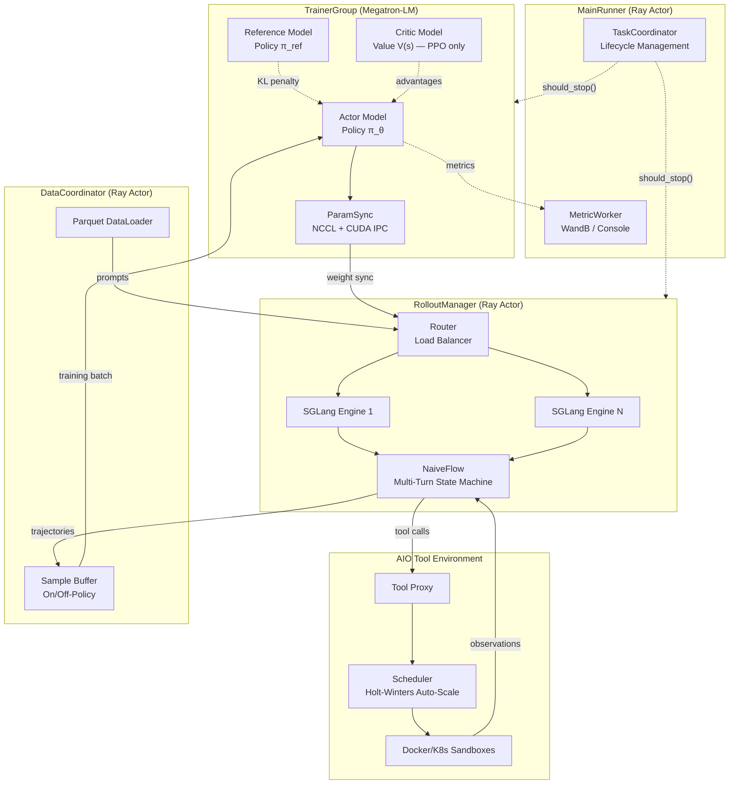
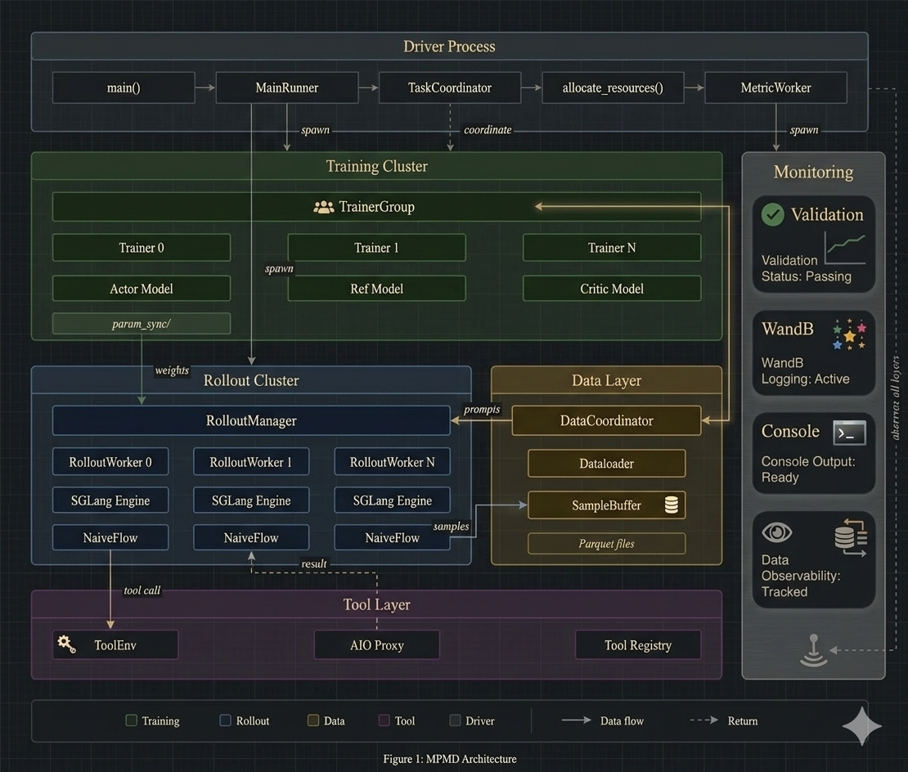
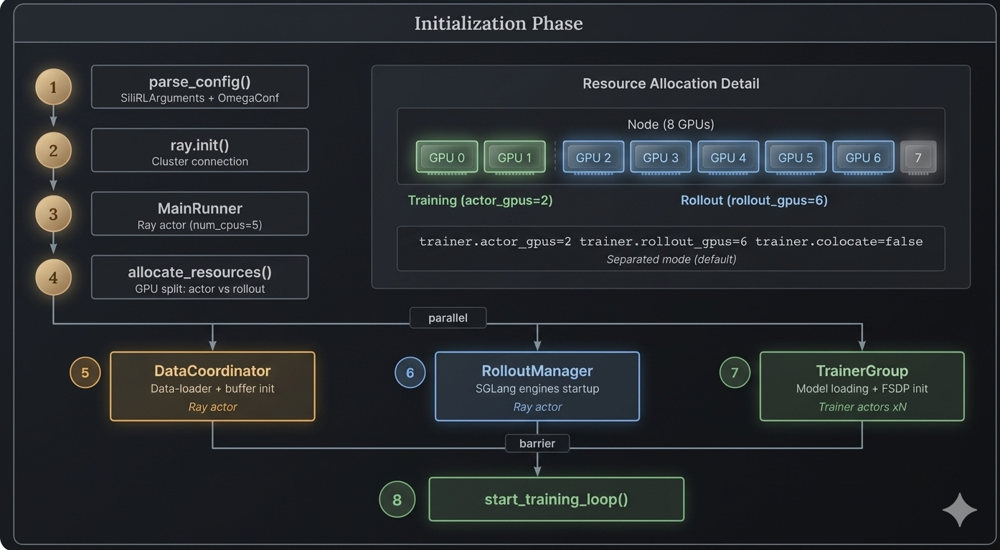
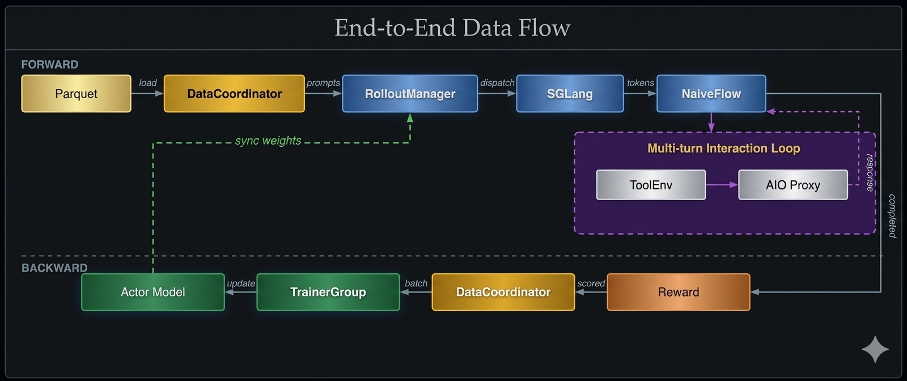
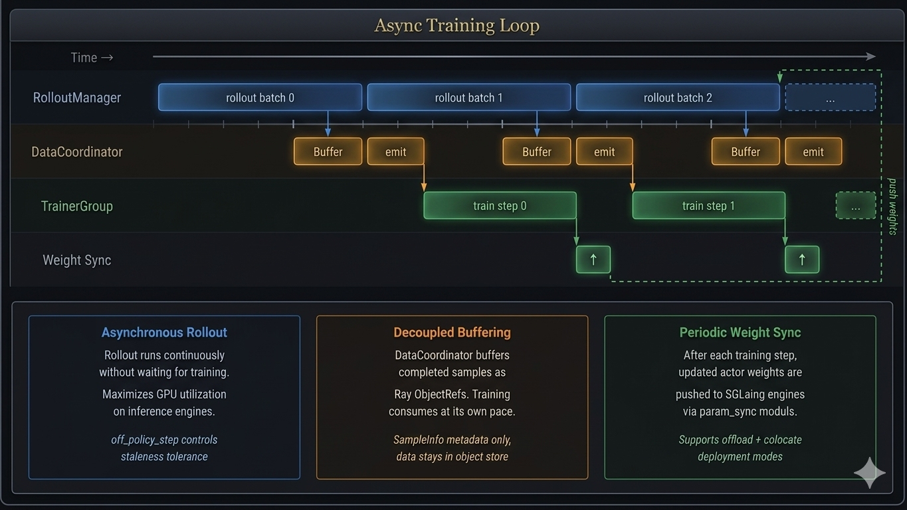
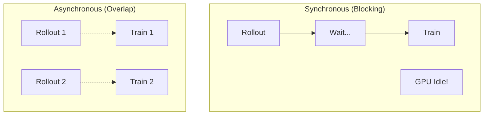

# Architecture Overview

*A complete picture of siirl-agentic's component architecture, data flow, and training lifecycle.*

!!! abstract "The key insight"
    siirl-agentic separates *what happens* (rollout, training, reward) from
    *when it happens* (async scheduling). This separation is why you can add
    new task types without touching the training loop.

## Design Philosophy

siirl-agentic is built on three architectural principles:

1.  **Asynchronous MPMD** — The major components (`RolloutManager` and `DataCoordinator` as Ray actors, `TrainerGroup` as a coordinator managing Ray trainer actors) run independently. No component blocks another.
2.  **Agentic-first data path** — The sample lifecycle natively supports multi-turn trajectories with tool interaction, per-turn loss masking, and variable-length sequences.
3.  **Configuration over code** — Task-specific logic (AgentFlow, reward functions, tool environments) is injected via config, not hardcoded in framework internals.

## How this differs from single-turn RL frameworks

| Aspect           | Single-turn (verl, OpenRLHF, TRL) | siirl-agentic                                |
| ---------------- | --------------------------------- | -------------------------------------------- |
| Rollout          | One prompt → one response         | Multi-turn trajectory with tool calls        |
| Scheduling       | Synchronous batches               | Async — rollout overlaps training            |
| Tool interaction | External, hacked on               | Native ToolEnv with state machine            |
| Loss masking     | Response-level                    | Per-turn, distinguishing model vs env tokens |
| Scaling          | Manual GPU allocation             | Ray-based auto-scaling with AIO              |

## System Architecture

The following diagram shows how the major Ray actors and coordinators connect. Solid arrows represent the primary data flow; dashed arrows represent auxiliary signals (KL penalty, advantage estimates, lifecycle events).



A detailed version of this diagram is shown below:

<figure markdown>
  { loading=lazy .glightbox data-gallery="fig1" }
  <figcaption>Figure 1: Global System Architecture </figcaption>
</figure>

## End-to-End Data Flow

<figure markdown>
  { loading=lazy .glightbox data-gallery="fig2" }
  <figcaption>Figure 2: End-to-End Data Flow</figcaption>
</figure>

## Component Responsibilities

### MainRunner (`siirl/async_train.py`)

The `MainRunner` is a Ray actor (with `num_cpus=5` reservation) that orchestrates the entire training lifecycle:

1.  Parse `SiiRLArguments` configuration via `parse_config()` (uses `argparse` + `OmegaConf.from_cli()`)
2.  Create `TaskCoordinator` for lifecycle management
3.  Allocate GPU resources (actor vs rollout split)
4.  Initialize `DataCoordinator`, `MetricWorker`, `RolloutManager`, `TrainerGroup`
5.  Start the async training loop
6.  Monitor status via `TaskCoordinator`
7.  Handle cleanup and failure reporting

### TrainerGroup (`siirl/worker/actor/trainer_group.py`)

A **plain Python coordinator class** (not a Ray actor) that manages distributed Ray trainer actors:

-   **Actor model** — Policy model being trained (Megatron backend)
-   **Reference model** — Frozen copy for KL divergence computation
-   **Critic model** — Value function estimator (PPO only, not used in GRPO)
-   **Parameter sync** — Pushes updated weights to RolloutManager's SGLang engines after each training step

Key files:

-   `siirl/worker/actor/trainer.py` — Per-rank training logic (forward, loss, backward, optimizer step)
-   `siirl/worker/actor/trainer_group.py` — Multi-rank coordination
-   `siirl/worker/actor/checkpoint_manager.py` — Save/load checkpoints
-   `siirl/engine/param_sync/` — Weight synchronization to rollout engines

### RolloutManager (`siirl/worker/rollout/rollout_manager.py`)

A **Ray actor** that manages inference engines and dispatches rollouts:

-   **SGLang engines** — One or more SGLang instances for fast LLM inference
-   **Router** — Load balances requests across engines (when multiple engines)
-   **NaiveFlow** — Multi-turn rollout execution with tool interaction
-   **Validation** — Separate validation rollouts with different sampling params

Key files:

-   `siirl/worker/rollout/rollout_manager.py` — Engine lifecycle, request dispatch
-   `siirl/worker/rollout/rollout_worker.py` — Per-engine rollout execution
-   `siirl/execution/rollout/agent_flow/naive_flow.py` — Multi-turn state machine
-   `siirl/execution/rollout/concurrency.py` — Concurrency parameter resolution

### DataCoordinator (`siirl/data_coordinator/`)

A **Ray actor** that manages the sample lifecycle from prompt to training. It stores sample metadata (`SampleInfo`) and Ray `ObjectRef`s, not the actual sample data:

-   **Dataloader** — Loads and distributes training/validation datasets
-   **Sample buffering** — Buffers completed rollout sample references for training consumption
-   **Off-policy support** — Accepts data from configurable version window (`off_policy_step`, default: 0 = on-policy only)

Key files:

-   `siirl/data_coordinator/data_buffer.py` — `init_data_coordinator()`, the `DataCoordinator` Ray actor class
-   `siirl/data_coordinator/dataloader/` — Dataset loading and distribution
-   `siirl/data_coordinator/sample.py` — `Sample` Pydantic BaseModel with prompt, response, mask, reward
-   `siirl/data_coordinator/protocol.py` — Data exchange protocol

### MetricWorker (`siirl/utils/metrics/`)

Collects and reports training metrics to WandB and/or console. Initialized by `MainRunner` before the training loop.

### ValidateProgressMonitor (`siirl/worker/validate/`)

Tracks validation rollout progress and reports validation metrics.

### TaskCoordinator (`siirl/utils/task_coordinator.py`)

Centralized lifecycle management for distributed training:

-   `should_stop()` — Polled by all components to check if training should end
-   `report_failure(source, reason)` — Any component reports failures for propagation
-   `report_completed(source)` — Signal successful completion
-   `request_shutdown(reason, source)` — Graceful shutdown request (note: parameter order is `reason` first, then `source`)
-   Event logging for post-mortem debugging

## Training Lifecycle

### Initialization Phase

<figure markdown>
  { loading=lazy .glightbox data-gallery="fig3" }
  <figcaption>Figure 3: Initialization Phase</figcaption>
</figure>

### Training Loop (Async)

<figure markdown>
  { loading=lazy .glightbox data-gallery="fig4" }
  <figcaption>Figure 4: Async Training Loop</figcaption>
</figure>

### Shutdown Phase

1.  Training epochs exhausted → `coordinator.report_completed()`
2.  All components detect `should_stop() == True`
3.  `MainRunner._cleanup_and_report()` logs summary
4.  Ray shutdown

## Deployment Modes

### Separated Mode (Default)

GPUs are split between training and rollout:

```
Node (8 GPUs):
  GPU 0-1: Actor/Ref/Critic (TrainerGroup)    # default: actor_gpus=2
  GPU 2-7: SGLang Engines (RolloutManager)    # default: rollout_gpus=6
```

Config:

``` yaml
trainer:
  actor_gpus: 2       # default
  rollout_gpus: 6     # default
  colocate: false     # default
```

### Colocated Mode

Training and rollout share the same GPUs via weight offloading:

```
Node (8 GPUs):
  GPU 0-7: Shared (offload rollout weights during training, vice versa)
```

Config: `trainer.colocate=true`

Colocated mode automatically:

-   Enables parameter offloading (`megatron.param_offload=true`)
-   Clamps `rollout.gpu_memory_utilization` to 0.45
-   Disables `validate_reuse_train_gpus`

## Key Data Structures

### SiiRLArguments (`siirl/params/training_args.py`)

Top-level configuration dataclass:

``` python
@dataclass
class SiiRLArguments:
    data: DataArguments              # Dataset paths, batch sizes, tokenization
    actor_ref: ActorRefArguments     # Actor, Ref, Algorithm, Checkpoint config
    rollout: RolloutArguments        # SGLang engine, sampling, multi-turn
    critic: CriticArguments          # Critic model (PPO only)
    trainer: TrainingArguments       # Epochs, GPU allocation, checkpointing
    custom_reward_function: CustomRewardArguments  # Custom reward config
```

### Sample (`siirl/data_coordinator/sample.py`) { #two-sample-classes }

Pydantic BaseModel that carries data through the NaiveFlow pipeline:

```
Sample:
  prompts: np.ndarray | None      # Prompt token IDs
  responses: np.ndarray | None    # Response token IDs (model + env)
  response_mask: np.ndarray | None  # 1 = model token, 0 = env token
  rollout_log_prob: np.ndarray | None  # Token-level log probabilities
  rewards: float                  # Scalar reward (nullable, default None)
  data_source: str                # Dataset source identifier
  reward_model: dict              # Ground truth for reward computation
```

!!! note "Two Sample classes"
    siirl-agentic has two classes named `Sample`:

    - `siirl.data_buffer.Sample` — Training-side data container (actor output, rewards, advantages)
    - `siirl.execution.rollout.agentflow.base.Sample` — Rollout-side trajectory container (messages, tool calls, states)

    These serve different purposes and are not interchangeable. When reading code, check which import you're looking at.

## Weight Sync Protocol

After each training step, updated model weights must reach the SGLang inference engines before the next rollout batch starts. This is handled by `ParamSyncDistributed` in `siirl/engine/param_sync/`.

The sync uses two optimizations to minimize latency:

1. **`FlattenedTensorBucket`** — Parameters are packed into contiguous memory buffers (buckets) before broadcast, reducing the number of NCCL calls from one-per-parameter to one-per-bucket. Bucket size is configurable; the default groups all parameters for a single transfer.

2. **CUDA IPC handles (zero-copy)** — When trainer and rollout processes share a node, weights are shared via CUDA Inter-Process Communication handles rather than copied over the network. The receiving SGLang process maps the trainer's GPU buffer directly, eliminating a device→host→device round-trip.

For multi-node deployments, NCCL broadcast is used between nodes and IPC handles are used within a node.

## Design Trade-offs

### Why Asynchronous at All?

Synchronous pipelines force training GPUs to sit idle while rollout waits for the slowest tool call:



*Figure 5: Synchronous vs Asynchronous execution*

In agentic workloads, tool call latency is dominated by response time variation (100 ms for local tools, 30 s for web APIs). The MPMD architecture decouples training from rollout: the Trainer keeps updating the policy while the RolloutManager collects new trajectories.

### Separation vs Simplicity

The MPMD architecture introduces complexity in debugging and deployment compared to monolithic designs. We accept this trade-off because:

- GPU utilization gains from async overlap far outweigh operational complexity
- Ray provides robust actor-level error isolation and retry
- The `TaskCoordinator` centralizes lifecycle management for observability

### Configuration Flexibility vs Safety

The dynamic function injection system (`MethodType` binding) is powerful but requires users to write correct Python functions. Risks are mitigated via:

- Type-annotated protocol interfaces (`AgentFlow`, `Model`, `Sample`)
- Validation at load time with clear error messages
- Built-in flows as reference implementations

### Async Data Freshness vs Throughput

Off-policy data from older model versions may reduce training signal quality. This is handled via:

- Configurable `off_policy_step` window (default: 0, meaning on-policy only) to bound data staleness
- Version tagging on all samples for auditability
- The throughput gain from continuous GPU utilization outweighs mild off-policy degradation in practice

## Next steps

- [Async Training Lifecycle](async_training_lifecycle.md) — Trace the exact sequence of events through the startup, training, and shutdown phases
- [How It Works](how_it_works.md) — A gentler narrative introduction to the same concepts covered here
- [AgentFlow Protocol](agentflow_protocol.md) — Understand how the pluggable flow layer fits into the architecture
