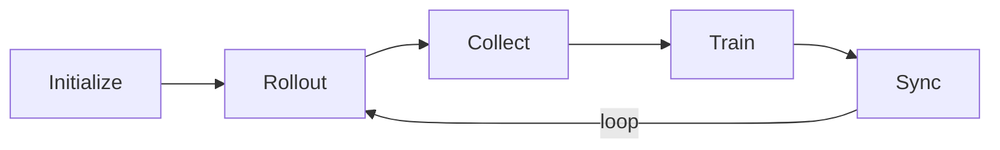
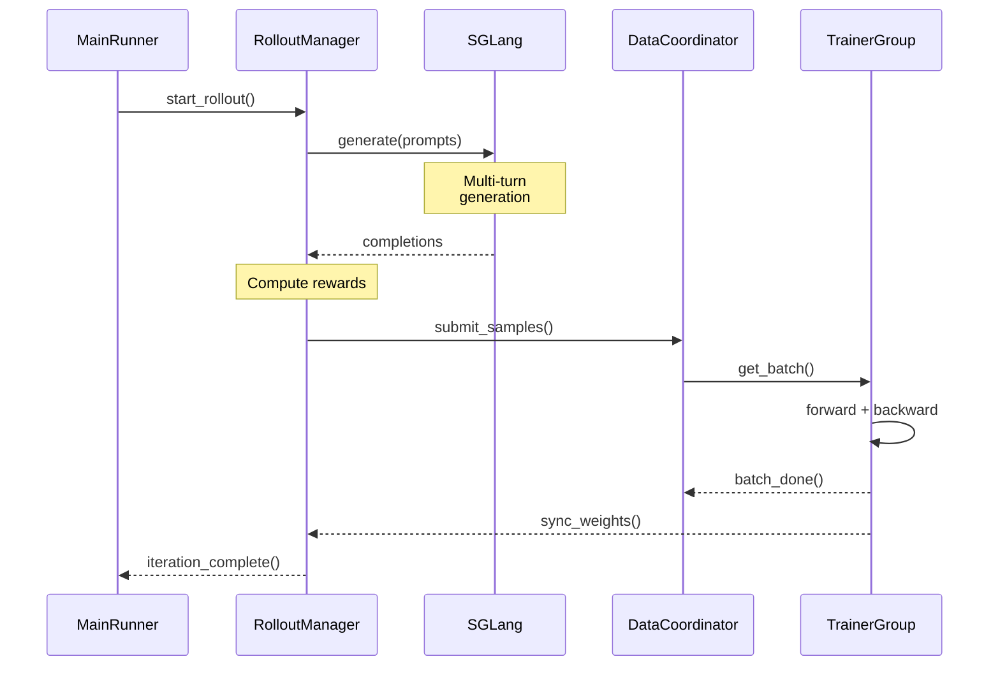
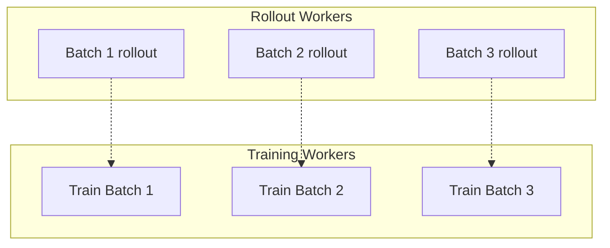
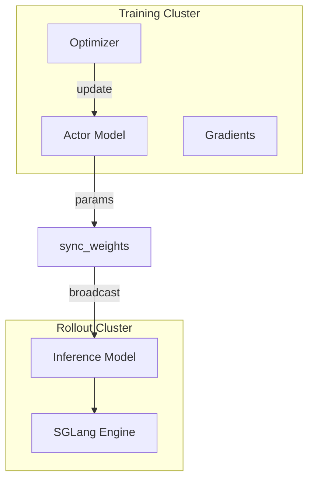

# Async Training Lifecycle

siirl-agentic's training loop runs rollout and training concurrently across independent Ray actors, eliminating the GPU idle time that would otherwise accumulate when tool calls have variable latency.

!!! abstract "The key insight"
    The training loop has three phases (rollout → reward → train) that run
    **asynchronously**. While batch N trains, batch N+1 is already generating
    rollouts. This is what makes the framework fast — GPUs never idle.

## Why Asynchronous?

In a **synchronous** RL pipeline, training cannot start until the current rollout batch completes. For agentic workloads where a single tool call can take anywhere from 100 ms (local tool) to 30 s (web API), this means training GPUs wait on the slowest sample in every batch:

```
[Rollout batch]──────────────────────[Wait]──[Train]──[Rollout batch]──...
 GPU: rollout   rollout   rollout     idle    training
```

siirl-agentic uses an **asynchronous MPMD** architecture where `RolloutManager` and `TrainerGroup` are independent Ray actors:

```
[Rollout 1]────────────────────────────────────────────────...
[Rollout 2]──────────────────────────────────────────...
[Train 1]──────────────────[Train 2]──────────────────[Train 3]...
```

`DataCoordinator` buffers completed rollout samples between the two pipelines. The Trainer pulls batches as soon as enough samples are ready, regardless of whether the current rollout batch has finished. This overlap is the key source of GPU efficiency in agentic training.

**Concurrency resolution:** The number of concurrent rollout requests per SGLang engine is determined by `siirl/execution/rollout/concurrency.py`. The effective concurrency is `min(train_server_concurrency, rollout_batch_size × n)`, preventing the request queue from growing unboundedly if rollout outpaces training.

**Off-policy tolerance:** Because rollout and training run at different rates, some training samples may come from a slightly older model version. The `off_policy_step` parameter (default: 0) bounds how many training steps old a sample can be before it is discarded. Setting `off_policy_step: 2` allows samples up to two training steps stale, which increases throughput at the cost of mild off-policy bias.

## Overview

siirl-agentic's training lifecycle consists of three major phases:

1.  **Initialization** — Config parsing, resource allocation, component startup
2.  **Async Training Loop** — Continuous rollout → buffer → train cycle
3.  **Shutdown** — Graceful termination, checkpoint saving, resource cleanup

## Phase 1: Initialization

The `main()` function in `siirl/async_train.py` drives initialization:



*Figure 1: Initialization Flow*

Step-by-step:

1.  **Ray initialization** — Start or connect to a Ray cluster with runtime env vars (`TOKENIZERS_PARALLELISM`, `NCCL_DEBUG`, etc.).
2.  **Config parsing** — `parse_config()` uses `argparse` + `OmegaConf.from_cli()` to parse CLI arguments and creates a `SiiRLArguments` dataclass hierarchy. Note: this does NOT load YAML files directly; configuration is passed via CLI arguments in OmegaConf dot-notation (e.g., `trainer.total_epochs=50`).
3.  **MainRunner launch** — A dedicated Ray actor (with `num_cpus=5` reservation) is created to orchestrate the workflow. This isolates the main process.
4.  **TaskCoordinator** — `create_coordinator()` creates a named Ray actor for centralized lifecycle management. All components reference this actor.
5.  **Resource allocation** — `allocate_resources(config)` splits available GPUs between training and rollout based on `trainer.actor_gpus` (default: 2) and `trainer.rollout_gpus` (default: 6).
6.  **DataCoordinator init** — Creates the `DataCoordinator` Ray actor and starts the dataloader for prompt distribution.
7.  **MetricWorker init** — Creates a `MetricWorker` for metrics collection and reporting.
8.  **RolloutManager init** — Starts SGLang inference engines, initializes the router, and prepares NaiveFlow instances. In colocated mode, this must complete before trainer init.
9.  **TrainerGroup init** — Initializes Actor, Reference, and (for PPO) Critic models with Megatron backend. Loads checkpoint if `resume_mode != "disable"`.

### Colocated Mode Special Handling

When `trainer.colocate=true`, the initialization order changes:

1.  RolloutManager must fully initialize first
2.  `offload_for_train()` is called to free GPU memory for trainer init
3.  Only then does `trainer_group.init_actors()` proceed
4.  `gpu_memory_utilization` is clamped to 0.45
5.  `param_offload` is forced on for all Megatron configs

## Phase 2: Async Training Loop

Once initialization completes, the async training loop begins:

### Detailed Component Interaction



*Figure 2: Detailed Async Training Sequence*

### Loop Architecture



*Figure 3: Async Loop Architecture*

The loop operates asynchronously:

-   **RolloutManager** continuously fetches prompts via `run_dataloader()` and dispatches rollouts. Each `RolloutWorker` runs `NaiveFlow` which interacts with tools.
-   **DataCoordinator** collects completed sample metadata and ObjectRefs. When enough samples accumulate for a training batch, they become available for the Trainer.
-   **TrainerGroup** pulls training batches and executes PPO or GRPO updates. After each update, parameter sync pushes new weights to the SGLang engines.

Key asynchronous properties:

-   Rollout and training run **concurrently** — the Trainer does not wait for all rollouts to finish before starting a training step.
-   **Off-policy tolerance** — `off_policy_step` controls how many training steps old a sample can be before it is discarded (default: 0, meaning on-policy only).
-   **Continuous GPU utilization** — While the Trainer updates weights, the RolloutManager is already collecting new trajectories.

### NaiveFlow State Machine

Each sample passes through the `NaiveFlow` state machine: `PENDING → GENERATING → PROCESSING_ENV → GENERATING → ... → TERMINATED`. For the complete NaiveFlow state machine, see [Agentic Multi-Turn: State Machine](../guides/agentic_multiturn.md#naiveflow-state-machine).

## Phase 3: Shutdown

Shutdown is coordinated through the `TaskCoordinator`:



*Figure 4: Shutdown Flow*

**Normal shutdown:**

1.  All training epochs are exhausted
2.  `TrainerGroup` calls `coordinator.report_completed()`
3.  All components polling `coordinator.should_stop()` receive `True`
4.  `MainRunner._cleanup_and_report()` logs the final summary
5.  `ray.shutdown()` cleans up the cluster

**Failure shutdown:**

1.  Any component catches an exception
2.  It calls `coordinator.report_failure(source, reason)`
3.  `should_stop()` returns `True` for all components
4.  `MainRunner` detects the failure, logs diagnostics, and re-raises

**Key config parameters:**

| Parameter                 | Default | Description                                                  |
| ------------------------- | ------- | ------------------------------------------------------------ |
| `trainer.total_epochs`    | 30      | Number of training epochs                                    |
| `trainer.off_policy_step` | 0       | Max staleness of training samples (0 = on-policy only)       |
| `trainer.colocate`        | false   | Whether to share GPUs between training and rollout           |
| `trainer.resume_mode`     | "auto"  | Checkpoint resume strategy: "auto", "disable", "resume_path" |

## DataCoordinator Internals

The `DataCoordinator` (`siirl/data_coordinator/data_buffer.py`) manages sample references between rollout and training. Internally it maintains:

- **`_sample_queue: deque`** — A FIFO queue of `SampleInfo` objects. Each `SampleInfo` holds metadata plus a Ray `ObjectRef` to the actual sample (stored in the Ray object store, not in the coordinator's memory).
- **`_cache`** — A dict from `sample_id` to `ObjectRef` for fast lookup when the trainer requests a specific batch.

**Length-balancing algorithm:** When multiple rollout workers submit samples concurrently, the coordinator enforces a per-worker quota to prevent any single worker from flooding the queue. When `get_batch()` is called, it assembles a batch from the front of `_sample_queue`, resolving `ObjectRef`s via `ray.get()` only at consumption time.

**Off-policy filtering:** Each `SampleInfo` carries a `weight_version` field — the training step at which the rollout model weights were last synced. `get_batch()` applies a `min_version` filter: `weight_version >= (current_step - off_policy_step)`. Samples older than this threshold are dropped rather than returned to the trainer. With `off_policy_step=0` (default), only samples generated with the current model version are used.

## Colocate Mode: `offload_for_train()` / `resume_for_rollout()`

In colocated mode, the full GPU memory is shared between SGLang (rollout) and Megatron (training). The protocol is:

1. **Before training step:** `RolloutManager.offload_for_train()` is called — SGLang suspends its KV cache and moves inference weights to CPU. GPU memory is now available for the Megatron training step.
2. **Training step executes** (forward, backward, optimizer update).
3. **After training step:** `RolloutManager.resume_for_rollout()` is called — weights are moved back to GPU and SGLang resumes accepting requests.

This serializes rollout and training (no true overlap in colocated mode), but allows using a single GPU pool for both phases. The `colocate_timeout_s` parameter (default: 60 s) controls how long to wait for the offload/resume operations before timing out.

## Code Anchors

-   `siirl/async_train.py` — `MainRunner.run()` orchestrates all three phases
-   `siirl/utils/task_coordinator.py` — `TaskCoordinator` lifecycle management
-   `siirl/worker/rollout/rollout_manager.py` — `RolloutManager` rollout dispatch
-   `siirl/worker/actor/trainer_group.py` — `TrainerGroup` training coordination
-   `siirl/data_coordinator/data_buffer.py` — `DataCoordinator` sample buffering
-   `siirl/execution/rollout/agent_flow/naive_flow.py` — `NaiveFlow` state machine

## Next steps

- [Architecture Overview](architecture_overview.md) — See the component diagram and understand design trade-offs behind the async architecture
- [AgentFlow Protocol](agentflow_protocol.md) — Learn how custom flow logic plugs into the lifecycle described here
- [Troubleshooting](../reference/troubleshooting.md) — Diagnose failures in the startup, rollout, and training phases covered in this document
