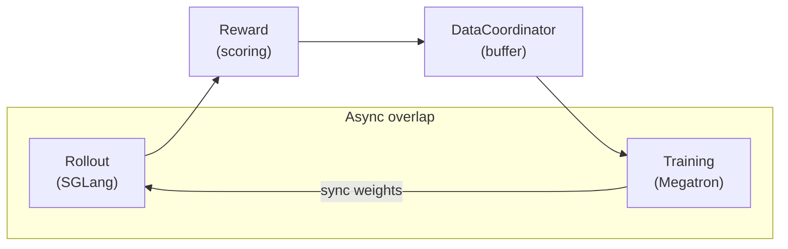

# How siirl-agentic Works

*A plain-language explanation of what happens when you launch a training run.*

## The training loop

Every training run in siirl-agentic cycles through three phases, running **asynchronously** so that rollout generation and model training overlap:

1. **Rollout** — The model receives a prompt from the dataset and generates a response. If the task involves tools, the model can emit tool calls, receive environment responses, and continue generating — across multiple turns. The complete exchange is called a **trajectory**.
2. **Reward** — Each completed trajectory is scored. Rewards can be rule-based (e.g., exact-match, code execution pass/fail) or computed by a learned reward model.
3. **Training** — Policy gradients (PPO or GRPO) update the model weights using a batch of scored trajectories. The updated weights are then pushed back to the rollout engine so future generations use the latest policy.

The key design choice is that these phases run **concurrently**: while one batch is being trained, the rollout engine is already collecting the next batch. This keeps GPUs occupied on both sides of the pipeline.



*Figure 1: The three-phase async training loop. Rollout and Training run concurrently; weights flow back after each training step.*

## Key components

| Component           | What it does                                                                                                                                 | Key class                                 |
| ------------------- | -------------------------------------------------------------------------------------------------------------------------------------------- | ----------------------------------------- |
| **MainRunner**      | Bootstraps the whole system: parses config, allocates GPUs, starts all components, monitors lifecycle                                        | `siirl/async_train.py`                    |
| **RolloutManager**  | Manages SGLang inference engines and dispatches rollout requests; runs `NaiveFlow` for multi-turn interaction                                | `siirl/worker/rollout/rollout_manager.py` |
| **TrainerGroup**    | Manages distributed training actors (Actor model, Reference model, Critic for PPO); runs forward/backward/optimizer steps                    | `siirl/worker/actor/trainer_group.py`     |
| **DataCoordinator** | Buffers completed trajectory references between rollout and training; handles on-policy vs off-policy windowing                              | `siirl/data_coordinator/data_buffer.py`   |
| **TaskCoordinator** | Centralized lifecycle management: propagates stop signals and failure reports to all components                                              | `siirl/utils/task_coordinator.py`         |
| **ToolEnv**         | Executes tool calls during rollout (e.g., code interpreter, web search, shell); returns `EnvResponse` with text and optional per-step reward | `siirl/environment/tool_env/`             |

## What happens in a multi-turn rollout

When `rollout.flow_function: naive` is set, each sample passes through `NaiveFlow` — a state machine that handles the full model–tool interaction loop:

1. **Model generates a response.** SGLang runs inference on the current conversation. The state is `GENERATING`.
2. **Tool calls are detected.** `NaiveFlow` parses the response tokens with `ToolParser`. If tool calls are found, the state transitions to `PROCESSING_ENV`.
3. **ToolEnv executes the tool.** Up to `max_parallel_calls` tool calls run concurrently via `asyncio.gather()`. Each call goes through `tool.create()` → `tool.step()` → `tool.release()`.
4. **Result appended to conversation.** The tool response is tokenized and appended to the sequence. These tokens receive `response_mask = 0` — they are **excluded from the policy gradient loss**. The state returns to `GENERATING`.
5. **Loop repeats until termination.** Steps 1–4 repeat until the model stops calling tools, a turn limit is reached (`max_env_turns`, `max_assistant_turns`), the token budget is exhausted (`max_response_length`), or the environment signals `complete=True`.
6. **Trajectory packaged as a `Sample`.** The final sequence — prompt tokens, all assistant tokens, all tool-response tokens — is packaged with its `response_mask` and sent to the `DataCoordinator` for reward computation and training.

The `response_mask` is what makes multi-turn training correct: only tokens the model generated (mask = 1) contribute to the loss; environment outputs (mask = 0) are invisible to the optimizer.

```
Tokens:        [prompt] [assistant-1] [tool-response] [assistant-2] [tool-response] [assistant-3]
response_mask:  0 0 0    1 1 1 1 1     0 0 0 0 0        1 1 1 1       0 0 0 0 0       1 1 1 1
```

## Rollout modes

siirl-agentic supports two GPU allocation strategies:

| Mode                    | Description                                                                                                                       | When to use                                  | Trade-off                                                 |
| ----------------------- | --------------------------------------------------------------------------------------------------------------------------------- | -------------------------------------------- | --------------------------------------------------------- |
| **Offload (separated)** | Training GPUs and rollout GPUs are distinct. By default, 2 GPUs for training and 6 GPUs for rollout.                              | Default; use when you have enough total GPUs | Best throughput; requires more total GPU memory           |
| **Colocate**            | Training and rollout share the same GPUs. Model weights are offloaded to CPU during the other phase. Set `trainer.colocate=true`. | Use when total GPU count is limited          | Lower peak GPU memory; slower due to CPU offload overhead |

In colocated mode, the system automatically clamps `rollout.gpu_memory_utilization` to 0.45 and forces `megatron.param_offload=true` to prevent OOM errors.

## Configuration system

siirl-agentic uses a dataclass-based configuration system driven by CLI arguments in OmegaConf dot-notation. There is no YAML file to edit — every parameter is passed directly on the command line:

```bash
python -m siirl.async_train \
    data.train_files=/data/gsm8k.parquet \
    actor_ref.model.model_path=/models/qwen-7b \
    trainer.total_epochs=50 \
    rollout.n=8 \
    trainer.actor_gpus=2 \
    trainer.rollout_gpus=6
```

All parameters live under one of five top-level namespaces: `data`, `actor_ref`, `rollout`, `critic`, `trainer`. See the [Configuration System guide](../guides/configuration_system.md) for the full parameter reference.

### Character-based lengths, not tokens { #character-based-lengths-not-tokens }

!!! warning "Character-based lengths, not tokens"
    `max_response_length` and `max_prompt_length` are measured in **characters**,
    not tokens. A common mistake: setting `max_response_length=512` thinking it's
    512 tokens — this is only ~128 tokens and will truncate most responses.

    Rule of thumb: multiply your desired token count by 4 for English, 3 for Chinese.

## Work effectively with siirl-agentic

!!! tip "Start small, scale up"
    When iterating on a new task, set `rollout.n=2` and `trainer.total_epochs=3` first. This lets you verify that reward signals fire, that the data pipeline runs end-to-end, and that shapes are correct — before committing to a full GPU run.

!!! tip "Monitor early"
    Watch `reward/mean` and `kl/mean` from the first epoch. A `reward/mean` that never moves means your reward function is not firing. A `kl/mean` that explodes means the learning rate or KL coefficient needs adjustment.

!!! tip "Use offload mode first"
    Start with the default separated mode (`trainer.colocate=false`) to prove your configuration works. Only switch to colocated mode if you are genuinely GPU-memory-constrained — it adds CPU offload overhead that reduces overall throughput.

## Next steps

- **[Quickstart](../get_started/quickstart.md)** — Run your first training job in minutes.
- **[Agentic Multi-Turn guide](../guides/agentic_multiturn.md)** — Configure tools, turn limits, and loss masking for multi-turn rollouts.
- **[GRPO Training](../guides/grpo_training.md)** / **[PPO Training](../guides/ppo_training.md)** — Algorithm-specific configuration and tips.
- **[Architecture Overview](architecture_overview.md)** — Detailed component diagram, data structures, and deployment modes.
