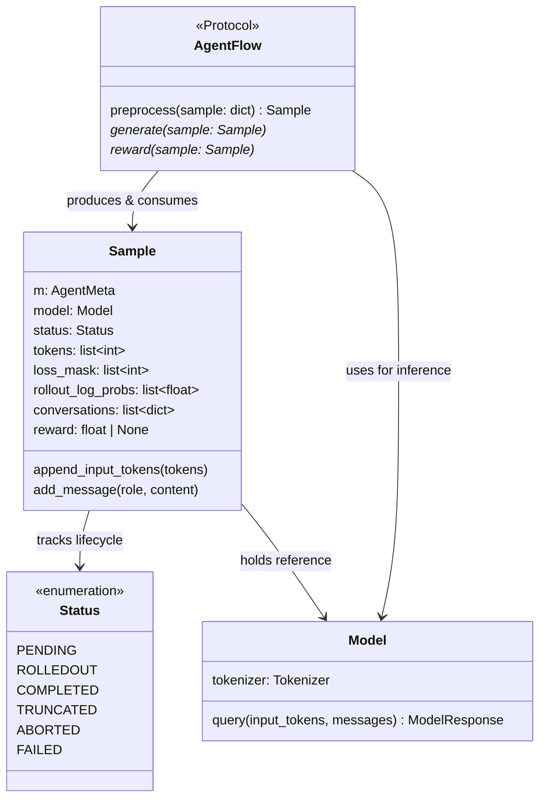
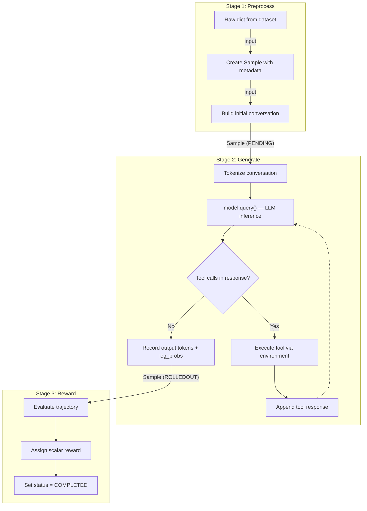

# Adding a New Executor or AgentFlow

*A step-by-step tutorial for implementing and registering a custom AgentFlow.*

## Prerequisites

-   Familiarity with the [Pluggable AgentFlow Protocol](../concepts/agentflow_protocol.md)
-   Understanding of the [Architecture Overview](../concepts/architecture_overview.md)
-   Local development environment ([Installation](../get_started/installation.md))

## The AgentFlow Protocol



*Figure 1: AgentFlow Protocol class diagram*

Every AgentFlow must implement three stages:

``` python
class AgentFlow(Protocol):
    def preprocess(self, sample: dict) -> Sample:
        """Convert a raw data dict into a Sample object."""
        ...

    async def generate(self, sample: Sample):
        """Run model inference (and optionally environment interaction)."""
        ...

    async def reward(self, sample: Sample):
        """Compute rewards for the completed trajectory."""
        ...
```

Where `Sample` is a generic dataclass with fields:

| Field               | Type                  | Description                                                   |                                  |
| ------------------- | --------------------- | ------------------------------------------------------------- | -------------------------------- |
| `m`                 | `AgentMeta` (generic) | Task-specific metadata defined by your flow                   |                                  |
| `model`             | `Model`               | Reference to the language model                               |                                  |
| `status`            | `Sample.Status`       | PENDING → ROLLEDOUT → COMPLETED (or TRUNCATED/ABORTED/FAILED) |                                  |
| `tokens`            | `list[int]`           | Full token sequence (prompt + response)                       |                                  |
| `loss_mask`         | `list[int]`           | 1 for model tokens to train on, 0 for env/prompt tokens       |                                  |
| `rollout_log_probs` | `list[float]`         | Log-probabilities from the rollout policy                     |                                  |
| `conversations`     | `list[dict]`          | Full conversation history (OpenAI format)                     |                                  |
| `reward`            | `float                | None`                                                         | Scalar reward for the trajectory |

!!! note "list, not Tensor"
    AgentFlow's `Sample` fields use Python `list` types, not PyTorch `Tensor`. This is different from NaiveFlow's `Sample` (in `data_coordinator/sample.py`) which uses `np.ndarray`.

## Three-Stage Flow



*Figure 2: The three-stage AgentFlow pipeline*

## Step 1: Create the Flow Module

Create a new file in `siirl/execution/rollout/agentflow/`:

``` python
# siirl/execution/rollout/agentflow/my_task_flow.py

from dataclasses import dataclass
from siirl.execution.rollout.agentflow.base import AgentFlow, Sample, Model, ModelResponse


@dataclass
class MyTaskMeta:
    """Task-specific metadata for each sample."""
    reference_answer: str = ""
    task_type: str = ""


class MyTaskFlow:
    """
    Custom AgentFlow for [describe your task type].

    Implements the three-stage AgentFlow protocol:
    preprocess → generate → reward
    """

    def __init__(self, config: dict, model: Model):
        self.config = config
        self.model = model

    def preprocess(self, data: dict) -> Sample[MyTaskMeta]:
        """
        Convert a raw dataset item into a Sample object.

        Args:
            data: Dictionary from the dataset loader.
                  Expected keys: 'prompt', 'reference', etc.

        Returns:
            Sample object ready for generation.
        """
        meta = MyTaskMeta(
            reference_answer=data.get("reference", ""),
            task_type=data.get("type", ""),
        )
        sample = Sample(
            m=meta,
            model=self.model,
            conversations=[{"role": "user", "content": data['prompt']}],
        )
        return sample

    async def generate(self, sample: Sample[MyTaskMeta]):
        """
        Run inference loop.

        For single-turn: one model.query() call.
        For multi-turn: loop with environment interaction.
        """
        # Build input tokens from conversation
        input_tokens = self.model.tokenizer.apply_chat_template(
            sample.conversations, add_generation_prompt=True, tokenize=True
        )
        sample.append_input_tokens(input_tokens)

        # Generate response
        response: ModelResponse = await self.model.query(
            input_tokens=input_tokens,
            messages=sample.conversations,
        )

        # Record output (automatically updates tokens, loss_mask, rollout_log_probs)
        sample.add_message("assistant", response)
        sample.status = Sample.Status.ROLLEDOUT

    async def reward(self, sample: Sample[MyTaskMeta]):
        """
        Compute reward for each trajectory.
        """
        # Example: compare with reference answer
        assistant_response = sample.conversations[-1]["content"]
        sample.reward = self._evaluate(assistant_response, sample.m.reference_answer)
        sample.status = Sample.Status.COMPLETED

    def _evaluate(self, response: str, reference: str) -> float:
        """Custom evaluation logic."""
        return 1.0 if reference.lower() in response.lower() else 0.0
```

## Step 2: Register the Flow

### Option A: Config Reference (Recommended)

Reference the flow directly in your training config:

``` yaml
rollout:
  agentflow:
    name: "siirl.execution.rollout.agentflow.my_task_flow:MyTaskFlow"
```

The `load_agentflow()` function will dynamically import and instantiate the class with `(config, model)`.

### Option B: Add to Built-in Registry

Add an entry in `siirl/execution/rollout/agentflow/__init__.py`:

``` python
BUILTIN_FLOW = {
    "swe": ".swe:agentflow",
    "my_task": ".my_task_flow:MyTaskFlow",  # Add this line
}
```

Then reference by alias:

``` yaml
rollout:
  agentflow:
    name: "my_task"
```

## Step 3: Custom Function Injection

The AgentFlow system supports dynamic function injection. Instead of subclassing, you can override individual stages via config:

``` yaml
rollout:
  agentflow:
    name: "swe"                                              # Use built-in SWE flow
    preprocess_fn: "my_project.preprocess:custom_preprocess"  # Override preprocess
    reward_fn: "my_project.rewards:custom_reward"             # Override reward
    generate_fn: "my_project.generate:custom_generate"        # Override generate (optional)
    python_path: ["/root/my_project"]                         # Extra import paths
```

The injected functions are bound to the flow instance via `MethodType`, so `self` refers to the AgentFlow instance:

``` python
# my_project/rewards.py
async def custom_reward(self, sample):
    """
    'self' is the AgentFlow instance.
    Access self.config, self.model, etc.
    """
    assistant_response = sample.conversations[-1]["content"]
    sample.reward = my_scoring_function(assistant_response)
    sample.status = sample.Status.COMPLETED
```

## Step 4: Add a Multi-Turn Flow

For tasks with environment interaction, implement the generate loop:

``` python
async def generate(self, sample: Sample[MyTaskMeta]):
    max_turns = self.config.get('max_turns', 5)

    for turn in range(max_turns):
        # 1. Build input tokens
        input_tokens = self.model.tokenizer.apply_chat_template(
            sample.conversations, add_generation_prompt=True, tokenize=True
        )
        if turn == 0:
            sample.append_input_tokens(input_tokens)

        # 2. Generate model response
        response = await self.model.query(
            input_tokens=input_tokens,
            messages=sample.conversations,
        )
        sample.add_message("assistant", response)

        # 3. Check for tool calls in response
        tool_calls = parse_tool_calls(response.output)
        if not tool_calls:
            break

        # 4. Execute tool call via environment
        env_response = await self.environment.step(tool_calls[0])

        # 5. Append environment response (masked from loss via add_message)
        sample.add_message("tool", env_response.text)

    sample.status = Sample.Status.ROLLEDOUT
```

## Step 5: Test Your Flow

Create a test file:

``` python
# tests/rollout/test_my_task_flow.py
import pytest
from siirl.execution.rollout.agentflow.base import DummyModel, Sample
from siirl.execution.rollout.agentflow.my_task_flow import MyTaskFlow

class TestMyTaskFlow:
    def test_preprocess(self):
        model = DummyModel()
        flow = MyTaskFlow(config={}, model=model)
        data = {"prompt": "Hello", "reference": "world"}
        sample = flow.preprocess(data)
        assert sample.conversations[0]["content"] == "Hello"
        assert sample.m.reference_answer == "world"

    @pytest.mark.asyncio
    async def test_generate(self):
        model = DummyModel(responses=["Hello world!"])
        flow = MyTaskFlow(config={}, model=model)
        sample = flow.preprocess({"prompt": "Hello", "reference": "world"})
        await flow.generate(sample)
        assert sample.status == Sample.Status.ROLLEDOUT

    @pytest.mark.asyncio
    async def test_reward(self):
        model = DummyModel(responses=["Hello world!"])
        flow = MyTaskFlow(config={}, model=model)
        sample = flow.preprocess({"prompt": "Hello", "reference": "world"})
        await flow.generate(sample)
        await flow.reward(sample)
        assert sample.reward is not None
        assert sample.status == Sample.Status.COMPLETED
```

Run:

``` bash
pytest tests/rollout/test_my_task_flow.py -v
```

## Checklist

-   [ ] Flow class accepts `(config: dict, model: Model)` in `__init__`
-   [ ] `preprocess` returns properly initialized `Sample` with metadata
-   [ ] `generate` populates `tokens`, `rollout_log_probs`, and `loss_mask` (via `add_message`)
-   [ ] `reward` assigns a scalar `reward` and sets `status = COMPLETED`
-   [ ] Flow is registered (config path or built-in registry)
-   [ ] Unit tests cover all three stages
-   [ ] Documentation updated if adding a built-in flow

## Next steps

- [AgentFlow Protocol](../concepts/agentflow_protocol.md) — Deepen your understanding of the design rationale and the three-method contract you just implemented
- [Code Structure](code_structure.md) — Explore the full codebase to understand where your new flow fits in the broader system
- [Contributing Guide](contributing.md) — Review the PR checklist and style requirements before submitting your new flow
