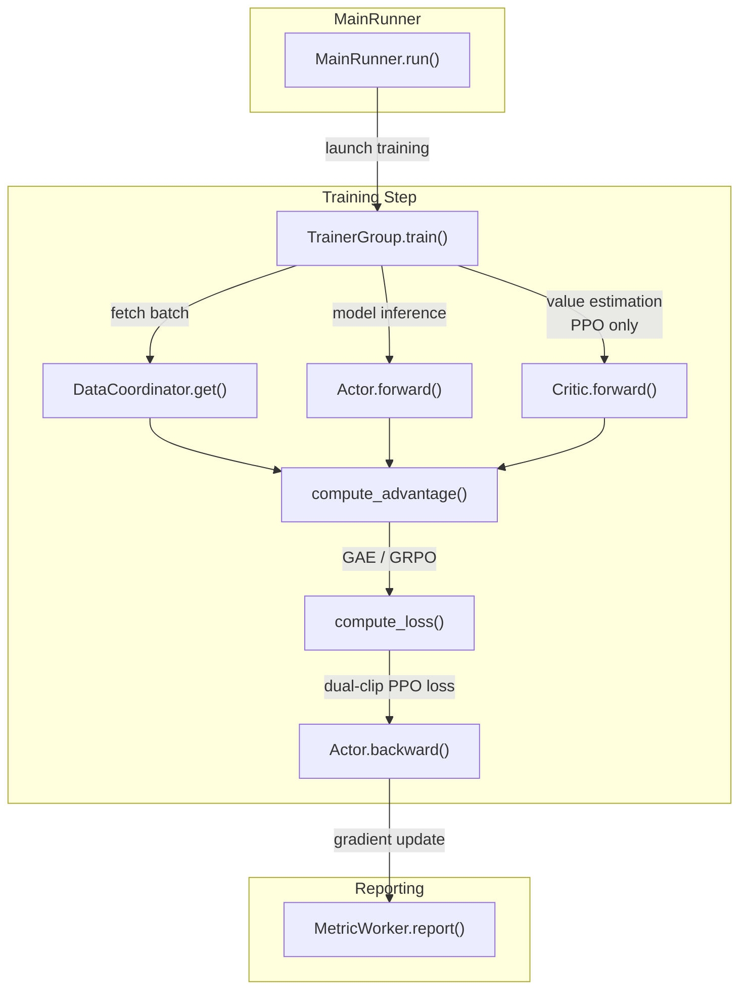
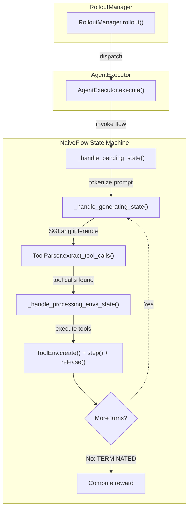
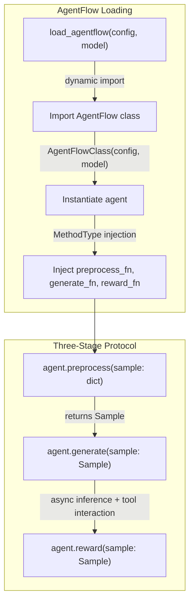
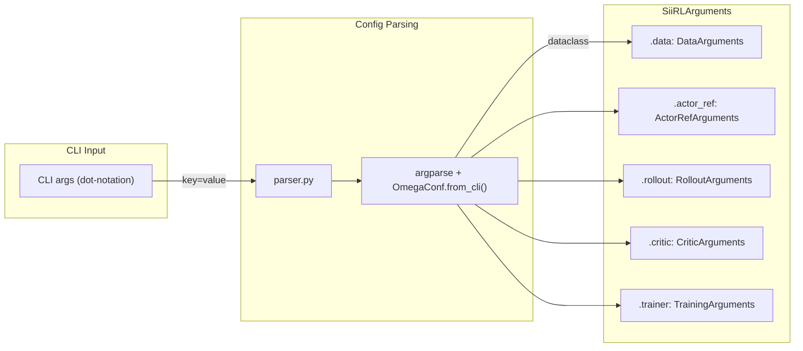
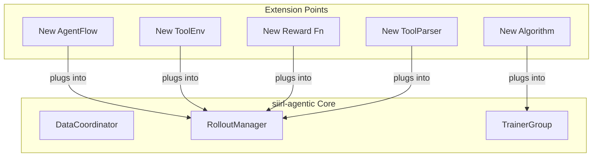

# Code Structure

*A developer-oriented walkthrough of the code organization, call chains, and extension points.*

## Entry Point

Everything starts from `siirl/async_train.py`:

``` python
# MainRunner is a Ray actor that orchestrates the entire training lifecycle
@ray.remote
class MainRunner:
    def run(self):
        # Phase 1: Parse CLI config (argparse + OmegaConf.from_cli()) → SiiRLArguments
        # Phase 2: Allocate GPU resources (actor_gpus, rollout_gpus, critic_gpus)
        # Phase 3: Initialize DataCoordinator (data loading + async buffering)
        # Phase 4: Initialize components (TrainerGroup, RolloutManager, MetricWorker)
        # Phase 5: Launch async training loop
        # Phase 6: Wait for completion
        # Phase 7: Check status via TaskCoordinator
        # Phase 8: Cleanup
```

## Call Chain: Training Step



*Figure 1: Training step call chain*

## Call Chain: Rollout Step (NaiveFlow)



*Figure 2: NaiveFlow rollout call chain*

## Call Chain: Rollout Step (AgentFlow)



*Figure 3: AgentFlow rollout path*

## Configuration Flow



*Figure 4: Configuration flow*

## Key Extension Points



*Figure 5: Extension points*

### 1. Adding a New AgentFlow

Create a new flow module and register it:

``` python
# siirl/execution/rollout/agentflow/my_flow.py
from .base import AgentFlow, Sample, Model

class MyFlow:
    """Implements the AgentFlow protocol."""

    def __init__(self, config: dict, model: Model):
        self.config = config
        self.model = model

    def preprocess(self, sample: dict) -> Sample:
        ...

    async def generate(self, sample: Sample):
        ...

    async def reward(self, sample: Sample):
        ...
```

Reference it in config:

``` yaml
rollout:
  agentflow:
    name: "siirl.execution.rollout.agentflow.my_flow:MyFlow"
```

### 2. Adding a New Tool Environment

Subclass `ToolEnv`:

``` python
# siirl/environment/tool_env/my_tool.py
from siirl.environment.tool_env.base_tool_env import ToolEnv
from siirl.environment.base import EnvResponse
from siirl.environment.tool_env.utils.schemas import OpenAIFunctionToolSchema

class MyTool(ToolEnv):
    def __init__(self, config, tool_schema: OpenAIFunctionToolSchema):
        super().__init__(config, tool_schema)

    async def create(self, create_kwargs=None, **kwargs):
        instance_id = "instance-1"
        return instance_id, EnvResponse()

    async def step(self, action: dict) -> EnvResponse:
        ...

    async def release(self, instance_id: str):
        ...
```

Register it in a tool config YAML and reference via `rollout.multiturn.env_path`.

### 3. Adding a New Reward Function

Create a reward function and inject via config:

``` python
# my_rewards.py
def custom_reward(data_source, solution_str, ground_truth):
    """Match the signature expected by NaiveFlow's reward_fn."""
    return compute_reward(solution_str, ground_truth)
```

### 4. Adding a New Algorithm

Extend the algorithm module:

-   Add advantage estimation in `siirl/algorithm/advantage.py`
-   Add loss function in `siirl/algorithm/loss.py`
-   Wire into the training loop in the worker

### 5. Adding a New ToolParser

Use the `ToolParser.register()` decorator:

``` python
from siirl.environment.tool_env.utils.tool_parser import ToolParser, FunctionCall

@ToolParser.register("my_format")
class MyToolParser(ToolParser):
    async def extract_tool_calls(self, responses_ids: list[int]) -> tuple[str, list[FunctionCall]]:
        text = await loop.run_in_executor(None, self.tokenizer.decode, responses_ids)
        # Parse and return...
        return content, function_calls
```

## Testing Structure

    tests/
    ├── actor/           # Actor/training worker tests
    ├── data_buffer/     # DataCoordinator tests
    ├── rollout/         # Rollout and NaiveFlow tests
    └── test_utils/      # Shared test utilities

Run tests:

``` bash
pytest tests/                      # All tests
pytest tests/data_buffer/ -v       # DataCoordinator tests
pytest tests/rollout/ -v           # Rollout tests
pytest -m gpu                      # GPU-dependent tests
```

!!! note "GPU Required"
    Most tests are end-to-end GPU tests that launch full training runs and require multiple GPUs. Unit tests without GPU are limited.

## Next steps

- [Adding a New Executor or AgentFlow](adding_new_executor_or_flow.md) — Apply your understanding of the code structure by implementing a custom flow
- [Contributing Guide](contributing.md) — Review the PR process, style requirements, and testing expectations before submitting changes
