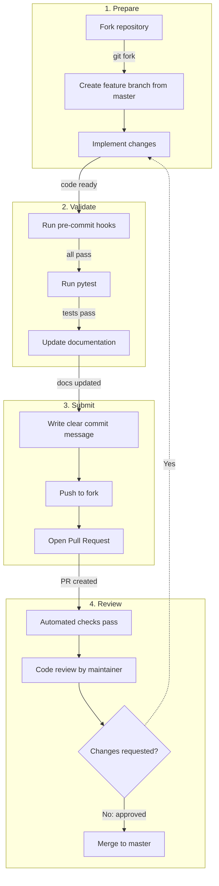

# Contributing to siirl-agentic

*Guidelines for development setup, code style, testing, and the pull request process.*

## Quick Start

``` bash
# 1. Clone and setup
git clone https://github.com/sii-research/siirl-agentic.git
cd siirl-agentic

# 2. Create virtual environment
python -m venv venv
source venv/bin/activate

# 3. Install in development mode
pip install -e ".[dev]"

# 4. Install pre-commit hooks
pre-commit install
```

## Code Style

We enforce consistent code style via pre-commit hooks:

| Tool          | Purpose         | Config                         |
| ------------- | --------------- | ------------------------------ |
| **Black**     | Code formatting | `line-length = 140`            |
| **isort**     | Import sorting  | `profile = "black"`            |
| **Ruff**      | Linting         | See `pyproject.toml`           |
| **codespell** | Spelling        | Configured in `pyproject.toml` |

All configurations are in `pyproject.toml`. Pre-commit runs automatically on `git commit`.

!!! note "mypy"
    mypy is configured in `pyproject.toml` (`[tool.mypy]`) but is **not included in dev dependencies**. Install it separately if needed: `pip install mypy`.

To run manually:

``` bash
pre-commit run --all-files
```

## Running Tests

``` bash
# All tests
pytest

# Specific test directories
pytest tests/data_buffer/ -v
pytest tests/rollout/ -v
pytest tests/actor/ -v

# With coverage report
pytest --cov=siirl --cov-report=html

# GPU-dependent tests
pytest -m gpu

# Specific file
pytest tests/data_buffer/test_data_buffer.py -v
```

### Test Markers

| Marker                     | Description               |
| -------------------------- | ------------------------- |
| `@pytest.mark.unit`        | Fast, isolated unit tests |
| `@pytest.mark.integration` | Multi-component tests     |
| `@pytest.mark.slow`        | Long-running tests        |
| `@pytest.mark.gpu`         | Requires GPU hardware     |

!!! warning "GPU Tests"
    Most tests are end-to-end GPU tests that launch full training runs and require multiple GPUs. There are limited unit tests that can run without GPUs.

## Pull Request Process



*Figure 1: Pull request workflow*

1.  **Fork** the repository and create a branch from `master` (the default branch)

2.  **Write tests** for your changes

3.  **Update documentation** if adding new features

4.  **Ensure all checks pass:**

    ``` bash
    pre-commit run --all-files
    pytest
    ```

5.  **Write a clear commit message:**

        Add async multi-turn agent support (#123)

        - Implement async agent executor
        - Add test cases for multi-turn scenarios
        - Update documentation

6.  **Submit PR** with a detailed description

## What to Contribute

### Bug Reports

-   Use GitHub Issues with a minimal reproduction example
-   Include: Python version, PyTorch version, CUDA version, Ray version
-   Attach relevant log snippets

### New Features

-   **New AgentFlow:** See [Adding New Executor or Flow](adding_new_executor_or_flow.md)
-   **New Tool Environment:** Subclass `ToolEnv` in `siirl/environment/tool_env/`
-   **New Reward Function:** Create in `siirl/utils/reward_score/` or inject via config
-   **New ToolParser:** Use `@ToolParser.register("name")` decorator
-   **Algorithm improvements:** Extend `siirl/algorithm/`

### Documentation

-   Fix typos, improve examples, add missing content

-   Build docs locally to verify:

    ``` bash
    cd docs && bash build.sh en
    ```

## Code Review Checklist

Reviewers will check:

-   [ ] Code follows project style (Black, isort, Ruff)
-   [ ] Tests cover new functionality
-   [ ] No performance regressions
-   [ ] Documentation updated
-   [ ] Type hints added for public APIs
-   [ ] Docstrings follow Google style

## Project Structure

For a detailed walkthrough of the codebase, see:

-   [Code Structure](code_structure.md) — Developer-oriented codebase guide
-   [Module Map](../reference/module_map.md) — Directory reference

## License

By contributing, you agree that your contributions will be licensed under the Apache License 2.0.

## Questions?

-   Open an issue on GitHub
-   Check existing documentation at [docs/](../overview.md)

## Next steps

- [Code Structure](code_structure.md) — Get a developer-oriented walkthrough of the codebase before writing your first contribution
- [Adding a New Executor or AgentFlow](adding_new_executor_or_flow.md) — Follow the tutorial to contribute a new AgentFlow to the framework
