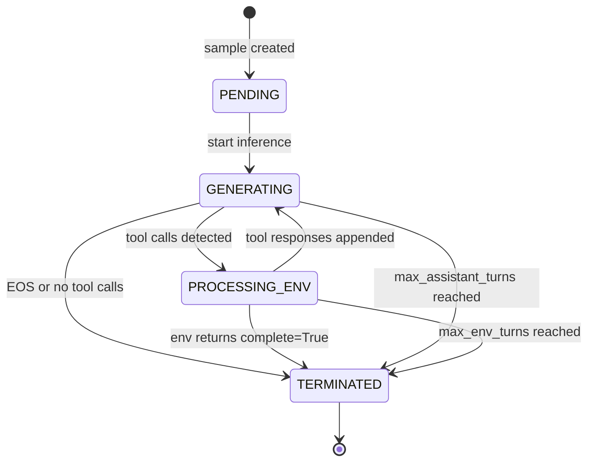
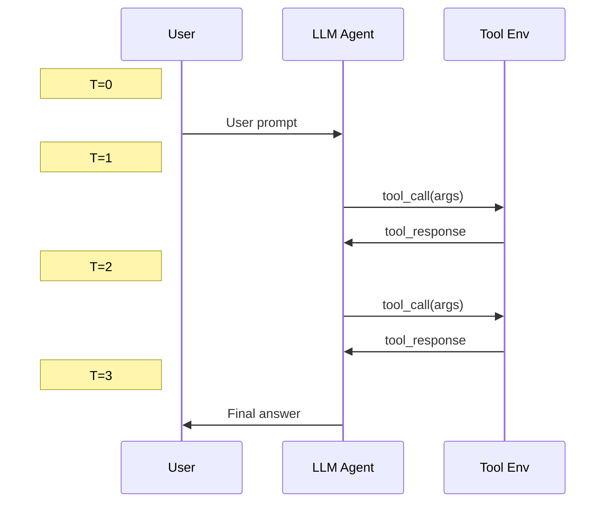

# Agentic Multi-Turn Training

*Configure multi-turn rollouts with tool interaction, covering state machine behavior, loss masking, and parameter tuning.*

## Overview

!!! tip "Key Insight"
    The most important parameter to get right is `data.max_response_length`. For multi-turn training, this must cover the total token budget for **all** assistant turns plus all tool response turns combined. A common mistake is leaving the default (512 tokens), which truncates agentic trajectories after the first tool call. For 5-turn interactions, start with `max_response_length=4096`; for SWE tasks, use 8192 or higher.

Multi-turn agentic training is the core differentiator of siirl-agentic. The rollout engine executes a state machine where the model generates text, calls tools, receives environment feedback, and continues generating — all within a single training step.

## Core Components

### NaiveFlow State Machine { #naiveflow-state-machine }

The `NaiveFlow` class (`siirl/execution/rollout/agent_flow/naive_flow.py`) implements the multi-turn rollout:



*Figure 1: NaiveFlow state machine (complete)*

The states in active use by NaiveFlow's main loop are `PENDING`, `GENERATING`, `PROCESSING_ENV`, and `TERMINATED`. The `BEFORE_PROCESSING_ENV` and `ABORTED` states are defined in `AgentState` but reserved for future extensions.

!!! note "NaiveFlow vs AgentFlow"
    NaiveFlow and AgentFlow are **two separate rollout systems**. NaiveFlow is a concrete state machine for production multi-turn tool interaction. AgentFlow (in `siirl/execution/rollout/agentflow/`) is a pluggable Protocol for defining custom task pipelines. They are not an inheritance relationship.

!!! note "tool_env Only"
    NaiveFlow currently only supports `env_type: tool_env`. Other environment types will raise `NotImplementedError`.

### AgentData (`siirl/execution/rollout/utils.py`)

Internal state tracking for each rollout sample:

``` python
class AgentData:
    def __init__(self, raw_prompt: list[dict[str, Any]]):
        self.messages = raw_prompt           # OpenAI-format conversation history
        self.prompts_ids = []                # Current full sequence (prompt + all turns)
        self.response_ids = []               # Current turn response tokens
        self.response_mask = []              # 1=model token, 0=env token
        self.rollout_log_prob = []           # Log-probs for all response tokens
        self.env_calls: list[FunctionCall] = []  # Pending tool calls
        self.env_rewards = []                # Per-turn environment rewards
        self.env_turns = 0                   # Current environment turn count
        self.assistant_turns = 0             # Current assistant turn count
        self.state = AgentState.PENDING      # Current state machine state
        self.env_kwargs = {}                 # Extra kwargs passed to tool env

class AgentState(Enum):
    PENDING = "pending"
    GENERATING = "generating"
    PROCESSING_ENV = "processing_envs"
    TERMINATED = "terminated"
    BEFORE_PROCESSING_ENV = "before_processing_envs"  # Reserved for future use
    ABORTED = "aborted"                                # Reserved for future use
```

!!! note "AgentState"
    `BEFORE_PROCESSING_ENV` and `ABORTED` are defined in the enum but **not used by NaiveFlow's main loop**, which only handles `PENDING`, `GENERATING`, `PROCESSING_ENV`, and `TERMINATED`. They exist for potential future extensions.

## Configuration

### Full Multi-Turn Config

``` yaml
rollout:
  flow_function: naive               # Use NaiveFlow
  max_model_len: 8192                # Max total context length

  multiturn:
    env_type: tool_env               # Environment type (currently only tool_env supported)
    max_env_turns: 5                 # Max tool interaction rounds (default: 1)
    max_assistant_turns: 10          # Max model generation turns (default: 1)
    max_parallel_calls: 4            # Concurrent tool calls (default: 1)
    max_env_response_length: 256     # Max env response characters (NOT tokens)
    env_response_truncate_side: middle  # left/middle/right
    env_path: /path/to/env_config.yaml
    env_kwargs:
      tool_format: hermes            # Tool call format: hermes, gpt-oss

data:
  max_response_length: 4096          # Max total response tokens
  mask_history: false                # Train on all turns vs last only
```

### Parameter Guide

| Parameter                    | Impact                                    | Recommendation                      |
| ---------------------------- | ----------------------------------------- | ----------------------------------- |
| `max_env_turns`              | Tool interaction depth                    | 3-10 for SWE, 1-3 for search        |
| `max_assistant_turns`        | Total model generation rounds             | 2× max_env_turns                    |
| `max_parallel_calls`         | Parallel tool execution                   | 1-4 (higher = more tool throughput) |
| `max_env_response_length`    | Tool response truncation (**characters**) | 256-1024 depending on tool          |
| `env_response_truncate_side` | Where to truncate                         | "middle" preserves start+end        |
| `max_response_length`        | Total token budget                        | Sum of all turns' tokens            |

!!! warning "Character-Based Truncation"
    `max_env_response_length` measures **characters** (Python `len(str)`), not tokens. When an environment response exceeds this length, it is truncated and `"...(truncated)"` markers are inserted. For "middle" truncation: the first `length//2` and last `length//2` characters are kept.

## Multi-Turn Interaction Sequence



*Figure 2: Multi-turn interaction sequence*

## Tool Call Formats

siirl-agentic supports multiple tool call formats via `ToolParser` (`siirl/environment/tool_env/utils/tool_parser.py`):

### Hermes Format (Default)

``` xml
<tool_call>
{"name": "search", "arguments": {"query_list": ["Tokyo population"]}}
</tool_call>
```

### GPT-OSS Format

Uses a custom token format with `<|start|>`, `<|channel|>`, `<|constrain|>`, `<|call|>` special tokens. Includes chain-of-thought filtering to avoid false positive tool calls inside `analysis` blocks.

Configure via `env_kwargs.tool_format`:

``` yaml
rollout:
  multiturn:
    env_kwargs:
      tool_format: hermes    # or "gpt-oss"
```

### ToolParser Registry

`ToolParser` uses a class-level registry pattern. To add a new format:

``` python
from siirl.environment.tool_env.utils.tool_parser import ToolParser, FunctionCall

@ToolParser.register("my_format")
class MyToolParser(ToolParser):
    async def extract_tool_calls(self, responses_ids: list[int]) -> tuple[str, list[FunctionCall]]:
        text = await loop.run_in_executor(None, self.tokenizer.decode, responses_ids)
        # Parse tool calls from text...
        return content, function_calls
```

## Trajectory Data Structure

Each completed rollout produces a `Sample` object (`siirl/data_coordinator/sample.py`) that carries the full trajectory to the Trainer. The key fields for multi-turn training:

```
Sample fields:
  prompts:          [p0, p1, p2, ..., pP]                  ← prompt tokens (fixed)
  responses:        [a0, a1, a2, t0, t1, a3, a4, t2, a5]   ← all response tokens (model + env interleaved)
  response_mask:    [1,  1,  1,  0,  0,  1,  1,  0,  1 ]   ← 1=model token, 0=env token
  rollout_log_prob: [lp0,lp1,lp2,  0,  0,lp3,lp4,  0,lp5]  ← log-probs (0 for env tokens)
  rewards:          0.85                                     ← scalar (set by reward function)
```

Where:
- `a0, a1, a2` = first assistant turn tokens
- `t0, t1` = first tool response tokens (environment output)
- `a3, a4` = second assistant turn tokens
- `t2` = second tool response tokens
- `a5` = final assistant turn token

The `response_mask` precisely separates what the model produced from what the environment returned. Only tokens with `response_mask=1` contribute to the policy gradient loss.

**Token budget accounting:** The total `responses` length is the sum of all assistant turns + all tool response turns. You must set `data.max_response_length` to accommodate the full multi-turn sequence, not just a single assistant response. For 5 turns with average 200 assistant tokens and 100 tool tokens, plan for at least `5 × (200 + 100) = 1500` tokens.

## Loss Masking

The key to multi-turn training is **correct loss masking**:

    Tokens:       [prompt] [assistant-1] [tool-response] [assistant-2] [tool-response] [assistant-3]
    response_mask: 0 0 0    1 1 1 1 1     0 0 0 0 0       1 1 1 1       0 0 0 0 0       1 1 1 1

-   **Model tokens** (assistant turns): `response_mask = 1` → included in policy gradient
-   **Environment tokens** (tool responses): `response_mask = 0` → masked from loss
-   **Prompt tokens**: Not in response → not in loss

This ensures the model learns from its own decisions, not from environment outputs.

## Termination Conditions

A rollout terminates when **any** of these conditions is met:

1.  `len(response_mask) >= max_response_length` (total token budget exhausted)
2.  `assistant_turns >= max_assistant_turns`
3.  `env_turns >= max_env_turns`
4.  No tool calls detected in model output (single-turn completion)
5.  Environment returns `complete=True` in any `EnvResponse`

## Tool Execution Flow

When NaiveFlow detects tool calls in model output:

1.  `ToolParser.extract_tool_calls()` parses the response tokens into `FunctionCall` objects
2.  Up to `max_parallel_calls` tool calls are executed concurrently via `asyncio.gather()`
3.  For each tool call, `NaiveFlow._step()`:
    - Looks up the tool by name from `EnvManager.env_name`
    - Calls `tool.create(create_kwargs=...)` to create a tool instance
    - Calls `tool.step(action)` to execute the action → returns `EnvResponse`
    - Calls `tool.release(instance_id)` to clean up
    - Truncates response text if it exceeds `max_env_response_length` characters
4.  Tool responses are tokenized and appended to the sequence with `response_mask=0`
5.  If any `EnvResponse.complete == True`, the rollout terminates

## Custom Tool Environments

Implement the `ToolEnv` interface:

``` python
from siirl.environment.tool_env.base_tool_env import ToolEnv
from siirl.environment.base import EnvResponse
from siirl.environment.tool_env.utils.schemas import OpenAIFunctionToolSchema

class MyCustomTool(ToolEnv):
    def __init__(self, config, tool_schema: OpenAIFunctionToolSchema):
        super().__init__(config, tool_schema)

    async def create(self, create_kwargs=None, **kwargs):
        """Create a tool instance. Called before step()."""
        instance_id = "my-instance-id"
        return instance_id, EnvResponse()

    async def step(self, action: dict) -> EnvResponse:
        """Execute tool action. `action` includes instance_id + tool arguments."""
        result = await my_tool_logic(action)
        return EnvResponse(
            text=result,
            rewards=0.5,       # Optional per-step reward
            complete=False,    # Set True to end trajectory
        )

    async def release(self, instance_id: str):
        """Cleanup tool instance after use."""
        pass
```

!!! note "Tool Schema Required"
    `ToolEnv.__init__` requires an `OpenAIFunctionToolSchema` that describes the tool's API (function name, parameters). This schema is passed to the model via `tokenizer.apply_chat_template(tools=...)` to enable tool calling.

## What Success Looks Like

A healthy multi-turn agentic training run shows these patterns:

| Metric                                       | Expected Pattern                | Warning Sign                                          |
| -------------------------------------------- | ------------------------------- | ----------------------------------------------------- |
| `rollout/env_turns_mean`                     | >= 1.5 and growing              | Near 0 = agent not using tools                        |
| `reward/mean`                                | Increasing trend over steps     | Flat after 100 steps = check reward fn                |
| `rollout/response_length_mean`               | Stable, < `max_response_length` | At max = trajectories being truncated                 |
| Fraction of `TERMINATED` via `complete=True` | Increasing over training        | If never = tools not signaling completion             |
| Tool call parse success rate                 | > 90%                           | Low = `tool_format` mismatch or wrong prompt template |

Check these in WandB/console logs after the first 5–10 training steps to catch configuration problems early.

## Common Mistakes

| Mistake                                                          | Symptom                          | Fix                                             |
| ---------------------------------------------------------------- | -------------------------------- | ----------------------------------------------- |
| `max_response_length` < total multi-turn tokens                  | Premature truncation             | Increase to 4096-8192                           |
| `max_env_turns=1` for SWE tasks                                  | Only one tool call               | Increase to 5+                                  |
| Missing `env_path`                                               | Tool env not loaded              | Provide path to tool config YAML                |
| `tool_format` mismatch                                           | Tool calls not parsed            | Match format to model's training data           |
| `max_parallel_calls` too high                                    | Tool server overload             | Start with 1, increase gradually                |
| Confusing chars vs tokens for `max_env_response_length`          | Unexpected truncation            | Remember: it's **characters**                   |
| Leaving `max_parallel_calls=1` for independent tools             | Slower rollout than necessary    | Increase to 4 for independent search/read tools |
| Not setting `env_response_truncate_side=middle` for code outputs | Start or end of test output lost | `"middle"` keeps first+last chars for context   |

## Next steps

- [Tool Environment & SWE Agent](tool_env_and_swe.md) — Implement custom tool environments and understand the SWE agent integration
- [AgentFlow Protocol](../concepts/agentflow_protocol.md) — Design a fully custom rollout pipeline instead of using NaiveFlow
- [First Agentic Training Job](../get_started/first_agentic_training_job.md) — Return to the end-to-end walkthrough if you need to revisit the setup
