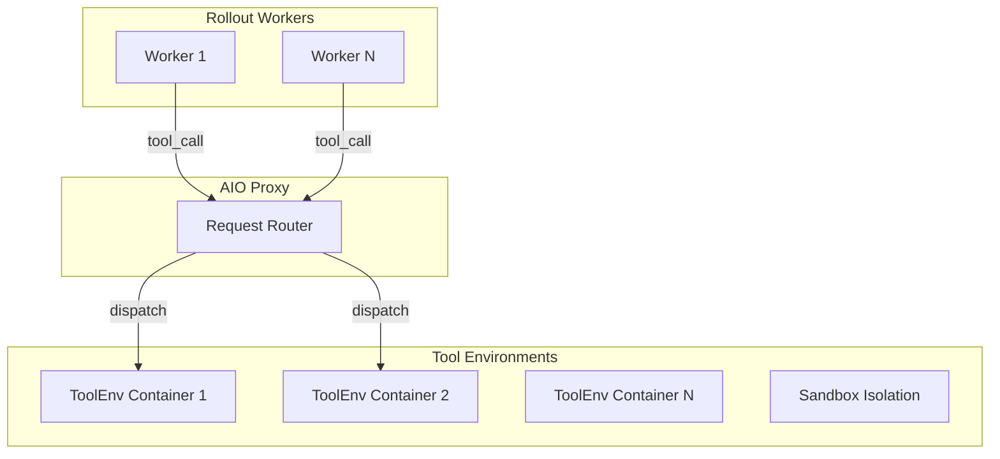
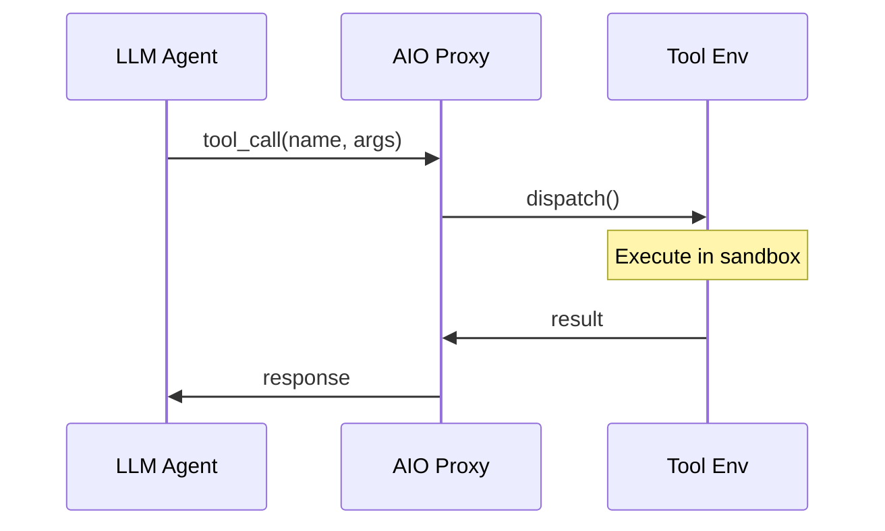

# AIO Tool Infrastructure

*Deploy and configure AIO's three-tier tool scheduling infrastructure, from startup to auto-scaling integration with the rollout pipeline.*

## Overview

!!! tip "Key Insight"
    AIO's Proxy acts as a load balancer between your rollout workers and the tool execution nodes. The critical configuration to get right is `capacity_per_worker`: set it too low and tool calls queue up, stalling rollout; set it too high and tool nodes OOM. A safe starting point: `capacity_per_worker=10` for search tools, `capacity_per_worker=3` for code sandboxes. Monitor `queue_depth` via `curl http://proxy-host:8080/status` — if it's consistently > 0, add more WorkerManagers.

AIO (Agentic I/O) is a distributed tool scheduling infrastructure that manages external tool instances across heterogeneous nodes. It solves the **tool bottleneck** that caps throughput in long-horizon agentic rollout: when 1000 concurrent rollouts all need sandbox executions, naive single-node tool servers cascade into timeouts.

See [AIO Highlights](../concepts/aio_infrastructure.md) for architecture rationale and design decisions.

## Architecture

AIO uses a three-tier scheduler:



*Figure 1: AIO three-tier architecture*

## Deployment

### Prerequisites

Clone and install AIO from the monorepo:

``` bash
# From the monorepo root (parent of siirl-agentic/)
cd AIO
pip install -e .
```

### Step 1: Create AIO Config

Create `aio_config.yaml`:

``` yaml
proxy:
  host: 0.0.0.0
  port: 8080
tools:
  - name: search
    capacity_per_worker: 10     # Max concurrent calls per worker
  - name: sandbox_fusion
    capacity_per_worker: 5
auto_scaling:
  enabled: true
  algorithm: holt_winters        # Time-series demand prediction
```

### Step 2: Start AIO Proxy

``` bash
python -m aio.Scheduler.proxy --config aio_config.yaml
```

The Proxy exposes:

-   `POST /call` — Submit tool call requests
-   `GET /status` — Current resource pool state
-   `GET /health` — Health check endpoint
-   `GET /metrics` — Concurrency and latency metrics

### Step 3: Start WorkerManagers

On each tool node:

``` bash
python -m aio.Scheduler.Resources.worker_manager \
    --proxy-url http://proxy-host:8080 \
    --config worker_config.yaml
```

WorkerManagers auto-register with the Proxy on startup. Verify registration:

``` bash
curl http://proxy-host:8080/status
```

Expected output:

``` json
{
  "tools": {
    "search": {"workers": 3, "total_capacity": 30, "active_calls": 7},
    "sandbox_fusion": {"workers": 2, "total_capacity": 10, "active_calls": 2}
  }
}
```

## Request Lifecycle



*Figure 2: End-to-end request lifecycle*

## Concurrency Sizing

!!! tip "Match AIO capacity to your rollout batch size"
    The rollout engine generates requests at a rate of `train_batch_size × rollout.n` per training step. AIO needs enough capacity to handle this burst.

The framework computes target concurrency as:

```python
target_concurrency = max(1, train_batch_size * rollout.n)
effective_concurrency = min(target_concurrency, resolved_limits["effective"])
```

The SGLang engine's `max_num_seqs` is also sized to match: if `rollout.max_num_seqs <= 0`, it defaults to `4 × train_server_concurrency`. The default `train_server_concurrency` is **256**.

For a typical run with `train_batch_size=256` and `rollout.n=8`, target concurrency = 2048. Ensure your AIO WorkerManagers have enough total capacity (`workers × capacity_per_worker`) to service this load without a queue building up.

## Integration with siirl-agentic

Configure the rollout to use AIO:

``` yaml
rollout:
  multiturn:
    env_type: tool_env
    env_kwargs:
      tool_format: hermes
      aio_proxy_url: http://proxy-host:8080

# Or set via environment variable
# export AIO_PROXY_URL=http://proxy-host:8080
```

The `AIOSearchEnv` class (`siirl/environment/tool_env/aio_search_env.py`) connects to the Proxy URL and dispatches tool calls asynchronously.

## Auto-Scaling

AIO uses a **Holt-Winters time-series predictor** for demand-based auto-scaling:

### How It Works

1.  `ConcurrencyMonitor` samples the active concurrent tool call count every second
2.  Holt-Winters exponential smoothing forecasts demand for the next time window
3.  When predicted demand exceeds current capacity × threshold, additional tool instances activate
4.  When load drops, idle instances are reclaimed to free resources

### Configuration

``` yaml
auto_scaling:
  enabled: true
  algorithm: holt_winters
  scale_up_threshold: 0.8     # Scale up when utilization > 80%
  scale_down_threshold: 0.3   # Scale down when utilization < 30%
  min_instances: 1            # Minimum tool instances per worker
  max_instances: 20           # Maximum tool instances per worker
  alpha: 0.3                  # Holt-Winters level smoothing factor
  beta: 0.1                   # Holt-Winters trend smoothing factor
```

## Async Batched Request Submitter

The client side uses a batched async submitter to absorb latency spikes:

``` yaml
aio:
  client:
    batch_size: 32             # Batch tool calls before submitting
    batch_timeout_ms: 10       # Max wait time to fill a batch
    max_retries: 3             # Retry failed calls
```

This prevents the rollout from blocking on individual slow tool calls by buffering and submitting requests in batches, while keeping per-sample latency bounded.

## Monitoring

### Real-time Status

``` bash
# Current pool state
curl http://proxy-host:8080/status

# Detailed metrics
curl http://proxy-host:8080/metrics
```

Key metrics to watch:

| Metric           | Description                                   |
| ---------------- | --------------------------------------------- |
| `active_calls`   | Current concurrent tool calls                 |
| `queue_depth`    | Pending calls waiting for capacity            |
| `p50_latency_ms` | Median tool call latency                      |
| `p99_latency_ms` | Tail latency (watch for AIO-scale-up trigger) |
| `scale_events`   | Number of auto-scaling events                 |

### Logs

Enable verbose AIO logging:

``` bash
LOGURU_LEVEL=DEBUG python -m aio.Scheduler.proxy --config aio_config.yaml
```

Look for `ConcurrencyMonitor` log lines showing demand forecasts and scale decisions.

## Multi-Node Deployment

For large-scale training with many tool workers:

``` bash
# Node 1: AIO Proxy (dedicated coordinator)
python -m aio.Scheduler.proxy --config aio_config.yaml

# Node 2–N: WorkerManagers (tool execution nodes)
# Run on each node:
python -m aio.Scheduler.Resources.worker_manager \
    --proxy-url http://node1:8080
```

Capacity planning:

-   **Search tools:** 10–20 concurrent calls per worker, 1 CPU + low memory
-   **Code sandbox:** 3–5 concurrent calls per worker, 2+ CPUs + 4GB RAM each
-   **Scaling rule:** Target 70% average utilization; auto-scaling handles peaks

## Common Issues

| Symptom                                 | Cause                       | Fix                                     |
| --------------------------------------- | --------------------------- | --------------------------------------- |
| `Error getting server from master node` | Proxy not running           | Start `python -m aio.Scheduler.proxy`   |
| Tool call timeouts                      | Capacity exhausted          | Add WorkerManagers or increase capacity |
| Tools not registered                    | WorkerManager not started   | Start WorkerManager on each tool node   |
| Scaling not triggered                   | Threshold too high          | Lower `scale_up_threshold`              |
| OOM on tool nodes                       | Too many concurrent sandbox | Reduce `capacity_per_worker`            |

## Next steps

- [AIO Infrastructure (concept)](../concepts/aio_infrastructure.md) — Understand the architecture design and motivation behind the three-tier scheduling system
- [Deployment Modes](deployment_modes.md) — Choose the right GPU topology to pair with your AIO tool infrastructure
- [Performance Tuning](performance_tuning.md) — Diagnose tool latency bottlenecks and tune AIO capacity for maximum throughput
