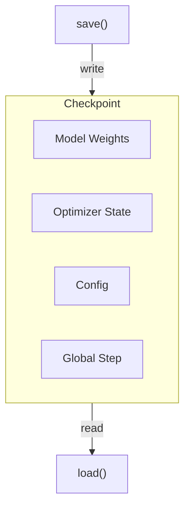

# Checkpoint & Resume

*Configure checkpoint saving, choose a resume mode, and export HuggingFace-compatible models.*

## Checkpoint Lifecycle

!!! tip "Key Insight"
    The two most important settings to configure before starting any long run are `trainer.save_freq` (default is `-1`, meaning **disabled**) and `trainer.max_actor_ckpt_to_keep` (default is `100`, which can fill terabytes of disk for large models). Set `save_freq=10` and `max_actor_ckpt_to_keep=5` as your standard production defaults. Always test checkpoint resume by doing a short run (2–3 steps), stopping, and restarting before committing to a multi-day training job.



*Figure 1: Checkpoint lifecycle*

## Save Configuration

``` yaml
trainer:
  save_freq: 10                    # Save every N steps (-1 = disable, default: -1)
  max_actor_ckpt_to_keep: 100     # Keep last N actor checkpoints (default: 100)
  max_critic_ckpt_to_keep: 100    # Keep last N critic checkpoints (default: 100)
  default_local_dir: checkpoints/  # Checkpoint directory

actor_ref:
  checkpoint:
    save_contents: ["model", "optimizer", "extra"]  # What to save
    # Add "hf_model" to also export HuggingFace format
```

!!! warning "Disk Space"
    The default `max_actor_ckpt_to_keep=100` retains up to 100 checkpoints. For large models, this can consume significant disk space. Consider reducing to 5–10 for production runs:
    ```yaml
    trainer:
      max_actor_ckpt_to_keep: 5
      max_critic_ckpt_to_keep: 5
    ```

## Resume Training

``` yaml
trainer:
  resume_mode: auto           # auto-detect latest checkpoint (default)
  # Or:
  resume_mode: resume_path
  resume_from_path: /path/to/checkpoint/step_100
```

### Resume Modes Reference

!!! tip "The three resume_mode values"
    The `resume_mode` parameter accepts exactly these values:

| Mode               | Behavior                                                                                                                      |
| ------------------ | ----------------------------------------------------------------------------------------------------------------------------- |
| `"auto"` (default) | Scans `trainer.default_local_dir` for the highest `global_step_N` directory; resumes from it if found, otherwise starts fresh |
| `"disable"`        | Always starts fresh regardless of existing checkpoints                                                                        |
| `"resume_path"`    | Resumes from the explicit `trainer.resume_from_path` — useful when switching `default_local_dir` between runs                 |


*Figure 2: Resume mode decision flow*

| Mode             | Behavior                                      |
| ---------------- | --------------------------------------------- |
| `auto` (default) | Find latest checkpoint in `default_local_dir` |
| `disable`        | Start fresh, ignore existing checkpoints      |
| `resume_path`    | Resume from specific `resume_from_path`       |

## Checkpoint Contents

| Content     | Description                          | Default   |
| ----------- | ------------------------------------ | --------- |
| `model`     | Model weights (Megatron format)      | Saved     |
| `optimizer` | Optimizer states                     | Saved     |
| `extra`     | RNG states, lr_scheduler, step count | Saved     |
| `hf_model`  | HuggingFace format (converted)       | Not saved |

The `CheckpointArguments` also supports:

- `contents: list[str]` — What to include when saving (default: `["model", "optimizer", "extra"]`)
- `load_contents: list[str]` — What to load when resuming (default: same as `contents`)
- `save_contents: list[str]` — Override what to save (if different from `contents`)

## Checkpoint Cleanup

The framework automatically manages old checkpoints via `_cleanup_old_global_steps()`. When the number of saved checkpoints exceeds `max_actor_ckpt_to_keep`, the oldest checkpoints are removed.

## Async Checkpoint Save

``` yaml
actor_ref:
  checkpoint:
    async_save: true    # Experimental: non-blocking checkpoint save (default: false)
```

!!! warning "Not Yet Functional"
    The `async_save` parameter is defined in `CheckpointArguments` but is currently **hardcoded to `False`** in the underlying save implementation (`dist_checkpointing.py`) due to a PyTorch 2.8.0 compatibility issue. All checkpoint saves are synchronous regardless of this setting. This will be enabled once the PyTorch issue is resolved.

## HuggingFace Export

To export a HuggingFace-compatible model alongside training checkpoints:

``` yaml
actor_ref:
  checkpoint:
    save_contents: ["model", "optimizer", "extra", "hf_model"]
```

The exported model is saved at `{checkpoint_dir}/global_step_{N}/actor/hf_model/` and can be loaded directly:

``` python
from transformers import AutoModelForCausalLM

model = AutoModelForCausalLM.from_pretrained(
    "/path/to/checkpoints/global_step_100/actor/hf_model"
)
```

!!! tip "Export Only at End"
    HuggingFace export adds overhead to every checkpoint save. For long runs, consider saving `hf_model` only for the final checkpoint by running a separate export script after training completes.

## Best Practices

1. **Set `save_freq` early** — The default is `-1` (disabled). Always set this before starting a long run.
2. **Limit retained checkpoints** — `max_actor_ckpt_to_keep: 5` is usually sufficient. The default of 100 can consume terabytes for large models.
3. **Test resume before long runs** — Run 1 epoch with `save_freq: 1`, stop, and restart to verify checkpoint/resume works correctly.
4. **Use `auto` resume mode** — `resume_mode: auto` is the safest default. It finds the latest checkpoint automatically on restart.
5. **Use shared filesystem for multi-node** — All nodes must be able to access `default_local_dir` (NFS or parallel FS).

## Troubleshooting

| Issue                           | Cause                                                   | Fix                                                                                                |
| ------------------------------- | ------------------------------------------------------- | -------------------------------------------------------------------------------------------------- |
| `No checkpoint found` on resume | Wrong `default_local_dir`                               | Verify path matches the directory used during saving                                               |
| Resume starts from step 0       | `resume_mode: disable`                                  | Change to `auto` or `resume_path`                                                                  |
| OOM during checkpoint save      | Saving all contents at once                             | Reduce `save_contents` (e.g., remove `hf_model`)                                                   |
| Checkpoint corruption           | Process killed during save                              | Re-run from previous checkpoint                                                                    |
| Disk full                       | Too many checkpoints retained                           | Reduce `max_actor_ckpt_to_keep`                                                                    |
| HF export silently skipped      | Missing `arch` parameter or weight saver not registered | Set `actor_ref.model.arch` (e.g., `"qwen2"`, `"llama"`) and verify weight saver exists in registry |

## Next steps

- [Metrics & Monitoring](metrics_and_evaluation.md) — Set up logging and validation to know whether a resumed run is progressing correctly
- [Troubleshooting](../reference/troubleshooting.md) — Diagnose checkpoint corruption and resume failures
- [Best Practices](../reference/best_practices.md) — Production checklist including checkpoint frequency recommendations
