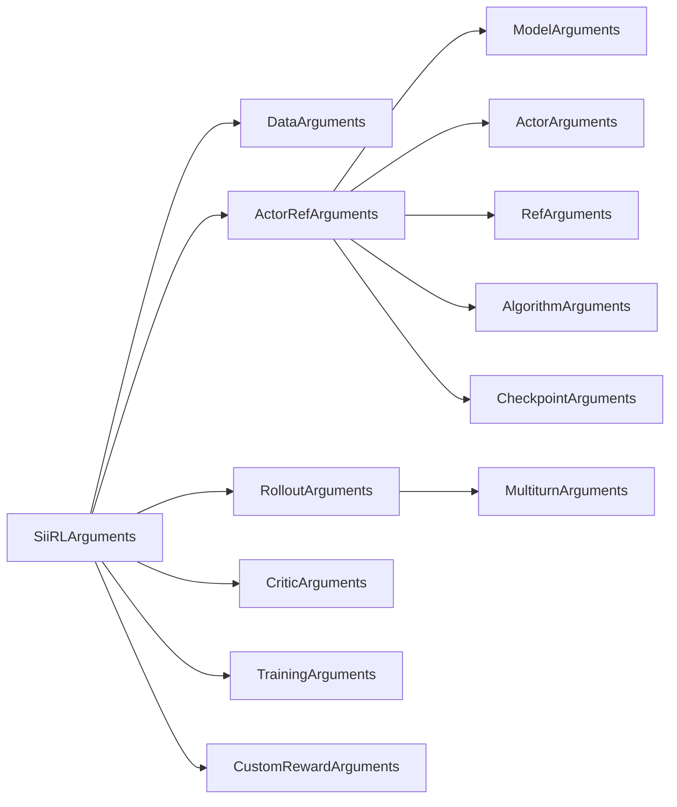

# Configuration System

*Understand siirl-agentic's CLI-driven configuration hierarchy and how to override any parameter.*

## Overview

!!! tip "Key Insight"
    siirl-agentic has no YAML config file loader — every parameter is passed as a CLI argument in dot-notation. This means shell scripts are your config files. Keep a copy of your training shell script alongside your checkpoints so you can reproduce runs. To quickly inspect all defaults, run `python -c "from siirl.params import SiiRLArguments; import dataclasses; print(dataclasses.asdict(SiiRLArguments()))"`.

siirl-agentic uses a **hierarchical dataclass-based configuration system** parsed via `argparse` + `OmegaConf.from_cli()`. All configuration is represented by the `SiiRLArguments` dataclass, which contains nested dataclasses for each subsystem.

!!! warning "No YAML File Loading"
    Unlike Hydra-based frameworks, `parse_config()` does **not** load a YAML config file. All parameters are passed directly as CLI arguments in dot-notation (e.g., `trainer.total_epochs=50`). Shell scripts typically set these in `bash` variables for readability.

## Configuration Hierarchy

The top-level `SiiRLArguments` dataclass is composed of these six sub-configs:

```python
@dataclass
class SiiRLArguments:
    data: DataArguments               # Data paths, formats, tokenization
    actor_ref: ActorRefArguments      # Model path + Actor + Ref + Algorithm
    rollout: RolloutArguments         # SGLang inference engine config
    critic: CriticArguments           # Value function model (PPO only)
    trainer: TrainingArguments        # GPU resources + training loop
    custom_reward_function: CustomRewardArguments  # Custom reward module
```



*Figure 1: SiiRLArguments configuration hierarchy*

## Essential Parameters Quick Reference

!!! tip "Start here for new runs"
    These 15 parameters cover 90% of what you need to tune for a typical GRPO agentic training run.

| Parameter                                     | Default      | Description                                            |
| --------------------------------------------- | ------------ | ------------------------------------------------------ |
| `actor_ref.model.path`                        | *(required)* | HuggingFace model path or checkpoint                   |
| `data.train_files`                            | *(required)* | List of training Parquet paths                         |
| `data.train_batch_size`                       | `1024`       | Prompts per training step                              |
| `data.max_prompt_length`                      | `512`        | Max prompt tokens (increase for agentic tasks)         |
| `data.max_response_length`                    | `512`        | Max response tokens (increase to 4096+ for multi-turn) |
| `actor_ref.algorithm.adv_estimator`           | `"grpo"`     | Algorithm: `"grpo"` or `"ppo"`                         |
| `actor_ref.algorithm.norm_adv_by_std_in_grpo` | `true`       | GRPO vs Dr.GRPO                                        |
| `actor_ref.actor.optim.lr`                    | `1e-6`       | Actor learning rate                                    |
| `actor_ref.actor.clip_ratio`                  | `0.2`        | PPO clip ratio                                         |
| `actor_ref.actor.ppo_epochs`                  | `1`          | Update passes per batch                                |
| `rollout.n`                                   | `1`          | Responses per prompt (use 8 for GRPO)                  |
| `rollout.temperature`                         | `1.0`        | Sampling temperature                                   |
| `rollout.gpu_memory_utilization`              | `0.5`        | SGLang memory fraction                                 |
| `trainer.actor_gpus`                          | `2`          | GPUs for training                                      |
| `trainer.rollout_gpus`                        | `6`          | GPUs for rollout                                       |
| `trainer.save_freq`                           | `-1`         | Steps between checkpoints (disabled by default!)       |
| `trainer.total_epochs`                        | `30`         | Training epochs                                        |

## How Parsing Works

The parsing flow in `siirl/params/parser.py`:

``` python
def parse_config() -> SiiRLArguments:
    parser = argparse.ArgumentParser()
    _, overrides = parser.parse_known_args()         # Capture all CLI args
    overrides = OmegaConf.from_cli(overrides)        # Parse dot-notation into nested dict
    siirl_config_dict = OmegaConf.to_container(overrides, resolve=True)
    siirl_args = convert_to_dataclass(siirl_config_dict, SiiRLArguments)
    return siirl_args
```

Any parameter not specified on the CLI uses the dataclass default value.


*Figure 2: Configuration parsing pipeline*

## Configuration Source Files

| File                            | Contains                                                                                                                                                     |
| ------------------------------- | ------------------------------------------------------------------------------------------------------------------------------------------------------------ |
| `siirl/params/training_args.py` | `TrainingArguments`, `SiiRLArguments`, `CustomRewardArguments`                                                                                               |
| `siirl/params/model_args.py`    | `ModelArguments`, `ActorArguments`, `RefArguments`, `RolloutArguments`, `MultiturnArguments`, `AlgorithmArguments`, `CriticArguments`, `CheckpointArguments` |
| `siirl/params/data_args.py`     | `DataArguments`                                                                                                                                              |
| `siirl/params/parser.py`        | `parse_config()` function                                                                                                                                    |

## Example: Shell Script Config

Since there is no YAML config file, training scripts use shell variables:

``` bash
export MODEL_PATH=/models/Qwen3-8B
export TRAIN_DATA_PATH=/data/train.parquet
export TEST_DATA_PATH=/data/test.parquet

python -m siirl.async_train \
    data.train_files="['$TRAIN_DATA_PATH']" \
    data.val_files="['$TEST_DATA_PATH']" \
    data.prompt_key=prompt \
    data.max_prompt_length=2048 \
    data.max_response_length=4096 \
    data.train_batch_size=512 \
    actor_ref.model.path=$MODEL_PATH \
    actor_ref.actor.train_backend=megatron \
    actor_ref.actor.ppo_mini_batch_size=256 \
    actor_ref.actor.clip_ratio=0.2 \
    actor_ref.actor.ppo_epochs=1 \
    actor_ref.actor.optim.lr=1e-6 \
    actor_ref.actor.optim.lr_decay_style=linear \
    actor_ref.algorithm.adv_estimator=grpo \
    actor_ref.algorithm.norm_adv_by_std_in_grpo=true \
    rollout.name=sglang \
    rollout.temperature=1.0 \
    rollout.top_p=1.0 \
    rollout.n=8 \
    rollout.gpu_memory_utilization=0.7 \
    rollout.tensor_model_parallel_size=2 \
    rollout.max_model_len=8192 \
    trainer.total_epochs=30 \
    trainer.actor_gpus=4 \
    trainer.rollout_gpus=4 \
    trainer.save_freq=10 \
    trainer.test_freq=5
```

## Key Configuration Groups

### Data Configuration (`data:`)

| Parameter             | Type      | Default                        | Description                                 |
| --------------------- | --------- | ------------------------------ | ------------------------------------------- |
| `train_files`         | list[str] | `["~/data/.../train.parquet"]` | Training dataset paths                      |
| `val_files`           | list[str] | `["~/data/.../test.parquet"]`  | Validation dataset paths                    |
| `train_batch_size`    | int       | 1024                           | Samples per training step                   |
| `max_prompt_length`   | int       | 512                            | Max prompt token length                     |
| `max_response_length` | int       | 512                            | Max response token length                   |
| `mask_history`        | bool      | false                          | Mask earlier turns, train on last turn only |
| `train_on_prompt`     | bool      | false                          | Include prompt tokens in loss               |

### Rollout Configuration (`rollout:`)

| Parameter                    | Type  | Default  | Description                                  |
| ---------------------------- | ----- | -------- | -------------------------------------------- |
| `name`                       | str   | "sglang" | Inference engine                             |
| `temperature`                | float | 1.0      | Sampling temperature                         |
| `n`                          | int   | 1        | Responses per prompt (GRPO typically uses 8) |
| `gpu_memory_utilization`     | float | 0.5      | SGLang GPU memory fraction                   |
| `tensor_model_parallel_size` | int   | 1        | Inference TP size                            |
| `train_server_concurrency`   | int   | 256      | Max concurrent requests per engine           |
| `flow_function`              | str   | "naive"  | Rollout flow implementation                  |
| `executor_module`            | str   | "naive"  | Batch executor module                        |

### Multi-turn Configuration (`rollout.multiturn:`)

| Parameter                    | Type | Default  | Description                                          |
| ---------------------------- | ---- | -------- | ---------------------------------------------------- |
| `env_type`                   | str  | null     | Environment type: `tool_env`, `vla_env`              |
| `max_env_turns`              | int  | 1        | Max environment interaction rounds                   |
| `max_assistant_turns`        | int  | 1        | Max model generation turns                           |
| `max_parallel_calls`         | int  | 1        | Concurrent tool calls per sample                     |
| `max_env_response_length`    | int  | 256      | Max env response length (**characters**, not tokens) |
| `env_response_truncate_side` | str  | "middle" | Truncation: left/middle/right                        |

!!! warning "Character-Based Truncation"
    `max_env_response_length` is measured in **characters** (Python `len(str)`), not tokens. The truncation happens on the raw text string before tokenization. See `NaiveFlow._step()` for the implementation.

### Training Configuration (`trainer:`)

| Parameter         | Type | Default | Description                             |
| ----------------- | ---- | ------- | --------------------------------------- |
| `total_epochs`    | int  | 30      | Training epochs                         |
| `actor_gpus`      | int  | 2       | GPUs for training                       |
| `rollout_gpus`    | int  | 6       | GPUs for rollout                        |
| `colocate`        | bool | false   | Share GPUs between training and rollout |
| `async_factor`    | int  | 1       | Rollout batch buffer ahead count        |
| `off_policy_step` | int  | 0       | Off-policy version window               |
| `save_freq`       | int  | -1      | Checkpoint save frequency               |
| `resume_mode`     | str  | "auto"  | Resume: auto/disable/resume_path        |

## Common Mistakes

| Mistake                                            | Symptom                      | Fix                                         |
| -------------------------------------------------- | ---------------------------- | ------------------------------------------- |
| `max_response_length` too small for multi-turn     | Trajectories truncated early | Increase to 4096+ for agentic tasks         |
| `n > 1` with PPO                                   | Unexpected behavior          | Use `n=1` for PPO, `n=8` for GRPO           |
| `actor_gpus + rollout_gpus > total GPUs`           | Resource allocation failure  | Ensure sum matches available GPUs           |
| Missing `multiturn.env_type`                       | No tool interaction          | Set `env_type: tool_env`                    |
| `colocate=true` with high `gpu_memory_utilization` | OOM errors                   | Framework auto-clamps to 0.45               |
| Using `--config config.yaml`                       | Error: unrecognized argument | No YAML file loading — use CLI dot-notation |

## CLI Override Quick Reference

All parameters are passed as `key=value` pairs on the command line. Nested config uses dot-notation. This table covers the most commonly overridden parameters:

| Override                              | Effect                        | Example                                  |
| ------------------------------------- | ----------------------------- | ---------------------------------------- |
| `trainer.total_epochs=N`              | Set number of training epochs | `trainer.total_epochs=50`                |
| `trainer.actor_gpus=N`                | GPUs for training             | `trainer.actor_gpus=4`                   |
| `trainer.rollout_gpus=N`              | GPUs for rollout              | `trainer.rollout_gpus=4`                 |
| `trainer.save_freq=N`                 | Save checkpoint every N steps | `trainer.save_freq=20`                   |
| `trainer.test_freq=N`                 | Validate every N steps        | `trainer.test_freq=10`                   |
| `trainer.off_policy_step=N`           | Allow N steps stale data      | `trainer.off_policy_step=2`              |
| `data.train_batch_size=N`             | Samples per training step     | `data.train_batch_size=512`              |
| `data.max_response_length=N`          | Max response tokens           | `data.max_response_length=4096`          |
| `actor_ref.actor.optim.lr=X`          | Learning rate                 | `actor_ref.actor.optim.lr=1e-6`          |
| `actor_ref.algorithm.adv_estimator=X` | Algorithm: `grpo` or `ppo`    | `actor_ref.algorithm.adv_estimator=grpo` |
| `rollout.temperature=X`               | Sampling temperature          | `rollout.temperature=0.8`                |
| `rollout.n=N`                         | Responses per prompt          | `rollout.n=8`                            |
| `rollout.gpu_memory_utilization=X`    | SGLang memory fraction        | `rollout.gpu_memory_utilization=0.7`     |
| `rollout.multiturn.max_env_turns=N`   | Max tool call rounds          | `rollout.multiturn.max_env_turns=5`      |
| `trainer.resume_mode=X`               | Resume strategy               | `trainer.resume_mode=auto`               |

### List Parameters

List values use Python-style syntax wrapped in quotes:

```bash
data.train_files="['/path/to/train1.parquet', '/path/to/train2.parquet']"
```

### Boolean Parameters

Use lowercase `true`/`false`:

```bash
trainer.colocate=true
actor_ref.actor.megatron.param_offload=true
```

### Nested Override Example

To change only the learning rate for a GRPO run without touching other parameters:

```bash
python -m siirl.async_train \
    actor_ref.actor.optim.lr=5e-7 \
    actor_ref.actor.optim.lr_decay_style=cosine \
    actor_ref.algorithm.adv_estimator=grpo \
    actor_ref.algorithm.norm_adv_by_std_in_grpo=true
```

## Loss Aggregation Modes

!!! tip "Key Takeaway"
    The `loss_agg_mode` parameter controls how per-token losses are reduced to a scalar. The right mode depends on whether your sequences have variable lengths — choosing poorly can cause long sequences to dominate training or short sequences to be under-weighted.

The `agg_loss()` function (`siirl/algorithm/loss.py`:27) supports four aggregation modes:

| Mode                      | Formula                                                                                                                 | Best For                                                                                                                            |
| ------------------------- | ----------------------------------------------------------------------------------------------------------------------- | ----------------------------------------------------------------------------------------------------------------------------------- |
| `token-mean`              | $\frac{\sum_i \text{loss}_i \cdot \text{mask}_i}{\sum_i \text{mask}_i}$                                                 | Default; fixed-length sequences where every token matters equally                                                                   |
| `seq-mean-token-sum`      | $\frac{1}{N_{\text{seq}}} \sum_s \sum_{t \in s} \text{loss}_t \cdot \text{mask}_t$                                      | Variable length; intentionally weights longer sequences more                                                                        |
| `seq-mean-token-mean`     | $\frac{1}{N_{\text{seq}}} \sum_s \frac{\sum_{t \in s} \text{loss}_t \cdot \text{mask}_t}{\sum_{t \in s} \text{mask}_t}$ | Variable length; equal weight per sequence regardless of length                                                                     |
| `seq-mean-token-sum-norm` | $\frac{\sum_s \sum_{t \in s} \text{loss}_t \cdot \text{mask}_t}{L_{\text{scale}}}$                                      | Stable training with very different lengths; $L_{\text{scale}}$ defaults to sequence dimension size, or set via `loss_scale_factor` |

Both the Actor and Critic support this parameter independently:

```bash
actor_ref.actor.loss_agg_mode="token-mean"    # Actor loss aggregation
critic.loss_agg_mode="token-mean"              # Critic loss aggregation (PPO only)
```

!!! warning "Dynamic Batch Interaction"
    When `use_dynamic_batch=True`, the `token-mean` mode uses a global `batch_num_tokens` denominator instead of the local mask sum, and `seq-mean-token-sum` uses `global_valid_seqs`. This ensures consistent loss scaling across GPUs with different micro-batch sizes.

## Off-Policy Configuration

!!! tip "Key Takeaway"
    By default siirl-agentic is strictly on-policy (`off_policy_step=0`). Enable off-policy training to reuse previous rollout data, improving sample efficiency at the cost of slightly stale gradients.

| Parameter                     | Type | Default  | Description                                                                                                                                                      |
| ----------------------------- | ---- | -------- | ---------------------------------------------------------------------------------------------------------------------------------------------------------------- |
| `trainer.off_policy_step`     | int  | `0`      | Number of version steps allowed for off-policy data. `0` = pure on-policy (only current version data). `N` = accept data from versions `[current - N, current]`. |
| `trainer.off_policy_strategy` | str  | `"fifo"` | Dispatch strategy for off-policy data. `"fifo"` discards oldest data first. `"oldest_first"` trains on oldest data first.                                        |

How it works with the DataBuffer:

1. Each rollout batch is tagged with the model version that generated it
2. When `off_policy_step=0`, the DataBuffer only releases batches matching the current training version
3. When `off_policy_step=N`, batches from up to N versions ago are accepted for training
4. The `off_policy_strategy` determines the order in which buffered batches are consumed

```bash
# Example: allow data up to 2 versions stale, consume oldest first
trainer.off_policy_step=2
trainer.off_policy_strategy="oldest_first"
```

!!! note "Async Factor Interaction"
    `trainer.async_factor` (default 1) controls how many rollout batches are buffered ahead. Combined with `off_policy_step`, this determines the maximum staleness of training data. With `async_factor=2` and `off_policy_step=1`, up to 3 batches may be buffered.

## Dynamic Batching

!!! tip "Key Takeaway"
    Use `use_dynamic_batch=True` when your sequences have widely varying lengths. This replaces fixed per-GPU batch sizes with token-based budgeting, improving GPU memory utilization.

| Parameter                              | Type | Default   | Description                                                                      |
| -------------------------------------- | ---- | --------- | -------------------------------------------------------------------------------- |
| `actor_ref.actor.use_dynamic_batch`    | bool | `False`   | Enable token-based dynamic batching instead of fixed sample count                |
| `actor_ref.actor.max_tokens_per_gpu`   | int  | `4096`    | Maximum tokens per GPU per micro-batch when dynamic batching is enabled          |
| `actor_ref.actor.use_workload_balance` | bool | `True`    | Use FLOPs-based workload balancing across GPUs (otherwise sequence-length based) |
| `actor_ref.actor.denominator_scope`    | str  | `"local"` | Loss denominator scope: `"local"` (per-GPU) or `"dp_global"` (across DP group)   |

| Feature          | Fixed Batch (`use_dynamic_batch=False`)                | Dynamic Batch (`use_dynamic_batch=True`)                      |
| ---------------- | ------------------------------------------------------ | ------------------------------------------------------------- |
| Batch size       | Fixed samples per GPU (`ppo_micro_batch_size_per_gpu`) | Variable samples, capped by `max_tokens_per_gpu`              |
| Memory usage     | Can waste memory on short sequences, OOM on long ones  | Adapts to sequence length distribution                        |
| Workload balance | Uneven if sequence lengths vary                        | FLOPs-balanced across GPUs (when `use_workload_balance=True`) |
| When to use      | Uniform-length data (e.g., math)                       | Variable-length data (e.g., multi-turn agentic)               |

```bash
# Enable dynamic batching for agentic training with variable-length trajectories
actor_ref.actor.use_dynamic_batch=true
actor_ref.actor.max_tokens_per_gpu=8192
actor_ref.actor.use_workload_balance=true
actor_ref.actor.denominator_scope="dp_global"
```

## Advanced Parallelism

!!! tip "Key Takeaway"
    Beyond basic TP/PP/DP, siirl-agentic supports sequence parallelism, context parallelism, and MoE expert parallelism for scaling to large models and long sequences.

| Parameter                             | Type | Default | Description                                                                                        |
| ------------------------------------- | ---- | ------- | -------------------------------------------------------------------------------------------------- |
| `trainer.sequence_parallel`           | bool | `False` | Enable Megatron sequence parallelism (splits activations along sequence dimension across TP ranks) |
| `trainer.context_parallel_size`       | int  | `1`     | Context parallelism degree for very long sequences                                                 |
| `trainer.expert_model_parallel_size`  | int  | `1`     | MoE expert parallelism (EP) — distributes experts across GPU groups                                |
| `trainer.expert_tensor_parallel_size` | int  | `1`     | MoE expert tensor parallelism — shards individual experts across GPUs                              |

| Parallelism   | Config Key                             | When to Use                                       | Constraint                           |
| ------------- | -------------------------------------- | ------------------------------------------------- | ------------------------------------ |
| Tensor (TP)   | `trainer.tensor_model_parallel_size`   | Large models that don't fit in single-GPU memory  | Must divide `actor_gpus`             |
| Pipeline (PP) | `trainer.pipeline_model_parallel_size` | Very deep models; hide communication with compute | TP x PP must divide `actor_gpus`     |
| Sequence (SP) | `trainer.sequence_parallel`            | Reduce activation memory with TP > 1              | Requires TP > 1                      |
| Context (CP)  | `trainer.context_parallel_size`        | Very long sequences (>8k tokens)                  | Must divide `actor_gpus` / (TP x PP) |
| Expert (EP)   | `trainer.expert_model_parallel_size`   | MoE models with many experts (e.g., 64+)          | Must divide number of experts        |
| Expert TP     | `trainer.expert_tensor_parallel_size`  | Large individual MoE experts                      | Must divide TP size                  |

```bash
# Example: 8-GPU MoE training with EP=2, TP=2, SP enabled
trainer.actor_gpus=8
trainer.tensor_model_parallel_size=2
trainer.sequence_parallel=true
trainer.expert_model_parallel_size=2
trainer.expert_tensor_parallel_size=1
```

!!! warning "Parallelism Compatibility"
    Sequence parallelism (`sequence_parallel=true`) requires tensor parallelism (`tensor_model_parallel_size > 1`) — it splits activation tensors along the sequence dimension across the same TP group. Context parallelism is orthogonal to TP and can be used independently.

## Next steps

- [GRPO Training](grpo_training.md) — Apply your config knowledge to GRPO-specific parameters like group size and advantage normalization
- [Best Practices](../reference/best_practices.md) — Learn which configuration values are most commonly misconfigured and how to avoid pitfalls
- [Configuration Reference](../reference/config_reference.md) — Complete parameter listing with types, defaults, and descriptions
