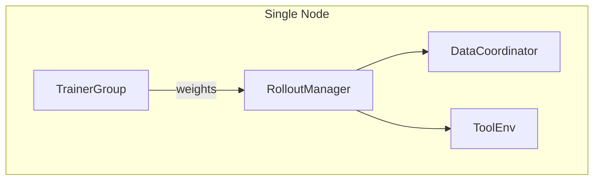
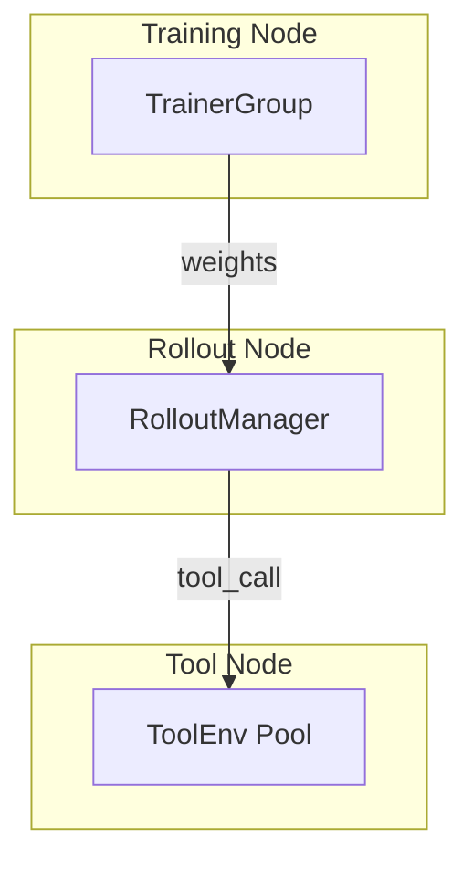
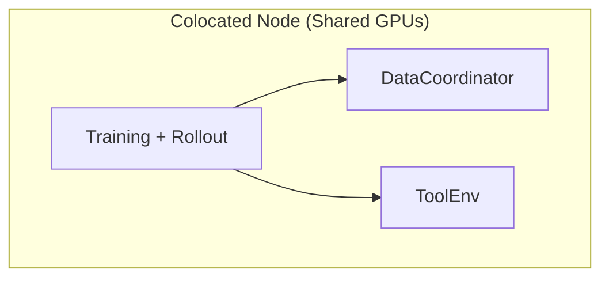
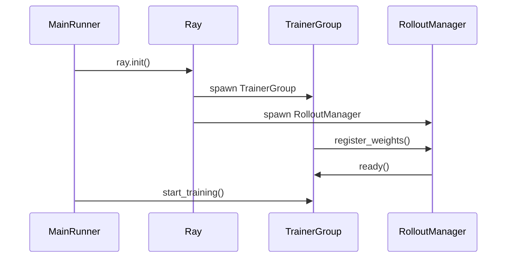

# Deployment Modes

*Choose between separated and colocated GPU topologies and understand when to use each.*

## Separated Mode (Default)

!!! tip "Key Insight"
    Separated mode is the right default for almost all cases. The GPU split ratio matters: if rollout is the bottleneck (generation time >> training step time), give more GPUs to rollout. If training is the bottleneck, give more to training. A 4+4 split on 8 GPUs is a balanced starting point for 7B–8B models. Only switch to colocated mode when you genuinely cannot afford the minimum 2 GPUs required by separated mode.

GPUs are split between training and rollout. Each group has dedicated resources.

``` yaml
trainer:
  colocate: false         # Default
  actor_gpus: 4           # GPUs for training (default: 2)
  rollout_gpus: 4         # GPUs for rollout (default: 6)
```



*Figure 1: Separated mode GPU topology*

**When to use:** Most production training. Clear resource boundaries, predictable performance. Recommended for models >= 7B parameters.

### Resource Allocation Examples

| Model Size | actor_gpus | rollout_gpus      | Notes                              |
| ---------- | ---------- | ----------------- | ---------------------------------- |
| 1.5B–3B    | 2          | 6                 | More rollout for fast generation   |
| 7B–8B      | 4          | 4                 | Balanced split                     |
| 13B–14B    | 4          | 4                 | TP=4 for both training and rollout |
| 70B+       | 8          | 8 (separate node) | Multi-node required                |

## Weight Synchronization

!!! tip "How weights move from trainer to rollout engine"
    Understanding the sync mechanism helps diagnose stalls and OOM during transitions.

In **separated mode**, weight sync uses `ParamSyncDistributed`: parameters are gathered from Megatron shards and broadcast over NCCL to the rollout engine's GPU memory.

In **colocated mode**, weight sync uses `ParamSyncColocated`: after each training step, the colocated flow runs:

```
rollout_manager.offload_for_train()   # move rollout engine weights to CPU
 → train()                            # forward + backward + optimizer step
 → rollout_manager.resume_for_rollout()  # load updated weights back to GPU
```

This offload/resume cycle is what `colocate_timeout_s=60` guards against — if offloading takes longer than 60 seconds (common with large models), it raises a timeout error.

## Colocated Mode

Training and rollout share all GPUs via weight offloading.

``` yaml
trainer:
  colocate: true
  colocate_timeout_s: 60              # Timeout for weight offloading transitions (default: 60)
  colocate_flattened_fail_fast: true   # Fail fast on offload errors (default: true)
```



*Figure 2: Colocated mode GPU topology*

**When to use:** Limited GPU budget, smaller models (< 7B). Maximum GPU utilization at the cost of time-sharing overhead.

The framework automatically manages:

- `megatron.param_offload = true` — Offload parameters to CPU when not in use
- `rollout.gpu_memory_utilization` clamped to `COLOCATE_MAX_GPU_MEM_UTIL=0.45` — Prevent OOM during transitions
- `validate_reuse_train_gpus` forced to `False` — Cannot reuse GPUs during validation in colocated mode
- `param_offload=True` — Forced on for all Megatron actors in colocated mode

### Separated vs Colocated Comparison



*Figure 3: Separated vs Colocated execution model*

### Colocated Execution Flow



*Figure 4: Colocated mode execution timeline*

## Multi-Node Deployment

For large models that don't fit on a single node:

``` yaml
trainer:
  nnodes: 2                    # Number of nodes
  n_gpus_per_node: 8           # GPUs per node
  actor_gpus: 8                # 1 node for training
  rollout_gpus: 8              # 1 node for rollout
```

### Multi-Node Setup Steps

1. **Start Ray cluster** on the head node:
   ``` bash
   ray start --head --port=6379
   ```

2. **Join worker nodes**:
   ``` bash
   ray start --address='head-node-ip:6379'
   ```

3. **Verify cluster**:
   ``` bash
   ray status  # Should show all nodes and GPUs
   ```

4. **Launch training** from the head node:
   ``` bash
   python -m siirl.async_train trainer.nnodes=2 trainer.n_gpus_per_node=8 ...
   ```

## Memory Planning

!!! tip "Key Takeaway"
    Use these formulas to estimate GPU memory before launching. Over-provisioning wastes resources; under-provisioning causes OOM.

### Separated Mode Memory Layout

In separated mode, training and rollout GPUs have independent memory budgets. The formulas below use `N` as the model parameter count in billions (e.g., N=7 for a 7B model).

| Node Role | Component                | Memory Formula                                                        | 7B Example (A100-80G)     |
| --------- | ------------------------ | --------------------------------------------------------------------- | ------------------------- |
| Training  | Actor weights (BF16)     | 2 x N GB                                                              | 14 GB                     |
| Training  | Optimizer states (AdamW) | 8 x N GB (with `use_distributed_optimizer=True`, divided by DP ranks) | 56 GB / DP                |
| Training  | Gradients (BF16)         | 2 x N GB                                                              | 14 GB                     |
| Training  | Reference model (BF16)   | 2 x N GB (with `ref.param_offload=True`, offloaded to CPU)            | 14 GB (or 0 if offloaded) |
| Training  | Activation memory        | Varies by sequence length and micro-batch size                        | 5-15 GB                   |
| Rollout   | SGLang KV cache          | `gpu_memory_utilization` x VRAM                                       | 0.5 x 80 = 40 GB          |
| Rollout   | Model weights (BF16)     | 2 x N GB / TP size                                                    | 14 GB / TP                |

**Example: 7B model on 8x A100-80G (4 train + 4 rollout)**

- Training per GPU: ~14 GB weights + ~14 GB optimizer/DP + ~14 GB grads + activations = ~50 GB
- Rollout per GPU: ~3.5 GB weights (TP=4) + ~40 GB KV cache = ~43.5 GB

### Colocated Mode Memory Layout

In colocated mode, both training and rollout share the same GPUs via time-sharing. The `_apply_colocate_guards()` function (`async_train.py`:42) automatically enforces safety limits:

- Forces `param_offload=True` on all Megatron configs (actor, ref, critic)
- Clamps `gpu_memory_utilization` to `COLOCATE_MAX_GPU_MEM_UTIL=0.45`
- Disables `validate_reuse_train_gpus`

| Phase                    | Active Memory                             | Peak             | Notes                              |
| ------------------------ | ----------------------------------------- | ---------------- | ---------------------------------- |
| Rollout phase            | Model weights + KV cache (0.45 x VRAM)    | ~50 GB on 80G    | Params offloaded after training    |
| Train→Rollout transition | Briefly both in memory                    | Highest OOM risk | Guarded by `colocate_timeout_s=60` |
| Training phase           | Weights + optimizer + grads + activations | ~60 GB on 80G    | KV cache freed                     |

## Weight Synchronization Protocol

!!! tip "Key Takeaway"
    In colocated mode, weights transfer via `FlattenedTensorBucket` — a flattened tensor buffer for efficient CUDA IPC. In separated mode, `ParamSyncDistributed` uses NCCL for cross-node broadcast.

### FlattenedTensorBucket IPC (Colocated Mode)

`ParamSyncColocated` (`update_weight.py`:452) uses SGLang's `FlattenedTensorBucket` for zero-copy weight transfer between training and rollout processes on the same GPU:

1. Model parameters are exported via `mbridge._export_weights_in_current_pipeline_stage()`
2. Parameters are grouped by dtype and packed into `FlattenedTensorBucket` instances
3. The flattened tensor is serialized via `MultiprocessingSerializer` with CUDA IPC handles
4. Each bucket is sent to rollout workers via `param_sync_from_tensor.remote()` with `load_format="flattened_bucket"`

Key configuration:

| Parameter                              | Default            | Description                                                                                            |
| -------------------------------------- | ------------------ | ------------------------------------------------------------------------------------------------------ |
| `trainer.param_sync_buffer_size`       | 536870912 (512 MB) | Buffer size per sync chunk. Increase to 1 GB for MoE or 13B+ models                                    |
| `trainer.colocate_flattened_fail_fast` | `true`             | If `true`, fails immediately on bucket sync errors with no fallback. Set to `false` only for debugging |
| `ParamSyncColocated._MAX_SYNC_RETRIES` | 2                  | Automatic retry count before fail-fast triggers                                                        |

### NCCL Broadcast (Separated Mode)

`ParamSyncDistributed` (`update_weight.py`:145) uses distributed process groups for cross-node weight sync:

1. Rollout workers connect via `connect_rollout_workers_from_distributed()`
2. Weights are chunked by `param_sync_buffer_size` and broadcast bucket-by-bucket
3. Rollout engine is paused (`pause_generation`) before sync and resumed (`continue_generation`) after
4. Weight version is verified on all workers post-sync

## Multi-Node Configuration

!!! tip "Key Takeaway"
    Keep tensor parallelism within a single node for optimal NVLink bandwidth. Use pipeline parallelism and data parallelism to span nodes.

### Parallelism Strategy

The `TrainingArguments` dataclass (`training_args.py`:117-123) exposes these parallelism controls:

| Parameter                              | Default | Scope               | Recommendation                                                                          |
| -------------------------------------- | ------- | ------------------- | --------------------------------------------------------------------------------------- |
| `trainer.tensor_model_parallel_size`   | 1       | Intra-node (NVLink) | Set to 4 or 8 within a node. Never span nodes — NVLink is 10-50x faster than InfiniBand |
| `trainer.pipeline_model_parallel_size` | 1       | Can span nodes      | Use PP=2+ for 70B+ models when single-node TP is insufficient                           |
| `trainer.context_parallel_size`        | 1       | Intra-node          | For very long sequences (32K+ tokens)                                                   |
| `trainer.expert_model_parallel_size`   | 1       | MoE models          | Distribute experts across GPUs                                                          |
| `trainer.sequence_parallel`            | `false` | With TP             | Enable when TP > 1 to reduce activation memory                                          |
| `rollout.tensor_model_parallel_size`   | 1       | Rollout side        | Must be <= `rollout_gpus`. Independent from training TP                                 |

### NCCL Environment Variables

For multi-node training, set these environment variables before launching:

``` bash
# Required for multi-node NCCL communication
export NCCL_SOCKET_IFNAME=eth0          # Network interface (check with `ip addr`)
export NCCL_IB_DISABLE=0                # Enable InfiniBand if available
export NCCL_DEBUG=WARN                  # Set to INFO for connection debugging

# Optional: improve multi-node performance
export NCCL_NET_GDR_LEVEL=5             # Enable GPU Direct RDMA
export NCCL_P2P_DISABLE=0              # Enable peer-to-peer GPU communication
```

### Multi-Node Topology Examples

=== "2 Nodes, 70B Model"

    ``` yaml
    trainer:
      nnodes: 2
      n_gpus_per_node: 8
      actor_gpus: 8                       # Node 1: training
      rollout_gpus: 8                     # Node 2: rollout
      tensor_model_parallel_size: 8       # TP within node
      pipeline_model_parallel_size: 1
    rollout:
      tensor_model_parallel_size: 8       # Rollout TP within node
    ```

=== "4 Nodes, 70B Model with PP"

    ``` yaml
    trainer:
      nnodes: 4
      n_gpus_per_node: 8
      actor_gpus: 16                      # Nodes 1-2: training
      rollout_gpus: 16                    # Nodes 3-4: rollout
      tensor_model_parallel_size: 8       # TP within each node
      pipeline_model_parallel_size: 2     # PP across 2 training nodes
    rollout:
      tensor_model_parallel_size: 8
    ```

## Comparison

| Aspect                      | Separated                | Colocated                    |
| --------------------------- | ------------------------ | ---------------------------- |
| GPU efficiency              | Dedicated per role       | Time-shared                  |
| Memory pressure             | Lower                    | Higher (offloading overhead) |
| Complexity                  | Simple                   | Offload management           |
| Best for                    | Production, large models | Prototyping, small models    |
| `validate_reuse_train_gpus` | Supported                | Not supported                |
| Min GPUs                    | 2 (1 train + 1 rollout)  | 1                            |

## Common mistakes

| Mistake                                                            | Symptom                                   | Fix                                                                  |
| ------------------------------------------------------------------ | ----------------------------------------- | -------------------------------------------------------------------- |
| `actor_gpus + rollout_gpus` exceeds node GPU count                 | Ray fails to allocate actors              | Set sum equal to available GPUs (e.g., 4+4 on an 8-GPU node)         |
| Using `colocate=true` with `gpu_memory_utilization=0.7`            | OOM during rollout-to-training transition | Framework clamps to 0.45 in colocated mode; do not override manually |
| Multi-node without shared filesystem for checkpoints               | Each node saves to a different local path | Mount NFS or parallel FS at `trainer.default_local_dir`              |
| `rollout.tensor_model_parallel_size` larger than rollout GPU count | SGLang fails to initialize                | TP size must be ≤ number of rollout GPUs                             |
| Forgetting `ray start --head` before launching training            | `ConnectionRefusedError` to Ray           | Start the Ray cluster first, then run the training script            |

## Next steps

- [Checkpoint & Resume](checkpoint_resume.md) — Configure checkpoint saving and resume strategies for your chosen deployment topology
- [Performance Tuning](performance_tuning.md) — Fine-tune async overlap and memory settings for separated or colocated mode
- [Troubleshooting](../reference/troubleshooting.md) — Resolve Ray actor allocation failures and GPU memory errors in your deployment
