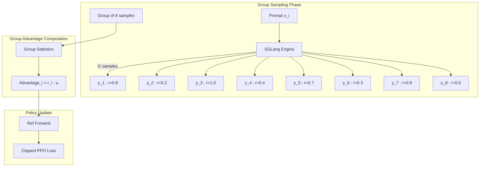
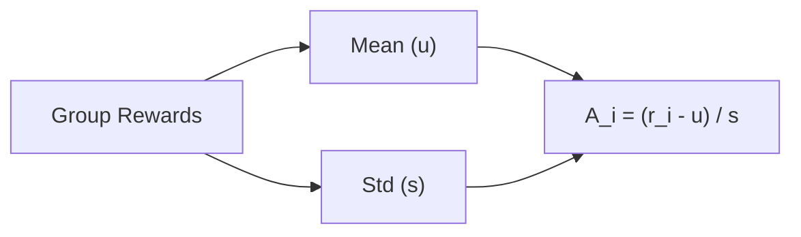

# GRPO Training

*Configure Group Relative Policy Optimization, understand group sampling mechanics, and tune for agentic tasks.*

## Overview

!!! tip "Key Insight"
    GRPO's biggest advantage for agentic tasks is that it needs no Critic model — reducing GPU memory by ~33% compared to PPO. The group of responses from the same prompt serves as a built-in baseline: responses above the group mean get positive advantage, below get negative. Start with `rollout.n=8`; smaller groups increase variance, larger groups increase compute cost linearly.

GRPO (Group Relative Policy Optimization) is a critic-free RL algorithm that estimates advantages by comparing rewards within a **group of responses** generated from the same prompt. This eliminates the need for a separate Critic model, reducing GPU memory and simplifying the training pipeline.

!!! note "Dr.GRPO Variant"
    When `norm_adv_by_std_in_grpo=false`, the algorithm becomes **Dr.GRPO** — advantages are computed as `(reward_i - mean)` without dividing by standard deviation. This can be useful when reward distributions have meaningful absolute scales.

## GRPO-Specific Configuration

``` yaml
actor_ref:
  algorithm:
    adv_estimator: grpo               # Use GRPO advantage estimator
    norm_adv_by_std_in_grpo: true     # Normalize advantages by group std (true=GRPO, false=Dr.GRPO)

  actor:
    ppo_mini_batch_size: 256
    ppo_micro_batch_size_per_gpu: 8
    clip_ratio: 0.2
    ppo_epochs: 1
    optim:
      lr: 1e-6

rollout:
  n: 8                                # Generate 8 responses per prompt
  temperature: 1.0                    # Sampling temperature
  do_sample: true

data:
  train_batch_size: 512               # Prompts per step (total samples = 512 × 8 = 4096)
```

## Minimal Runnable Example

``` bash
export MODEL_PATH=/path/to/Qwen3-8B
export TRAIN_DATA_PATH=/path/to/train.parquet
export TEST_DATA_PATH=/path/to/test.parquet

bash examples/grpo_train/run_qwen3_8b_separated.sh
```

## How GRPO Works



*Figure 1: GRPO training pipeline*

For each prompt, GRPO:

1. Generates `n` responses (default 8)
2. Computes reward for each response
3. Calculates group-relative advantage: `adv_i = (reward_i - mean) / std` (when `norm_adv_by_std_in_grpo=true`)
4. Updates the policy using PPO-style clipped objective

**Edge case:** When the group has only 1 sample (n=1), mean is set to 0 and std is set to 1, effectively using raw reward as the advantage (no normalization).

## Group Advantage Computation Detail



*Figure 2: Group advantage computation*

## Key Parameters

| Parameter                                     | Impact                                             | Recommended Range  |
| --------------------------------------------- | -------------------------------------------------- | ------------------ |
| `rollout.n`                                   | Group size (more = better estimates, more compute) | 4 to 16            |
| `rollout.temperature`                         | Response diversity                                 | 0.8 to 1.2         |
| `actor_ref.algorithm.norm_adv_by_std_in_grpo` | Normalize advantages (true=GRPO, false=Dr.GRPO)    | true (recommended) |
| `actor_ref.actor.optim.lr`                    | Learning rate                                      | 1e-7 to 5e-6       |
| `data.train_batch_size`                       | Prompts per step                                   | 128 to 1024        |

## GRPO Advantages for Agentic Tasks

GRPO is particularly well-suited for agentic training:

1.  **No Critic model** — Saves GPU memory, critical when tool environments consume resources
2.  **Group diversity** — Multiple responses from the same prompt explore different tool-use strategies
3.  **Simple reward signal** — Works with binary/sparse rewards common in agentic tasks (pass/fail)
4.  **Scalable** — Total rollout samples = `batch_size × n`, naturally parallelized

## Agentic GRPO Example

``` yaml
# GRPO + multi-turn tool interaction
actor_ref:
  algorithm:
    adv_estimator: grpo
  actor:
    ppo_mini_batch_size: 128

rollout:
  n: 8
  flow_function: naive
  multiturn:
    env_type: tool_env
    max_env_turns: 5
    max_assistant_turns: 10

data:
  train_batch_size: 256
  max_response_length: 8192   # Longer for multi-turn trajectories
```

## Implementation Details: `compute_grpo_outcome_advantage()`

!!! tip "How the advantage function works"
    Understanding what the code actually does helps you tune these parameters effectively.

The core advantage computation lives in `siirl/algorithm/grpo_utils.py`. Groups are identified by the `index` array — all samples sharing the same `index` value belong to the same prompt group.

```python
# Pseudocode of compute_grpo_outcome_advantage()
for each group (identified by index):
    group_rewards = rewards[group_mask]
    group_mean = group_rewards.mean()
    group_std  = group_rewards.std()

    if norm_adv_by_std_in_grpo:
        # Standard GRPO
        advantage = (reward - group_mean) / (group_std + eps)
    else:
        # Dr.GRPO — no std division
        advantage = reward - group_mean
```

The `eps` prevents division by zero when all group rewards are identical (std = 0).

### Loss Aggregation Modes

The `actor.loss_agg_mode` parameter controls how token-level losses are reduced to a scalar:

| Mode                        | Formula                                       | Use Case                          |
| --------------------------- | --------------------------------------------- | --------------------------------- |
| `"token-mean"`              | sum(loss × mask) / sum(mask)                  | Default; uniform weight per token |
| `"seq-mean-token-sum"`      | mean over seqs of sum(loss × mask) per seq    | Avoids long-seq dominance         |
| `"seq-mean-token-mean"`     | mean over seqs of mean(loss × mask) per seq   | Fully normalized                  |
| `"seq-mean-token-sum-norm"` | seq-mean-token-sum normalized by total tokens | Hybrid                            |

### KL Penalty Types

Set via `actor_ref.algorithm.kl_penalty`:

| Value          | Description                                                     |
| -------------- | --------------------------------------------------------------- |
| `"kl"`         | Standard KL: `log(p_old/p_new)`                                 |
| `"low_var_kl"` | Low-variance estimator; reduces noise in sparse reward settings |

## What Success Looks Like

A well-converging GRPO run will show these patterns:

| Metric                       | Expected Range         | Notes                                                    |
| ---------------------------- | ---------------------- | -------------------------------------------------------- |
| `reward/mean`                | Steadily increasing    | Plateau after 20+ steps → check reward function          |
| `reward/std`                 | Non-zero, stable       | Zero std → all responses same reward (check temperature) |
| `actor/clip_ratio`           | 0.05–0.25              | Too high → reduce lr; near zero → lr too low             |
| `kl/mean`                    | 0.5–10                 | >15 → reduce lr or enable KL penalty                     |
| `rollout/env_turns_mean`     | >1 (for agentic tasks) | Near 0 → tools not being invoked                         |
| Within-group reward variance | > 0                    | Zero variance → group comparison impossible              |

## Common Issues

| Symptom                                                   | Cause                               | Fix                                       |
| --------------------------------------------------------- | ----------------------------------- | ----------------------------------------- |
| All rewards identical in group                            | Temperature too low                 | Increase `rollout.temperature`            |
| Advantage variance too high                               | Small group size                    | Increase `rollout.n`                      |
| Slow rollout                                              | Large `n` × `batch_size`            | Reduce one or both, add rollout GPUs      |
| Training instability                                      | `norm_adv_by_std_in_grpo=false`     | Set to `true`                             |
| OOM during rollout                                        | Too many concurrent samples         | Reduce `rollout.train_server_concurrency` |
| `rollout.n=1` — no learning signal                        | Only 1 sample = no group comparison | Set `rollout.n` to at least 4             |
| `temperature=0.0` — identical responses                   | Greedy decoding = zero diversity    | Use `temperature` ≥ 0.7 for training      |
| High variance with `norm_adv_by_std_in_grpo=true` and n=2 | Std of 2 samples is noisy           | Use `rollout.n` ≥ 4; or switch to Dr.GRPO |

## Next steps

- [PPO Training](ppo_training.md) — Learn how PPO's Actor-Critic approach compares to GRPO's group-sampling method
- [Agentic Multi-Turn](agentic_multiturn.md) — Extend GRPO training to multi-turn tool-interaction trajectories
- [Performance Tuning](performance_tuning.md) — Squeeze more throughput from group sampling with async tuning and memory optimization
