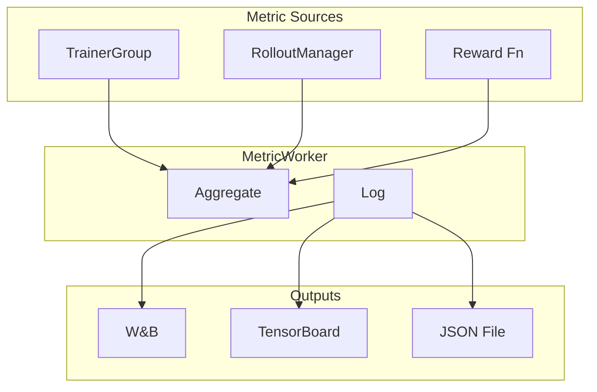

# Metrics & Monitoring

*Monitor training progress with the available metrics, logging backends, and validation configuration.*

## Logging Backends

!!! tip "Key Insight"
    The single most useful metric to watch during training is `reward/mean` — it should trend upward. If it's flat after 50+ steps, check your reward function and learning rate before adjusting anything else. For agentic training, also watch `rollout/env_turns_mean`: if it's 0 or 1, your agent is not using tools. Set `trainer.test_freq=10` early — the default is `-1` (disabled), so you won't get validation metrics unless you explicitly enable it.

``` yaml
trainer:
  logger: ["console", "wandb"]    # Default: both console and WandB
  project_name: siirl_examples
  experiment_name: my_experiment
```

Supported backends: `console`, `wandb`

## Metrics Collection Pipeline



*Figure 1: Metrics collection pipeline*

## Key Training Metrics

| Metric             | Description                               |
| ------------------ | ----------------------------------------- |
| `reward/mean`      | Average reward per step                   |
| `reward/std`       | Reward standard deviation                 |
| `actor/loss`       | Actor policy loss (Dual-clip PPO or GRPO) |
| `actor/clip_ratio` | Fraction of clipped updates               |
| `critic/loss`      | Critic value loss (PPO only)              |
| `kl/mean`          | KL divergence from reference model        |
| `lr`               | Current learning rate                     |

## Rollout Metrics

| Metric                         | Description                       |
| ------------------------------ | --------------------------------- |
| `rollout/generation_duration`  | LLM generation time (seconds)     |
| `rollout/reward_duration`      | Reward computation time (seconds) |
| `rollout/total_tokens`         | Total tokens generated            |
| `rollout/response_length_mean` | Average response length (tokens)  |

For agentic (multi-turn) training, additional metrics may appear:

| Metric                   | Description                                |
| ------------------------ | ------------------------------------------ |
| `rollout/env_turns_mean` | Average tool interaction rounds per sample |
| `rollout/env_duration`   | Time spent on tool calls                   |

## Validation Configuration

``` yaml
trainer:
  test_freq: 10                # Validate every N steps (default: -1 = disabled)
  val_before_train: true       # Validate before first step (default: true)
  log_val_generations: 5       # Log N validation sample generations (default: 0)

data:
  val_batch_size: null         # null = entire validation set (default: null)
```

!!! warning "Planned Feature"
    `log_val_generations` is defined in `TrainingArguments` but is **not yet consumed** by any code path. The parameter exists for future implementation of validation sample logging to WandB. Check release notes for availability.

## MetricWorker Implementation

!!! tip "MetricWorker is a separate Ray actor"
    Metrics are collected asynchronously and do not block the training loop.

The `MetricWorker` is initialized as `MetricWorker.remote()` — a dedicated Ray actor — during startup in `siirl/async_train.py`. Key implementation details:

- Located in `siirl/utils/metrics/`
- Spawned as `MetricWorker.remote()` — runs as a separate Ray actor, decoupled from the training loop
- A `MetricTracker` instance is created **only on rank 0** of the TrainerGroup, avoiding duplicate logging
- Handles both training metrics (loss, gradients, learning rate) and rollout metrics (generation time, reward)
- Validation behavior controlled by `val_before_train=True` (default) and `test_freq=-1` (disabled by default)

## Interpreting Metrics

### Healthy Training Signs

- `reward/mean` should trend upward over time
- `actor/loss` should decrease (but may fluctuate)
- `kl/mean` should stay bounded (typically < 15)
- `actor/clip_ratio` should be non-zero but not too high (0.1–0.3 is normal)

### Warning Signs

| Metric Pattern                           | Possible Cause                      | Action                             |
| ---------------------------------------- | ----------------------------------- | ---------------------------------- |
| `reward/mean` flat                       | Reward function issue or lr too low | Check reward function, increase lr |
| `kl/mean` > 20                           | Policy diverging too fast           | Reduce lr, enable KL loss          |
| `actor/clip_ratio` > 0.5                 | Clip ratio too loose                | Decrease `clip_ratio`              |
| `critic/loss` increasing                 | Critic lr too high                  | Reduce `critic.optim.lr`           |
| `rollout/generation_duration` increasing | Model generating longer responses   | Check `max_response_length`        |

## Validation & Evaluation Scaling

### Validation Configuration

```yaml
trainer:
  test_freq: 10                    # Run validation every N training steps (-1 = disabled)
  val_before_train: true           # Run validation before first training step (default: true)
  validate_reuse_train_gpus: false # Reuse training GPUs for validation rollout (separated mode only)
  log_val_generations: 5           # Log N validation sample outputs (planned, not yet active)

data:
  val_batch_size: null             # null = use the full validation set (default)
```

!!! note "val_batch_size: null"
    Setting `val_batch_size: null` runs validation over the entire validation dataset. For large datasets this can take significant time. Set an explicit value (e.g., `val_batch_size: 256`) to cap validation cost.

### Validation Sampling Parameters

Validation rollouts use different sampling parameters than training rollouts to measure greedy (deterministic) performance:

```yaml
rollout:
  val_temperature: 0.0        # Greedy decoding for validation (default: 0.0)
  val_top_p: 1.0              # No nucleus sampling for validation
  val_n: 1                    # Single response per prompt (not multi-sample)
```

Setting `val_temperature: 0.0` ensures validation metrics reflect the model's best-guess performance rather than a stochastic sample. This is consistent with how most benchmarks are reported.

### GPU Reuse in Separated Mode

In separated mode, you can optionally reuse training GPUs for validation rollout to avoid needing dedicated validation resources:

```yaml
trainer:
  validate_reuse_train_gpus: true   # Only works with colocate: false
```

When enabled, the TrainerGroup pauses and its GPUs are temporarily given to the RolloutManager for validation. This reduces GPU requirements but adds latency to the validation step.

!!! warning "Not supported in colocated mode"
    `validate_reuse_train_gpus` is automatically disabled when `trainer.colocate: true`. Colocated mode already shares GPUs between training and rollout — there is no separate "training GPU" pool to reuse.

### Troubleshooting Validation

| Symptom                             | Cause                                | Fix                                                                |
| ----------------------------------- | ------------------------------------ | ------------------------------------------------------------------ |
| Validation never runs               | `test_freq: -1` (default)            | Set `test_freq: 10` or another positive value                      |
| `val_before_train` takes too long   | Large validation set                 | Set `data.val_batch_size: 256` to limit scope                      |
| Validation OOM                      | Same GPU memory pressure as training | Reduce `data.val_batch_size` or enable `validate_reuse_train_gpus` |
| `log_val_generations` has no effect | Feature not yet implemented          | No action needed — this is a planned feature                       |
| Validation metrics not in WandB     | `logger` missing `wandb`             | Add `trainer.logger: ["console", "wandb"]`                         |

## Common mistakes

| Mistake                                                | Symptom                                             | Fix                                                                  |
| ------------------------------------------------------ | --------------------------------------------------- | -------------------------------------------------------------------- |
| Leaving `test_freq: -1` (default)                      | No validation metrics appear                        | Set `trainer.test_freq=10` before starting training                  |
| Not setting `experiment_name`                          | All runs share the same WandB run name              | Set `trainer.experiment_name` to a unique name per run               |
| Reading `kl/mean` without context                      | KL of 10 seems high but is normal early in training | Baseline expectation: KL < 15 is healthy; > 20 warrants action       |
| Ignoring `rollout/env_turns_mean` for agentic runs     | Missing signal that tools are not being called      | Track this metric; a value near 0 means the agent is not using tools |
| Using `val_batch_size: null` on a large validation set | Validation takes 10x longer than expected           | Set `data.val_batch_size: 256` to cap validation cost                |

## Next steps

- [Best Practices](../reference/best_practices.md) — Apply the production checklist to ensure your experiment tracking and validation are configured correctly
- [Performance Tuning](performance_tuning.md) — Use the metrics you've set up to diagnose rollout and training bottlenecks
- [Troubleshooting](../reference/troubleshooting.md) — Interpret metric anomalies and resolve common training failures
