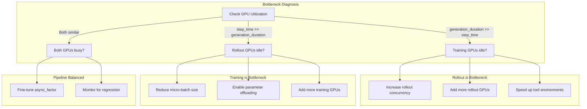
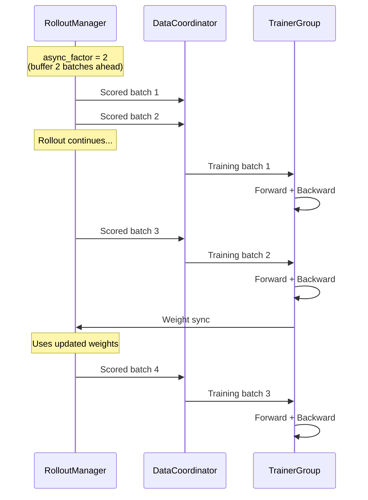

# Performance Tuning

*Diagnose bottlenecks and apply targeted tuning strategies for the async pipeline, rollout concurrency, memory, and agentic workloads.*

## Bottleneck Diagnosis

!!! tip "Key Insight"
    Before changing any performance settings, look at two metrics: `rollout/generation_duration` and the training step time. If generation time is 3x the training step time, rollout is your bottleneck — add rollout GPUs or increase `rollout.train_server_concurrency`. If they're roughly equal, you're well-balanced and `async_factor=2` will give you the most gain. Do not tune memory settings until you have confirmed which side is the bottleneck.

Before tuning, identify the bottleneck:



*Figure 1: Bottleneck decision tree*

Key metrics to check:

| Metric                             | What it tells you                                        |
| ---------------------------------- | -------------------------------------------------------- |
| `rollout/generation_duration`      | Time spent in LLM inference — if high, add rollout GPUs  |
| `rollout/env_duration`             | Time spent on tool calls — if high, scale AIO            |
| `rollout/reward_duration`          | Time spent on reward — if high, optimize reward function |
| Training step time vs rollout time | Which side is the bottleneck                             |

## Async Pipeline Timing

The following diagram illustrates how rollout and training overlap in the async pipeline:



*Figure 2: Async pipeline timing with `async_factor=2`*

## Pipeline Throughput

### Async Factor

``` yaml
trainer:
  async_factor: 2                     # Buffer 2 rollout batches ahead (default: 1)
  param_sync_buffer_size: 536870912   # Weight sync buffer in bytes (default: 512MB)
  param_sync_rpc_timeout_s: 120       # RPC timeout for weight sync (default: 120s)
```

Higher `async_factor` means more decoupling between rollout and training, at the cost of higher off-policy staleness. Set to 2-3 if training GPUs are frequently idle waiting for rollout.

`param_sync_buffer_size` controls the staging buffer for weight synchronization between trainer and rollout engine. Increase to 1GB for 13B+ models if you see timeout errors during sync.

### Off-Policy Training

``` yaml
trainer:
  off_policy_step: 2       # Accept data from [current-2, current] versions (default: 0)
```

Allows training on slightly stale data, maximizing GPU utilization during long agentic rollouts. When `off_policy_step=0` (default), training is strictly on-policy.

## Rollout Concurrency

``` yaml
rollout:
  train_server_concurrency: 256    # Concurrent requests per engine (default: 256)
  max_num_seqs: 0                  # 0 = auto (4 × concurrency)
```

For agentic workloads with tool calls, high concurrency keeps engines saturated while individual requests wait for tool responses.

!!! tip "Agentic Concurrency"
    In multi-turn rollouts, each sample makes multiple LLM calls interleaved with tool calls. Higher `train_server_concurrency` allows more samples to share the GPU — when one sample is waiting for tool response, others can generate. This is the key performance advantage of async multi-turn.

### Concurrency Clamping

In colocated mode, the framework automatically clamps:

- `gpu_memory_utilization` to 0.45
- `train_server_concurrency` may be reduced if memory pressure is detected

## Memory Optimization

### Parameter Offloading (Megatron Backend)

``` yaml
actor_ref:
  actor:
    megatron:
      param_offload: true       # Offload params to CPU during rollout
      grad_offload: true        # Offload gradients to CPU
      optimizer_offload: true   # Offload optimizer states to CPU
```

This enables training larger models on fewer GPUs at the cost of CPU↔GPU transfer time.

### Dynamic Batching

``` yaml
actor_ref:
  actor:
    use_dynamic_batch: true       # Token-based batching instead of fixed batch
    max_tokens_per_gpu: 4096      # Max tokens per GPU per micro-batch
    use_workload_balance: true    # FLOPs-based load balancing across GPUs
    denominator_scope: "local"    # Loss denominator scope: "local" or "dp_global"
```

Dynamic batching packs variable-length sequences efficiently, avoiding padding waste. Especially useful for agentic training where trajectory lengths vary significantly.

`denominator_scope` controls how the loss denominator is computed across data-parallel ranks:
- `"local"` (default): each rank normalizes by its own token count
- `"dp_global"`: normalize by total token count across all DP ranks (more accurate with variable-length sequences)

### SGLang Memory

``` yaml
rollout:
  gpu_memory_utilization: 0.7    # SGLang GPU memory fraction (default: 0.5)
```

Increase if rollout GPUs have headroom. In colocated mode, this is auto-clamped to 0.45.

## Multi-Node Scaling

``` yaml
trainer:
  nnodes: 4
  n_gpus_per_node: 8
  actor_gpus: 16    # 2 nodes for training
  rollout_gpus: 16  # 2 nodes for rollout
```

### Scaling Guidelines

| Model Size | Recommended Setup                  | Notes                            |
| ---------- | ---------------------------------- | -------------------------------- |
| 1.5B–3B    | 1 node, 2 train + 6 rollout        | More rollout for fast generation |
| 7B–8B      | 1 node, 4 train + 4 rollout        | Balanced split                   |
| 13B–14B    | 1 node, 4 train + 4 rollout (TP=4) | TP for both sides                |
| 70B+       | 2+ nodes, 8+ train + 8+ rollout    | Multi-node required              |

## Agentic-Specific Tuning

### Tool Call Parallelism

``` yaml
rollout:
  multiturn:
    max_parallel_calls: 4     # Concurrent tool calls per sample (default: 1)
```

Higher values reduce per-sample latency if tools support concurrent execution, but increase load on tool servers.

### Tool Response Length

``` yaml
rollout:
  multiturn:
    max_env_response_length: 512    # Characters, not tokens (default: 256)
    env_response_truncate_side: middle
```

Shorter tool responses = fewer tokens = faster training. Use "middle" truncation to preserve start and end of long outputs (e.g., test results).

### Response Length Budget

``` yaml
data:
  max_response_length: 8192   # Total token budget for all turns
```

For multi-turn tasks, this must be large enough for all assistant + tool turns. Monitor `rollout/response_length_mean` — if it's close to `max_response_length`, trajectories are being truncated.

## Common mistakes

| Mistake                                                | Symptom                                 | Fix                                                                    |
| ------------------------------------------------------ | --------------------------------------- | ---------------------------------------------------------------------- |
| Tuning `async_factor` before finding the bottleneck    | No improvement or worse performance     | First confirm which side (rollout/training) is slower, then tune       |
| Setting `gpu_memory_utilization=0.9` in colocated mode | OOM during weight sync transitions      | Framework clamps to 0.45 in colocated mode; do not override            |
| `off_policy_step=0` with long agentic rollouts         | Training GPUs idle 40-60% of the time   | Set `off_policy_step=2` to allow training on slightly stale data       |
| Leaving `max_response_length=512` for multi-turn       | Trajectories truncated after 1-2 turns  | Set to 4096+ for agentic tasks; monitor `rollout/response_length_mean` |
| Using fixed batch when trajectory lengths vary widely  | High padding waste, low GPU utilization | Enable `use_dynamic_batch=true` with `max_tokens_per_gpu=4096`         |

## Quick Profiling Commands

!!! tip
    Start with nvidia-smi monitoring to identify whether training or rollout is the bottleneck.

### GPU Monitoring

Use `nvidia-smi dmon` for continuous GPU utilization monitoring:

``` bash
# Sample every 5 seconds: SM utilization, memory, encoder usage
nvidia-smi dmon -s u -d 5
```

| Column | Meaning                              | What to look for                                                                      |
| ------ | ------------------------------------ | ------------------------------------------------------------------------------------- |
| `SM%`  | Streaming multiprocessor utilization | >80% during training forward/backward, >60% during rollout                            |
| `Mem%` | GPU memory bandwidth utilization     | Sustained high values may indicate memory-bound kernels                               |
| `Enc%` | Encoder utilization                  | Should be near 0% for LLM workloads (non-zero suggests unexpected video/encoding ops) |

Complement with `nvidia-smi --query-gpu=utilization.gpu,utilization.memory,memory.used --format=csv -l 5` for a CSV-friendly format suitable for automated collection.

### Ray Status

Monitor Ray actor health and resource allocation:

``` bash
# Check cluster resources and actor status
ray status

# Export a chrome-trace timeline for visual analysis
ray timeline --output=timeline.json
# Open timeline.json in chrome://tracing for per-actor execution visualization
```

Use `ray status` to verify that all expected training and rollout actors are alive. Missing actors indicate silent crashes that will degrade throughput without explicit errors.

### WandB Timing Metrics

The framework logs detailed per-step timing under `perf/delta_time/*` in WandB. Key metrics to compare:

| WandB Metric                  | Source                                      | Interpretation                                 |
| ----------------------------- | ------------------------------------------- | ---------------------------------------------- |
| `rollout/generation_duration` | `Sample.timing_info["generation_duration"]` | Time in LLM inference per batch                |
| `rollout/reward_duration`     | `Sample.timing_info["reward_duration"]`     | Time in reward computation per batch           |
| `rollout/rollout_duration`    | `Sample.timing_info["rollout_duration"]`    | Total rollout time (generation + reward + env) |
| Training step time            | Framework-level timer                       | Forward + backward + optimizer step            |

Compare `generation_duration` vs training step time to determine which side is the bottleneck. The `Sample.timing_info` dict also contains `rollout_start_at` and `rollout_end_at` timestamps for absolute timing analysis.

## GPU Utilization Targets

!!! tip
    These reference values help you determine if your pipeline is healthy.

| Phase                     | Healthy Range           | Concern Threshold          | Action                                                                                            |
| ------------------------- | ----------------------- | -------------------------- | ------------------------------------------------------------------------------------------------- |
| Training forward/backward | >80% SM utilization     | <60%                       | Check data pipeline stalls, increase `ppo_micro_batch_size_per_gpu` or enable `use_dynamic_batch` |
| Rollout (SGLang)          | >60% SM utilization     | <40%                       | Increase batch size or `rollout.train_server_concurrency` (default: 256)                          |
| Weight sync               | Brief spike, then idle  | Sustained high utilization | Check network bandwidth, reduce `trainer.tensor_model_parallel_size`                              |
| Idle gaps between steps   | <10% of total step time | >20% of total step time    | Increase `trainer.async_factor` (default: 1) to overlap rollout and training                      |

When utilization is healthy on both sides but throughput is still low, check for CPU bottlenecks (reward computation, data preprocessing) using `htop` or `py-spy`.

## Latency Budget Breakdown

!!! tip
    Understanding where time goes in each training step helps you target optimizations.

| Component                 | Typical % of Step | Key Parameter                                                         | How to Reduce                                                            |
| ------------------------- | ----------------- | --------------------------------------------------------------------- | ------------------------------------------------------------------------ |
| Rollout generation        | 40–60%            | `rollout.n` (default: 1), `data.max_response_length`                  | Reduce response length budget, fewer samples per prompt                  |
| Reward computation        | 5–15%             | Reward function complexity                                            | Simplify reward function, batch evaluation, use sandbox caching          |
| Training forward+backward | 20–30%            | `actor_ref.actor.ppo_micro_batch_size_per_gpu`                        | Increase micro-batch, enable `use_dynamic_batch=true`                    |
| Weight sync               | 5–10%             | `trainer.colocate`, `trainer.param_sync_buffer_size` (default: 512MB) | Use colocate mode for single-node; increase buffer for large models      |
| Data transfer / overhead  | 2–5%              | `trainer.async_factor` (default: 1)                                   | Pipeline with `async_factor=2` to overlap data transfer with computation |

For agentic workloads, tool environment latency (`rollout/env_duration`) can dominate. If tool calls account for >30% of rollout time, scale AIO concurrency or optimize tool server response times before tuning LLM inference parameters.

## Next steps

- [Deployment Modes](deployment_modes.md) — Choose between separated and colocated topologies as the foundation for performance optimization
- [Metrics & Monitoring](metrics_and_evaluation.md) — Set up the metric tracking needed to identify bottlenecks
- [Configuration Reference](../reference/config_reference.md) — Look up exact parameter names and defaults for all performance-related settings
