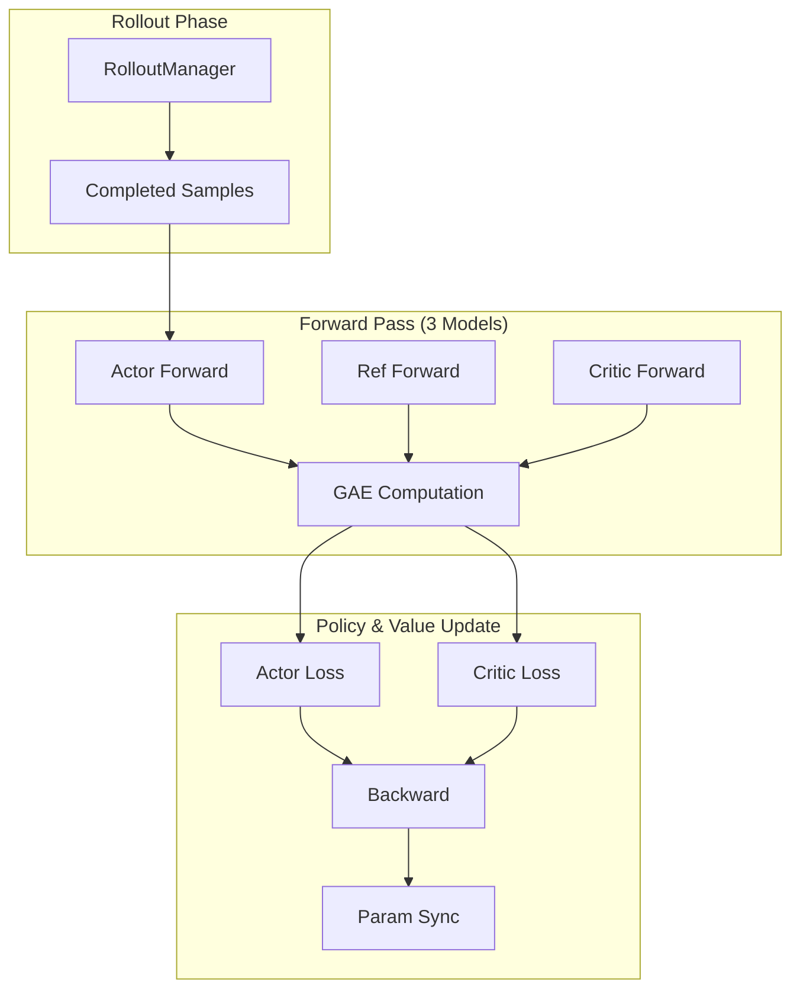
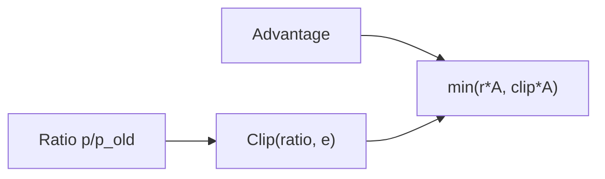

# PPO Training

*Configure Proximal Policy Optimization with siirl-agentic's dual-clip implementation and tune the Actor-Critic setup.*

## Overview

!!! tip "Key Insight"
    PPO trains a Critic (value function) alongside the Actor, which provides lower-variance advantage estimates than GRPO's group-relative approach. The tradeoff: PPO needs ~50% more GPU memory (3 models vs 2) and requires careful Critic learning rate tuning — set it 10x higher than the Actor lr as a starting point (`actor lr=1e-6`, `critic lr=1e-5`). Use `rollout.n=1` with PPO; multiple samples per prompt are not used.

PPO (Proximal Policy Optimization) in siirl-agentic uses three models:

- **Actor** — Policy model being optimized
- **Reference** — Frozen copy for KL divergence computation
- **Critic** — Value function estimator for advantage computation

!!! note "Dual-Clip PPO"
    siirl-agentic implements **Dual-clip PPO**, not standard (single-clip) PPO. In addition to the standard upper clip ratio, Dual-clip PPO applies a lower clip bound for negative advantages using `clip_ratio_c`. This prevents excessively large policy updates in the negative direction, improving training stability. See the "Dual-Clip Parameters" section below.

## PPO-Specific Configuration

``` yaml
actor_ref:
  algorithm:
    adv_estimator: ppo           # Use PPO advantage estimator
    gamma: 1.0                   # Discount factor
    lam: 1.0                     # GAE lambda
    kl_penalty: kl               # KL penalty type

  actor:
    ppo_mini_batch_size: 256     # Mini-batch size
    ppo_micro_batch_size_per_gpu: 8  # Per-GPU micro-batch
    clip_ratio: 0.2              # PPO clipping ratio (upper bound)
    clip_ratio_low: null         # Lower clip bound (null = symmetric with clip_ratio)
    clip_ratio_high: null        # Upper clip bound (null = use clip_ratio)
    clip_ratio_c: 3.0            # Dual-clip lower bound for negative advantages
    ppo_epochs: 1                # PPO update epochs per batch
    entropy_coeff: 0.0           # Entropy regularization
    use_kl_loss: false           # Additional KL loss term
    kl_loss_coef: 0.0            # KL loss coefficient (when use_kl_loss=true)
    kl_loss_type: low_var_kl     # KL loss variant: "kl" or "low_var_kl"
    loss_agg_mode: token-mean    # Loss aggregation: "token-mean" or "seq-mean"

  ref:
    log_prob_micro_batch_size_per_gpu: 8  # Ref forward batch size

critic:
  ppo_mini_batch_size: 256
  ppo_micro_batch_size_per_gpu: 8
  ppo_epochs: 1
  cliprange_value: 0.5          # Value function clipping
  optim:
    lr: 1e-5                    # Critic learning rate (typically higher than actor)

rollout:
  n: 1                          # PPO uses 1 sample per prompt
```

## Minimal Runnable Example

``` bash
export MODEL_PATH=/path/to/Qwen3-8B
export TRAIN_DATA_PATH=/path/to/train.parquet
export TEST_DATA_PATH=/path/to/test.parquet

bash examples/ppo_train/run_qwen3_8b_separated.sh
```

## PPO Training Flow



*Figure 1: PPO training data flow*

## Dual-Clip PPO Details

Standard PPO clips the probability ratio to `[1 - clip_ratio, 1 + clip_ratio]`. Dual-clip PPO adds an additional lower bound for negative advantages:

- When advantage > 0: ratio is clipped to `[1 - clip_ratio, 1 + clip_ratio]` (same as standard PPO)
- When advantage < 0: ratio is additionally clipped to a maximum of `clip_ratio_c` (default: 3.0), preventing the model from making very large updates to reduce probability of bad responses



*Figure 2: Dual-clip PPO objective*

This is controlled by three parameters:

| Parameter               | Default | Description                                       |
| ----------------------- | ------- | ------------------------------------------------- |
| `actor.clip_ratio`      | 0.2     | Standard symmetric clip range                     |
| `actor.clip_ratio_c`    | 3.0     | Dual-clip lower bound for negative advantages     |
| `actor.clip_ratio_low`  | null    | Override lower clip (null = use `1 - clip_ratio`) |
| `actor.clip_ratio_high` | null    | Override upper clip (null = use `1 + clip_ratio`) |

## Key Parameters

| Parameter                    | Impact                           | Recommended Range |
| ---------------------------- | -------------------------------- | ----------------- |
| `actor_ref.actor.optim.lr`   | Policy learning rate             | 1e-7 to 1e-5      |
| `critic.optim.lr`            | Value function learning rate     | 1e-6 to 1e-4      |
| `actor_ref.actor.clip_ratio` | PPO clipping range               | 0.1 to 0.3        |
| `critic.cliprange_value`     | Value clipping range             | 0.2 to 0.5        |
| `actor_ref.algorithm.gamma`  | Discount factor                  | 0.99 to 1.0       |
| `actor_ref.algorithm.lam`    | GAE lambda                       | 0.95 to 1.0       |
| `trainer.critic_warmup`      | Critic warmup steps (default: 0) | 0 to 10           |

## PPO vs GRPO

| Aspect      | PPO                    | GRPO                  |
| ----------- | ---------------------- | --------------------- |
| Models      | Actor + Ref + Critic   | Actor + Ref           |
| GPU usage   | Higher (3 models)      | Lower (2 models)      |
| `rollout.n` | 1 (single sample)      | 8+ (group sampling)   |
| Advantage   | GAE from Critic values | Group-relative reward |
| Stability   | More stable            | Simpler, but noisier  |

## Implementation Details

!!! tip "Dual-clip parameters with real defaults"
    The full set of dual-clip parameters and their actual defaults:

```yaml
actor_ref:
  actor:
    clip_ratio: 0.2        # Standard symmetric clip (±0.2 around 1.0)
    clip_ratio_low: 0.2    # Explicit lower bound (same as clip_ratio by default)
    clip_ratio_high: 0.2   # Explicit upper bound (same as clip_ratio by default)
    clip_ratio_c: 3.0      # Dual-clip constant for negative advantages
```

Increasing `clip_ratio_c` beyond the default 3.0 allows larger updates on negative-advantage samples.

### GAE Defaults

```yaml
actor_ref:
  algorithm:
    gamma: 1.0   # Discount factor — 1.0 = no discounting (appropriate for episodic tasks)
    lam: 1.0     # GAE lambda — 1.0 = Monte Carlo returns (no bias)
```

GAE with `gamma=1.0` and `lam=1.0` reduces to plain Monte Carlo advantage estimation, which is appropriate for agentic tasks where episodes have clear boundaries.

### Value Loss: Clipped MSE

The Critic loss uses a clipped MSE to prevent large value updates:

```python
# Pseudocode of critic value loss
v_clipped = old_value + clip(new_value - old_value, -cliprange_value, +cliprange_value)
loss = max(MSE(new_value, returns), MSE(v_clipped, returns))
```

`cliprange_value=0.5` means the value function cannot change by more than 0.5 per update step.

### CriticWorker

The Critic model is implemented as a `CriticWorker` class in `siirl/worker/actor/trainer.py`. It runs the same base model architecture as the Actor but with a scalar value head appended. In separated mode, the Critic occupies its own GPU partition.

### ppo_epochs

`ppo_epochs=1` (the default) means each collected batch is used for exactly one gradient step. Higher values (2–4) improve sample efficiency but increase the risk of policy divergence since data becomes stale.

## Dual-Clip PPO Math

!!! tip "Key Takeaway"
    Dual-clip PPO adds a second clipping mechanism for negative advantages, preventing the policy from making excessively large updates to *reduce* the probability of bad actions. This is more conservative than standard PPO in the negative-advantage regime.

The policy loss in `compute_policy_loss_vanilla()` (`siirl/algorithm/loss.py`:98) proceeds in three stages:

**Stage 1 — Standard PPO clip:**

$$L_{\text{clip}} = \max\!\bigl(-r_t \cdot A_t,\ -\text{clip}(r_t,\, 1-\epsilon_{\text{low}},\, 1+\epsilon_{\text{high}}) \cdot A_t\bigr)$$

where $r_t = \frac{\pi_\theta(a_t|s_t)}{\pi_{\theta_{\text{old}}}(a_t|s_t)}$ is the probability ratio.

**Stage 2 — Dual-clip for negative advantages:**

When $A_t < 0$, an additional lower bound is applied:

$$L_{\text{dual}} = \min\!\bigl(-c \cdot A_t,\ L_{\text{clip}}\bigr)$$

where $c$ is `clip_ratio_c` (default 3.0). This prevents the objective from becoming arbitrarily large when the ratio $r_t$ is far from 1.

**Stage 3 — Final loss selection:**

$$L_t = \begin{cases} L_{\text{dual}} & \text{if } A_t < 0 \\ L_{\text{clip}} & \text{if } A_t \geq 0 \end{cases}$$

| Parameter                | Config Key                        | Default | Effect                                                                    |
| ------------------------ | --------------------------------- | ------- | ------------------------------------------------------------------------- |
| $\epsilon$               | `actor_ref.actor.clip_ratio`      | `0.2`   | Symmetric clip range fallback                                             |
| $\epsilon_{\text{low}}$  | `actor_ref.actor.clip_ratio_low`  | `0.2`   | Lower clip bound: ratio clamped to $[1 - \epsilon_{\text{low}}, \ldots]$  |
| $\epsilon_{\text{high}}$ | `actor_ref.actor.clip_ratio_high` | `0.2`   | Upper clip bound: ratio clamped to $[\ldots, 1 + \epsilon_{\text{high}}]$ |
| $c$                      | `actor_ref.actor.clip_ratio_c`    | `3.0`   | Dual-clip constant; must be > 1.0                                         |

!!! note "Asymmetric Clipping"
    You can set `clip_ratio_low` and `clip_ratio_high` to different values for asymmetric clipping. For example, `clip_ratio_low=0.1, clip_ratio_high=0.3` would be more conservative about decreasing action probabilities than increasing them.

## Value Loss Clipping

!!! tip "Key Takeaway"
    The Critic's value loss uses clipped MSE to prevent catastrophic value function updates. The `cliprange_value` parameter (default 0.5) bounds how much the predicted value can change per update step.

The value loss in `compute_value_loss()` (`siirl/algorithm/loss.py`:73) is computed as:

$$V_{\text{clipped}} = \text{clip}\!\bigl(V_{\text{new}},\ V_{\text{old}} - \delta,\ V_{\text{old}} + \delta\bigr)$$

$$L_V = \text{agg}\!\bigl(\max\!\bigl((V_{\text{new}} - R)^2,\ (V_{\text{clipped}} - R)^2\bigr)\bigr)$$

where $\delta$ = `cliprange_value` (default `0.5`) and $R$ is the computed return.

The `max()` operation ensures that the loss is always at least as large as the unclipped loss — this prevents the value function from exploiting the clipping to reduce its loss artificially.

| Parameter | Config Key               | Default | Effect                                          |
| --------- | ------------------------ | ------- | ----------------------------------------------- |
| $\delta$  | `critic.cliprange_value` | `0.5`   | Max allowed change in value prediction per step |

## GAE Walkthrough

!!! tip "Key Takeaway"
    GAE (Generalized Advantage Estimation) computes advantages by blending TD errors backwards through time. With siirl-agentic's defaults of `gamma=1.0` and `lam=1.0`, GAE reduces to Monte Carlo advantage estimation.

The GAE computation in `compute_ppo_advantage_return()` (`siirl/algorithm/advantage.py`:99) iterates backwards through the response:

$$\delta_t = r_t + \gamma \cdot V_{t+1} - V_t$$

$$\hat{A}_t = \delta_t + \gamma \cdot \lambda \cdot \hat{A}_{t+1}$$

$$R_t = \hat{A}_t + V_t$$

**Numeric example** — given rewards $[0.1, 0.2, 1.0]$ and value estimates $[0.5, 0.6, 0.7]$ with `gamma=1.0, lam=1.0`:

| Step $t$ | $r_t$ | $V_t$ | $V_{t+1}$    | $\delta_t$                         | $\hat{A}_t$                             |
| -------- | ----- | ----- | ------------ | ---------------------------------- | --------------------------------------- |
| 2        | 1.0   | 0.7   | 0 (terminal) | $1.0 + 1.0 \times 0 - 0.7 = 0.3$   | $0.3$                                   |
| 1        | 0.2   | 0.6   | 0.7          | $0.2 + 1.0 \times 0.7 - 0.6 = 0.3$ | $0.3 + 1.0 \times 1.0 \times 0.3 = 0.6$ |
| 0        | 0.1   | 0.5   | 0.6          | $0.1 + 1.0 \times 0.6 - 0.5 = 0.2$ | $0.2 + 1.0 \times 1.0 \times 0.6 = 0.8$ |

Returns: $R_t = \hat{A}_t + V_t$ = $[1.3, 1.2, 1.0]$.

After computing raw advantages, `masked_whiten()` normalizes them to zero mean and unit variance across the response mask.

| Parameter | Config Key                  | Default | Effect                                                  |
| --------- | --------------------------- | ------- | ------------------------------------------------------- |
| $\gamma$  | `actor_ref.algorithm.gamma` | `1.0`   | Discount factor; 1.0 = no discounting (episodic tasks)  |
| $\lambda$ | `actor_ref.algorithm.lam`   | `1.0`   | GAE lambda; 1.0 = Monte Carlo (unbiased, high variance) |

!!! note "Choosing gamma and lam"
    For agentic tasks with clear episode boundaries, the defaults (`gamma=1.0, lam=1.0`) work well. For longer trajectories where you want to discount distant rewards, try `gamma=0.99, lam=0.95` — this introduces bias but reduces variance significantly.

## Critic Warmup

!!! tip "Key Takeaway"
    Enable `trainer.critic_warmup` to pre-train the Critic's value function for several steps before the Actor starts updating. This prevents early policy updates from being guided by a random value function.

| Parameter           | Config Key              | Default | Effect                                                            |
| ------------------- | ----------------------- | ------- | ----------------------------------------------------------------- |
| Critic warmup steps | `trainer.critic_warmup` | `0`     | Number of initial training steps where only the Critic is updated |

**Why it helps:**

1. At initialization, the Critic produces random value estimates, leading to noisy advantage estimates
2. With `critic_warmup=0` (default), the Actor immediately starts optimizing against these noisy advantages
3. Setting `critic_warmup=5` allows the Critic to learn a reasonable value baseline before the Actor begins policy updates
4. This is especially important for agentic tasks where the initial value landscape is complex

```bash
# Recommended for PPO agentic training
trainer.critic_warmup=5
```

## Entropy Coefficient

!!! tip "Key Takeaway"
    The `entropy_coeff` parameter adds an entropy bonus to the policy loss, encouraging exploration. Higher values produce more diverse outputs; lower values (including the default 0.0) let the policy focus on exploitation.

| Parameter           | Config Key                      | Default | Effect                                 |
| ------------------- | ------------------------------- | ------- | -------------------------------------- |
| Entropy coefficient | `actor_ref.actor.entropy_coeff` | `0.0`   | Weight of entropy bonus in policy loss |

The total Actor loss becomes:

$$L_{\text{actor}} = L_{\text{policy}} - \alpha \cdot H(\pi_\theta)$$

where $\alpha$ = `entropy_coeff` and $H(\pi_\theta)$ is the policy entropy.

**Tuning guidance:**

| `entropy_coeff` | Behavior                                     | Typical Use Case                                            |
| --------------- | -------------------------------------------- | ----------------------------------------------------------- |
| `0.0` (default) | No entropy bonus; pure reward maximization   | Simple tasks with clear optimal strategy                    |
| `0.001 - 0.01`  | Mild exploration pressure                    | Multi-turn agentic tasks where diverse tool strategies help |
| `0.01 - 0.1`    | Strong exploration; prevents policy collapse | Early training stages or sparse reward environments         |

!!! warning "Entropy vs KL Loss"
    `entropy_coeff` and `use_kl_loss` serve related but different purposes. Entropy encourages output diversity regardless of the reference policy. KL loss (`kl_loss_coef`, default `0.001`) penalizes deviation from the reference model specifically. For most agentic tasks, start with `entropy_coeff=0.0` and `use_kl_loss=false`, and add one if training shows signs of policy collapse or divergence.

## Common Issues

| Symptom                               | Cause                               | Fix                                                     |
| ------------------------------------- | ----------------------------------- | ------------------------------------------------------- |
| Value loss diverges                   | Critic lr too high                  | Reduce `critic.optim.lr`                                |
| No reward improvement                 | Clip ratio too tight                | Increase `actor_ref.actor.clip_ratio`                   |
| OOM on critic                         | Micro-batch too large               | Reduce `critic.ppo_micro_batch_size_per_gpu`            |
| KL divergence spikes                  | Learning rate too high              | Reduce `actor_ref.actor.optim.lr`, enable `use_kl_loss` |
| Critic predicts constant value        | Critic lr too low or warmup missing | Use `trainer.critic_warmup=5` to pre-train critic       |
| Policy updates before critic warms up | `critic_warmup=0` (default)         | Set `trainer.critic_warmup` to 3–10 steps               |
| Actor loss oscillates                 | `ppo_epochs` too high               | Keep at 1 (default) for agentic tasks                   |

## Next steps

- [GRPO Training](grpo_training.md) — Compare GRPO's group-sampling approach as a simpler, critic-free alternative to PPO
- [Performance Tuning](performance_tuning.md) — Optimize GPU utilization and throughput for your PPO setup
- [Best Practices](../reference/best_practices.md) — Pre-flight checklist and common pitfalls to avoid before long runs
