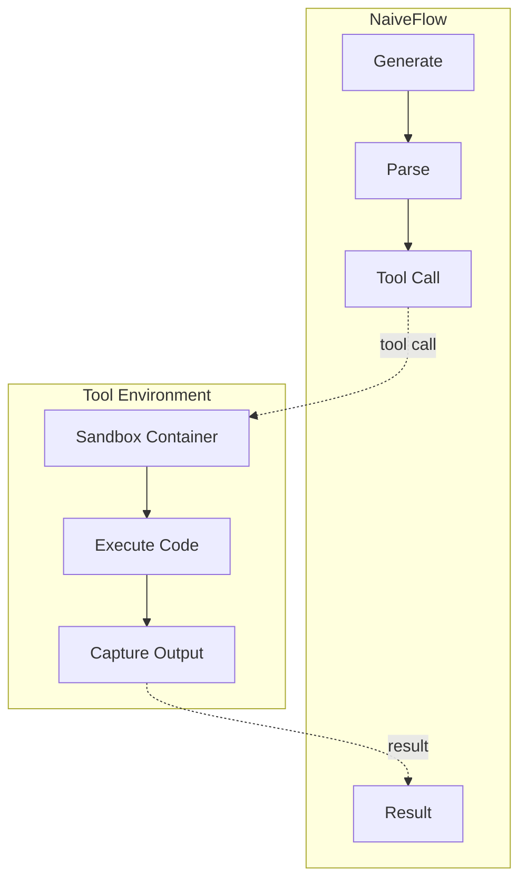
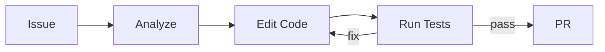

# Tool Environment

*Configure and implement tool environments for SWE-bench and similar coding tasks, covering the registration system and custom tool development.*

## Overview

!!! tip "Key Insight"
    Every tool environment must define two things: a Python class implementing `create()` and `step()`, and a YAML config that tells siirl-agentic which class to load and what its OpenAI function schema looks like. The schema is passed to the model via `tokenizer.apply_chat_template(tools=...)` — if your schema does not match what the model expects, tool calls will not be generated. Use the Hermes format (`env_kwargs.tool_format: hermes`) for most models; switch to `gpt-oss` only for models trained with GPT-style tool tokens.

siirl-agentic supports agentic training on SWE-style tasks where the model interacts with code sandboxes, file systems, and test runners. The tool environment system provides a unified interface for these interactions.

## Tool Environment Architecture



*Figure 1: Tool environment architecture*

## Key Classes

### EnvManager (`siirl/environment/__init__.py`)

The `EnvManager` is a dataclass that holds all registered tools:

``` python
@dataclass
class EnvManager:
    env_list: list          # All ToolEnv instances
    env_name: dict          # {tool_name: ToolEnv} mapping for dispatch
    tool_schemas: list      # OpenAI function tool schemas for chat template
    tool_parser: ToolParser # Parses model output into FunctionCall objects
    tool_parser_name: str   # "hermes" or "gpt-oss"
```

It is created by `initialize_env(config)` which reads from the tool config YAML file (`env_path`).

### ToolEnv Base Class (`siirl/environment/tool_env/base_tool_env.py`)

``` python
class ToolEnv(BasEnvironment):
    def __init__(self, config, tool_schema: OpenAIFunctionToolSchema):
        self.config = config
        self.tool_schema = tool_schema or self.get_openai_tool_schema()
        self.name = self.tool_schema.function.name   # Used for dispatch in EnvManager
        self._instance_dict = {}

    def get_openai_tool_schema(self) -> OpenAIFunctionToolSchema:
        """Return the tool schema (overridable)."""
        return self.tool_schema

    async def release(self, instance_id: str):
        """Release a tool instance. Override for cleanup logic."""
        pass
```

Subclasses must implement:

- `async def create(self, create_kwargs=None, **kwargs) -> tuple[str, EnvResponse]` — Create a tool instance
- `async def step(self, action: dict) -> EnvResponse` — Execute tool action

### EnvResponse (`siirl/environment/base.py`)

``` python
class EnvResponse(BaseModel):
    text: str | None = None        # Text response from the tool
    image: list[Any] | None = None # Image outputs (for VLA tasks)
    video: list[Any] | None = None # Video outputs (for VLA tasks)
    rewards: float | None = None   # Optional per-step reward
    complete: bool = False         # True = end the trajectory
    metrics: dict | None = None    # Optional metrics for logging
```

### FunctionCall (`siirl/environment/tool_env/utils/tool_parser.py`)

``` python
class FunctionCall(BaseModel):
    name: str         # Tool function name
    arguments: str    # JSON-encoded arguments string
```

## Tool Registration System

### Tool Registration Flow



*Figure 2: Tool registration flow*

### Tool Config YAML

Tools are registered via a YAML config file (referenced by `rollout.multiturn.env_path`):

``` yaml
tools:
  - class_name: siirl.environment.tool_env.aio_search_env.AIOSearchEnv
    config:
      type: native          # ToolType: "native" or "mcp"
      # ... tool-specific config
    tool_schema:
      type: function
      function:
        name: search
        description: "Search for information"
        parameters:
          type: object
          properties:
            query_list:
              type: array
              items:
                type: string
          required: ["query_list"]
```

### How Registration Works (`siirl/environment/tool_env/utils/tool_register.py`)

`initialize_tools_from_config(tools_config_file)`:

1. Loads the YAML config with `OmegaConf.load()`
2. For each tool entry:
   - Dynamically imports the class via `class_name` (e.g., `module.path.ClassName`)
   - Validates `config.type` as a `ToolType` enum (`"native"` or `"mcp"`)
   - Parses `tool_schema` into an `OpenAIFunctionToolSchema` Pydantic model
   - Instantiates the tool: `tool_cls(config=..., tool_schema=...)`
3. Returns `(tool_list, tool_name_dict, tool_schemas)` — used to construct `EnvManager`

### ToolParser Registry

`ToolParser` uses a class-level `_registry` dict with `@ToolParser.register(name)` decorators:

``` python
# Built-in parsers:
@ToolParser.register("hermes")
class HermesToolParser(ToolParser): ...

@ToolParser.register("gpt-oss")
class GptOssToolParser(ToolParser): ...
```

Get a parser: `ToolParser.get_tool_parser("hermes", tokenizer)`

## Built-in Tool Environments

### AIO Search Environment

For retrieval-augmented tasks, using the AIO distributed tool infrastructure:

``` yaml
rollout:
  multiturn:
    env_type: tool_env
    env_path: /path/to/search_tools.yaml
    env_kwargs:
      tool_format: hermes
```

Key file: `siirl/environment/tool_env/aio_search_env.py`

The `AIOSearchEnv` connects to an AIO Proxy server to dispatch search queries. See [AIO Tool Infrastructure](aio_tool_infrastructure.md) for deployment.

## Implementing a Custom Tool Environment

### Step 1: Define the Tool Class

``` python
# my_tools/sandbox_tool.py
from siirl.environment.tool_env.base_tool_env import ToolEnv
from siirl.environment.base import EnvResponse
from siirl.environment.tool_env.utils.schemas import OpenAIFunctionToolSchema

class SandboxTool(ToolEnv):
    def __init__(self, config, tool_schema: OpenAIFunctionToolSchema):
        super().__init__(config, tool_schema)
        self.sandbox_url = config.get("sandbox_url", "http://localhost:9000")

    async def create(self, create_kwargs=None, **kwargs):
        """Create a sandbox instance."""
        instance_id = await self._provision_sandbox(create_kwargs or {})
        return instance_id, EnvResponse()

    async def step(self, action: dict) -> EnvResponse:
        """Execute code in the sandbox."""
        instance_id = action.pop("instance_id")
        code = action.get("code", "")
        result = await self._run_code(instance_id, code)
        return EnvResponse(
            text=result.output,
            rewards=1.0 if result.tests_passed else 0.0,
            complete=result.all_tests_passed,
        )

    async def release(self, instance_id: str):
        """Destroy the sandbox instance."""
        await self._destroy_sandbox(instance_id)
```

### Step 2: Create Tool Config YAML

``` yaml
# tools_config.yaml
tools:
  - class_name: my_tools.sandbox_tool.SandboxTool
    config:
      type: native
      sandbox_url: http://sandbox-host:9000
    tool_schema:
      type: function
      function:
        name: execute_code
        description: "Execute Python code in a sandbox"
        parameters:
          type: object
          properties:
            code:
              type: string
              description: "Python code to execute"
          required: ["code"]
```

### Step 3: Configure Training

``` yaml
rollout:
  flow_function: naive
  multiturn:
    env_type: tool_env
    env_path: tools_config.yaml
    max_env_turns: 10
    max_assistant_turns: 20
    max_env_response_length: 1024
    env_kwargs:
      tool_format: hermes

data:
  max_response_length: 16384   # SWE tasks need long context
```

## SWE-Bench Configuration

For SWE-bench style tasks with code editing and test execution:

``` yaml
rollout:
  flow_function: naive
  multiturn:
    env_type: tool_env
    env_path: /path/to/swe_tools.yaml
    max_env_turns: 10
    max_assistant_turns: 20
    max_parallel_calls: 1        # Sequential tool calls for SWE
    max_env_response_length: 1024
    env_response_truncate_side: middle  # Keep start+end of long outputs
    env_kwargs:
      tool_format: hermes

data:
  max_response_length: 16384   # SWE tasks generate long trajectories
  max_prompt_length: 4096      # SWE prompts can be long (issue + codebase context)
```

!!! tip "AgentFlow for SWE"
    siirl-agentic also includes a built-in SWE AgentFlow at `siirl/execution/rollout/agentflow/swe/`. This is a separate system from NaiveFlow and uses the AgentFlow Protocol for more flexible SWE task definition. Use `rollout.agentflow.name=swe` to activate it.

## Utils Directory (`siirl/environment/tool_env/utils/`)

| File                      | Description                                                                            |
| ------------------------- | -------------------------------------------------------------------------------------- |
| `tool_parser.py`          | `ToolParser` ABC with registry, `HermesToolParser`, `GptOssToolParser`, `FunctionCall` |
| `tool_register.py`        | `initialize_tools_from_config()`, `ToolType` enum, dynamic class loading               |
| `schemas.py`              | `OpenAIFunctionToolSchema` Pydantic model for tool API schema                          |
| `tool_call.py`            | Tool call utility functions                                                            |
| `sandbox_fusion_utils.py` | Sandbox-specific utilities                                                             |

## What Success Looks Like

A properly functioning tool environment setup will show these signs:

| Indicator                           | Healthy State                                              | Problem Signal                           |
| ----------------------------------- | ---------------------------------------------------------- | ---------------------------------------- |
| Tool parse rate                     | >95% of model outputs with tool calls are parsed correctly | Low rate = `tool_format` mismatch        |
| `EnvResponse.complete` rate         | Increasing as training progresses                          | Always 0 = task never completing         |
| `rollout/env_duration`              | Stable latency (< 2s for search, < 10s for code)           | Growing latency = tool server bottleneck |
| `rewards` from `EnvResponse`        | Non-zero for partial credit tasks                          | Always 0 = reward function not connected |
| Tool `create()`/`release()` balance | No leaked instances over time                              | Leaks → sandbox pool exhaustion          |

## Common Mistakes

| Mistake                                 | Symptom                               | Fix                                                     |
| --------------------------------------- | ------------------------------------- | ------------------------------------------------------- |
| Sandbox not accessible                  | Tool execution timeout                | Check AIO Proxy connectivity                            |
| Short `max_response_length`             | Incomplete edits                      | Increase to 16384+                                      |
| Wrong `tool_format`                     | Tool calls not parsed                 | Match model's expected format                           |
| Missing `env_path`                      | `Error: tools_config_file is None`    | Point to tool config YAML                               |
| `config.type` not `"native"`            | `NotImplementedError`                 | Only `native` type currently supported                  |
| Tool class not importable               | `ModuleNotFoundError`                 | Ensure `class_name` path is on `PYTHONPATH`             |
| Returning `complete=True` too early     | Trajectories terminate before solving | Only set `complete=True` on definitive success/failure  |
| Not implementing `release()`            | Sandbox instance leak                 | Always implement `release()` to destroy instances       |
| Forgetting `arguments` is a JSON string | `json.loads()` error inside tool      | `FunctionCall.arguments` is `str`, not `dict`; parse it |

## Next steps

- [AIO Tool Infrastructure](aio_tool_infrastructure.md) — Scale and operationalize your tool environments with distributed scheduling and autoscaling
- [Agentic Multi-Turn](agentic_multiturn.md) — Configure multi-turn rollout parameters now that your tool environment is defined
- [AgentFlow Protocol](../concepts/agentflow_protocol.md) — Build a fully custom rollout pipeline that integrates your tool environment
