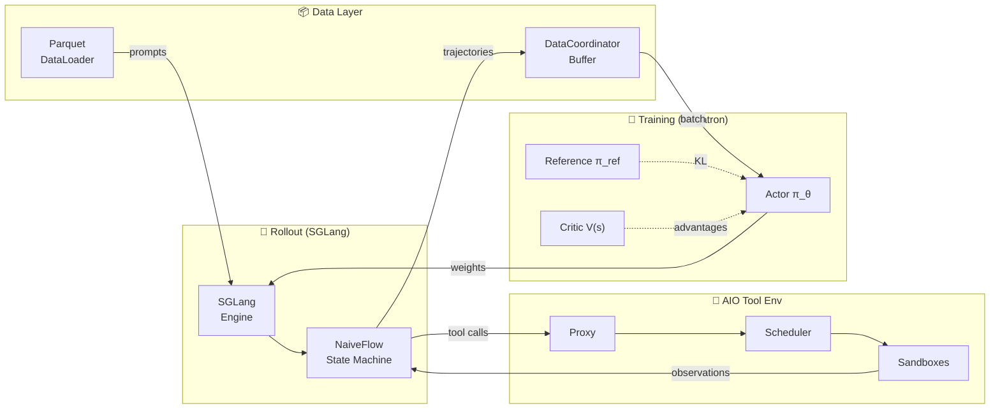

# siirl-agentic

> Async multi-turn agentic RL training — tool-aware, GPU-efficient, production-ready.

## Get started

```bash
# Install
pip install -e "siirl-agentic/[all]"

# Run GRPO training on a single node (4 GPUs)
python siirl/async_train.py \
    --config-name grpo_qwen2.5_7b \
    actor_rollout_ref.model.path=Qwen/Qwen2.5-7B-Instruct \
    trainer.n_gpus_per_node=4 \
    trainer.total_epochs=3
```

For a step-by-step walkthrough, see [Installation](get_started/installation.md) and [Quick Start](get_started/quickstart.md).

## Architecture at a Glance

The system has three main components connected by Ray: a **Training Group** (Megatron-LM actors), a **Rollout Manager** (SGLang inference), and an **AIO Tool Environment** (for multi-turn agent interaction). A **DataCoordinator** buffers completed trajectories and feeds training batches, while an async loop orchestrates the entire data flow.



> For detailed component descriptions, see [Architecture Overview](concepts/architecture_overview.md) and [Async Training Lifecycle](concepts/async_training_lifecycle.md).

## Documentation guide

- **Get running fast** — [Quickstart](get_started/quickstart.md) → [First Agentic Job](get_started/first_agentic_training_job.md)
- **Reproduce a benchmark** — [DeepScaleR GRPO Tutorial](tutorials/deepscaler_grpo.md) → [Algorithm Baselines](reference/algorithm_baselines.md)
- **Understand the architecture** — [How It Works](concepts/how_it_works.md) → [Architecture Overview](concepts/architecture_overview.md)
- **Train a custom task** — [Data Preparation](guides/data_preparation.md) → [Custom Rewards](guides/custom_rewards.md)
- **Train an agent with tools** — [SWE Agent Tutorial](tutorials/swe_agent_training.md) → [Tool Environment](guides/tool_env_and_swe.md)
- **Deploy across multiple nodes** — [AIO Infrastructure](concepts/aio_infrastructure.md)
- **Optimize performance** — [Performance Tuning](guides/performance_tuning.md) → [Handling OOM](guides/handling_oom.md)
- **Resume from a checkpoint** — [Checkpoint & Resume](guides/checkpoint_resume.md)
- **Debug a problem** — [Debugging Guide](guides/debugging.md) → [Troubleshooting](reference/troubleshooting.md)
- **Extend the framework** — [Adding Flows](contributing/adding_new_executor_or_flow.md) → [Custom Agent](guides/custom_agent.md)
- **Contribute code** — [Contributing Guide](contributing/contributing.md)

## Why siirl-agentic?

Training LLM agents to use tools requires **multi-turn interaction** — the model generates, the environment responds, repeat. Existing RL frameworks treat this as an afterthought. siirl-agentic solves it at the architecture level:

| Challenge                   | Existing frameworks          | siirl-agentic                                                           |
| --------------------------- | ---------------------------- | ----------------------------------------------------------------------- |
| **Multi-turn trajectories** | Manual state management      | NaiveFlow state machine — tracks turns, tokens, loss masks per step     |
| **Tool I/O blocking GPU**   | Synchronous, GPU waits       | Async MPMD — rollout and training are independent, GPU never waits      |
| **Tool environment scaling** | No built-in orchestration   | AIO 3-tier scheduler with Holt-Winters auto-scaling                     |
| **Loss contamination**      | Uniform mask across sequence | Per-turn masking — only model tokens contribute to gradients            |
| **Reward granularity**      | Single scalar per episode    | Per-turn `EnvResponse.rewards` + outcome reward from `AgentFlow.reward()` |

## What you can do

???+ example "Train a coding agent on SWE tasks"

    siirl-agentic ships a ready-made SWE agent (`siirl/execution/rollout/agentflow/swe/`) that reads a GitHub issue, edits files in a sandboxed environment, and runs tests to verify the patch. Connect it to your reward function and start training in minutes.

    See [Agentic Multi-Turn Training](guides/agentic_multiturn.md) for the full walkthrough.

???+ example "Run GRPO training without a critic model"

    GRPO computes advantages from group-relative scores, so there is no value network to train or synchronize. This cuts GPU memory roughly in half compared to PPO and removes the value head warm-up phase.

    ```bash
    python siirl/async_train.py \
        --config-name grpo_qwen2.5_7b \
        actor_rollout_ref.model.path=Qwen/Qwen2.5-7B-Instruct \
        algorithm.adv_estimator=grpo \
        actor_rollout_ref.rollout.n=8
    ```

    See [GRPO Training](guides/grpo_training.md) for configuration details.

???+ example "Scale to multi-node with elastic tool scheduling"

    The AIO tool infrastructure runs as independent Ray actors, separate from the training and rollout workers. Add nodes to the Ray cluster and the tool scheduler absorbs the extra capacity automatically — no config changes required.

    See [AIO Infrastructure](concepts/aio_infrastructure.md) for the scaling model and placement-group layout.

???+ example "Define custom task pipelines with AgentFlow"

    AgentFlow is a three-method protocol — `preprocess()`, `generate()`, `reward()` — that you implement once and inject into the training loop via config. No subclassing or framework-specific boilerplate.

    ```python
    class MyFlow(AgentFlow):
        def preprocess(self, batch): ...
        def generate(self, batch, engine): ...
        def reward(self, trajectories): ...
    ```

    See [AgentFlow Protocol](concepts/agentflow_protocol.md) for the full contract and injection mechanism.

## Supported algorithms

| Algorithm         | Estimator                | Critic | Best for                              |
| ----------------- | ------------------------ | ------ | ------------------------------------- |
| **Dual-clip PPO** | GAE                      | Yes    | Dense rewards, fine-grained shaping   |
| **GRPO**          | Group-relative           | No     | Pass/fail rewards, memory-constrained |
| **Dr.GRPO**       | Group-relative (unnorm.) | No     | Absolute-scale rewards                |

## Next steps

New here? Start with the [Quickstart](get_started/quickstart.md). Already familiar? Jump to [Guides](guides/configuration_system.md) or browse the [Config Reference](reference/config_reference.md).
