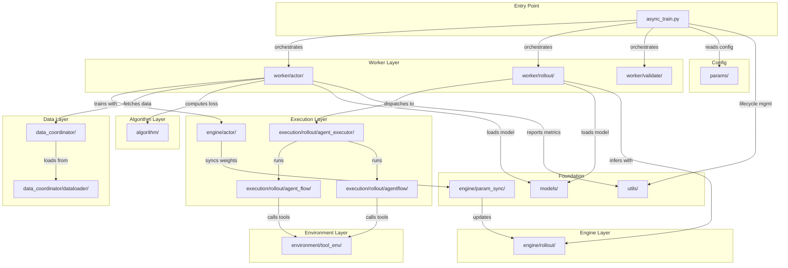

# Module Map

*A quick reference map from top-level directories to their responsibilities and key files.*

## Module Dependency Overview

*Figure 1: Module dependency graph*

## Top-Level Structure

    siirl-agentic/
    ├── siirl/                    # Main package
    │   ├── async_train.py        # Entry point: MainRunner Ray actor
    │   ├── algorithm/            # RL algorithm implementations
    │   ├── data_coordinator/     # Async data buffering & loading
    │   ├── engine/               # GPU compute engines
    │   ├── environment/          # Tool environments & base classes
    │   ├── execution/            # Rollout orchestration
    │   ├── models/               # Model loading & weight management
    │   ├── params/               # Configuration dataclasses
    │   ├── utils/                # Shared utilities
    │   └── worker/               # Ray actor workers
    ├── examples/                 # Training scripts & configs
    ├── scripts/                  # Utility scripts
    ├── tests/                    # Test suite
    └── docs/                     # Documentation (this site)

## Module Details

### `siirl/async_train.py`

The main entry point. Implements `MainRunner` as a Ray actor with an 8-phase lifecycle:

1.  Parse config → 2. Allocate resources → 3. Init DataCoordinator → 4. Init components → 5. Async training loop → 6. Wait → 7. Check status → 8. Cleanup

### `siirl/algorithm/`

| File            | Description                                                |
| --------------- | ---------------------------------------------------------- |
| `advantage.py`  | GAE and group-relative advantage estimation (GRPO/Dr.GRPO) |
| `loss.py`       | Dual-clip PPO loss, GRPO loss, entropy bonus               |
| `kl_penalty.py` | KL divergence computation between actor and reference      |

### `siirl/data_coordinator/`

| File             | Description                                                                       |                                                             |
| ---------------- | --------------------------------------------------------------------------------- | ----------------------------------------------------------- |
| `data_buffer.py` | `DataCoordinator` Ray actor — async sample buffering between rollout and training |                                                             |
| `protocol.py`    | Data exchange protocols between components                                        |                                                             |
| `sample.py`      | `Sample` Pydantic model — fields are `np.ndarray                                  | None` (prompts, responses, response_mask, rollout_log_prob) |
| `dataloader/`    | Dataset loading and batching logic                                                |                                                             |

!!! note "Two Sample Classes"
    `siirl/data_coordinator/sample.py:Sample` (Pydantic, `np.ndarray` fields) is used by NaiveFlow. `siirl/execution/rollout/agentflow/base.py:Sample` (dataclass, `list` fields) is used by AgentFlow. See [Two Sample classes](../concepts/architecture_overview.md#two-sample-classes) for details.

### `siirl/engine/`

| Directory     | Description                                                 |
| ------------- | ----------------------------------------------------------- |
| `actor/`      | Actor model engine (forward/backward, Megatron integration) |
| `param_sync/` | Parameter synchronization between actor and rollout engines |
| `rollout/`    | SGLang-based rollout inference engine                       |

### `siirl/environment/`

| File                              | Description                                                            |
| --------------------------------- | ---------------------------------------------------------------------- |
| `__init__.py`                     | `EnvManager` dataclass, `initialize_env()` — creates tools from config |
| `base.py`                         | `BasEnvironment` ABC, `EnvResponse` Pydantic model                     |
| `tool_env/base_tool_env.py`       | `ToolEnv` — base class with OpenAI function-calling tool schema        |
| `tool_env/aio_search_env.py`      | `AIOSearchEnv` — concrete tool env using AIO HTTP API                  |
| `tool_env/utils/tool_parser.py`   | `ToolParser` ABC with registry, `HermesToolParser`, `GptOssToolParser` |
| `tool_env/utils/tool_register.py` | `initialize_tools_from_config()`, `ToolType` enum                      |
| `tool_env/utils/schemas.py`       | `OpenAIFunctionToolSchema` Pydantic model                              |

### `siirl/execution/rollout/`

| File/Directory             | Description                                                                |
| -------------------------- | -------------------------------------------------------------------------- |
| `agent_flow/naive_flow.py` | `NaiveFlow` — multi-turn rollout state machine (production system)         |
| `agentflow/base.py`        | `AgentFlow` Protocol (`preprocess → generate → reward`), `Sample`, `Model` |
| `agentflow/__init__.py`    | `load_agentflow(config, model)` — dynamic function injection               |
| `agentflow/swe/`           | Built-in SWE AgentFlow implementation                                      |
| `agent_executor/`          | Agent execution orchestrator                                               |
| `utils.py`                 | `AgentData`, `AgentState` enum                                             |
| `concurrency.py`           | Concurrency resolution utilities                                           |

!!! note "NaiveFlow vs AgentFlow"
    `agent_flow/naive_flow.py` (NaiveFlow) and `agentflow/` (AgentFlow Protocol) are **two separate rollout systems**. NaiveFlow is activated by `flow_function: naive`. AgentFlow is activated via `rollout.agentflow.name`.

### `siirl/models/`

| File/Directory              | Description                           |
| --------------------------- | ------------------------------------- |
| `loader.py`                 | Model weight loading utilities        |
| `weight_loader_registry.py` | Registry for weight format converters |
| `mcore/`                    | Megatron-Core model implementations   |
| `llama/`                    | LLaMA-specific model utilities        |
| `patcher.py`                | Model architecture patching utilities |

### `siirl/params/`

| File               | Description                                                                                                           |
| ------------------ | --------------------------------------------------------------------------------------------------------------------- |
| `training_args.py` | `SiiRLArguments` (top-level), `TrainingArguments`                                                                     |
| `model_args.py`    | `ModelArguments`, `ActorArguments`, `RolloutArguments`, `AlgorithmArguments`, `CriticArguments`, `MultiturnArguments` |
| `data_args.py`     | `DataArguments` — dataset paths, lengths, batch sizes                                                                 |
| `parser.py`        | `parse_config()` — CLI parser using `argparse` + `OmegaConf.from_cli()`                                               |
| `display_dict.py`  | Config display and serialization                                                                                      |

### `siirl/utils/`

| File/Directory         | Description                                                              |
| ---------------------- | ------------------------------------------------------------------------ |
| `task_coordinator.py`  | `TaskCoordinator` Ray actor — distributed lifecycle management           |
| `timer.py`             | Training timer and profiling                                             |
| `distributed_utils.py` | Distributed communication helpers                                        |
| `checkpoint/`          | Checkpoint save/load logic                                               |
| `logger/`              | Logging configuration (loguru-based)                                     |
| `megatron/`            | Megatron-Core integration utilities                                      |
| `metrics/`             | `MetricWorker` — training metrics collection and reporting (rank 0 only) |
| `model_utils/`         | Model utility functions                                                  |
| `net_utils/`           | Network and port utilities                                               |
| `reward_score/`        | Reward scoring functions (custom reward implementations)                 |

### `siirl/worker/`

| Directory   | Description                                                                             |
| ----------- | --------------------------------------------------------------------------------------- |
| `actor/`    | `TrainerGroup` — coordinator class managing Ray trainer actors (NOT itself a Ray actor) |
| `rollout/`  | `RolloutManager` — Ray actor orchestrating rollout across multiple SGLang engines       |
| `validate/` | `ValidateProgressMonitor` — validation progress tracking                                |

## External Dependencies

| Component                 | Package                     | Role                                                  |
| ------------------------- | --------------------------- | ----------------------------------------------------- |
| Distributed orchestration | `ray`                       | Actor model, resource management                      |
| Inference engine          | `sglang`                    | High-throughput LLM inference for rollout             |
| Model framework           | `transformers`              | Model loading, tokenization                           |
| GPU training              | `torch` + Megatron-Core     | Distributed training with tensor/pipeline parallelism |
| Tool scheduling           | `AIO` (separate repository) | Elastic tool instance management                      |
| Config parsing            | `omegaconf`                 | CLI dot-notation parsing                              |

## Related

-   [Architecture Overview](../concepts/architecture_overview.md) — High-level system design
-   [Code Structure](../contributing/code_structure.md) — Developer-oriented walkthrough
