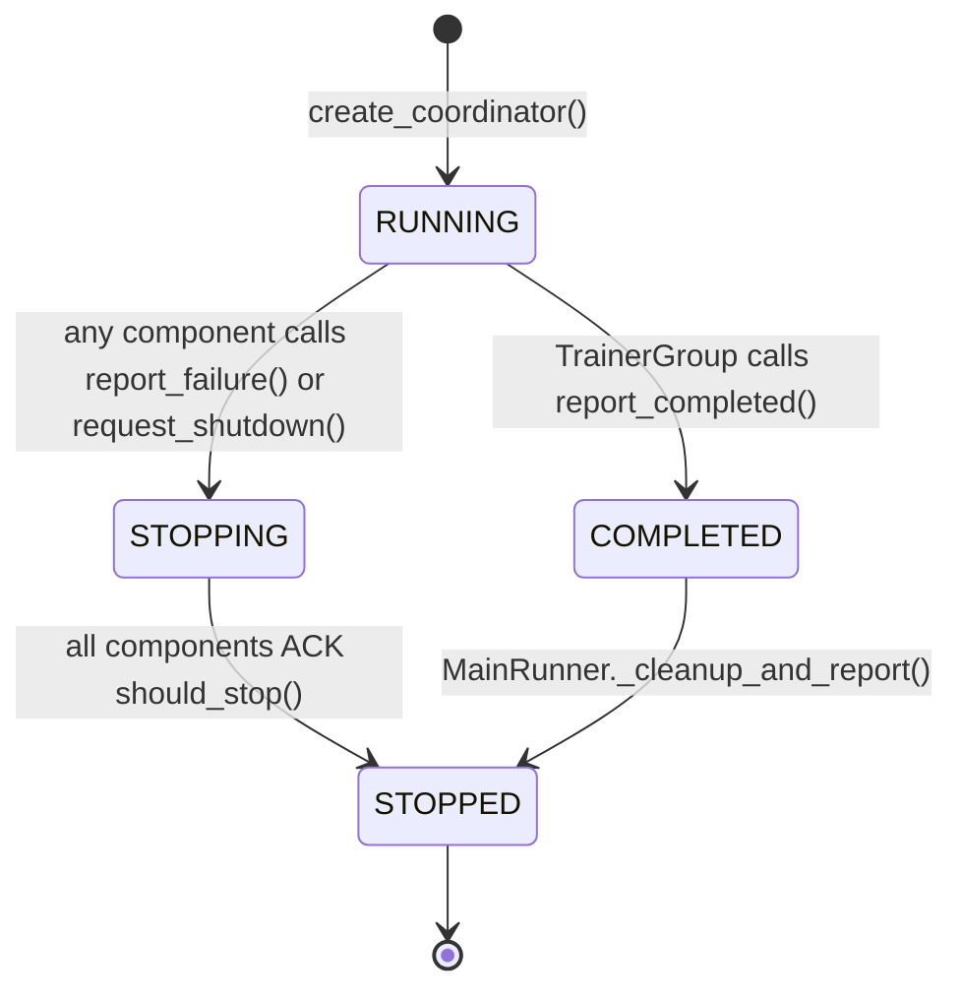

# Troubleshooting

*Diagnose and resolve the most common failure modes in siirl-agentic training runs.*

## Quick Diagnostic Guide

Use this table to quickly identify your issue category and jump to the fix:

| Symptom | Category | Quick Fix |
| ------- | -------- | --------- |
| Ray connection fails | Initialization | `ray stop --force && ray start --head` |
| GPU allocation error | Initialization | Reduce `actor_gpus` + `rollout_gpus` to match available |
| SGLang startup error | Initialization | Lower `rollout.gpu_memory_utilization` |
| CUDA OOM | Training | Reduce `ppo_micro_batch_size_per_gpu` or enable `param_offload` |
| Training no progress | Training | Check tool env logs and DataCoordinator buffer |
| Reward always 0 | Multi-Turn | Verify `data_source` matches reward function |
| Tool calls not detected | Multi-Turn | Set `tool_format: hermes` or `gpt-oss` |
| AIO connection failed | Multi-Turn | Check AIO Proxy health endpoint |
| Tool timeout | Multi-Turn | Scale AIO instances or increase timeout |
| Rollouts too short | Trajectories | Increase `max_env_turns` and `max_assistant_turns` |
| Resume fails | Checkpoint | Check `resume_mode` and checkpoint path |
| Disk full | Checkpoint | Set `max_actor_ckpt_to_keep: 5` |

## Common errors

### `CUDA out of memory`

**Most likely cause:** `rollout.n` too large, or using colocate mode with a large model.

**Fix (in order):**
1. Reduce `rollout.n` (halve it first)
2. Switch from colocated to separated mode (`trainer.colocate: false`)
3. Enable offloading: `actor_ref.actor.megatron.param_offload: true`
4. Reduce `data.max_response_length`

In colocated mode, the framework auto-clamps `rollout.gpu_memory_utilization` to 0.45 — do not override this. See [OOM During Training](#oom-during-training) below for the full mitigation checklist.

### `SGLang server not responding`

**Most likely cause:** SGLang crashed during weight sync or ran out of GPU memory after a weight update.

**Fix:**
1. Check SGLang logs: `grep -i "error\|oom\|cuda" siirl_logs/*.log`
2. Increase `rollout.gpu_memory_utilization` if OOM: set to 0.6–0.7 (default 0.5) to give SGLang more headroom
3. Reduce `mem_fraction_static` if the SGLang server is fragmenting memory on long runs
4. Check for GPU memory leaks: `nvidia-smi` between restarts

SGLang engine crashes do **not** auto-recover. You must restart the full training job.

### `reward/mean` flat at 0.0

**Most likely cause:** Reward function returns 0 for all samples, or the tool environment is failing silently.

**Fix:**
1. Check rollout logs for `ToolEnvError` or tool call parsing failures
2. Verify your reward function with a unit test on a known-good sample
3. Check `data.reward_fn_key` matches the column name in your dataset
4. For multi-turn: ensure the reward function handles trajectories with tool turns (check `response_mask`)
5. Enable debug logging: `LOGURU_LEVEL=DEBUG python -m siirl.async_train ...` and look for reward computation lines

## Initialization Failures

### Ray Connection Issues

**Symptom:** `ConnectionError: Ray is not initialized`

**Root cause:** Ray cluster not started or conflicting Ray processes.

**Diagnosis:**

``` bash
ray status
```

**Fix:**

``` bash
ray stop
ray start --head
```

### GPU Resource Allocation Failure

**Symptom:** `ValueError: Not enough GPUs` or `actor_gpus + rollout_gpus > available`

**Root cause:** Requested GPU count exceeds available resources.

**Fix:** Ensure `trainer.actor_gpus + trainer.rollout_gpus <= total GPUs`:

``` yaml
trainer:
  actor_gpus: 4       # default: 2
  rollout_gpus: 4     # default: 6
  # Total must be <= N_GPUS_PER_NODE × NNODES
```

### SGLang Engine Startup Failure

**Symptom:** `TimeoutError` during RolloutManager initialization

**Root cause:** SGLang engine failed to start (model loading, memory).

**Diagnosis:**

``` bash
# Check SGLang logs
grep -i "error\|oom\|cuda" siirl_logs/*.log
```

**Fix:**

- Reduce `rollout.gpu_memory_utilization` (default: 0.5)
- Ensure model path is correct and accessible
- Check CUDA version compatibility

## Training Loop Issues

### OOM During Training

**Symptom:** `torch.cuda.OutOfMemoryError`

**Root cause:** Batch too large for available GPU memory.

**Fix (in order of priority):**

1. Reduce `actor_ref.actor.ppo_micro_batch_size_per_gpu`
2. Enable `actor_ref.actor.megatron.param_offload: true`
3. Reduce `data.max_response_length`
4. Add more training GPUs (`trainer.actor_gpus`)

### OOM in Colocated Mode

**Symptom:** OOM during rollout↔train transition

**Root cause:** Insufficient memory after weight offloading.

**Fix:**

- Framework auto-clamps `rollout.gpu_memory_utilization` to 0.45 — do not override
- Increase `trainer.colocate_timeout_s` for slow offload (default: 60)

### Training Stuck / No Progress

**Symptom:** No training step logs for extended period

**Root cause:** Rollout producing no samples (tool timeouts, all samples failing).

**Diagnosis:**

``` bash
# Check DataCoordinator status
grep "DataCoordinator\|DataBuffer" siirl_logs/*.log | tail -20
```

**Fix:**

- Check tool environment availability (AIO Proxy running?)
- Increase `rollout.train_server_concurrency`
- Check `data.max_response_length` isn't too small

### Reward Always Zero

**Symptom:** `reward/mean = 0.0` across all steps

**Root cause:** Reward function not matching expected format.

**Fix:**

- Verify custom reward function returns non-zero values
- Check `data.reward_fn_key` matches dataset column
- For multi-turn: ensure reward function handles tool interaction trajectories

## Multi-Turn / Agentic Issues

### Tool Calls Not Detected

**Symptom:** Model generates tool call syntax but rollout doesn't execute tools

**Root cause:** Tool parser format mismatch.

**Fix:**

``` yaml
rollout:
  multiturn:
    env_kwargs:
      tool_format: hermes    # Must match model's tool call format
```

Supported formats: `hermes` (default), `gpt-oss`

### AIO Proxy Connection Failed

**Symptom:** `Error: Exception occurred while getting server from master node`

**Root cause:** AIO Proxy not running or unreachable.

**Fix:**

``` bash
# Verify AIO Proxy is running
curl http://PROXY_HOST:PROXY_PORT/health

# Start if not running
python -m aio.Scheduler.proxy --config aio_config.yaml
```

### Tool Environment Timeout

**Symptom:** `TimeoutError` during tool execution

**Root cause:** Tool instance overloaded or unresponsive.

**Fix:**

- Increase tool instance count in AIO config
- Check AIO ResourcePool capacity: `curl http://proxy/status`
- Reduce `rollout.multiturn.max_parallel_calls` per sample

### Trajectories Too Short

**Symptom:** Most rollouts terminate after 1 turn

**Root cause:** `max_assistant_turns=1` or `max_env_turns=1` (both default to 1)

**Fix:**

``` yaml
rollout:
  multiturn:
    max_env_turns: 5          # default: 1
    max_assistant_turns: 10   # default: 1
```

### Tool Responses Unexpectedly Truncated

**Symptom:** Tool responses have `...(truncated)` markers

**Root cause:** `max_env_response_length` is measured in **characters**, not tokens.

**Fix:**

``` yaml
rollout:
  multiturn:
    max_env_response_length: 1024   # Characters, default: 256
```

## Checkpoint Issues

### Resume Fails

**Symptom:** `FileNotFoundError` on resume

**Root cause:** Checkpoint path doesn't exist or incompatible format.

**Fix:**

``` yaml
trainer:
  resume_mode: auto              # Auto-detect latest checkpoint (default)
  # Or specify explicitly:
  resume_mode: resume_path
  resume_from_path: /path/to/checkpoint
```

### Checkpoint Too Large / Disk Full

**Symptom:** Slow save/load, disk full

**Root cause:** `max_actor_ckpt_to_keep` defaults to 100 — old checkpoints may accumulate.

**Fix:**

``` yaml
trainer:
  max_actor_ckpt_to_keep: 5      # Keep only 5 latest (default: 100)

actor_ref:
  checkpoint:
    save_contents: ["model"]      # Skip optimizer and extra states
```

## Performance Issues

### Low GPU Utilization

**Symptom:** `nvidia-smi` shows <50% GPU usage

**Root cause:** Rollout bottleneck (slow tools) or data pipeline stall.

**Fix:**

- Increase `trainer.async_factor` to buffer more rollout batches (default: 1)
- Enable off-policy: `trainer.off_policy_step: 2` (default: 0)
- Add more rollout GPUs
- Scale AIO tool instances

### Slow Parameter Sync

**Symptom:** Long pause between training steps

**Root cause:** Large model weights, slow network.

**Fix:**

- Check `param_sync` logs for timing details
- Ensure NVLink/InfiniBand connectivity between nodes

## Failure Propagation & Graceful Shutdown

### TaskCoordinator State Machine

All distributed failure handling flows through the `TaskCoordinator` Ray actor (`siirl/utils/task_coordinator.py`). Its state machine has three terminal states:



*Figure: TaskCoordinator state machine*

Any component — `MainRunner`, `TrainerGroup`, `RolloutManager`, or `DataCoordinator` — can trigger shutdown by calling:

```python
coordinator.report_failure(source="RolloutManager", reason="SGLang engine OOM")
# or
coordinator.request_shutdown(reason="Manual stop", source="user")
```

Once any failure or shutdown is reported, all components polling `coordinator.should_stop()` will receive `True` on their next poll cycle (typically within 1–2 seconds).

### Common Failure Scenarios

#### CUDA OOM in TrainerGroup

**What happens:**
1. `torch.cuda.OutOfMemoryError` raised inside a trainer Ray actor
2. Ray catches the exception at the actor boundary
3. If uncaught inside the actor: Ray marks the actor as dead; `MainRunner` detects the dead actor via `ray.get()` timeout
4. `MainRunner` calls `coordinator.report_failure("TrainerGroup", "OOM")`
5. All components receive `should_stop() = True`

**Debugging tip:** The OOM will appear in the Ray actor log. Find it with:
```bash
grep -r "OutOfMemoryError\|CUDA out of memory" /tmp/ray/session_latest/logs/
```

#### SGLang Engine Crash

**What happens:**
1. SGLang engine process exits unexpectedly
2. `RolloutManager` detects the crash on the next request (connection refused or timeout)
3. `RolloutManager` calls `coordinator.report_failure("RolloutManager", "SGLang crash")`
4. Training stops gracefully

**Note:** The current implementation does **not** automatically restart crashed SGLang engines. You must restart the full training job.

**Debugging tip:** SGLang logs are written to the rollout worker's stdout. Look in:
```bash
grep -i "sglang\|engine\|crash" siirl_logs/*.log
```

#### DataCoordinator Starvation

**What happens:**
1. `DataCoordinator` buffer drops to zero (no completed rollout samples)
2. `TrainerGroup` blocks waiting for `DataCoordinator.get_batch()`
3. If `RolloutManager` is also stuck (all tools timed out), no new samples arrive
4. After `trainer.data_starvation_timeout_s` seconds (default: not set), training may appear frozen

**Symptom:** No training step logs for extended periods.

**Debugging:**
```bash
# Check if DataCoordinator has any samples
grep "DataCoordinator\|buffer.*empty\|waiting for batch" siirl_logs/*.log | tail -20

# Check if RolloutManager is producing samples
grep "RolloutManager\|submitted.*samples\|rollout.*complete" siirl_logs/*.log | tail -20
```

**Fix:** Usually caused by all tool calls timing out. Check AIO Proxy health:
```bash
curl http://PROXY_HOST:PROXY_PORT/health
curl http://PROXY_HOST:PROXY_PORT/status
```

### Debugging Tips

**Enable verbose logging:**
```bash
LOGURU_LEVEL=DEBUG python -m siirl.async_train ...
```

**Find Ray actor logs:**
```bash
# All logs for the current Ray session
ls /tmp/ray/session_latest/logs/

# Filter for a specific component
grep -r "RolloutManager\|TaskCoordinator" /tmp/ray/session_latest/logs/ | tail -50
```

**Check TaskCoordinator events post-mortem:**

`TaskCoordinator` logs all lifecycle events. After a training run (successful or not), the `MainRunner._cleanup_and_report()` method prints a summary. Look for lines like:
```
[TaskCoordinator] FAILURE reported by RolloutManager: SGLang engine timeout at step 142
```

**Identify which component failed first:**

In a cascading failure, multiple components may call `report_failure()`. The `TaskCoordinator` records the *first* failure report with its source and reason. This is the root cause; subsequent failures are consequences.

## Getting Help

If the above doesn't resolve your issue:

1.  Check logs in `siirl_logs/` directory
2.  Set `LOGURU_LEVEL=DEBUG` for verbose logging
3.  File an issue at <https://github.com/sii-research/siirl-agentic/issues>

## Next steps

- [Best Practices](best_practices.md) — Review the production checklist to prevent the issues covered in this guide from occurring in the first place
- [Deployment Modes](../guides/deployment_modes.md) — Revisit GPU topology configuration if you are seeing Ray actor allocation or memory errors
