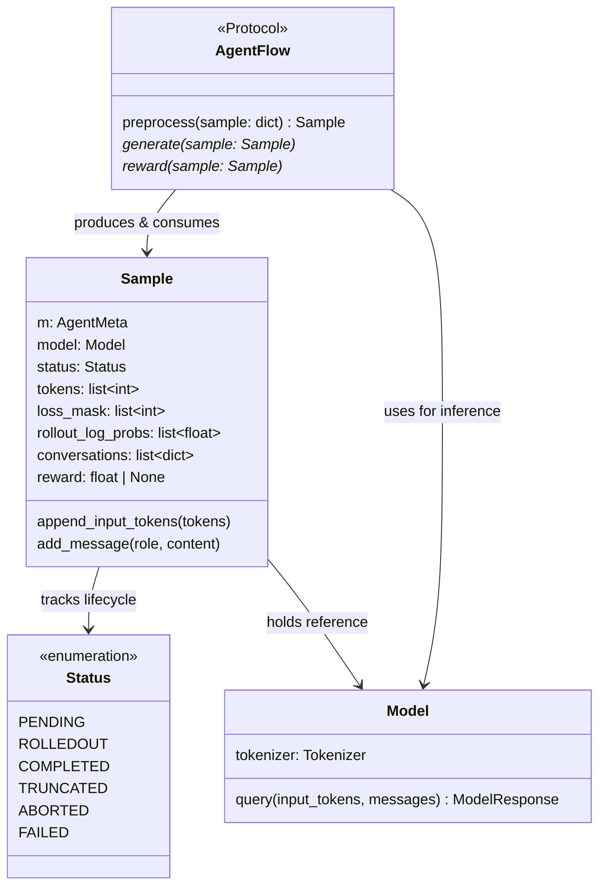
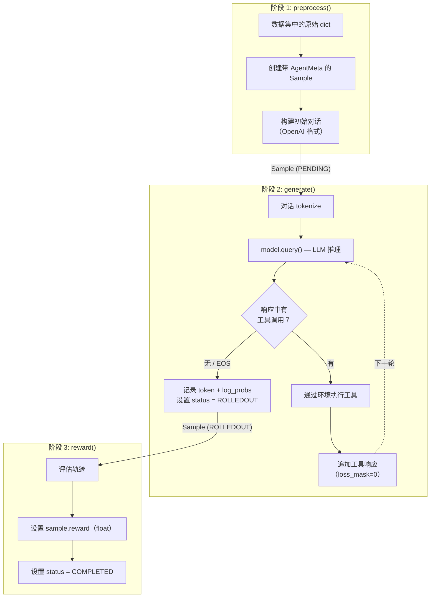

# AgentFlow 协议

AgentFlow 协议是一个三方法契约（`preprocess → generate → reward`），将任务特定逻辑与 rollout 引擎解耦，让你通过 YAML 配置交换或覆盖任意阶段，无需修改框架内部代码。

!!! abstract "核心洞察"
    AgentFlow 是一个三方法契约：`preprocess()`、`generate()`、`reward()`。
    如果你的任务能用这三个步骤来表达，就可以直接接入，
    无需修改任何框架代码。把它理解为训练任务的插件接口。

## 协议概览



*图 1：AgentFlow 协议类图*

## 方法签名

每个 AgentFlow 实现提供恰好三个方法：

```python
class AgentFlow(Protocol):
    def preprocess(self, sample: dict) -> Sample:
        """将原始数据集字典转换为准备好生成的 Sample 对象。"""
        ...

    async def generate(self, sample: Sample):
        """运行模型推理，可选择与工具/环境交互循环。"""
        ...

    async def reward(self, sample: Sample):
        """为已完成的轨迹计算标量奖励。"""
        ...
```

`generate` 和 `reward` 方法是 `async` 的——rollout 引擎在多个样本上并发 await 它们。

## Sample 对象

`Sample` 是一个通用数据类，在三个阶段中携带轨迹数据。它位于 `siirl/execution/rollout/agentflow/base.py`：

| 字段                  | 类型              | 描述                                     |                      |
| ------------------- | --------------- | -------------------------------------- | -------------------- |
| `m`                 | `AgentMeta`（泛型） | 由你的 flow 定义的任务特定元数据                    |                      |
| `model`             | `Model`         | 语言模型的引用                                |                      |
| `status`            | `Sample.Status` | 生命周期状态（见下文）                            |                      |
| `tokens`            | `list[int]`     | 完整 token 序列（prompt + 所有响应轮次）           |                      |
| `loss_mask`         | `list[int]`     | 模型生成 token 为 `1`，环境/prompt token 为 `0` |                      |
| `rollout_log_probs` | `list[float]`   | rollout 策略的 token 级 log 概率             |                      |
| `conversations`     | `list[dict]`    | OpenAI 格式的完整对话历史                       |                      |
| `reward`            | `float \        | None`                                  | 由 `reward()` 设置的标量奖励 |

!!! note "两个 Sample 类"
    此处的 `Sample`（AgentFlow，`list` 字段）与 `siirl/data_coordinator/sample.py` 中的 `Sample`（NaiveFlow，`np.ndarray` 字段）不同。详见[两个 Sample 类](../concepts/architecture_overview.md#two-sample-classes)。

### Sample 状态生命周期

```
PENDING → （generate 后）→ ROLLEDOUT → （reward 后）→ COMPLETED
                                     ↘ TRUNCATED  （达到最大轮数）
                                     ↘ ABORTED    （不可恢复的错误）
                                     ↘ FAILED     （奖励计算失败）
```

## 三阶段流水线



*图 2：AgentFlow 三阶段流水线*

## 注册 Flow

### 选项 A：完整 Python 路径（推荐）

在训练配置中使用 `module:class` 路径直接引用 flow 类：

```yaml
rollout:
  agentflow:
    name: "my_project.flows.my_task_flow:MyTaskFlow"
    python_path: ["/root/my_project"]   # 如果在包外则添加到 sys.path
```

`load_agentflow(config, model)` 函数会动态导入并用 `(config, model)` 实例化该类。

### 选项 B：内置注册表别名

在 `siirl/execution/rollout/agentflow/__init__.py` 中添加条目：

```python
BUILTIN_FLOW = {
    "swe": ".swe:agentflow",
    "my_task": ".my_task_flow:MyTaskFlow",  # 添加你的 flow
}
```

然后通过别名引用：

```yaml
rollout:
  agentflow:
    name: "my_task"
```

## 通过 YAML 动态函数注入

你可以在配置中指向 Python 函数来覆盖单个阶段，而不必创建子类。这在你想复用内置 flow 但只定制奖励逻辑时非常有用：

```yaml
rollout:
  agentflow:
    name: "swe"                                              # 使用内置 SWE flow
    preprocess_fn: "my_project.preprocess:custom_preprocess" # 覆盖 preprocess
    reward_fn: "my_project.rewards:custom_reward"            # 覆盖 reward
    generate_fn: "my_project.generate:custom_generate"       # 覆盖 generate（可选）
    python_path: ["/root/my_project"]
```

注入的函数通过 `MethodType` 绑定到 flow 实例，因此 `self` 指向 AgentFlow 实例：

```python
# my_project/rewards.py
async def custom_reward(self, sample):
    """
    'self' 是 AgentFlow 实例——可访问 self.config、self.model 等。
    """
    assistant_response = sample.conversations[-1]["content"]
    sample.reward = my_scoring_function(assistant_response)
    sample.status = sample.Status.COMPLETED
```

## 自定义奖励示例

奖励函数在 `generate()` 完成后接收一个 `Sample`。你将 float 赋值给 `sample.reward` 并设置状态：

```python
async def custom_reward(self, sample: Sample) -> None:
    """示例：与参考答案的精确匹配奖励。"""
    # 获取最后一条 assistant 消息
    response = next(
        m["content"] for m in reversed(sample.conversations)
        if m["role"] == "assistant"
    )
    reference = sample.m.reference_answer   # 由 preprocess() 存储在 AgentMeta 中

    # 规范化并比较
    sample.reward = 1.0 if reference.strip().lower() in response.strip().lower() else 0.0
    sample.status = sample.Status.COMPLETED
```

对于多轮轨迹，你可以检查 `sample.conversations` 来评估中间步骤，或使用 `sample.tokens` 和 `sample.loss_mask` 在 token 级别工作。

## 通过配置选择 Flow

训练运行中使用哪种 flow 由 `config.rollout.flow_function` 决定：

- **`"naive"`** — 直接使用 `NaiveFlow`（生产级多轮状态机）。这是工具交互训练的默认路径。NaiveFlow 进一步读取 `config.rollout.executor_module` 以实例化正确的执行器（例如 `"naive"` → `NaiveExecutor`）。
- **自定义模块路径** — 除 `"naive"` 外的任何值都被解析为 Python 路径（`"module.path:ClassName"`），通过 `load_agentflow(config, model)` 加载为 AgentFlow 实现。

```yaml
# 使用内置 NaiveFlow 状态机（默认）
rollout:
  flow_function: naive
  executor_module: naive    # 在 NaiveFlow 内加载 NaiveExecutor

# 使用自定义 AgentFlow 实现
rollout:
  flow_function: my_project.flows:MyTaskFlow
  agentflow:
    python_path: ["/root/my_project"]
```

NaiveFlow 与 AgentFlow 协议因此**并不竞争**——NaiveFlow 是框架的内置实现，而 AgentFlow 是用户自定义替代方案的接口。

## 与 NaiveFlow 的关系

AgentFlow 和 NaiveFlow 是**并行系统**，不是继承关系：

|           | AgentFlow                                | NaiveFlow                                          |
| --------- | ---------------------------------------- | -------------------------------------------------- |
| 用途        | 通过 Protocol 实现可插拔任务流水线                   | 生产级多轮状态机                                           |
| 位置        | `siirl/execution/rollout/agentflow/`     | `siirl/execution/rollout/agent_flow/naive_flow.py` |
| Sample 类型 | `agentflow/base.py::Sample`（Python list） | `data_coordinator/sample.py::Sample`（np.ndarray）   |
| 配置方式      | `rollout.agentflow.name`                 | `rollout.flow_function: naive`                     |
| 工具交互      | 通过自定义 `generate()` 逻辑                    | 内置状态机                                              |

当你需要完全自定义流水线时使用 AgentFlow。当你想使用内置多轮工具交互循环时使用 NaiveFlow。

## 下一步

- [添加新 Executor 或 AgentFlow](../contributing/adding_new_executor_or_flow.md) — 按分步教程实现并注册你自己的 AgentFlow
- [Agentic 多轮训练](../guides/agentic_multiturn.md) — 无需编写自定义 flow，直接使用 NaiveFlow 进行多轮工具交互训练
- [架构概览](architecture_overview.md) — 了解 AgentFlow 如何融入更宏观的组件架构和数据流
