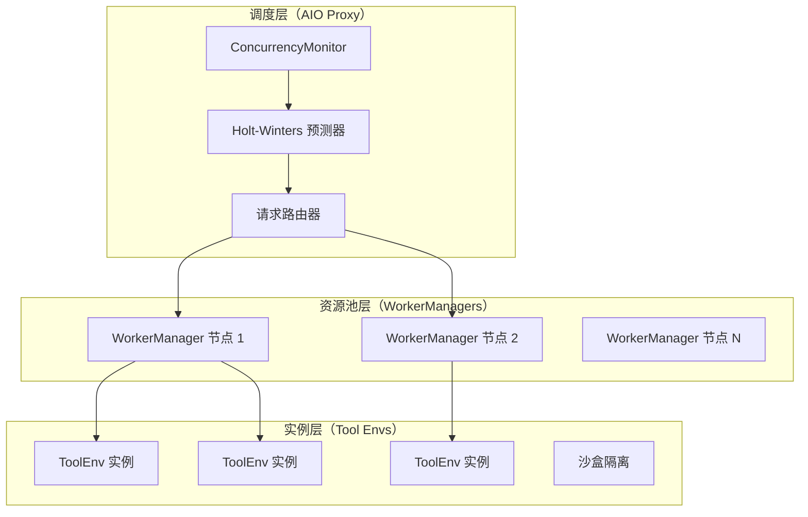
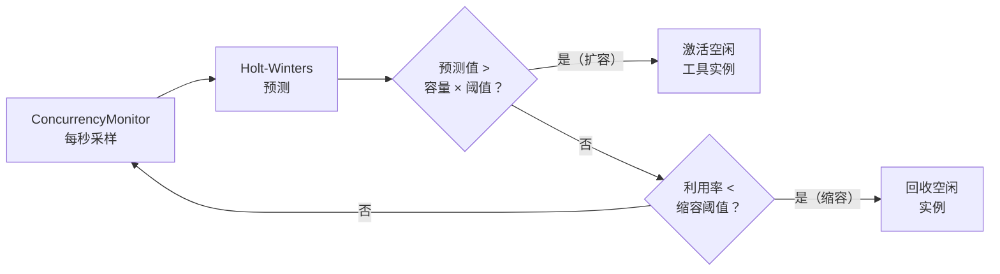

# AIO 基础设施

AIO（Agentic I/O）是一个三层分布式工具调度基础设施，解决了长时 agentic rollout 中高并发工具调用导致的吞吐量瓶颈问题。

!!! abstract "核心洞察"
    工具实例就像云函数——AIO 根据需求预测（Holt-Winters 预测）自动扩缩容。
    你只需声明需要哪些工具；AIO 负责决定运行多少实例以及在哪里运行。

## 工具瓶颈问题

标准 RL rollout 假设每个样本只有一次推理步骤：prompt 进，response 出。Agentic rollout 不同——单条轨迹可能触发 5–50 次工具调用，每次耗时从 100ms（本地搜索）到 30s（网页检索、代码沙盒）不等。在大规模场景下，1000 个并发 rollout 每步产生高达 50,000 次工具调用，会压垮任何单节点工具服务器，导致级联超时并中断训练。

AIO 通过将工具执行分散到动态工作节点池，并使用需求预测在负载峰值前提前扩容来解决这个问题。

## 三层架构



*图 1：AIO 三层架构*

### 调度层（AIO Proxy）

**Proxy** 是所有来自 rollout worker 的工具调用的唯一入口。它：

- 使用负载感知调度将请求路由到可用的 WorkerManager
- 运行 `ConcurrencyMonitor`，每秒采样活跃调用数
- 将测量数据输入 **Holt-Winters 预测器** 进行需求预测
- 根据预测值与当前容量的对比触发扩缩容事件

Proxy 暴露 REST API：`POST /call`、`GET /status`、`GET /health`、`GET /metrics`。

### 资源池层（WorkerManagers）

每个 **WorkerManager** 运行在专用工具节点上，负责：

- 维护固定数量的 `ToolEnv` 实例池
- 启动时自动向 Proxy 注册
- 上报容量和活跃调用数用于负载均衡

你可以通过添加 WorkerManager 节点来水平扩展资源池，无需修改 Proxy 或 rollout worker 配置。

### 实例层（工具环境）

每个 **ToolEnv 实例** 是一种工具类型的隔离执行上下文。根据工具的安全要求，隔离可以是进程级或容器级的。

工具实例在 `create()` 时从资源池分配，在 `release()` 时归还。单个 WorkerManager 可以托管多种工具类型，每种类型可有多个实例。

## 基于 Holt-Winters 的需求预测

AIO 使用**双指数平滑（Holt-Winters）**——一种经典时间序列方法——提前一个时间窗口预测工具需求：

```
Level(t)  = α × observed(t)  + (1 - α) × (Level(t-1) + Trend(t-1))
Trend(t)  = β × (Level(t) - Level(t-1)) + (1 - β) × Trend(t-1)
Forecast  = Level(t) + Trend(t)
```

其中：
- `α`（默认：0.3）控制 Level 对新观测值的适应速度
- `β`（默认：0.1）控制 Trend 分量的适应速度

选择 Holt-Winters 而非简单移动平均，是因为 agentic rollout 具有可预测的趋势：当新的 rollout batch 开始时，工具调用需求急剧上升，结束时下降。趋势感知预测让系统在饱和之前就完成扩容，而不是在之后。

## 自动扩缩容行为



*图 2：自动扩缩容决策循环*

配置：

```yaml
auto_scaling:
  enabled: true
  algorithm: holt_winters
  scale_up_threshold: 0.8     # 利用率 > 80% 时扩容
  scale_down_threshold: 0.3   # 利用率 < 30% 时缩容
  min_instances: 1            # 每个 WorkerManager 最小实例数
  max_instances: 20           # 每个 WorkerManager 最大实例数
  alpha: 0.3                  # Holt-Winters Level 平滑系数
  beta: 0.1                   # Holt-Winters Trend 平滑系数
```

## 工具实例管理

### 生命周期

每次工具调用经历三阶段生命周期，由 NaiveFlow 管理：

```
create(create_kwargs) → step(action) → release(instance_id)
```

1. **`create()`** — 从 WorkerManager 的资源池中分配实例，返回 `(instance_id, EnvResponse)`
2. **`step()`** — 在已分配的实例中执行工具动作
3. **`release()`** — 将实例归还到资源池以供复用

这个生命周期确保有状态的工具（如浏览器会话、运行中的沙盒）在多轮交互中始终与正确的 rollout 样本关联。

### 并行执行

当 `max_parallel_calls > 1` 时，NaiveFlow 使用 `asyncio.gather()` 在单轮中并发调度多个工具调用。每次调用独立经历完整的 `create → step → release` 生命周期：

```python
results = await asyncio.gather(*[
    self._step(agent_data, call) for call in tool_calls[:max_parallel_calls]
])
```

这意味着单个 rollout 样本可以同时使用多达 `max_parallel_calls` 个工具实例，在工具是 IO 密集型时可以成倍提高有效吞吐量。

## 并发解析

AIO 启动前，siirl-agentic 会解析训练服务器和 rollout 请求的有效并发数。这由 `siirl/execution/rollout/concurrency.py` 处理：

- **`resolve_train_server_concurrency(config)`** — 确定 SGLang 服务器接受的并发请求数。如果设置了 `rollout.train_server_concurrency` 则使用该值；否则根据可用 GPU 内存和模型大小自动计算。
- **`resolve_rollout_concurrency(config)`** — 确定每个 SGLang 引擎的 in-flight rollout 请求数。有效值为 `min(train_server_concurrency, rollout_batch_size × n)`，防止 rollout 速度超过训练时请求队列无限增长。

!!! warning "工具调用队列行为"
    单个 rollout 样本中超出 `max_parallel_calls` 的工具调用会被 **`asyncio.gather()` 排队**，而非静默丢弃。单轮中只有前 `max_parallel_calls` 个调用会并发执行；该轮的多余调用会被丢弃。不同轮次的调用不受影响——每轮独立调度最多 `max_parallel_calls` 个。设置 `max_parallel_calls: 1`（默认值），除非已验证工具环境能正确处理并发访问。

## 与 siirl-agentic 的集成

配置 rollout 通过 AIO 路由工具调用：

```yaml
rollout:
  multiturn:
    env_type: tool_env
    env_kwargs:
      tool_format: hermes
      aio_proxy_url: http://proxy-host:8080
```

或通过环境变量：

```bash
export AIO_PROXY_URL=http://proxy-host:8080
```

`AIOSearchEnv` 类（`siirl/environment/tool_env/aio_search_env.py`）将工具解析器的 `FunctionCall` 对象转换为对 Proxy `/call` 端点的 HTTP 请求。

## 关键设计决策

### 集中式 Proxy，分布式 Workers

Proxy 是轻量级协调器——不持有任何工具状态。所有执行都在 WorkerManager 中进行。这意味着你可以重启或升级 WorkerManager 而不影响 Proxy，也可以在仅有 CPU 的节点上运行 Proxy。

### 拉取式而非推送式扩缩容

WorkerManager 不主动推送自身状态——Proxy 轮询它们获取容量指标。这避免了大量 WorkerManager 在高负载时同时向 Proxy 发送心跳而造成的惊群问题。

### 预测而非被动响应

被动自动扩缩容器（达到饱和时才扩容）会在新实例启动期间造成训练停顿。AIO 的基于预测的方式利用 rollout batch 的可预测节奏提前扩容，在正常条件下将队列深度保持在接近零的水平。

## 下一步

- [AIO 工具基础设施指南](../guides/aio_tool_infrastructure.md) — 按照运维指南部署、配置和扩展本文描述的系统
- [部署模式](../guides/deployment_modes.md) — 选择与 AIO 部署相匹配的 GPU 拓扑
- [性能调优](../guides/performance_tuning.md) — 调整 AIO 容量和并发设置，消除工具延迟瓶颈
