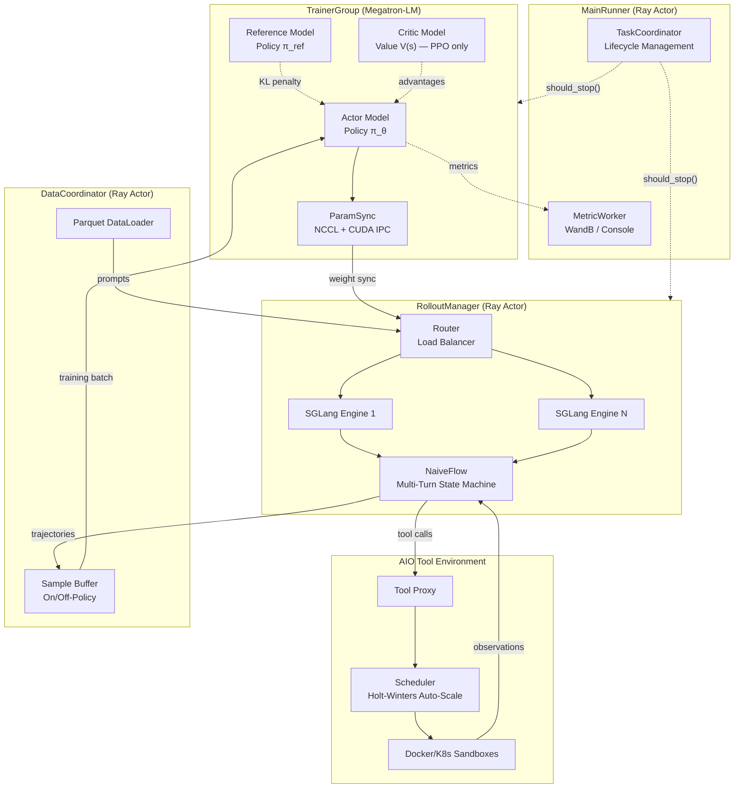
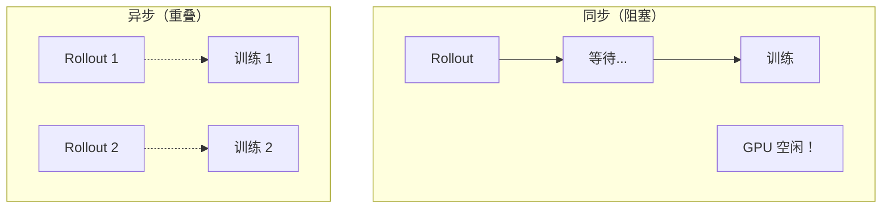

# 架构概览

*siirl-agentic 的组件架构、数据流和训练生命周期的完整图景。*

!!! abstract "核心洞察"
    siirl-agentic 将*发生什么*（rollout、训练、奖励）与
    *何时发生*（异步调度）分离。正是这种分离，使你无需修改训练循环
    就能添加新的任务类型。

## 设计哲学

siirl-agentic 基于三个架构原则构建：

1.  **异步 MPMD** — 主要组件（`RolloutManager` 和 `DataCoordinator` 作为 Ray actor，`TrainerGroup` 作为管理 Ray trainer actor 的协调类）独立运行，互不阻塞。
2.  **Agentic 优先的数据路径** — 样本生命周期原生支持多轮轨迹、工具交互、逐 turn loss masking 和变长序列。
3.  **配置优于代码** — 任务特定逻辑（AgentFlow、奖励函数、工具环境）通过配置注入，不硬编码在框架内部。

## 与单轮 RL 框架的区别

| 方面           | 单轮框架（verl、OpenRLHF、TRL） | siirl-agentic           |
| ------------ | ----------------------- | ----------------------- |
| Rollout      | 一个 prompt → 一个响应        | 带工具调用的多轮轨迹              |
| 调度           | 同步批次                    | 异步 — rollout 与训练重叠      |
| 工具交互         | 外部附加，非原生                | 原生 ToolEnv 与状态机         |
| Loss masking | 响应级别                    | 逐轮，区分模型 token 与环境 token |
| 扩缩容          | 手动 GPU 分配               | 基于 Ray 的 AIO 自动扩缩容      |

## 系统架构

下图展示了主要 Ray actor 与协调器之间的连接关系。实线箭头表示主要数据流；虚线箭头表示辅助信号（KL 惩罚、优势估计、生命周期事件）。



详细版架构图如下所示：

<figure markdown>
  { loading=lazy .glightbox data-gallery="fig1" }
  <figcaption>图 1：全局系统架构</figcaption>
</figure>

## 端到端数据流

<figure markdown>
  { loading=lazy .glightbox data-gallery="fig2" }
  <figcaption>图 2：端到端数据流</figcaption>
</figure>

## 组件职责

### MainRunner (`siirl/async_train.py`)

`MainRunner` 是一个 Ray actor（预留 `num_cpus=5`），编排整个训练生命周期：

1.  通过 `parse_config()` 解析 `SiiRLArguments` 配置（使用 `argparse` + `OmegaConf.from_cli()`）
2.  创建 `TaskCoordinator` 进行生命周期管理
3.  分配 GPU 资源（训练 vs 推理分割）
4.  初始化 `DataCoordinator`、`MetricWorker`、`RolloutManager`、`TrainerGroup`
5.  启动异步训练循环
6.  通过 `TaskCoordinator` 监控状态
7.  处理清理和失败上报

### TrainerGroup (`siirl/worker/actor/trainer_group.py`)

一个**普通 Python 协调类**（不是 Ray actor），管理分布式 Ray trainer actor：

-   **Actor 模型** — 正在训练的策略模型（Megatron 后端）
-   **Reference 模型** — 用于 KL 散度计算的冻结副本
-   **Critic 模型** — 价值函数估计器（仅 PPO 使用，GRPO 不需要）
-   **参数同步** — 每个训练步后将更新的权重推送到 RolloutManager 的 SGLang 引擎

关键文件：

-   `siirl/worker/actor/trainer.py` — 每个 rank 的训练逻辑（前向、loss、反向、优化器步）
-   `siirl/worker/actor/trainer_group.py` — 多 rank 协调
-   `siirl/worker/actor/checkpoint_manager.py` — 保存/加载检查点
-   `siirl/engine/param_sync/` — 权重同步到推理引擎

### RolloutManager (`siirl/worker/rollout/rollout_manager.py`)

一个 **Ray actor**，管理推理引擎并调度 rollout：

-   **SGLang 引擎** — 一个或多个 SGLang 实例用于快速 LLM 推理
-   **Router** — 在多引擎间负载均衡请求
-   **NaiveFlow** — 带工具交互的多轮 rollout 执行
-   **验证** — 使用不同采样参数的独立验证 rollout

关键文件：

-   `siirl/worker/rollout/rollout_manager.py` — 引擎生命周期、请求调度
-   `siirl/worker/rollout/rollout_worker.py` — 每个引擎的 rollout 执行
-   `siirl/execution/rollout/agent_flow/naive_flow.py` — 多轮状态机
-   `siirl/execution/rollout/concurrency.py` — 并发参数解析

### DataCoordinator (`siirl/data_coordinator/`)

一个 **Ray actor**，管理从 prompt 到训练的样本生命周期。它存储样本元数据（`SampleInfo`）和 Ray `ObjectRef`，而非实际样本数据：

-   **Dataloader** — 加载和分发训练/验证数据集
-   **样本缓冲** — 缓冲已完成的 rollout 样本引用供训练消费
-   **Off-policy 支持** — 接受可配置版本窗口内的数据（`off_policy_step`，默认：0 = 仅 on-policy）

关键文件：

-   `siirl/data_coordinator/data_buffer.py` — `init_data_coordinator()`，`DataCoordinator` Ray actor 类
-   `siirl/data_coordinator/dataloader/` — 数据集加载和分发
-   `siirl/data_coordinator/sample.py` — `Sample` Pydantic BaseModel，包含 prompt、response、mask、reward
-   `siirl/data_coordinator/protocol.py` — 数据交换协议

### MetricWorker (`siirl/utils/metrics/`)

收集和上报训练指标到 WandB 和/或控制台。在训练循环之前由 `MainRunner` 初始化。

### ValidateProgressMonitor (`siirl/worker/validate/`)

追踪验证 rollout 进度并上报验证指标。

### TaskCoordinator (`siirl/utils/task_coordinator.py`)

分布式训练的集中式生命周期管理：

-   `should_stop()` — 所有组件轮询以检查训练是否应结束
-   `report_failure(source, reason)` — 任何组件上报失败以便传播
-   `report_completed(source)` — 成功完成信号
-   `request_shutdown(reason, source)` — 优雅关闭请求（注意：参数顺序是先 `reason`，后 `source`）
-   事件日志用于事后调试

## 训练生命周期

### 初始化阶段

<figure markdown>
  { loading=lazy .glightbox data-gallery="fig3" }
  <figcaption>图 3：初始化阶段</figcaption>
</figure>

### 训练循环（异步）

<figure markdown>
  { loading=lazy .glightbox data-gallery="fig4" }
  <figcaption>图 4：异步训练循环</figcaption>
</figure>

### 关闭阶段

1.  训练 epoch 用尽 → `coordinator.report_completed()`
2.  所有组件检测到 `should_stop() == True`
3.  `MainRunner._cleanup_and_report()` 记录摘要
4.  Ray 关闭

## 部署模式

### Separated 模式（默认）

GPU 在训练和推理之间分割：

```
节点 (8 GPUs):
  GPU 0-1: Actor/Ref/Critic (TrainerGroup)    # 默认: actor_gpus=2
  GPU 2-7: SGLang Engines (RolloutManager)    # 默认: rollout_gpus=6
```

配置：

``` yaml
trainer:
  actor_gpus: 2       # 默认
  rollout_gpus: 6     # 默认
  colocate: false     # 默认
```

### Colocated 模式

训练和推理共享相同的 GPU，通过权重 offload 实现：

```
节点 (8 GPUs):
  GPU 0-7: 共享（训练时 offload 推理权重，反之亦然）
```

配置：`trainer.colocate=true`

Colocated 模式自动：

-   启用参数 offload（`megatron.param_offload=true`）
-   将 `rollout.gpu_memory_utilization` 限制为 0.45
-   禁用 `validate_reuse_train_gpus`

## 关键数据结构

### SiiRLArguments (`siirl/params/training_args.py`)

顶层配置数据类：

``` python
@dataclass
class SiiRLArguments:
    data: DataArguments              # 数据集路径、batch 大小、tokenization
    actor_ref: ActorRefArguments     # Actor、Ref、Algorithm、Checkpoint 配置
    rollout: RolloutArguments        # SGLang 引擎、采样、多轮配置
    critic: CriticArguments          # Critic 模型（仅 PPO）
    trainer: TrainingArguments       # Epoch、GPU 分配、检查点
    custom_reward_function: CustomRewardArguments  # 自定义奖励配置
```

### Sample (`siirl/data_coordinator/sample.py`) { #two-sample-classes }

贯穿 NaiveFlow 流水线的 Pydantic BaseModel 数据载体：

```
Sample:
  prompts: np.ndarray | None      # Prompt token ID
  responses: np.ndarray | None    # Response token ID（模型 + 环境交替）
  response_mask: np.ndarray | None  # 1 = 模型 token, 0 = 环境 token
  rollout_log_prob: np.ndarray | None  # Token 级 log 概率
  rewards: float                  # 标量奖励（可空，默认 None）
  data_source: str                # 数据集来源标识
  reward_model: dict              # 用于奖励计算的 ground truth
```

!!! note "两个 Sample 类"
    siirl-agentic 有两个同名的 `Sample` 类：

    - `siirl.data_buffer.Sample` — 训练侧数据容器（actor 输出、奖励、优势值）
    - `siirl.execution.rollout.agentflow.base.Sample` — Rollout 侧轨迹容器（消息、工具调用、状态）

    两者用途不同，不可互换。阅读代码时，请确认你在看哪一个 import。

## 权重同步协议

每个训练步完成后，更新的模型权重必须在下一轮 rollout batch 开始前同步到 SGLang 推理引擎。这由 `siirl/engine/param_sync/` 中的 `ParamSyncDistributed` 负责。

同步使用两项优化以最小化延迟：

1. **`FlattenedTensorBucket`** — 参数在广播前被打包到连续内存缓冲区（bucket）中，将 NCCL 调用次数从每参数一次减少到每 bucket 一次。Bucket 大小可配置；默认将所有参数打包为单次传输。

2. **CUDA IPC 句柄（零拷贝）** — 当 trainer 与 rollout 进程共享同一节点时，权重通过 CUDA 进程间通信句柄共享，而非通过网络复制。接收端 SGLang 进程直接映射 trainer 的 GPU 缓冲区，省去 device→host→device 往返。

在多节点部署中，节点间使用 NCCL 广播，节点内使用 IPC 句柄。

## 设计权衡

### 为什么需要异步？

同步流水线会迫使训练 GPU 在等待 rollout 中最慢的工具调用时空闲：



*图 5：同步与异步执行对比*

在 Agentic 工作负载中，rollout 延迟由工具调用响应时间的差异主导（本地工具 100ms，Web API 30s）。MPMD 架构将训练与 rollout 解耦：Trainer 持续更新策略，RolloutManager 持续收集新轨迹。

### 分离 vs 简洁

MPMD 架构相比单体设计在调试和部署上引入了复杂性。我们接受这一权衡是因为：

- 异步重叠带来的 GPU 利用率增益远超运维复杂性
- Ray 提供了健壮的 actor 级错误隔离和重试
- `TaskCoordinator` 集中了生命周期管理以提供可观测性

### 配置灵活性 vs 安全性

动态函数注入系统（`MethodType` 绑定）功能强大但需要用户编写正确的 Python 函数。我们通过以下方式降低风险：

- 带类型注解的协议接口（`AgentFlow`、`Model`、`Sample`）
- 加载时验证并提供清晰的错误消息
- 内置 flow 作为参考实现

### 异步数据新鲜度 vs 吞吐量

来自旧模型版本的 off-policy 数据可能降低训练信号质量。我们通过以下方式处理：

- 可配置的 `off_policy_step` 窗口（默认：0，即仅 on-policy）以限制数据过期程度
- 所有样本上的版本标签以支持审计
- 持续 GPU 利用带来的吞吐量增益在实践中超过轻微的 off-policy 降级

## 下一步

- [异步训练生命周期](async_training_lifecycle.md) — 追踪启动、训练和关闭阶段的完整事件序列
- [系统工作原理](how_it_works.md) — 以更平易近人的叙述方式了解本文所涵盖的相同概念
- [AgentFlow 协议](agentflow_protocol.md) — 理解可插拔 flow 层如何融入整体架构
