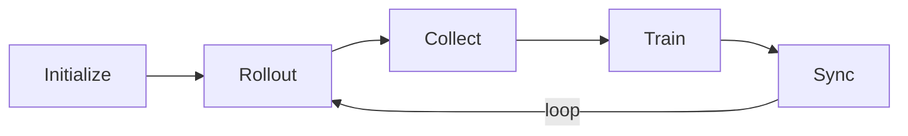
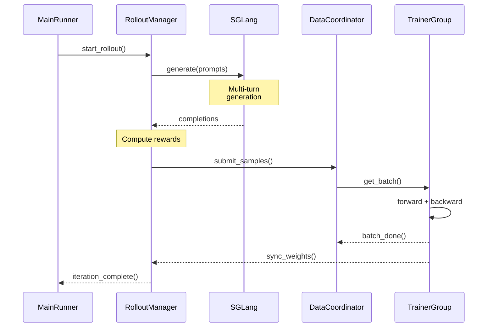
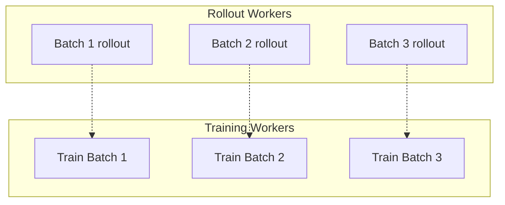
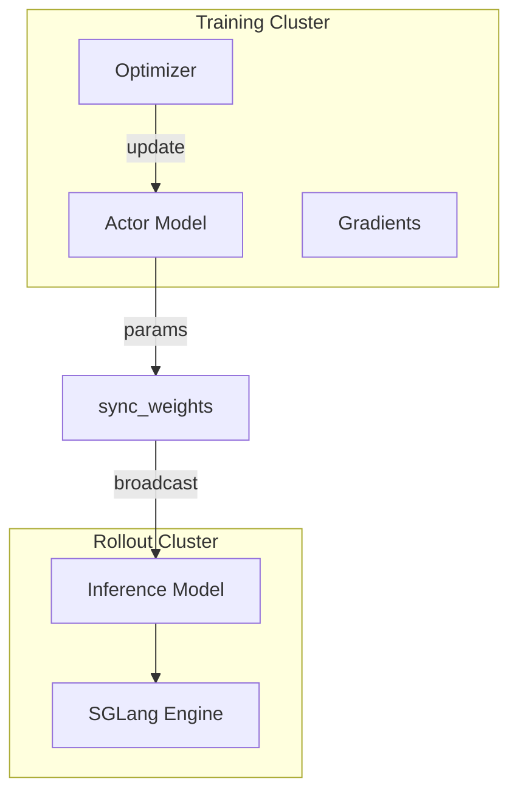

# 异步训练生命周期

siirl-agentic 的训练循环在独立的 Ray actor 之间并发运行 rollout 和训练，消除了工具调用延迟不一致时原本会积累的 GPU 空闲时间。

!!! abstract "核心洞察"
    训练循环有三个阶段（rollout → 奖励 → 训练），这三个阶段**异步**运行。
    当第 N 批次在训练时，第 N+1 批次已经在生成 rollout。
    这就是框架速度快的原因——GPU 从不空闲。

## 为什么需要异步？

在**同步** RL 流水线中，训练必须等待当前 rollout batch 完成后才能开始。对于 agentic 工作负载，单次工具调用的耗时从 100ms（本地工具）到 30s（Web API）不等，这意味着训练 GPU 在每个 batch 中都要等待最慢的样本：

```
[Rollout batch]──────────────────────[等待]──[训练]──[Rollout batch]──...
 GPU: rollout   rollout   rollout     空闲    训练中
```

siirl-agentic 使用**异步 MPMD** 架构，`RolloutManager` 和 `TrainerGroup` 是独立的 Ray actor：

```
[Rollout 1]────────────────────────────────────────────────...
[Rollout 2]──────────────────────────────────────────...
[训练 1]──────────────────[训练 2]──────────────────[训练 3]...
```

`DataCoordinator` 在两条流水线之间缓冲已完成的 rollout 样本。Trainer 一旦有足够的样本就拉取 batch，无需等待当前 rollout batch 全部完成。这种重叠是 agentic 训练中 GPU 效率的关键来源。

**并发解析：** 每个 SGLang 引擎的并发 rollout 请求数由 `siirl/execution/rollout/concurrency.py` 确定。有效并发数为 `min(train_server_concurrency, rollout_batch_size × n)`，防止在 rollout 速度超过训练时请求队列无限增长。

**Off-policy 容忍：** 由于 rollout 和训练以不同速率运行，部分训练样本可能来自稍旧的模型版本。`off_policy_step` 参数（默认：0）限制了样本可以过期多少个训练步才被丢弃。设置 `off_policy_step: 2` 允许样本最多过期两个训练步，以轻微的 off-policy 偏差换取更高吞吐量。

## 概览

siirl-agentic 的训练生命周期包含三大阶段：

1.  **初始化** — 配置解析、资源分配、组件启动
2.  **异步训练循环** — 持续的 rollout → 缓冲 → 训练循环
3.  **关停** — 优雅终止、检查点保存、资源清理

## 阶段 1：初始化

`siirl/async_train.py` 中的 `main()` 函数驱动初始化：



*图 1：初始化流程*

步骤：

1.  **Ray 初始化** — 启动或连接 Ray 集群，设置运行时环境变量（`TOKENIZERS_PARALLELISM`、`NCCL_DEBUG` 等）。
2.  **配置解析** — `parse_config()` 使用 `argparse` + `OmegaConf.from_cli()` 解析 CLI 参数，创建 `SiiRLArguments` 数据类层级。注意：这不会直接加载 YAML 文件；配置通过 CLI 参数以 OmegaConf 点号表示法传递（例如 `trainer.total_epochs=50`）。
3.  **MainRunner 启动** — 创建一个专用 Ray actor（预留 `num_cpus=5`）来编排工作流。这隔离了主进程。
4.  **TaskCoordinator** — `create_coordinator()` 创建一个命名 Ray actor 用于集中式生命周期管理。所有组件引用此 actor。
5.  **资源分配** — `allocate_resources(config)` 根据 `trainer.actor_gpus`（默认：2）和 `trainer.rollout_gpus`（默认：6）在训练和推理之间分配可用 GPU。
6.  **DataCoordinator 初始化** — 创建 `DataCoordinator` Ray actor 并启动 dataloader 进行 prompt 分发。
7.  **MetricWorker 初始化** — 创建 `MetricWorker` 用于指标收集和上报。
8.  **RolloutManager 初始化** — 启动 SGLang 推理引擎，初始化路由器，准备 NaiveFlow 实例。在 colocated 模式下，这必须在 trainer 初始化之前完成。
9.  **TrainerGroup 初始化** — 使用 Megatron 后端初始化 Actor、Reference 和（PPO 时的）Critic 模型。如果 `resume_mode != "disable"` 则加载检查点。

### Colocated 模式特殊处理

当 `trainer.colocate=true` 时，初始化顺序改变：

1.  RolloutManager 必须先完全初始化
2.  调用 `offload_for_train()` 释放 GPU 内存供 trainer 初始化
3.  然后才执行 `trainer_group.init_actors()`
4.  `gpu_memory_utilization` 被限制为 0.45
5.  所有 Megatron 配置强制启用 `param_offload`

## 阶段 2：异步训练循环

初始化完成后，异步训练循环开始：

### 详细组件交互



*图 2：详细异步训练时序*

### 循环架构



*图 3：异步循环架构*

循环异步运行：

-   **RolloutManager** 通过 `run_dataloader()` 持续获取 prompt 并分发 rollout。每个 `RolloutWorker` 运行 `NaiveFlow` 与工具交互。
-   **DataCoordinator** 收集已完成的样本元数据和 ObjectRef。当积累足够样本形成训练 batch 时，它们变为可供 Trainer 使用。
-   **TrainerGroup** 拉取训练 batch 并执行 PPO 或 GRPO 更新。每次更新后，参数同步将新权重推送到 SGLang 引擎。

关键异步特性：

-   Rollout 和训练**并发**运行 — Trainer 不会等待所有 rollout 完成后才开始训练步。
-   **Off-policy 容忍** — `off_policy_step` 控制样本可以过期多少个训练步才被丢弃（默认：0，即仅 on-policy）。
-   **持续 GPU 利用** — Trainer 更新权重时，RolloutManager 已经在收集新轨迹。

### NaiveFlow 状态机

每个样本在 `NaiveFlow` 中经历状态机：`PENDING → GENERATING → PROCESSING_ENV → GENERATING → ... → TERMINATED`。完整的 NaiveFlow 状态机见 [Agentic 多轮训练：状态机](../guides/agentic_multiturn.md#naiveflow-state-machine)。

## 阶段 3：关停

通过 `TaskCoordinator` 协调关停：



*图 4：关停流程*

**正常关停：**

1.  所有训练 epoch 耗尽
2.  `TrainerGroup` 调用 `coordinator.report_completed()`
3.  所有轮询 `coordinator.should_stop()` 的组件收到 `True`
4.  `MainRunner._cleanup_and_report()` 记录最终摘要
5.  `ray.shutdown()` 清理集群

**故障关停：**

1.  任何组件捕获异常
2.  调用 `coordinator.report_failure(source, reason)`
3.  所有组件的 `should_stop()` 返回 `True`
4.  `MainRunner` 检测到故障，记录诊断信息并重新抛出

**关键配置参数：**

| 参数                        | 默认值    | 描述                                     |
| ------------------------- | ------ | -------------------------------------- |
| `trainer.total_epochs`    | 30     | 训练 epoch 数                             |
| `trainer.off_policy_step` | 0      | 训练样本的最大过期步数（0 = 仅 on-policy）           |
| `trainer.colocate`        | false  | 是否在训练和推理之间共享 GPU                       |
| `trainer.resume_mode`     | "auto" | 检查点恢复策略："auto"、"disable"、"resume_path" |

## DataCoordinator 内部机制

`DataCoordinator`（`siirl/data_coordinator/data_buffer.py`）管理 rollout 与训练之间的样本引用。其内部维护：

- **`_sample_queue: deque`** — 一个 `SampleInfo` 对象的 FIFO 队列。每个 `SampleInfo` 持有元数据加上一个指向实际样本的 Ray `ObjectRef`（实际数据存储在 Ray 对象存储中，不在协调器内存中）。
- **`_cache`** — 从 `sample_id` 到 `ObjectRef` 的字典，供 trainer 请求特定 batch 时快速查找。

**长度均衡算法：** 当多个 rollout worker 并发提交样本时，协调器对每个 worker 执行配额限制，防止单个 worker 淹没队列。调用 `get_batch()` 时，从 `_sample_queue` 头部组装 batch，仅在消费时通过 `ray.get()` 解析 `ObjectRef`。

**Off-policy 过滤：** 每个 `SampleInfo` 携带 `weight_version` 字段——rollout 模型权重最后一次同步时的训练步数。`get_batch()` 应用 `min_version` 过滤：`weight_version >= (current_step - off_policy_step)`。比此阈值更旧的样本会被丢弃，不返回给 trainer。使用 `off_policy_step=0`（默认），只使用当前模型版本生成的样本。

## Colocate 模式：`offload_for_train()` / `resume_for_rollout()`

在 colocated 模式下，全部 GPU 内存由 SGLang（rollout）和 Megatron（训练）共享。协议如下：

1. **训练步前：** 调用 `RolloutManager.offload_for_train()`——SGLang 暂停其 KV cache，将推理权重移至 CPU。GPU 内存现在可供 Megatron 训练步使用。
2. **执行训练步**（前向、反向、优化器更新）。
3. **训练步后：** 调用 `RolloutManager.resume_for_rollout()`——权重移回 GPU，SGLang 恢复接受请求。

这使 rollout 与训练串行化（colocated 模式下没有真正的重叠），但允许使用单一 GPU 池完成两个阶段。`colocate_timeout_s` 参数（默认：60s）控制 offload/resume 操作的超时时间。

## 代码锚点

-   `siirl/async_train.py` — `MainRunner.run()` 编排所有三个阶段
-   `siirl/utils/task_coordinator.py` — `TaskCoordinator` 生命周期管理
-   `siirl/worker/rollout/rollout_manager.py` — `RolloutManager` rollout 分发
-   `siirl/worker/actor/trainer_group.py` — `TrainerGroup` 训练协调
-   `siirl/data_coordinator/data_buffer.py` — `DataCoordinator` 样本缓冲
-   `siirl/execution/rollout/agent_flow/naive_flow.py` — `NaiveFlow` 状态机

## 下一步

- [架构概览](architecture_overview.md) — 查看组件图，了解异步架构背后的设计权衡
- [AgentFlow 协议](agentflow_protocol.md) — 了解自定义 flow 逻辑如何插入本文描述的生命周期
- [常见问题与排障](../reference/troubleshooting.md) — 诊断本文所述启动、rollout 和训练阶段的故障
