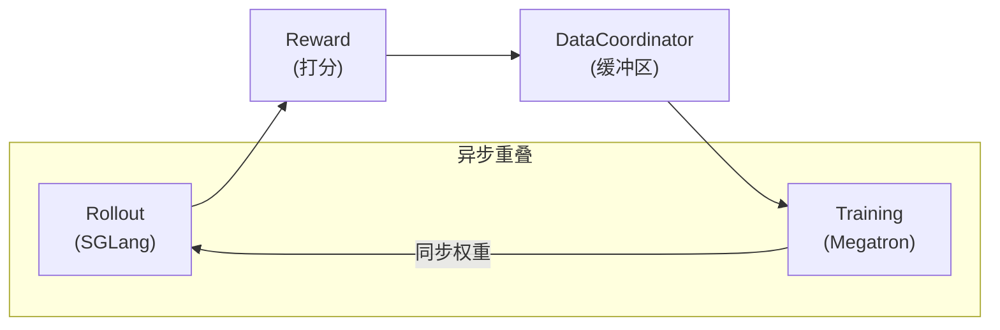

# siirl-agentic 工作原理

*用通俗语言解释启动一次训练运行时发生了什么。*

## 训练循环

siirl-agentic 的每次训练运行都在三个阶段中循环，并以**异步方式**运行，使 rollout 生成与模型训练可以重叠进行：

1. **Rollout** — 模型从数据集中接收一个 prompt 并生成响应。如果任务涉及工具，模型可以发起工具调用、接收环境响应，然后继续生成——跨越多个 turn。整个完整的交互过程称为一条**轨迹（trajectory）**。
2. **Reward** — 对每条完成的轨迹进行打分。奖励可以是基于规则的（例如精确匹配、代码执行通过/失败），也可以由学习型奖励模型计算。
3. **Training** — 使用一批打过分的轨迹，通过策略梯度（PPO 或 GRPO）更新模型权重。更新后的权重会被推回 rollout 引擎，使后续的生成使用最新的策略。

核心设计选择是这三个阶段**并发运行**：在训练一批数据的同时，rollout 引擎已经在收集下一批数据。这使两侧的 GPU 都能保持忙碌。



*图 1：三阶段异步训练循环。Rollout 与 Training 并发运行；每次训练步骤后权重流回 rollout 引擎。*

## 核心组件

| 组件                  | 职责                                                                                   | 关键类                                       |
| ------------------- | ------------------------------------------------------------------------------------ | ----------------------------------------- |
| **MainRunner**      | 启动整个系统：解析配置、分配 GPU、启动所有组件、监控生命周期                                                     | `siirl/async_train.py`                    |
| **RolloutManager**  | 管理 SGLang 推理引擎并分发 rollout 请求；运行 `NaiveFlow` 处理多轮交互                                   | `siirl/worker/rollout/rollout_manager.py` |
| **TrainerGroup**    | 管理分布式训练 actor（Actor 模型、Reference 模型、PPO 专用的 Critic）；执行 forward/backward/optimizer 步骤 | `siirl/worker/actor/trainer_group.py`     |
| **DataCoordinator** | 在 rollout 与训练之间缓冲已完成的轨迹引用；处理 on-policy 与 off-policy 窗口                               | `siirl/data_coordinator/data_buffer.py`   |
| **TaskCoordinator** | 集中化生命周期管理：向所有组件传播停止信号和失败报告                                                           | `siirl/utils/task_coordinator.py`         |
| **ToolEnv**         | 在 rollout 期间执行工具调用（如代码解释器、网络搜索、Shell）；返回包含文本和可选逐步奖励的 `EnvResponse`                   | `siirl/environment/tool_env/`             |

## 多轮 Rollout 的执行过程

当设置 `rollout.flow_function: naive` 时，每个样本会经过 `NaiveFlow`——一个处理完整模型–工具交互循环的状态机：

1. **模型生成响应。** SGLang 对当前对话运行推理。此时状态为 `GENERATING`。
2. **检测工具调用。** `NaiveFlow` 使用 `ToolParser` 解析响应 token。如果发现工具调用，状态转换为 `PROCESSING_ENV`。
3. **ToolEnv 执行工具。** 最多 `max_parallel_calls` 个工具调用通过 `asyncio.gather()` 并发执行。每次调用经过 `tool.create()` → `tool.step()` → `tool.release()`。
4. **结果追加到对话中。** 工具响应被 tokenize 后追加到序列中。这些 token 的 `response_mask = 0`——它们从**策略梯度损失中排除**。状态返回到 `GENERATING`。
5. **循环直到终止。** 步骤 1–4 重复，直到模型停止调用工具、达到 turn 限制（`max_env_turns`、`max_assistant_turns`）、token 预算耗尽（`max_response_length`），或环境发出 `complete=True` 信号。
6. **轨迹打包为 `Sample`。** 最终序列——prompt token、所有 assistant token、所有工具响应 token——与其 `response_mask` 一起打包，发送到 `DataCoordinator` 进行奖励计算和训练。

`response_mask` 是使多轮训练正确的关键：只有模型生成的 token（mask = 1）参与损失计算；环境输出（mask = 0）对优化器不可见。

```
Tokens:        [prompt] [assistant-1] [tool-response] [assistant-2] [tool-response] [assistant-3]
response_mask:  0 0 0    1 1 1 1 1     0 0 0 0 0        1 1 1 1       0 0 0 0 0       1 1 1 1
```

## Rollout 模式

siirl-agentic 支持两种 GPU 分配策略：

| 模式                 | 说明                                                                 | 适用场景             | 权衡                        |
| ------------------ | ------------------------------------------------------------------ | ---------------- | ------------------------- |
| **Offload（分离模式）**  | 训练 GPU 与 rollout GPU 相互独立。默认 2 个 GPU 用于训练，6 个用于 rollout            | 默认模式；GPU 总数充足时使用 | 吞吐量最优；需要更多 GPU 显存         |
| **Colocate（共置模式）** | 训练与 rollout 共享同一批 GPU，权重在另一方运行时被卸载到 CPU。设置 `trainer.colocate=true` | GPU 总数有限时使用      | 峰值显存占用更低；CPU 卸载开销会降低整体吞吐量 |

在共置模式下，系统会自动将 `rollout.gpu_memory_utilization` 钳制为 0.45，并强制开启 `megatron.param_offload=true` 以防止 OOM 错误。

## 配置系统

siirl-agentic 使用基于 dataclass 的配置系统，通过 CLI 参数以 OmegaConf 点语法驱动。无需编辑 YAML 文件——所有参数直接在命令行传入：

```bash
python -m siirl.async_train \
    data.train_files=/data/gsm8k.parquet \
    actor_ref.model.model_path=/models/qwen-7b \
    trainer.total_epochs=50 \
    rollout.n=8 \
    trainer.actor_gpus=2 \
    trainer.rollout_gpus=6
```

所有参数归属于五个顶层命名空间之一：`data`、`actor_ref`、`rollout`、`critic`、`trainer`。完整的参数参考请见[配置系统指南](../guides/configuration_system.md)。

### 基于字符的长度，而非 token { #character-based-lengths-not-tokens }

!!! warning "基于字符的长度，而非 token"
    `max_response_length` 和 `max_prompt_length` 以**字符数**为单位，而非 token 数。常见错误：设置 `max_response_length=512` 以为是 512 个 token——实际上只有约 128 个 token，会截断大多数响应。

    经验法则：英文乘以 4，中文乘以 3，即得所需 token 数对应的字符数。

## 高效使用 siirl-agentic

!!! tip "从小规模开始，逐步扩展"
    在迭代新任务时，先设置 `rollout.n=2` 和 `trainer.total_epochs=3`。这样可以在投入完整 GPU 运行之前，验证奖励信号是否触发、数据管道是否端到端运行、以及 tensor shape 是否正确。

!!! tip "尽早监控指标"
    从第一个 epoch 起就关注 `reward/mean` 和 `kl/mean`。`reward/mean` 从不变动意味着奖励函数没有触发。`kl/mean` 爆炸意味着学习率或 KL 系数需要调整。

!!! tip "优先使用 Offload 模式"
    先使用默认的分离模式（`trainer.colocate=false`）验证配置正确运行。只有在确实受 GPU 显存限制时才切换到共置模式——它会引入 CPU 卸载开销，降低整体吞吐量。

## 下一步

- **[快速开始](../get_started/quickstart.md)** — 几分钟内完成第一次训练运行。
- **[多轮 Agentic 训练指南](../guides/agentic_multiturn.md)** — 配置工具、turn 限制和多轮 rollout 的 loss masking。
- **[GRPO 训练](../guides/grpo_training.md)** / **[PPO 训练](../guides/ppo_training.md)** — 算法特定的配置和使用技巧。
- **[架构概览](architecture_overview.md)** — 详细的组件图、数据结构和部署模式。
