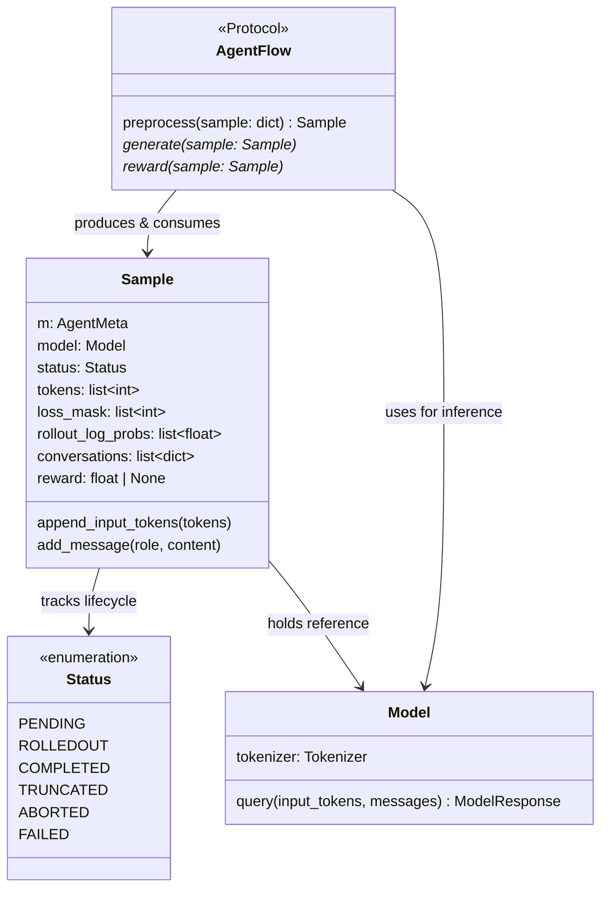
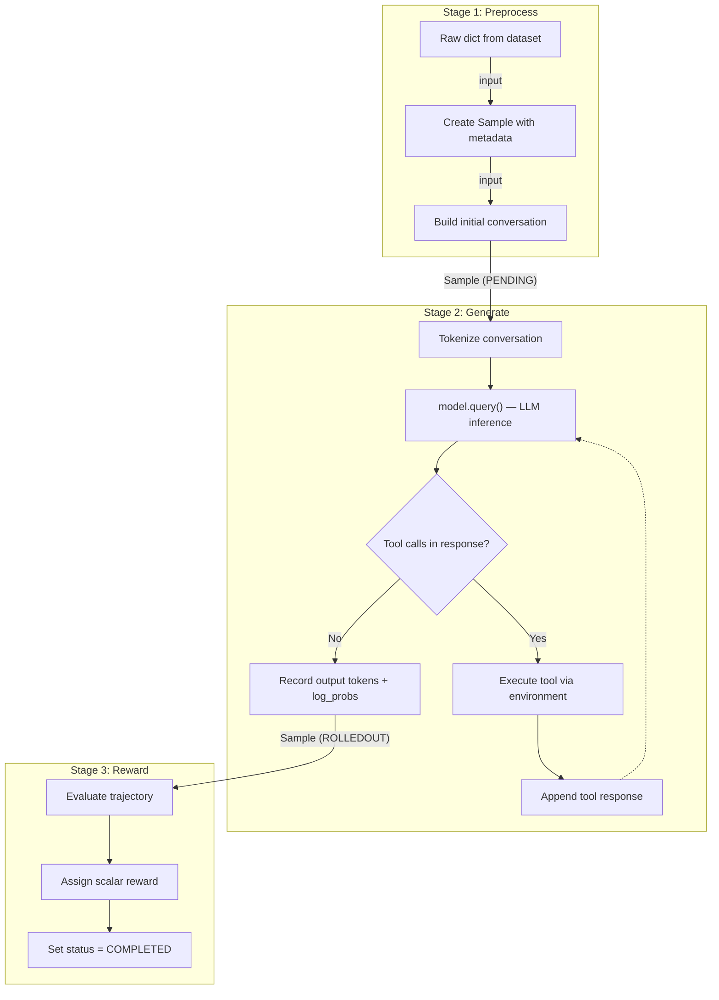

# 添加新 Executor 或 AgentFlow

*实现并注册自定义 AgentFlow 的完整分步教程。*

## 前置条件

-   熟悉 [可插拔 AgentFlow 协议](../concepts/agentflow_protocol.md)
-   了解 [架构概览](../concepts/architecture_overview.md)
-   本地开发环境已搭建（[安装](../get_started/installation.md)）

## AgentFlow 协议



*图 1：AgentFlow Protocol 类图*

每个 AgentFlow 必须实现三个阶段：

``` python
class AgentFlow(Protocol):
    def preprocess(self, sample: dict) -> Sample:
        """将原始数据字典转换为 Sample 对象。"""
        ...

    async def generate(self, sample: Sample):
        """运行模型推理（及可选的环境交互）。"""
        ...

    async def reward(self, sample: Sample):
        """为完成的轨迹计算奖励。"""
        ...
```

`Sample` 是一个泛型 dataclass，包含以下字段：

| 字段                  | 类型              | 说明                                                          |         |
| ------------------- | --------------- | ----------------------------------------------------------- | ------- |
| `m`                 | `AgentMeta`（泛型） | 由你的 flow 定义的任务特定元数据                                         |         |
| `model`             | `Model`         | 语言模型的引用                                                     |         |
| `status`            | `Sample.Status` | PENDING → ROLLEDOUT → COMPLETED（或 TRUNCATED/ABORTED/FAILED） |         |
| `tokens`            | `list[int]`     | 完整 token 序列（prompt + response）                              |         |
| `loss_mask`         | `list[int]`     | 1=参与训练的模型 token，0=环境/prompt token                           |         |
| `rollout_log_probs` | `list[float]`   | rollout 策略的 log-probability                                 |         |
| `conversations`     | `list[dict]`    | 完整对话历史（OpenAI 格式）                                           |         |
| `reward`            | `float          | None`                                                       | 轨迹的标量奖励 |

!!! note "list 而非 Tensor"
    AgentFlow 的 `Sample` 字段使用 Python `list` 类型，而非 PyTorch `Tensor`。这与 NaiveFlow 的 `Sample`（在 `data_coordinator/sample.py` 中）使用 `np.ndarray` 不同。

## 三阶段流程



*图 2：三阶段 AgentFlow 流水线*

## 第一步：创建 Flow 模块

在 `siirl/execution/rollout/agentflow/` 中创建新文件：

``` python
# siirl/execution/rollout/agentflow/my_task_flow.py

from dataclasses import dataclass
from siirl.execution.rollout.agentflow.base import AgentFlow, Sample, Model, ModelResponse


@dataclass
class MyTaskMeta:
    """每个样本的任务特定元数据。"""
    reference_answer: str = ""
    task_type: str = ""


class MyTaskFlow:
    """
    自定义 AgentFlow，用于 [描述你的任务类型]。

    实现三阶段 AgentFlow 协议：
    preprocess → generate → reward
    """

    def __init__(self, config: dict, model: Model):
        self.config = config
        self.model = model

    def preprocess(self, data: dict) -> Sample[MyTaskMeta]:
        """
        将原始数据集项转换为 Sample 对象。

        Args:
            data: 来自数据集加载器的字典。
                  期望的键：'prompt'、'reference' 等。

        Returns:
            准备好进行生成的 Sample 对象。
        """
        meta = MyTaskMeta(
            reference_answer=data.get("reference", ""),
            task_type=data.get("type", ""),
        )
        sample = Sample(
            m=meta,
            model=self.model,
            conversations=[{"role": "user", "content": data['prompt']}],
        )
        return sample

    async def generate(self, sample: Sample[MyTaskMeta]):
        """
        运行推理循环。

        单轮：一次 model.query() 调用。
        多轮：包含环境交互的循环。
        """
        # 从对话构建输入 token
        input_tokens = self.model.tokenizer.apply_chat_template(
            sample.conversations, add_generation_prompt=True, tokenize=True
        )
        sample.append_input_tokens(input_tokens)

        # 生成响应
        response: ModelResponse = await self.model.query(
            input_tokens=input_tokens,
            messages=sample.conversations,
        )

        # 记录输出（自动更新 tokens、loss_mask、rollout_log_probs）
        sample.add_message("assistant", response)
        sample.status = Sample.Status.ROLLEDOUT

    async def reward(self, sample: Sample[MyTaskMeta]):
        """
        为每条轨迹计算奖励。
        """
        # 示例：与参考答案比较
        assistant_response = sample.conversations[-1]["content"]
        sample.reward = self._evaluate(assistant_response, sample.m.reference_answer)
        sample.status = Sample.Status.COMPLETED

    def _evaluate(self, response: str, reference: str) -> float:
        """自定义评估逻辑。"""
        return 1.0 if reference.lower() in response.lower() else 0.0
```

## 第二步：注册 Flow

### 方式 A：配置引用（推荐）

在训练配置中直接引用 flow：

``` yaml
rollout:
  agentflow:
    name: "siirl.execution.rollout.agentflow.my_task_flow:MyTaskFlow"
```

`load_agentflow()` 函数会动态导入并使用 `(config, model)` 实例化该类。

### 方式 B：添加到内置注册表

在 `siirl/execution/rollout/agentflow/__init__.py` 中添加条目：

``` python
BUILTIN_FLOW = {
    "swe": ".swe:agentflow",
    "my_task": ".my_task_flow:MyTaskFlow",  # 添加这一行
}
```

然后通过别名引用：

``` yaml
rollout:
  agentflow:
    name: "my_task"
```

## 第三步：自定义函数注入

AgentFlow 系统支持动态函数注入。无需继承，你可以通过配置覆盖单个阶段：

``` yaml
rollout:
  agentflow:
    name: "swe"                                              # 使用内置 SWE flow
    preprocess_fn: "my_project.preprocess:custom_preprocess"  # 覆盖 preprocess
    reward_fn: "my_project.rewards:custom_reward"             # 覆盖 reward
    generate_fn: "my_project.generate:custom_generate"        # 覆盖 generate（可选）
    python_path: ["/root/my_project"]                         # 额外导入路径
```

注入的函数通过 `MethodType` 绑定到 flow 实例，因此 `self` 引用的是 AgentFlow 实例：

``` python
# my_project/rewards.py
async def custom_reward(self, sample):
    """
    'self' 是 AgentFlow 实例。
    可访问 self.config、self.model 等。
    """
    assistant_response = sample.conversations[-1]["content"]
    sample.reward = my_scoring_function(assistant_response)
    sample.status = sample.Status.COMPLETED
```

## 第四步：实现多轮 Flow

对于需要环境交互的任务，实现 generate 循环：

``` python
async def generate(self, sample: Sample[MyTaskMeta]):
    max_turns = self.config.get('max_turns', 5)

    for turn in range(max_turns):
        # 1. 构建输入 token
        input_tokens = self.model.tokenizer.apply_chat_template(
            sample.conversations, add_generation_prompt=True, tokenize=True
        )
        if turn == 0:
            sample.append_input_tokens(input_tokens)

        # 2. 生成模型响应
        response = await self.model.query(
            input_tokens=input_tokens,
            messages=sample.conversations,
        )
        sample.add_message("assistant", response)

        # 3. 检查响应中的工具调用
        tool_calls = parse_tool_calls(response.output)
        if not tool_calls:
            break

        # 4. 通过环境执行工具调用
        env_response = await self.environment.step(tool_calls[0])

        # 5. 追加环境响应（通过 add_message 从 loss 中屏蔽）
        sample.add_message("tool", env_response.text)

    sample.status = Sample.Status.ROLLEDOUT
```

## 第五步：编写测试

创建测试文件：

``` python
# tests/rollout/test_my_task_flow.py
import pytest
from siirl.execution.rollout.agentflow.base import DummyModel, Sample
from siirl.execution.rollout.agentflow.my_task_flow import MyTaskFlow

class TestMyTaskFlow:
    def test_preprocess(self):
        model = DummyModel()
        flow = MyTaskFlow(config={}, model=model)
        data = {"prompt": "Hello", "reference": "world"}
        sample = flow.preprocess(data)
        assert sample.conversations[0]["content"] == "Hello"
        assert sample.m.reference_answer == "world"

    @pytest.mark.asyncio
    async def test_generate(self):
        model = DummyModel(responses=["Hello world!"])
        flow = MyTaskFlow(config={}, model=model)
        sample = flow.preprocess({"prompt": "Hello", "reference": "world"})
        await flow.generate(sample)
        assert sample.status == Sample.Status.ROLLEDOUT

    @pytest.mark.asyncio
    async def test_reward(self):
        model = DummyModel(responses=["Hello world!"])
        flow = MyTaskFlow(config={}, model=model)
        sample = flow.preprocess({"prompt": "Hello", "reference": "world"})
        await flow.generate(sample)
        await flow.reward(sample)
        assert sample.reward is not None
        assert sample.status == Sample.Status.COMPLETED
```

运行：

``` bash
pytest tests/rollout/test_my_task_flow.py -v
```

## 完成 Checklist

-   [ ] Flow 类在 `__init__` 中接受 `(config: dict, model: Model)`
-   [ ] `preprocess` 返回正确初始化的带元数据的 `Sample`
-   [ ] `generate` 填充了 `tokens`、`rollout_log_probs` 和 `loss_mask`（通过 `add_message`）
-   [ ] `reward` 赋值了标量 `reward` 并设置 `status = COMPLETED`
-   [ ] Flow 已注册（配置路径或内置注册表）
-   [ ] 单元测试覆盖了三个阶段
-   [ ] 如果添加了内置 flow，文档已更新

## 下一步

- [AgentFlow 协议](../concepts/agentflow_protocol.md) — 深入理解你刚实现的三方法契约的设计原理
- [代码结构](code_structure.md) — 探索完整代码库，了解新 flow 在整个系统中的位置
- [贡献指南](contributing.md) — 提交新 flow 前，回顾 PR 检查清单和代码风格要求
