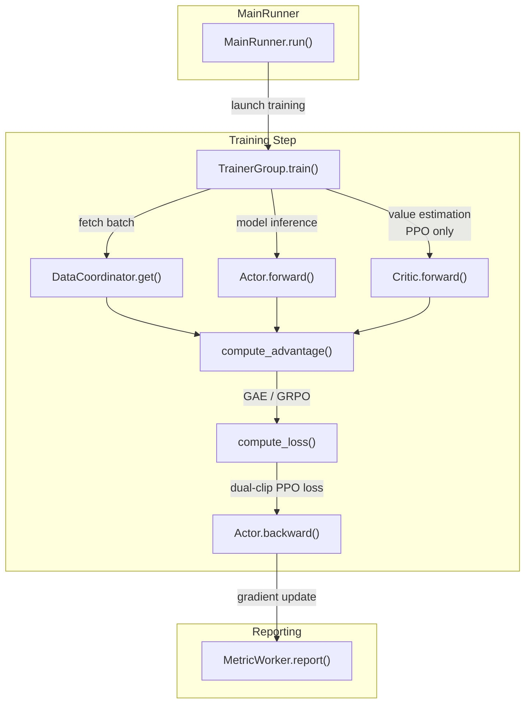
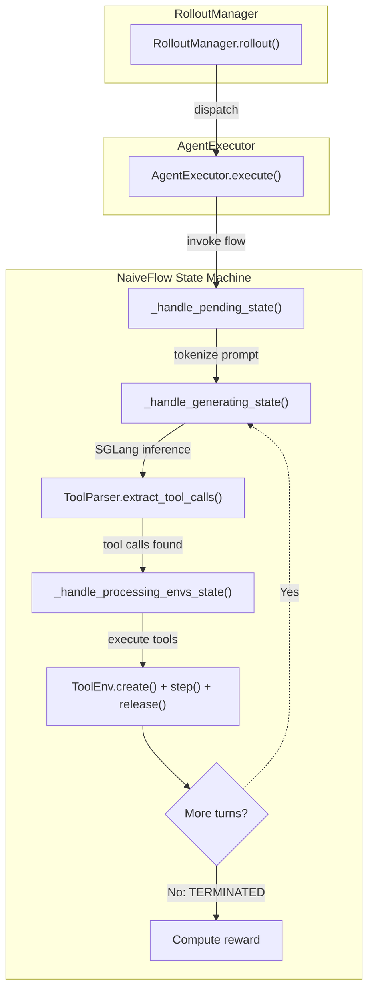
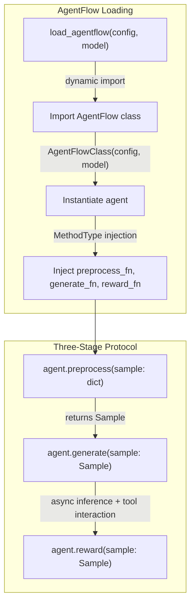
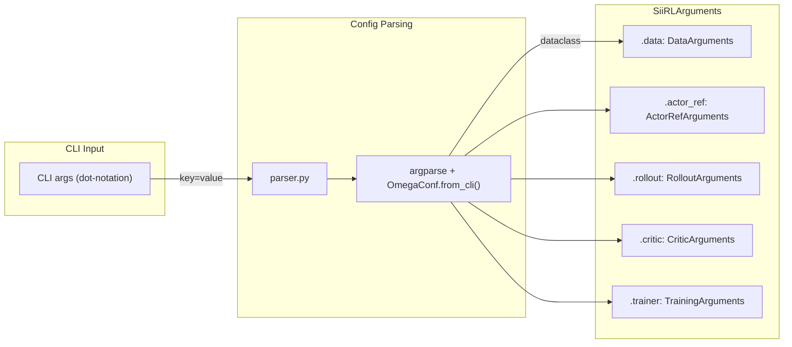
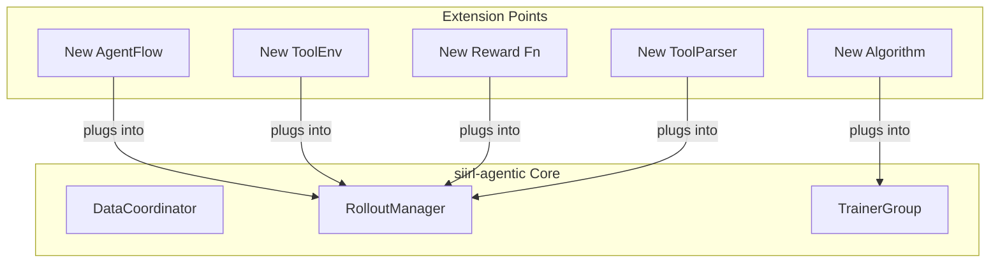

# 代码结构

*代码组织方式、调用链路与扩展点的开发者向导。*

## 入口点

一切从 `siirl/async_train.py` 开始：

``` python
# MainRunner 是一个 Ray Actor，负责编排整个训练生命周期
@ray.remote
class MainRunner:
    def run(self):
        # 阶段 1：解析 CLI 配置（argparse + OmegaConf.from_cli()）→ SiiRLArguments
        # 阶段 2：分配 GPU 资源（actor_gpus, rollout_gpus, critic_gpus）
        # 阶段 3：初始化 DataCoordinator（数据加载 + 异步缓冲）
        # 阶段 4：初始化组件（TrainerGroup, RolloutManager, MetricWorker）
        # 阶段 5：启动异步训练循环
        # 阶段 6：等待完成
        # 阶段 7：通过 TaskCoordinator 检查状态
        # 阶段 8：清理
```

## 训练步调用链



*图 1：训练步调用链*

## Rollout 步调用链（NaiveFlow）



*图 2：NaiveFlow rollout 调用链*

## Rollout 步调用链（AgentFlow）



*图 3：AgentFlow rollout 路径*

## 配置流转



*图 4：配置流转*

## 关键扩展点



*图 5：扩展点*

### 1. 新增 AgentFlow

创建新的 flow 模块并注册：

``` python
# siirl/execution/rollout/agentflow/my_flow.py
from .base import AgentFlow, Sample, Model

class MyFlow:
    """实现 AgentFlow 协议。"""

    def __init__(self, config: dict, model: Model):
        self.config = config
        self.model = model

    def preprocess(self, sample: dict) -> Sample:
        ...

    async def generate(self, sample: Sample):
        ...

    async def reward(self, sample: Sample):
        ...
```

在配置中引用：

``` yaml
rollout:
  agentflow:
    name: "siirl.execution.rollout.agentflow.my_flow:MyFlow"
```

### 2. 新增工具环境

继承 `ToolEnv`：

``` python
# siirl/environment/tool_env/my_tool.py
from siirl.environment.tool_env.base_tool_env import ToolEnv
from siirl.environment.base import EnvResponse
from siirl.environment.tool_env.utils.schemas import OpenAIFunctionToolSchema

class MyTool(ToolEnv):
    def __init__(self, config, tool_schema: OpenAIFunctionToolSchema):
        super().__init__(config, tool_schema)

    async def create(self, create_kwargs=None, **kwargs):
        instance_id = "instance-1"
        return instance_id, EnvResponse()

    async def step(self, action: dict) -> EnvResponse:
        ...

    async def release(self, instance_id: str):
        ...
```

通过工具配置 YAML 注册，并通过 `rollout.multiturn.env_path` 引用。

### 3. 新增奖励函数

创建奖励函数并通过配置注入：

``` python
# my_rewards.py
def custom_reward(data_source, solution_str, ground_truth):
    """匹配 NaiveFlow 的 reward_fn 期望的签名。"""
    return compute_reward(solution_str, ground_truth)
```

### 4. 新增算法

扩展算法模块：

-   在 `siirl/algorithm/advantage.py` 中添加优势估计
-   在 `siirl/algorithm/loss.py` 中添加 loss 函数
-   在 worker 中接入训练循环

### 5. 新增 ToolParser

使用 `ToolParser.register()` 装饰器：

``` python
from siirl.environment.tool_env.utils.tool_parser import ToolParser, FunctionCall

@ToolParser.register("my_format")
class MyToolParser(ToolParser):
    async def extract_tool_calls(self, responses_ids: list[int]) -> tuple[str, list[FunctionCall]]:
        text = await loop.run_in_executor(None, self.tokenizer.decode, responses_ids)
        # 解析并返回...
        return content, function_calls
```

## 测试结构

    tests/
    ├── actor/           # Actor/训练 worker 测试
    ├── data_buffer/     # DataCoordinator 测试
    ├── rollout/         # Rollout 和 NaiveFlow 测试
    └── test_utils/      # 共享测试工具

运行测试：

``` bash
pytest tests/                      # 所有测试
pytest tests/data_buffer/ -v       # DataCoordinator 测试
pytest tests/rollout/ -v           # Rollout 测试
pytest -m gpu                      # 依赖 GPU 的测试
```

!!! note "需要 GPU"
    大多数测试是端到端 GPU 测试，需要启动完整训练运行并要求多个 GPU。不依赖 GPU 的单元测试数量有限。

## 下一步

- [添加新 Executor 或 AgentFlow](adding_new_executor_or_flow.md) — 利用对代码结构的理解，实现并注册一个自定义 flow
- [贡献指南](contributing.md) — 在提交变更前，了解 PR 流程、代码风格要求和测试规范
