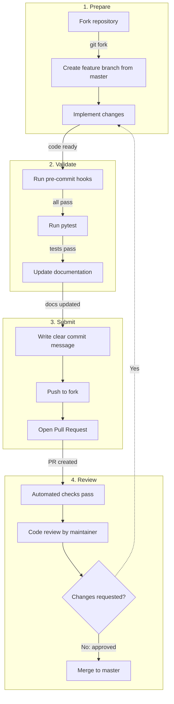

# 贡献指南

*开发环境搭建、代码风格、测试和 PR 流程的完整指南。*

## 快速开始

``` bash
# 1. 克隆并初始化
git clone https://github.com/sii-research/siirl-agentic.git
cd siirl-agentic

# 2. 创建虚拟环境
python -m venv venv
source venv/bin/activate

# 3. 开发模式安装
pip install -e ".[dev]"

# 4. 安装 pre-commit hooks
pre-commit install
```

## 代码风格

我们通过 pre-commit hooks 强制执行统一的代码风格：

| 工具            | 用途        | 配置                     |
| ------------- | --------- | ---------------------- |
| **Black**     | 代码格式化     | `line-length = 140`    |
| **isort**     | import 排序 | `profile = "black"`    |
| **Ruff**      | 代码检查      | 见 `pyproject.toml`     |
| **codespell** | 拼写检查      | 在 `pyproject.toml` 中配置 |

所有配置均在 `pyproject.toml` 中。Pre-commit 在 `git commit` 时自动运行。

!!! note "mypy"
    mypy 在 `pyproject.toml`（`[tool.mypy]`）中已配置，但**未包含在 dev 依赖中**。如需使用请单独安装：`pip install mypy`。

手动运行：

``` bash
pre-commit run --all-files
```

## 运行测试

``` bash
# 所有测试
pytest

# 指定测试目录
pytest tests/data_buffer/ -v
pytest tests/rollout/ -v
pytest tests/actor/ -v

# 生成覆盖率报告
pytest --cov=siirl --cov-report=html

# 依赖 GPU 的测试
pytest -m gpu

# 指定文件
pytest tests/data_buffer/test_data_buffer.py -v
```

### 测试标记

| 标记                         | 说明         |
| -------------------------- | ---------- |
| `@pytest.mark.unit`        | 快速、隔离的单元测试 |
| `@pytest.mark.integration` | 多组件测试      |
| `@pytest.mark.slow`        | 长耗时测试      |
| `@pytest.mark.gpu`         | 需要 GPU 硬件  |

!!! warning "GPU 测试"
    大多数测试是端到端 GPU 测试，需要启动完整训练运行并要求多个 GPU。不依赖 GPU 的单元测试数量有限。

## PR 流程



*图 1：Pull Request 工作流*

1.  **Fork** 仓库，从 `master`（默认分支）创建分支

2.  为你的修改**编写测试**

3.  如果添加了新功能，**更新文档**

4.  **确保所有检查通过：**

    ``` bash
    pre-commit run --all-files
    pytest
    ```

5.  **编写清晰的 commit 信息：**

        Add async multi-turn agent support (#123)

        - Implement async agent executor
        - Add test cases for multi-turn scenarios
        - Update documentation

6.  **提交 PR**，附上详细说明

## 可以贡献什么

### Bug 报告

-   在 GitHub Issues 中提交，附上最小可复现示例
-   包含：Python 版本、PyTorch 版本、CUDA 版本、Ray 版本
-   附上相关日志片段

### 新功能

-   **新 AgentFlow：** 参见 [添加新 Executor 或 Flow](adding_new_executor_or_flow.md)
-   **新工具环境：** 在 `siirl/environment/tool_env/` 中继承 `ToolEnv`
-   **新奖励函数：** 在 `siirl/utils/reward_score/` 中创建或通过配置注入
-   **新 ToolParser：** 使用 `@ToolParser.register("name")` 装饰器
-   **算法改进：** 扩展 `siirl/algorithm/`

### 文档

-   修复错别字、改进示例、补充缺失内容

-   本地构建验证：

    ``` bash
    cd docs && bash build.sh en
    ```

## 代码审查 Checklist

审查者将检查：

-   [ ] 代码遵循项目风格（Black、isort、Ruff）
-   [ ] 测试覆盖了新功能
-   [ ] 没有性能回退
-   [ ] 文档已更新
-   [ ] 公共 API 添加了类型注解
-   [ ] Docstring 遵循 Google 风格

## 项目结构

代码库的详细介绍请参见：

-   [代码结构](code_structure.md) — 开发者向代码库导览
-   [模块地图](../reference/module_map.md) — 目录参考

## License

提交贡献即表示你同意你的贡献将以 Apache License 2.0 授权。

## 有疑问？

-   在 GitHub 上开一个 issue
-   查看现有文档：[文档首页](../overview.md)

## 下一步

- [代码结构](code_structure.md) — 在写下第一行贡献代码之前，先完成开发者向代码库导览
- [添加新 Executor 或 AgentFlow](adding_new_executor_or_flow.md) — 跟随教程，向框架贡献一个新的 AgentFlow
