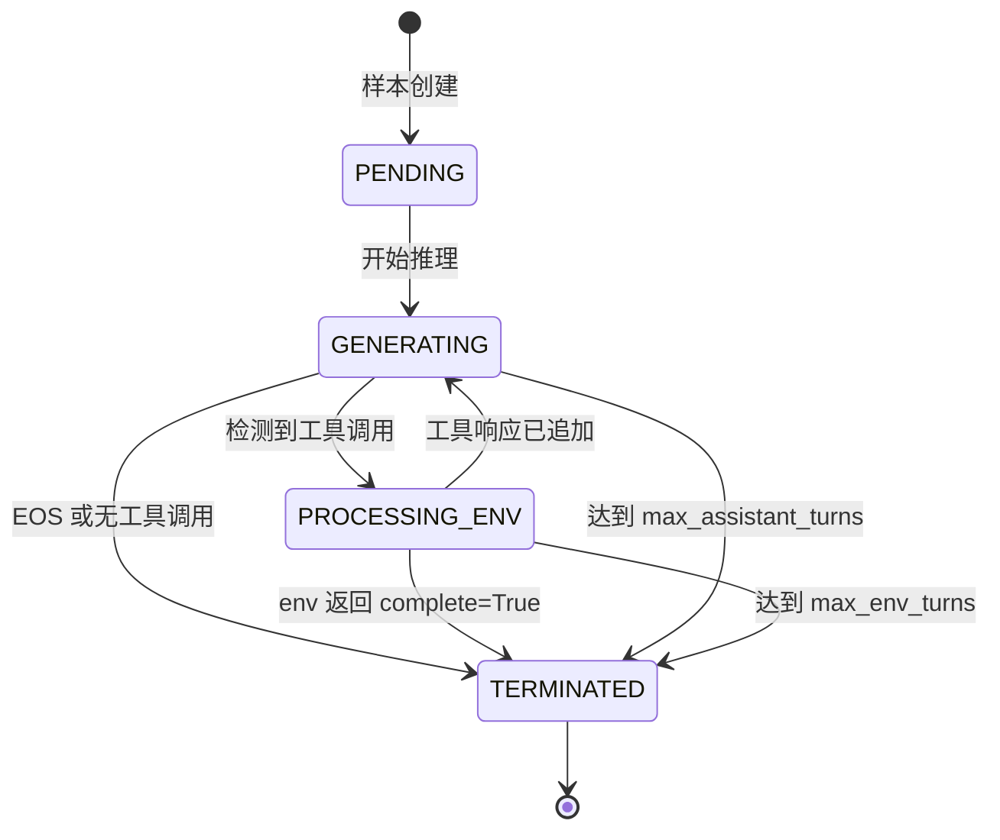
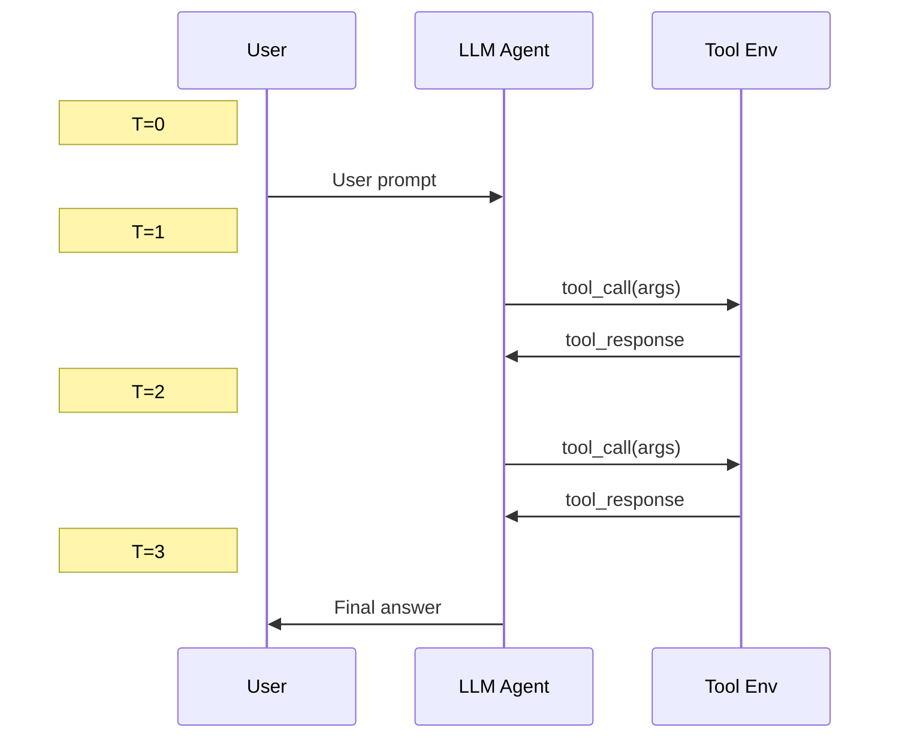

# Agentic 多轮训练

*多轮配置详解、工具环境设置、状态机行为原理与 loss masking 说明。*

## 概述

!!! tip "核心要点"
    最重要的参数是 `data.max_response_length`。对于多轮训练，这个值必须覆盖**所有** assistant 轮次加上所有工具响应轮次的总 token 预算。常见错误是保留默认值（512 token），导致 agentic 轨迹在第一次工具调用后就被截断。对于 5 轮交互，从 `max_response_length=4096` 开始；SWE 任务建议使用 8192 或更高。

多轮 agentic 训练是 siirl-agentic 的核心差异化特性。Rollout 引擎执行一个状态机：模型生成文本、调用工具、接收环境反馈，再继续生成——全部在单个训练步内完成。

## 核心组件

### NaiveFlow 状态机 { #naiveflow-state-machine }

`NaiveFlow` 类（`siirl/execution/rollout/agent_flow/naive_flow.py`）实现多轮 rollout：



*图 1: NaiveFlow 状态机（完整版）*

NaiveFlow 主循环实际使用的状态为 `PENDING`、`GENERATING`、`PROCESSING_ENV` 和 `TERMINATED`。`BEFORE_PROCESSING_ENV` 和 `ABORTED` 状态已在 `AgentState` 中定义，预留供未来扩展。

!!! note "NaiveFlow 与 AgentFlow"
    NaiveFlow 和 AgentFlow 是**两个独立的 rollout 系统**。NaiveFlow 是用于生产环境多轮工具交互的具体状态机。AgentFlow（位于 `siirl/execution/rollout/agentflow/`）是一个可插拔的 Protocol，用于定义自定义任务流水线。两者之间不是继承关系。

!!! note "仅支持 tool_env"
    NaiveFlow 目前仅支持 `env_type: tool_env`。其他环境类型将抛出 `NotImplementedError`。

### AgentData（`siirl/execution/rollout/utils.py`）

每个 rollout 样本的内部状态跟踪：

``` python
class AgentData:
    def __init__(self, raw_prompt: list[dict[str, Any]]):
        self.messages = raw_prompt           # OpenAI 格式的对话历史
        self.prompts_ids = []                # 当前完整序列（prompt + 所有轮次）
        self.response_ids = []               # 当前轮次响应 token
        self.response_mask = []              # 1=模型 token，0=环境 token
        self.rollout_log_prob = []           # 所有响应 token 的 log-prob
        self.env_calls: list[FunctionCall] = []  # 待处理的工具调用
        self.env_rewards = []                # 每轮环境奖励
        self.env_turns = 0                   # 当前环境交互轮数
        self.assistant_turns = 0             # 当前 assistant 生成轮数
        self.state = AgentState.PENDING      # 当前状态机状态
        self.env_kwargs = {}                 # 传递给 tool env 的额外参数

class AgentState(Enum):
    PENDING = "pending"
    GENERATING = "generating"
    PROCESSING_ENV = "processing_envs"
    TERMINATED = "terminated"
    BEFORE_PROCESSING_ENV = "before_processing_envs"  # 预留供未来使用
    ABORTED = "aborted"                                # 预留供未来使用
```

!!! note "AgentState"
    `BEFORE_PROCESSING_ENV` 和 `ABORTED` 已在枚举中定义，但**未被 NaiveFlow 主循环使用**，主循环仅处理 `PENDING`、`GENERATING`、`PROCESSING_ENV` 和 `TERMINATED`。它们存在是为了未来可能的扩展。

## 配置说明

### 完整多轮配置

``` yaml
rollout:
  flow_function: naive               # 使用 NaiveFlow
  max_model_len: 8192                # 最大总上下文长度

  multiturn:
    env_type: tool_env               # 环境类型（目前仅支持 tool_env）
    max_env_turns: 5                 # 最大工具交互轮数（默认值：1）
    max_assistant_turns: 10          # 最大模型生成轮数（默认值：1）
    max_parallel_calls: 4            # 并发工具调用数（默认值：1）
    max_env_response_length: 256     # 最大环境响应字符数（注意：是字符，不是 token）
    env_response_truncate_side: middle  # left/middle/right
    env_path: /path/to/env_config.yaml
    env_kwargs:
      tool_format: hermes            # 工具调用格式：hermes, gpt-oss

data:
  max_response_length: 4096          # 最大总响应 token 数
  mask_history: false                # 是否只在最后一轮计算 loss
```

### 参数说明

| 参数                           | 影响                | 推荐值                    |
| ---------------------------- | ----------------- | ---------------------- |
| `max_env_turns`              | 工具交互深度            | SWE 任务 3-10，搜索任务 1-3   |
| `max_assistant_turns`        | 总模型生成轮数           | 设为 max_env_turns 的 2 倍 |
| `max_parallel_calls`         | 并发工具执行数           | 1-4（越高工具吞吐越大）          |
| `max_env_response_length`    | 工具响应截断阈值（**字符数**） | 根据工具类型设置 256-1024      |
| `env_response_truncate_side` | 截断位置              | "middle" 保留首尾信息        |
| `max_response_length`        | 总 token 预算        | 所有轮次 token 之和          |

!!! warning "基于字符的截断"
    `max_env_response_length` 以**字符**（Python `len(str)`）为单位，而非 token。当环境响应超过此长度时，会被截断并插入 `"...(truncated)"` 标记。对于 "middle" 截断：保留前 `length//2` 个和后 `length//2` 个字符。

## 多轮交互序列



*图 2: 多轮交互序列*

## 工具调用格式

siirl-agentic 通过 `ToolParser`（`siirl/environment/tool_env/utils/tool_parser.py`）支持多种工具调用格式：

### Hermes 格式（默认）

``` xml
<tool_call>
{"name": "search", "arguments": {"query_list": ["Tokyo population"]}}
</tool_call>
```

### GPT-OSS 格式

使用自定义 token 格式，包含 `<|start|>`、`<|channel|>`、`<|constrain|>`、`<|call|>` 等特殊 token。包括思维链过滤功能，避免在 `analysis` 块内产生误报工具调用。

通过 `env_kwargs.tool_format` 配置：

``` yaml
rollout:
  multiturn:
    env_kwargs:
      tool_format: hermes    # 或 "gpt-oss"
```

### ToolParser 注册表

`ToolParser` 使用类级别的注册表模式。要添加新格式：

``` python
from siirl.environment.tool_env.utils.tool_parser import ToolParser, FunctionCall

@ToolParser.register("my_format")
class MyToolParser(ToolParser):
    async def extract_tool_calls(self, responses_ids: list[int]) -> tuple[str, list[FunctionCall]]:
        text = await loop.run_in_executor(None, self.tokenizer.decode, responses_ids)
        # 从文本中解析工具调用...
        return content, function_calls
```

## 轨迹数据结构

每个完成的 rollout 产生一个 `Sample` 对象（`siirl/data_coordinator/sample.py`），携带完整轨迹传递给 Trainer。多轮训练的关键字段：

```
Sample 字段：
  prompts:          [p0, p1, p2, ..., pP]                  ← prompt tokens（固定）
  responses:        [a0, a1, a2, t0, t1, a3, a4, t2, a5]   ← 所有响应 token（模型+环境交替）
  response_mask:    [1,  1,  1,  0,  0,  1,  1,  0,  1 ]   ← 1=模型 token，0=环境 token
  rollout_log_prob: [lp0,lp1,lp2,  0,  0,lp3,lp4,  0,lp5]  ← log-prob（环境 token 为 0）
  rewards:          0.85                                     ← 标量（由奖励函数设置）
```

其中：
- `a0, a1, a2` = 第一轮 assistant token
- `t0, t1` = 第一次工具响应 token（环境输出）
- `a3, a4` = 第二轮 assistant token
- `t2` = 第二次工具响应 token
- `a5` = 最后一轮 assistant token

`response_mask` 精确区分了模型产出的内容和环境返回的内容。只有 `response_mask=1` 的 token 才参与策略梯度 loss。

**Token 预算计算：** `responses` 的总长度是所有 assistant 轮次和工具响应轮次 token 数的总和。你必须将 `data.max_response_length` 设置为能容纳完整多轮序列的值，而不仅仅是单个 assistant 响应。对于 5 轮交互，每轮平均 200 个 assistant token 和 100 个工具响应 token，至少需要设置为 `5 × (200 + 100) = 1500` token。

## Loss Masking

多轮训练的关键是**正确的 loss masking**：

    Token 序列:   [prompt] [assistant-1] [tool-response] [assistant-2] [tool-response] [assistant-3]
    response_mask: 0 0 0    1 1 1 1 1     0 0 0 0 0       1 1 1 1       0 0 0 0 0       1 1 1 1

-   **模型 token**（assistant 轮次）：`response_mask = 1` → 参与策略梯度计算
-   **环境 token**（工具响应）：`response_mask = 0` → 从 loss 中屏蔽
-   **Prompt token**：不在响应中 → 不参与 loss

这确保模型只从自身决策中学习，而非从环境输出中学习。

## 终止条件

满足以下**任意一个**条件时，rollout 终止：

1.  `len(response_mask) >= max_response_length`（总 token 预算耗尽）
2.  `assistant_turns >= max_assistant_turns`
3.  `env_turns >= max_env_turns`
4.  模型输出中未检测到工具调用（单轮完成）
5.  环境在任意 `EnvResponse` 中返回 `complete=True`

## 工具执行流程

当 NaiveFlow 检测到模型输出中包含工具调用时：

1.  `ToolParser.extract_tool_calls()` 将响应 token 解析为 `FunctionCall` 对象
2.  最多 `max_parallel_calls` 个工具调用通过 `asyncio.gather()` 并发执行
3.  对于每个工具调用，`NaiveFlow._step()` 执行以下操作：
    - 通过 `EnvManager.env_name` 按名称查找工具
    - 调用 `tool.create(create_kwargs=...)` 创建工具实例
    - 调用 `tool.step(action)` 执行动作 → 返回 `EnvResponse`
    - 调用 `tool.release(instance_id)` 进行清理
    - 如果响应文本超过 `max_env_response_length` 字符则截断
4.  工具响应被 tokenize 并追加到序列中，`response_mask=0`
5.  如果任意 `EnvResponse.complete == True`，rollout 终止

## 自定义工具环境

实现 `ToolEnv` 接口：

``` python
from siirl.environment.tool_env.base_tool_env import ToolEnv
from siirl.environment.base import EnvResponse
from siirl.environment.tool_env.utils.schemas import OpenAIFunctionToolSchema

class MyCustomTool(ToolEnv):
    def __init__(self, config, tool_schema: OpenAIFunctionToolSchema):
        super().__init__(config, tool_schema)

    async def create(self, create_kwargs=None, **kwargs):
        """创建工具实例。在 step() 之前调用。"""
        instance_id = "my-instance-id"
        return instance_id, EnvResponse()

    async def step(self, action: dict) -> EnvResponse:
        """执行工具动作。`action` 包含 instance_id 和工具参数。"""
        result = await my_tool_logic(action)
        return EnvResponse(
            text=result,
            rewards=0.5,       # 可选的逐步奖励
            complete=False,    # 设为 True 则终止轨迹
        )

    async def release(self, instance_id: str):
        """使用后清理工具实例。"""
        pass
```

!!! note "需要 Tool Schema"
    `ToolEnv.__init__` 需要一个 `OpenAIFunctionToolSchema`，用于描述工具的 API（函数名、参数）。该 schema 通过 `tokenizer.apply_chat_template(tools=...)` 传递给模型，以启用工具调用。

## 训练成功的标志

健康的多轮 agentic 训练应呈现以下模式：

| 指标                             | 预期模式                       | 警告信号                                |
| ------------------------------ | -------------------------- | ----------------------------------- |
| `rollout/env_turns_mean`       | ≥ 1.5 且持续增长                | 接近 0 = agent 未使用工具                  |
| `reward/mean`                  | 随步数呈上升趋势                   | 100 步后仍持平 = 检查奖励函数                  |
| `rollout/response_length_mean` | 稳定，< `max_response_length` | 达到最大值 = 轨迹被截断                       |
| `complete=True` 终止比例           | 训练中逐步提高                    | 始终为 0 = 工具未发送完成信号                   |
| 工具调用解析成功率                      | > 90%                      | 过低 = `tool_format` 不匹配或 prompt 模板错误 |

在前 5–10 个训练步后检查这些指标，可以尽早发现配置问题。

## 常见问题

| 问题                                          | 症状            | 解决方案                    |
| ------------------------------------------- | ------------- | ----------------------- |
| `max_response_length` 小于多轮总 token 数         | 过早截断          | 增大到 4096-8192           |
| SWE 任务中 `max_env_turns=1`                   | 只有一次工具调用      | 增大到 5+                  |
| 缺少 `env_path`                               | 工具环境未加载       | 提供工具配置 YAML 文件路径        |
| `tool_format` 不匹配                           | 工具调用未被解析      | 与模型训练数据的格式保持一致          |
| `max_parallel_calls` 过高                     | 工具服务器过载       | 从 1 开始逐步增大              |
| 混淆字符与 token 的 `max_env_response_length`     | 意外截断          | 记住：单位是**字符**            |
| 独立工具保留 `max_parallel_calls=1`               | Rollout 比必要的慢 | 对独立的搜索/读取工具增大到 4        |
| 代码输出未设置 `env_response_truncate_side=middle` | 测试输出首尾丢失      | `"middle"` 保留首尾字符以保留上下文 |

## 下一步

- [工具环境](tool_env_and_swe.md) — 实现自定义工具环境，了解 SWE agent 集成方式
- [AgentFlow 协议](../concepts/agentflow_protocol.md) — 设计完全自定义的 rollout 流水线，替代 NaiveFlow
- [首个 Agentic 训练任务](../get_started/first_agentic_training_job.md) — 如需回顾，返回端到端配置指南
