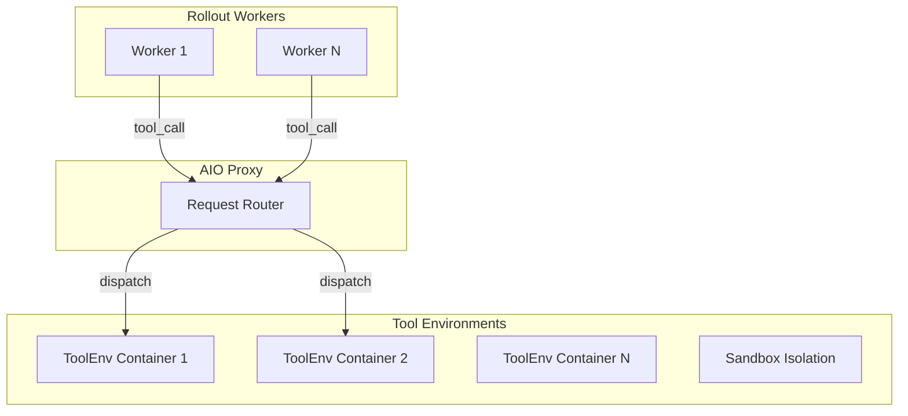
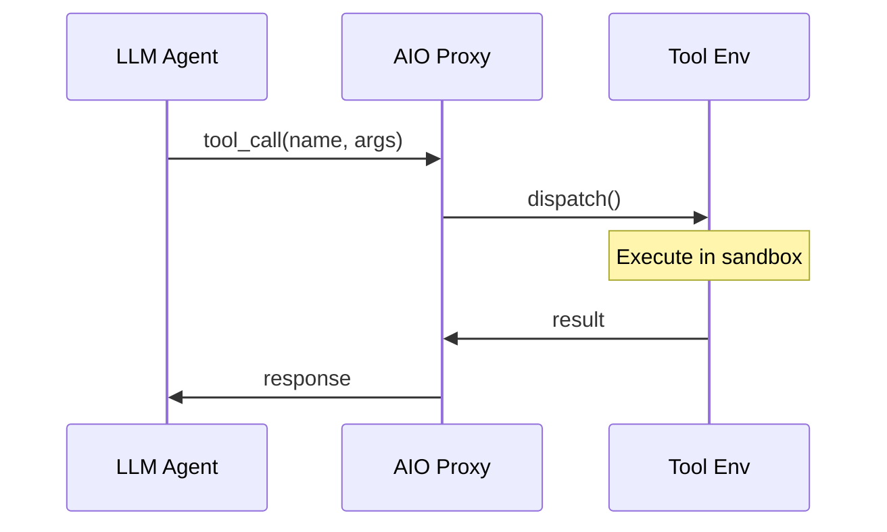

# AIO 工具基础设施

*AIO 三层架构的完整指南，涵盖部署步骤、自动扩缩配置以及与 rollout 流水线的集成。*

## 概述

!!! tip "核心要点"
    AIO Proxy 充当 rollout workers 和工具执行节点之间的负载均衡器。最关键的配置是 `capacity_per_worker`：设置过低会导致工具调用排队，阻塞 rollout；设置过高会导致工具节点 OOM。安全起点：搜索工具 `capacity_per_worker=10`，代码沙箱 `capacity_per_worker=3`。通过 `curl http://proxy-host:8080/status` 监控 `queue_depth`——如果持续大于 0，需要增加更多 WorkerManager。

AIO（Agentic I/O）是一个分布式工具调度基础设施，负责在异构节点上管理外部工具实例。它解决了长期 agentic rollout 中限制吞吐量的**工具瓶颈**问题：当 1000 个并发 rollout 都需要沙箱执行时，简单的单节点工具服务器会级联超时。

架构原理与设计决策详见 [AIO 亮点](../concepts/aio_infrastructure.md)。

## 架构

AIO 使用三层调度器：



*图 1: AIO 三层架构*

## 部署

### 前置要求

从 monorepo 克隆并安装 AIO：

``` bash
# 从 monorepo 根目录（siirl-agentic/ 的父目录）
cd AIO
pip install -e .
```

### 第一步：创建 AIO 配置

创建 `aio_config.yaml`：

``` yaml
proxy:
  host: 0.0.0.0
  port: 8080
tools:
  - name: search
    capacity_per_worker: 10     # 每个 worker 的最大并发调用数
  - name: sandbox_fusion
    capacity_per_worker: 5
auto_scaling:
  enabled: true
  algorithm: holt_winters        # 时间序列需求预测
```

### 第二步：启动 AIO Proxy

``` bash
python -m aio.Scheduler.proxy --config aio_config.yaml
```

Proxy 暴露以下端点：

-   `POST /call` — 提交工具调用请求
-   `GET /status` — 当前资源池状态
-   `GET /health` — 健康检查端点
-   `GET /metrics` — 并发度与延迟指标

### 第三步：启动 WorkerManager

在每个工具节点上运行：

``` bash
python -m aio.Scheduler.Resources.worker_manager \
    --proxy-url http://proxy-host:8080 \
    --config worker_config.yaml
```

WorkerManager 启动时会自动向 Proxy 注册。验证注册状态：

``` bash
curl http://proxy-host:8080/status
```

预期输出：

``` json
{
  "tools": {
    "search": {"workers": 3, "total_capacity": 30, "active_calls": 7},
    "sandbox_fusion": {"workers": 2, "total_capacity": 10, "active_calls": 2}
  }
}
```

## 请求生命周期



*图 2: 端到端请求生命周期*

## 并发容量规划

!!! tip "将 AIO 容量与 rollout batch size 匹配"
    Rollout 引擎每个训练步生成 `train_batch_size × rollout.n` 个请求。AIO 需要足够的容量来处理这一突发量。

框架计算目标并发数的公式为：

```python
target_concurrency = max(1, train_batch_size * rollout.n)
effective_concurrency = min(target_concurrency, resolved_limits["effective"])
```

SGLang 引擎的 `max_num_seqs` 也会相应调整：如果 `rollout.max_num_seqs <= 0`，默认值为 `4 × train_server_concurrency`。`train_server_concurrency` 的默认值为 **256**。

对于 `train_batch_size=256` 和 `rollout.n=8` 的典型运行，目标并发数 = 2048。确保 AIO WorkerManager 的总容量（`workers × capacity_per_worker`）足以处理此负载，避免队列积压。

## 与 siirl-agentic 集成

配置 rollout 使用 AIO：

``` yaml
rollout:
  multiturn:
    env_type: tool_env
    env_kwargs:
      tool_format: hermes
      aio_proxy_url: http://proxy-host:8080

# 或通过环境变量设置
# export AIO_PROXY_URL=http://proxy-host:8080
```

`AIOSearchEnv` 类（`siirl/environment/tool_env/aio_search_env.py`）连接到 Proxy URL 并异步分派工具调用。

## 自动扩缩

AIO 使用 **Holt-Winters 时间序列预测器**进行基于需求的自动扩缩：

### 工作原理

1.  `ConcurrencyMonitor` 每秒采样当前活跃的并发工具调用数
2.  Holt-Winters 指数平滑预测下一时间窗口的需求
3.  当预测需求超过当前容量 × 阈值时，激活更多工具实例
4.  当负载降低时，空闲实例被回收以释放资源

### 配置

``` yaml
auto_scaling:
  enabled: true
  algorithm: holt_winters
  scale_up_threshold: 0.8     # 利用率 > 80% 时扩容
  scale_down_threshold: 0.3   # 利用率 < 30% 时缩容
  min_instances: 1            # 每个 worker 的最小工具实例数
  max_instances: 20           # 每个 worker 的最大工具实例数
  alpha: 0.3                  # Holt-Winters 水平平滑因子
  beta: 0.1                   # Holt-Winters 趋势平滑因子
```

## 异步批量请求提交器

客户端使用批量异步提交器来吸收延迟峰值：

``` yaml
aio:
  client:
    batch_size: 32             # 提交前批量收集的工具调用数
    batch_timeout_ms: 10       # 填充批次的最大等待时间
    max_retries: 3             # 失败调用的重试次数
```

这通过缓冲并批量提交请求来防止 rollout 在单个慢速工具调用上阻塞，同时保持每个样本的延迟在可控范围内。

## 监控

### 实时状态

``` bash
# 当前资源池状态
curl http://proxy-host:8080/status

# 详细指标
curl http://proxy-host:8080/metrics
```

需要关注的关键指标：

| 指标               | 说明                |
| ---------------- | ----------------- |
| `active_calls`   | 当前并发工具调用数         |
| `queue_depth`    | 等待容量的排队调用数        |
| `p50_latency_ms` | 工具调用中位延迟          |
| `p99_latency_ms` | 尾部延迟（关注 AIO 扩容触发） |
| `scale_events`   | 自动扩缩事件数           |

### 日志

启用详细 AIO 日志：

``` bash
LOGURU_LEVEL=DEBUG python -m aio.Scheduler.proxy --config aio_config.yaml
```

查看 `ConcurrencyMonitor` 日志行了解需求预测和扩缩决策。

## 多节点部署

用于大规模训练和大量工具 worker 的部署：

``` bash
# 节点 1：AIO Proxy（专用协调器）
python -m aio.Scheduler.proxy --config aio_config.yaml

# 节点 2-N：WorkerManager（工具执行节点）
# 在每个节点上运行：
python -m aio.Scheduler.Resources.worker_manager \
    --proxy-url http://node1:8080
```

容量规划：

-   **搜索工具：** 每个 worker 10-20 个并发调用，1 CPU + 低内存
-   **代码沙箱：** 每个 worker 3-5 个并发调用，2+ CPU + 每个 4GB RAM
-   **扩缩规则：** 目标平均利用率 70%；自动扩缩处理峰值

## 常见问题

| 症状                                      | 原因                | 解决方案                               |
| --------------------------------------- | ----------------- | ---------------------------------- |
| `Error getting server from master node` | Proxy 未运行         | 启动 `python -m aio.Scheduler.proxy` |
| 工具调用超时                                  | 容量耗尽              | 增加 WorkerManager 或增大容量             |
| 工具未注册                                   | WorkerManager 未启动 | 在每个工具节点上启动 WorkerManager           |
| 未触发扩缩                                   | 阈值过高              | 降低 `scale_up_threshold`            |
| 工具节点 OOM                                | 并发沙箱过多            | 减小 `capacity_per_worker`           |

## 下一步

- [AIO 基础设施（概念）](../concepts/aio_infrastructure.md) — 深入理解三层调度系统的架构设计与设计动机
- [部署模式](deployment_modes.md) — 选择与 AIO 工具基础设施匹配的 GPU 拓扑
- [性能调优](performance_tuning.md) — 诊断工具延迟瓶颈，调优 AIO 容量以最大化吞吐量
