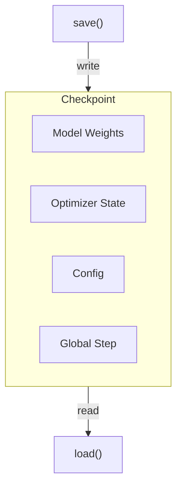
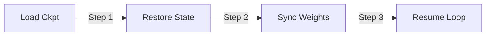

# 检查点与恢复

*配置检查点保存、选择恢复模式，并导出 HuggingFace 兼容格式的模型。*

## 检查点生命周期

!!! tip "核心要点"
    在启动任何长时间运行前，最重要的两个设置是 `trainer.save_freq`（默认为 `-1`，即**禁用**）和 `trainer.max_actor_ckpt_to_keep`（默认为 `100`，对大模型可能占用数 TB 磁盘）。建议将生产默认值设为 `save_freq=10` 和 `max_actor_ckpt_to_keep=5`。在投入多天训练之前，务必通过短暂运行（2–3 步）、停止、重启来测试检查点恢复是否正常。



*图 1: 检查点生命周期*

## 保存配置

``` yaml
trainer:
  save_freq: 10                    # 每 N 步保存一次（-1 = 禁用，默认值：-1）
  max_actor_ckpt_to_keep: 100     # 保留最近 N 个 actor 检查点（默认值：100）
  max_critic_ckpt_to_keep: 100    # 保留最近 N 个 critic 检查点（默认值：100）
  default_local_dir: checkpoints/  # 检查点目录

actor_ref:
  checkpoint:
    save_contents: ["model", "optimizer", "extra"]  # 保存内容
    # 添加 "hf_model" 同时导出 HuggingFace 格式
```

!!! warning "磁盘空间"
    默认的 `max_actor_ckpt_to_keep=100` 会保留最多 100 个检查点。对于大模型，这可能消耗大量磁盘空间。建议在生产运行中减小到 5-10：
    ```yaml
    trainer:
      max_actor_ckpt_to_keep: 5
      max_critic_ckpt_to_keep: 5
    ```

## 恢复训练

``` yaml
trainer:
  resume_mode: auto           # 自动检测最新检查点（默认）
  # 或者指定路径：
  resume_mode: resume_path
  resume_from_path: /path/to/checkpoint/step_100
```

### 恢复模式参考

!!! tip "resume_mode 的三个取值"
    `resume_mode` 参数接受以下精确值：

| 模式              | 行为                                                                       |
| --------------- | ------------------------------------------------------------------------ |
| `"auto"`（默认值）   | 扫描 `trainer.default_local_dir` 中最高编号的 `global_step_N` 目录；找到则从该点恢复，否则从头开始 |
| `"disable"`     | 无论是否存在检查点，始终从头开始                                                         |
| `"resume_path"` | 从显式指定的 `trainer.resume_from_path` 恢复——适用于跨 `default_local_dir` 切换        |



*图 2: 恢复模式决策流程*

| 模式            | 行为                            |
| ------------- | ----------------------------- |
| `auto`（默认）    | 在 `default_local_dir` 中找最新检查点 |
| `disable`     | 从头开始，忽略已有检查点                  |
| `resume_path` | 从指定 `resume_from_path` 恢复     |

## 检查点内容

| 内容          | 说明                          | 默认  |
| ----------- | --------------------------- | --- |
| `model`     | 模型权重（Megatron 格式）           | 已保存 |
| `optimizer` | 优化器状态                       | 已保存 |
| `extra`     | RNG 状态、lr_scheduler、step 计数 | 已保存 |
| `hf_model`  | HuggingFace 格式（转换后）         | 不保存 |

`CheckpointArguments` 还支持：

- `contents: list[str]` — 保存时包含的内容（默认值：`["model", "optimizer", "extra"]`）
- `load_contents: list[str]` — 恢复时加载的内容（默认值：与 `contents` 相同）
- `save_contents: list[str]` — 覆盖保存内容（如果与 `contents` 不同）

## 检查点清理

框架通过 `_cleanup_old_global_steps()` 自动管理旧检查点。当保存的检查点数量超过 `max_actor_ckpt_to_keep` 时，最旧的检查点会被删除。

## 异步检查点保存

``` yaml
actor_ref:
  checkpoint:
    async_save: true    # 实验性：非阻塞检查点保存（默认值：false）
```

!!! warning "尚未生效"
    `async_save` 参数在 `CheckpointArguments` 中定义，但在底层保存实现（`dist_checkpointing.py`）中被**硬编码为 `False`**，原因是 PyTorch 2.8.0 兼容性问题。无论此设置如何，所有检查点保存都是同步的。待 PyTorch 问题解决后将启用。

## HuggingFace 导出

在训练检查点旁导出 HuggingFace 兼容模型：

``` yaml
actor_ref:
  checkpoint:
    save_contents: ["model", "optimizer", "extra", "hf_model"]
```

导出的模型保存在 `{checkpoint_dir}/global_step_{N}/actor/hf_model/`，可直接加载：

``` python
from transformers import AutoModelForCausalLM

model = AutoModelForCausalLM.from_pretrained(
    "/path/to/checkpoints/global_step_100/actor/hf_model"
)
```

!!! tip "仅在最后导出"
    HuggingFace 导出会增加每次检查点保存的开销。对于长时间运行，考虑在训练完成后通过单独的导出脚本只保存最终的 `hf_model`。

## 最佳实践

1. **尽早设置 `save_freq`** — 默认值为 `-1`（禁用）。在启动长时间运行前务必设置。
2. **限制保留的检查点数量** — `max_actor_ckpt_to_keep: 5` 通常足够。默认的 100 对大模型可能消耗数 TB 空间。
3. **长时间运行前测试恢复** — 用 `save_freq: 1` 运行 1 个 epoch，停止后重启，验证检查点/恢复功能正常。
4. **使用 `auto` 恢复模式** — `resume_mode: auto` 是最安全的默认选择。重启时自动找到最新检查点。
5. **多节点使用共享文件系统** — 所有节点必须能访问 `default_local_dir`（NFS 或并行文件系统）。

## 故障排除

| 问题                        | 原因                             | 修复                                                                      |
| ------------------------- | ------------------------------ | ----------------------------------------------------------------------- |
| 恢复时 `No checkpoint found` | `default_local_dir` 路径错误       | 确认路径与保存时使用的目录一致                                                         |
| 恢复后从 step 0 开始            | `resume_mode: disable`         | 改为 `auto` 或 `resume_path`                                               |
| 检查点保存时 OOM                | 一次性保存所有内容                      | 减少 `save_contents`（如移除 `hf_model`）                                      |
| 检查点损坏                     | 保存过程中进程被杀                      | 从上一个检查点重新运行                                                             |
| 磁盘已满                      | 保留的检查点过多                       | 减小 `max_actor_ckpt_to_keep`                                             |
| HF 导出被静默跳过                | 缺少 `arch` 参数或 weight saver 未注册 | 设置 `actor_ref.model.arch`（如 `"qwen2"`、`"llama"`）并验证 weight saver 已在注册表中 |

## 下一步

- [指标与监控](metrics_and_evaluation.md) — 设置日志和验证，确认恢复后的训练是否正在正常推进
- [常见问题与排障](../reference/troubleshooting.md) — 诊断检查点损坏和恢复失败问题
- [最佳实践](../reference/best_practices.md) — 包含检查点频率建议的生产检查清单
