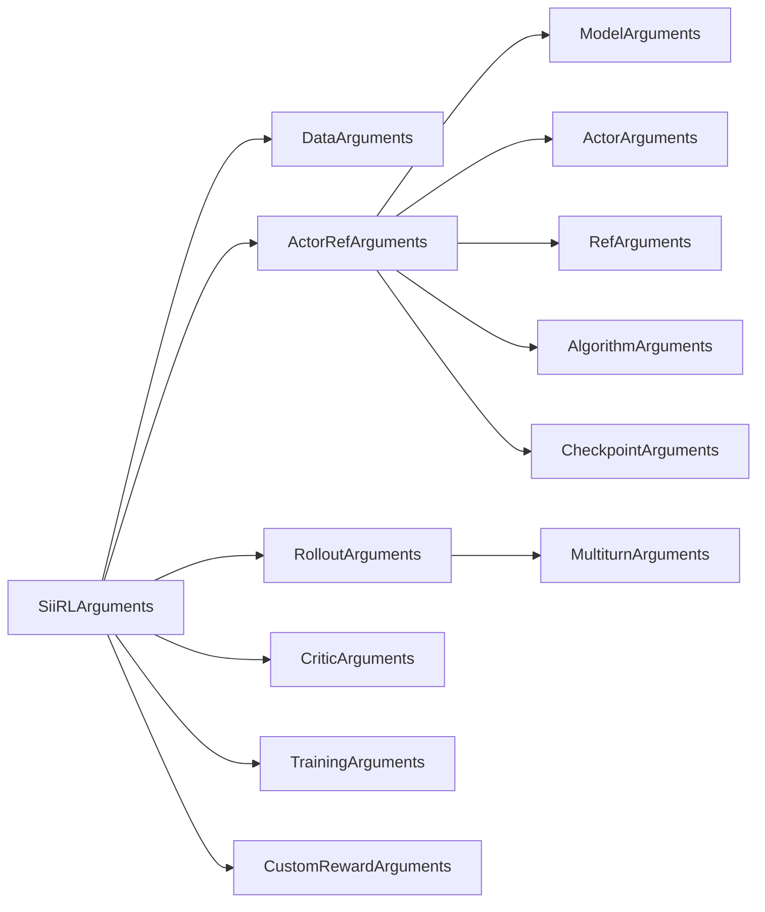

# 配置系统

*理解 siirl-agentic 的 CLI 驱动配置层次结构，以及如何覆盖任意参数。*

## 概述

!!! tip "核心要点"
    siirl-agentic 没有 YAML 配置文件加载器——每个参数都通过点分表示法作为 CLI 参数传递。这意味着 shell 脚本就是你的配置文件。将训练 shell 脚本与检查点一起保存，以便复现运行。要快速查看所有默认值，运行：`python -c "from siirl.params import SiiRLArguments; import dataclasses; print(dataclasses.asdict(SiiRLArguments()))"`

siirl-agentic 使用**基于数据类的分层配置系统**，通过 `argparse` + `OmegaConf.from_cli()` 解析。所有配置由 `SiiRLArguments` 数据类表示，其中包含各子系统的嵌套数据类。

!!! warning "无 YAML 文件加载"
    与基于 Hydra 的框架不同，`parse_config()` **不会**加载 YAML 配置文件。所有参数通过 CLI 以点分表示法直接传递（例如 `trainer.total_epochs=50`）。Shell 脚本通常使用 `bash` 变量来提高可读性。

## 配置层次结构

顶层 `SiiRLArguments` 数据类由以下六个子配置组成：

```python
@dataclass
class SiiRLArguments:
    data: DataArguments               # 数据路径、格式、分词配置
    actor_ref: ActorRefArguments      # 模型路径 + Actor + Ref + 算法
    rollout: RolloutArguments         # SGLang 推理引擎配置
    critic: CriticArguments           # 价值函数模型（仅 PPO）
    trainer: TrainingArguments        # GPU 资源 + 训练循环
    custom_reward_function: CustomRewardArguments  # 自定义奖励模块
```



*图 1: SiiRLArguments 配置层次结构*

## 核心参数快速参考

!!! tip "新建训练任务时先看这里"
    这 15 个参数覆盖了典型 GRPO agentic 训练中 90% 的调参需求。

| 参数                                            | 默认值      | 说明                               |
| --------------------------------------------- | -------- | -------------------------------- |
| `actor_ref.model.path`                        | *（必填）*   | HuggingFace 模型路径或检查点             |
| `data.train_files`                            | *（必填）*   | 训练 Parquet 路径列表                  |
| `data.train_batch_size`                       | `1024`   | 每个训练步的 prompt 数                  |
| `data.max_prompt_length`                      | `512`    | 最大 prompt token 数（agentic 任务需增大） |
| `data.max_response_length`                    | `512`    | 最大响应 token 数（多轮任务增大到 4096+）      |
| `actor_ref.algorithm.adv_estimator`           | `"grpo"` | 算法：`"grpo"` 或 `"ppo"`            |
| `actor_ref.algorithm.norm_adv_by_std_in_grpo` | `true`   | GRPO vs Dr.GRPO                  |
| `actor_ref.actor.optim.lr`                    | `1e-6`   | Actor 学习率                        |
| `actor_ref.actor.clip_ratio`                  | `0.2`    | PPO 裁剪比例                         |
| `actor_ref.actor.ppo_epochs`                  | `1`      | 每批次更新轮数                          |
| `rollout.n`                                   | `1`      | 每个 prompt 的响应数（GRPO 使用 8）        |
| `rollout.temperature`                         | `1.0`    | 采样温度                             |
| `rollout.gpu_memory_utilization`              | `0.5`    | SGLang 内存占比                      |
| `trainer.actor_gpus`                          | `2`      | 训练用 GPU 数                        |
| `trainer.rollout_gpus`                        | `6`      | Rollout 用 GPU 数                  |
| `trainer.save_freq`                           | `-1`     | 检查点保存间隔步数（默认禁用！）                 |
| `trainer.total_epochs`                        | `30`     | 训练 epoch 数                       |

## 解析流程

`siirl/params/parser.py` 中的解析流程：

``` python
def parse_config() -> SiiRLArguments:
    parser = argparse.ArgumentParser()
    _, overrides = parser.parse_known_args()         # 捕获所有 CLI 参数
    overrides = OmegaConf.from_cli(overrides)        # 将点分表示法解析为嵌套字典
    siirl_config_dict = OmegaConf.to_container(overrides, resolve=True)
    siirl_args = convert_to_dataclass(siirl_config_dict, SiiRLArguments)
    return siirl_args
```

任何未在 CLI 中指定的参数将使用数据类的默认值。


*图 2: 配置解析流水线*

## 配置源文件

| 文件                              | 包含内容                                                                                                                                                  |
| ------------------------------- | ----------------------------------------------------------------------------------------------------------------------------------------------------- |
| `siirl/params/training_args.py` | `TrainingArguments`、`SiiRLArguments`、`CustomRewardArguments`                                                                                          |
| `siirl/params/model_args.py`    | `ModelArguments`、`ActorArguments`、`RefArguments`、`RolloutArguments`、`MultiturnArguments`、`AlgorithmArguments`、`CriticArguments`、`CheckpointArguments` |
| `siirl/params/data_args.py`     | `DataArguments`                                                                                                                                       |
| `siirl/params/parser.py`        | `parse_config()` 函数                                                                                                                                   |

## 示例：Shell 脚本配置

由于没有 YAML 配置文件，训练脚本使用 shell 变量：

``` bash
export MODEL_PATH=/models/Qwen3-8B
export TRAIN_DATA_PATH=/data/train.parquet
export TEST_DATA_PATH=/data/test.parquet

python -m siirl.async_train \
    data.train_files="['$TRAIN_DATA_PATH']" \
    data.val_files="['$TEST_DATA_PATH']" \
    data.prompt_key=prompt \
    data.max_prompt_length=2048 \
    data.max_response_length=4096 \
    data.train_batch_size=512 \
    actor_ref.model.path=$MODEL_PATH \
    actor_ref.actor.train_backend=megatron \
    actor_ref.actor.ppo_mini_batch_size=256 \
    actor_ref.actor.clip_ratio=0.2 \
    actor_ref.actor.ppo_epochs=1 \
    actor_ref.actor.optim.lr=1e-6 \
    actor_ref.actor.optim.lr_decay_style=linear \
    actor_ref.algorithm.adv_estimator=grpo \
    actor_ref.algorithm.norm_adv_by_std_in_grpo=true \
    rollout.name=sglang \
    rollout.temperature=1.0 \
    rollout.top_p=1.0 \
    rollout.n=8 \
    rollout.gpu_memory_utilization=0.7 \
    rollout.tensor_model_parallel_size=2 \
    rollout.max_model_len=8192 \
    trainer.total_epochs=30 \
    trainer.actor_gpus=4 \
    trainer.rollout_gpus=4 \
    trainer.save_freq=10 \
    trainer.test_freq=5
```

## 核心配置组说明

### 数据配置（`data:`）

| 参数                    | 类型        | 默认值                            | 说明                        |
| --------------------- | --------- | ------------------------------ | ------------------------- |
| `train_files`         | list[str] | `["~/data/.../train.parquet"]` | 训练数据集路径                   |
| `val_files`           | list[str] | `["~/data/.../test.parquet"]`  | 验证数据集路径                   |
| `train_batch_size`    | int       | 1024                           | 每个训练步的样本数                 |
| `max_prompt_length`   | int       | 512                            | 最大 prompt token 长度        |
| `max_response_length` | int       | 512                            | 最大响应 token 长度             |
| `mask_history`        | bool      | false                          | 只在最后一轮计算 loss（多轮训练时使用）    |
| `train_on_prompt`     | bool      | false                          | 是否在 prompt token 上计算 loss |

### Rollout 配置（`rollout:`）

| 参数                           | 类型    | 默认值      | 说明                           |
| ---------------------------- | ----- | -------- | ---------------------------- |
| `name`                       | str   | "sglang" | 推理引擎                         |
| `temperature`                | float | 1.0      | 采样温度                         |
| `n`                          | int   | 1        | 每个 prompt 生成的响应数（GRPO 通常为 8） |
| `gpu_memory_utilization`     | float | 0.5      | SGLang GPU 内存占用比例            |
| `tensor_model_parallel_size` | int   | 1        | 推理 TP 并行度                    |
| `train_server_concurrency`   | int   | 256      | 每个引擎的最大并发请求数                 |
| `flow_function`              | str   | "naive"  | Rollout flow 实现              |
| `executor_module`            | str   | "naive"  | 批量执行器模块                      |

### 多轮配置（`rollout.multiturn:`）

| 参数                           | 类型  | 默认值      | 说明                          |
| ---------------------------- | --- | -------- | --------------------------- |
| `env_type`                   | str | null     | 环境类型：`tool_env`、`vla_env`   |
| `max_env_turns`              | int | 1        | 最大环境交互轮数                    |
| `max_assistant_turns`        | int | 1        | 最大模型生成轮数                    |
| `max_parallel_calls`         | int | 1        | 每个样本的并发工具调用数                |
| `max_env_response_length`    | int | 256      | 最大环境响应长度（**字符数**，非 token 数） |
| `env_response_truncate_side` | str | "middle" | 截断方式：left / middle / right  |

!!! warning "基于字符的截断"
    `max_env_response_length` 以**字符**（Python `len(str)`）为单位，而非 token。截断发生在分词之前的原始文本字符串上。具体实现参见 `NaiveFlow._step()`。

### 训练配置（`trainer:`）

| 参数                | 类型   | 默认值    | 说明                                |
| ----------------- | ---- | ------ | --------------------------------- |
| `total_epochs`    | int  | 30     | 训练 epoch 数                        |
| `actor_gpus`      | int  | 2      | 训练用 GPU 数                         |
| `rollout_gpus`    | int  | 6      | Rollout 用 GPU 数                   |
| `colocate`        | bool | false  | 是否共享训练和 rollout GPU               |
| `async_factor`    | int  | 1      | Rollout 批次预缓冲数量                   |
| `off_policy_step` | int  | 0      | Off-policy 版本容忍窗口                 |
| `save_freq`       | int  | -1     | 检查点保存频率                           |
| `resume_mode`     | str  | "auto" | 恢复模式：auto / disable / resume_path |

## 常见错误

| 错误                                           | 现象         | 解决方案                         |
| -------------------------------------------- | ---------- | ---------------------------- |
| `max_response_length` 对多轮过小                  | 轨迹过早截断     | Agentic 任务建议设为 4096+         |
| PPO 时设置 `n > 1`                              | 异常行为       | PPO 使用 `n=1`，GRPO 使用 `n=8`   |
| `actor_gpus + rollout_gpus > 总 GPU 数`        | 资源分配失败     | 确保总和不超过可用 GPU 数              |
| 缺少 `multiturn.env_type`                      | 没有工具交互     | 设置 `env_type: tool_env`      |
| `colocate=true` 配合高 `gpu_memory_utilization` | OOM        | 框架自动限制在 0.45                 |
| 使用 `--config config.yaml`                    | 错误：无法识别的参数 | 不支持 YAML 文件加载 — 使用 CLI 点分表示法 |

## CLI 覆盖快速参考

所有参数以 `key=value` 形式在命令行传递。嵌套配置使用点分表示法。下表涵盖最常用的覆盖参数：

| 覆盖                                    | 效果                | 示例                                       |
| ------------------------------------- | ----------------- | ---------------------------------------- |
| `trainer.total_epochs=N`              | 设置训练 epoch 数      | `trainer.total_epochs=50`                |
| `trainer.actor_gpus=N`                | 训练用 GPU 数         | `trainer.actor_gpus=4`                   |
| `trainer.rollout_gpus=N`              | Rollout 用 GPU 数   | `trainer.rollout_gpus=4`                 |
| `trainer.save_freq=N`                 | 每 N 步保存检查点        | `trainer.save_freq=20`                   |
| `trainer.test_freq=N`                 | 每 N 步执行验证         | `trainer.test_freq=10`                   |
| `trainer.off_policy_step=N`           | 允许 N 步的过期数据       | `trainer.off_policy_step=2`              |
| `data.train_batch_size=N`             | 每个训练步的样本数         | `data.train_batch_size=512`              |
| `data.max_response_length=N`          | 最大响应 token 数      | `data.max_response_length=4096`          |
| `actor_ref.actor.optim.lr=X`          | 学习率               | `actor_ref.actor.optim.lr=1e-6`          |
| `actor_ref.algorithm.adv_estimator=X` | 算法：`grpo` 或 `ppo` | `actor_ref.algorithm.adv_estimator=grpo` |
| `rollout.temperature=X`               | 采样温度              | `rollout.temperature=0.8`                |
| `rollout.n=N`                         | 每个 prompt 的响应数    | `rollout.n=8`                            |
| `rollout.gpu_memory_utilization=X`    | SGLang 内存占用比例     | `rollout.gpu_memory_utilization=0.7`     |
| `rollout.multiturn.max_env_turns=N`   | 最大工具调用轮数          | `rollout.multiturn.max_env_turns=5`      |
| `trainer.resume_mode=X`               | 恢复策略              | `trainer.resume_mode=auto`               |

### 列表参数

列表值使用 Python 风格语法并加引号：

```bash
data.train_files="['/path/to/train1.parquet', '/path/to/train2.parquet']"
```

### 布尔参数

使用小写 `true`/`false`：

```bash
trainer.colocate=true
actor_ref.actor.megatron.param_offload=true
```

### 嵌套覆盖示例

仅修改 GRPO 运行的学习率，不影响其他参数：

```bash
python -m siirl.async_train \
    actor_ref.actor.optim.lr=5e-7 \
    actor_ref.actor.optim.lr_decay_style=cosine \
    actor_ref.algorithm.adv_estimator=grpo \
    actor_ref.algorithm.norm_adv_by_std_in_grpo=true
```

## Loss 聚合模式

!!! tip "核心要点"
    `loss_agg_mode` 参数控制逐 token 损失如何归约为标量。正确的模式取决于序列长度是否变化——选择不当会导致长序列主导训练或短序列权重不足。

`agg_loss()` 函数（`siirl/algorithm/loss.py`:27）支持四种聚合模式：

| 模式                        | 公式                                                                                                                      | 适用场景                                                                  |
| ------------------------- | ----------------------------------------------------------------------------------------------------------------------- | --------------------------------------------------------------------- |
| `token-mean`              | $\frac{\sum_i \text{loss}_i \cdot \text{mask}_i}{\sum_i \text{mask}_i}$                                                 | 默认值；固定长度序列，每个 token 等权                                                |
| `seq-mean-token-sum`      | $\frac{1}{N_{\text{seq}}} \sum_s \sum_{t \in s} \text{loss}_t \cdot \text{mask}_t$                                      | 变长序列；有意给长序列更大权重                                                       |
| `seq-mean-token-mean`     | $\frac{1}{N_{\text{seq}}} \sum_s \frac{\sum_{t \in s} \text{loss}_t \cdot \text{mask}_t}{\sum_{t \in s} \text{mask}_t}$ | 变长序列；每条序列等权，不论长度                                                      |
| `seq-mean-token-sum-norm` | $\frac{\sum_s \sum_{t \in s} \text{loss}_t \cdot \text{mask}_t}{L_{\text{scale}}}$                                      | 长度差异极大时保持训练稳定；$L_{\text{scale}}$ 默认为序列维度大小，可通过 `loss_scale_factor` 设置 |

Actor 和 Critic 独立支持此参数：

```bash
actor_ref.actor.loss_agg_mode="token-mean"    # Actor 损失聚合
critic.loss_agg_mode="token-mean"              # Critic 损失聚合（仅 PPO）
```

!!! warning "与 Dynamic Batch 的交互"
    当 `use_dynamic_batch=True` 时，`token-mean` 模式使用全局 `batch_num_tokens` 作为分母而非局部 mask 求和，`seq-mean-token-sum` 使用 `global_valid_seqs`。这确保了不同微批量大小的 GPU 之间 loss 缩放一致。

## Off-Policy 配置

!!! tip "核心要点"
    默认情况下 siirl-agentic 是严格 on-policy 的（`off_policy_step=0`）。启用 off-policy 训练可以复用先前的 rollout 数据，以略微过时的梯度为代价提高样本效率。

| 参数                            | 类型  | 默认值      | 说明                                                                                       |
| ----------------------------- | --- | -------- | ---------------------------------------------------------------------------------------- |
| `trainer.off_policy_step`     | int | `0`      | Off-policy 数据允许的版本步数。`0` = 纯 on-policy（仅当前版本数据）。`N` = 接受 `[current - N, current]` 版本的数据。 |
| `trainer.off_policy_strategy` | str | `"fifo"` | Off-policy 数据调度策略。`"fifo"` 优先丢弃最旧数据。`"oldest_first"` 优先训练最旧数据。                           |

与 DataBuffer 的协作流程：

1. 每个 rollout 批次标记生成它的模型版本号
2. 当 `off_policy_step=0` 时，DataBuffer 仅释放与当前训练版本匹配的批次
3. 当 `off_policy_step=N` 时，最多 N 个版本之前的批次也可用于训练
4. `off_policy_strategy` 决定缓冲批次的消费顺序

```bash
# 示例：允许最多 2 个版本的过期数据，优先消费最旧的
trainer.off_policy_step=2
trainer.off_policy_strategy="oldest_first"
```

!!! note "与 Async Factor 的交互"
    `trainer.async_factor`（默认 1）控制预缓冲的 rollout 批次数。与 `off_policy_step` 结合使用时，决定训练数据的最大过期程度。`async_factor=2` 配合 `off_policy_step=1` 时，最多可缓冲 3 个批次。

## 动态批处理

!!! tip "核心要点"
    当序列长度差异较大时，使用 `use_dynamic_batch=True`。这将固定的每 GPU 批量大小替换为基于 token 的预算机制，提高 GPU 内存利用率。

| 参数                                     | 类型   | 默认值       | 说明                                                |
| -------------------------------------- | ---- | --------- | ------------------------------------------------- |
| `actor_ref.actor.use_dynamic_batch`    | bool | `False`   | 启用基于 token 的动态批处理，替代固定样本数                         |
| `actor_ref.actor.max_tokens_per_gpu`   | int  | `4096`    | 动态批处理时每 GPU 每微批次的最大 token 数                       |
| `actor_ref.actor.use_workload_balance` | bool | `True`    | 使用基于 FLOPs 的 GPU 间负载均衡（否则基于序列长度）                  |
| `actor_ref.actor.denominator_scope`    | str  | `"local"` | Loss 分母范围：`"local"`（单 GPU）或 `"dp_global"`（跨 DP 组） |

| 特性   | 固定批处理（`use_dynamic_batch=False`）            | 动态批处理（`use_dynamic_batch=True`）               |
| ---- | ------------------------------------------- | --------------------------------------------- |
| 批量大小 | 每 GPU 固定样本数（`ppo_micro_batch_size_per_gpu`） | 样本数可变，受 `max_tokens_per_gpu` 上限约束             |
| 内存使用 | 短序列浪费内存，长序列可能 OOM                           | 自适应序列长度分布                                     |
| 负载均衡 | 序列长度不均时负载不平衡                                | GPU 间 FLOPs 均衡（`use_workload_balance=True` 时） |
| 适用场景 | 均匀长度数据（如数学题）                                | 变长数据（如多轮 agentic 任务）                          |

```bash
# 为变长轨迹的 agentic 训练启用动态批处理
actor_ref.actor.use_dynamic_batch=true
actor_ref.actor.max_tokens_per_gpu=8192
actor_ref.actor.use_workload_balance=true
actor_ref.actor.denominator_scope="dp_global"
```

## 高级并行策略

!!! tip "核心要点"
    除基本的 TP/PP/DP 外，siirl-agentic 还支持序列并行、上下文并行和 MoE 专家并行，用于扩展到大模型和长序列场景。

| 参数                                    | 类型   | 默认值     | 说明                                  |
| ------------------------------------- | ---- | ------- | ----------------------------------- |
| `trainer.sequence_parallel`           | bool | `False` | 启用 Megatron 序列并行（沿序列维度在 TP 组内切分激活值） |
| `trainer.context_parallel_size`       | int  | `1`     | 上下文并行度，用于超长序列                       |
| `trainer.expert_model_parallel_size`  | int  | `1`     | MoE 专家并行（EP）——将专家分布到不同 GPU 组        |
| `trainer.expert_tensor_parallel_size` | int  | `1`     | MoE 专家张量并行——在 GPU 间切分单个专家           |

| 并行方式      | 配置键                                    | 适用场景                 | 约束                            |
| --------- | -------------------------------------- | -------------------- | ----------------------------- |
| 张量并行（TP）  | `trainer.tensor_model_parallel_size`   | 单卡放不下的大模型            | 必须整除 `actor_gpus`             |
| 流水线并行（PP） | `trainer.pipeline_model_parallel_size` | 超深模型；用计算隐藏通信         | TP x PP 必须整除 `actor_gpus`     |
| 序列并行（SP）  | `trainer.sequence_parallel`            | TP > 1 时减少激活内存       | 需要 TP > 1                     |
| 上下文并行（CP） | `trainer.context_parallel_size`        | 超长序列（>8k token）      | 必须整除 `actor_gpus` / (TP x PP) |
| 专家并行（EP）  | `trainer.expert_model_parallel_size`   | 多专家 MoE 模型（如 64+ 专家） | 必须整除专家数                       |
| 专家 TP     | `trainer.expert_tensor_parallel_size`  | 大型单个 MoE 专家          | 必须整除 TP 大小                    |

```bash
# 示例：8 GPU MoE 训练，EP=2，TP=2，启用 SP
trainer.actor_gpus=8
trainer.tensor_model_parallel_size=2
trainer.sequence_parallel=true
trainer.expert_model_parallel_size=2
trainer.expert_tensor_parallel_size=1
```

!!! warning "并行策略兼容性"
    序列并行（`sequence_parallel=true`）需要张量并行（`tensor_model_parallel_size > 1`）——它在同一 TP 组内沿序列维度切分激活张量。上下文并行与 TP 正交，可独立使用。

## 下一步

- [GRPO 训练](grpo_training.md) — 将配置知识应用到 GRPO 专属参数，如分组大小和优势归一化
- [最佳实践](../reference/best_practices.md) — 了解最常见的配置错误及规避方法
- [配置参考](../reference/config_reference.md) — 包含类型、默认值和说明的完整参数列表
