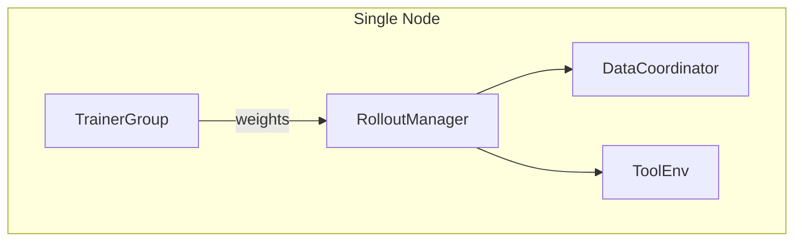
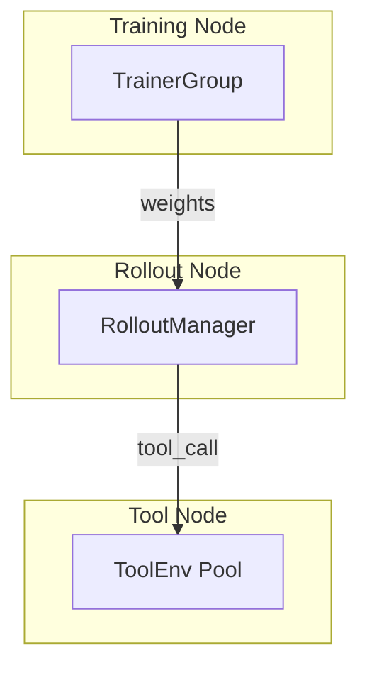
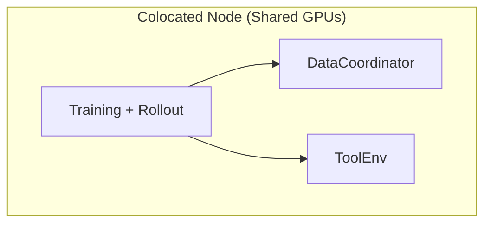
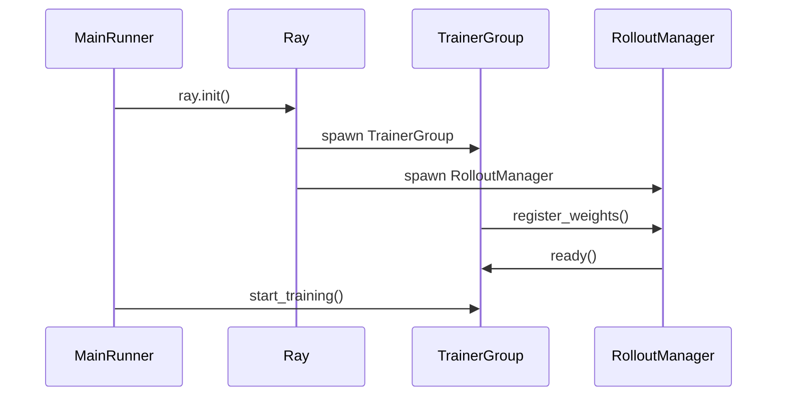

# 部署模式

*在 separated 和 colocated GPU 拓扑之间做选择，并了解各自的适用场景。*

## Separated 模式（默认）

!!! tip "核心要点"
    Separated 模式是绝大多数场景的正确默认选择。GPU 分配比例很重要：如果 rollout 是瓶颈（生成时间 >> 训练步时间），分配更多 GPU 给 rollout；如果训练是瓶颈，分配更多给训练。8 GPU 节点上 4+4 分配是 7B–8B 模型的均衡起点。只有在真正无法负担 separated 模式所需最少 2 块 GPU 时，才切换到 colocated 模式。

GPU 分别分配给训练和 rollout，各组拥有专用资源。

``` yaml
trainer:
  colocate: false         # 默认值
  actor_gpus: 4           # 训练用 GPU 数（默认：2）
  rollout_gpus: 4         # Rollout 用 GPU 数（默认：6）
```



*图 1: Separated 模式 GPU 拓扑*

**适用场景：** 大多数生产训练。资源边界清晰，性能可预测。推荐用于 >= 7B 参数的模型。

### 资源分配示例

| 模型大小    | actor_gpus | rollout_gpus | 备注                   |
| ------- | ---------- | ------------ | -------------------- |
| 1.5B–3B | 2          | 6            | 更多 rollout 用于快速生成    |
| 7B–8B   | 4          | 4            | 均衡分配                 |
| 13B–14B | 4          | 4            | 训练和 rollout 均使用 TP=4 |
| 70B+    | 8          | 8（独立节点）      | 需要多节点                |

## 权重同步机制

!!! tip "权重如何从训练器传输到 rollout 引擎"
    理解同步机制有助于诊断切换卡顿和 OOM 问题。

在 **separated 模式**下，权重同步使用 `ParamSyncDistributed`：参数从 Megatron 分片中收集，并通过 NCCL 广播到 rollout 引擎的 GPU 显存。

在 **colocated 模式**下，权重同步使用 `ParamSyncColocated`：每个训练步后，colocated 流程执行以下操作：

```
rollout_manager.offload_for_train()   # 将 rollout 引擎权重移至 CPU
 → train()                            # 前向 + 反向 + 优化器步骤
 → rollout_manager.resume_for_rollout()  # 将更新后的权重加载回 GPU
```

`colocate_timeout_s=60` 保护的正是这个卸载/恢复循环——如果卸载耗时超过 60 秒（大模型上常见），会抛出超时错误。

## Colocated 模式

训练和 rollout 通过权重卸载共享全部 GPU。

``` yaml
trainer:
  colocate: true
  colocate_timeout_s: 60              # 权重卸载转换超时时间（默认：60）
  colocate_flattened_fail_fast: true   # 卸载出错时快速失败（默认：true）
```



*图 2: Colocated 模式 GPU 拓扑*

**适用场景：** GPU 预算有限、模型较小（< 7B）的场景。以时分复用的开销换取最大 GPU 利用率。

框架自动管理：

- `megatron.param_offload = true` — 不使用时将参数卸载到 CPU
- `rollout.gpu_memory_utilization` 限制为 `COLOCATE_MAX_GPU_MEM_UTIL=0.45` — 防止转换过程中 OOM
- `validate_reuse_train_gpus` 强制设为 `False` — colocated 模式下不能在验证时复用 GPU
- `param_offload=True` — colocated 模式下所有 Megatron actor 强制开启

### Separated 与 Colocated 对比



*图 3: Separated 与 Colocated 执行模型*

### Colocated 执行流程



*图 4: Colocated 模式执行时间线*

## 多节点部署

适用于单节点无法容纳的大模型：

``` yaml
trainer:
  nnodes: 2                    # 节点数量
  n_gpus_per_node: 8           # 每节点 GPU 数
  actor_gpus: 8                # 1 个节点用于训练
  rollout_gpus: 8              # 1 个节点用于 rollout
```

### 多节点配置步骤

1. **在主节点启动 Ray 集群**：
   ``` bash
   ray start --head --port=6379
   ```

2. **加入工作节点**：
   ``` bash
   ray start --address='head-node-ip:6379'
   ```

3. **验证集群**：
   ``` bash
   ray status  # 应显示所有节点和 GPU
   ```

4. **从主节点启动训练**：
   ``` bash
   python -m siirl.async_train trainer.nnodes=2 trainer.n_gpus_per_node=8 ...
   ```

## 对比

| 维度                          | Separated           | Colocated |
| --------------------------- | ------------------- | --------- |
| GPU 效率                      | 各角色独占               | 时分复用      |
| 显存压力                        | 较低                  | 较高（卸载开销）  |
| 复杂度                         | 简单                  | 需要管理卸载    |
| 最适合                         | 生产环境、大模型            | 原型开发、小模型  |
| `validate_reuse_train_gpus` | 支持                  | 不支持       |
| 最少 GPU 数                    | 2（1 训练 + 1 rollout） | 1         |

## 常见错误

| 错误                                                    | 现象                         | 解决方案                                         |
| ----------------------------------------------------- | -------------------------- | -------------------------------------------- |
| `actor_gpus + rollout_gpus` 超过节点 GPU 数                | Ray 无法分配 actor             | 设置总和等于可用 GPU 数（如 8 卡节点用 4+4）                 |
| `colocate=true` 时设置 `gpu_memory_utilization=0.7`      | rollout 到训练切换时 OOM         | colocated 模式下框架自动限制为 0.45，不要手动覆盖             |
| 多节点时检查点目录未使用共享文件系统                                    | 每个节点保存到不同的本地路径             | 在 `trainer.default_local_dir` 挂载 NFS 或并行文件系统 |
| `rollout.tensor_model_parallel_size` 大于 rollout GPU 数 | SGLang 初始化失败               | TP 大小必须 ≤ rollout GPU 数                      |
| 启动训练前忘记运行 `ray start --head`                          | 报 `ConnectionRefusedError` | 先启动 Ray 集群，再运行训练脚本                           |

## 下一步

- [检查点与恢复](checkpoint_resume.md) — 为所选部署拓扑配置检查点保存和恢复策略
- [性能调优](performance_tuning.md) — 针对 separated 或 colocated 模式微调异步重叠和内存参数
- [常见问题与排障](../reference/troubleshooting.md) — 排查部署中的 Ray actor 分配失败和 GPU 显存错误
