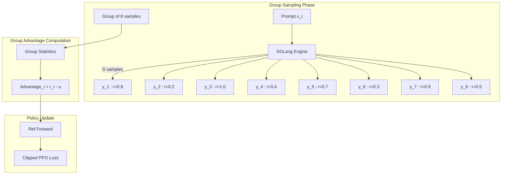
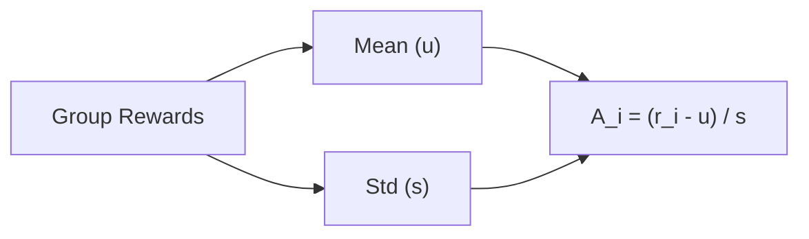

# GRPO 训练

*配置组相对策略优化（GRPO）、理解分组采样机制，并针对 agentic 任务调优。*

## 概述

!!! tip "核心要点"
    GRPO 在 agentic 任务中最大的优势是不需要 Critic 模型——与 PPO 相比 GPU 内存减少约 33%。同一 prompt 的一组响应充当内置基准：高于组均值的响应获得正优势，低于均值的获得负优势。建议从 `rollout.n=8` 开始；组大小越小方差越大，组越大计算开销线性增加。

GRPO（Group Relative Policy Optimization）是一种无 Critic 的 RL 算法，通过比较**同一 prompt 的一组响应**的奖励来估计优势值。这省去了独立的 Critic 模型，降低了 GPU 内存占用并简化了训练流程。

!!! note "Dr.GRPO 变体"
    当 `norm_adv_by_std_in_grpo=false` 时，算法变为 **Dr.GRPO** — 优势值计算为 `(reward_i - mean)`，不除以标准差。当奖励分布具有有意义的绝对尺度时，这种方式可能更有用。

## GRPO 专属配置

``` yaml
actor_ref:
  algorithm:
    adv_estimator: grpo               # 使用 GRPO 优势估计
    norm_adv_by_std_in_grpo: true     # 用组内标准差归一化优势（true=GRPO，false=Dr.GRPO）

  actor:
    ppo_mini_batch_size: 256
    ppo_micro_batch_size_per_gpu: 8
    clip_ratio: 0.2
    ppo_epochs: 1
    optim:
      lr: 1e-6

rollout:
  n: 8                                # 每个 prompt 生成 8 个响应
  temperature: 1.0                    # 采样温度
  do_sample: true

data:
  train_batch_size: 512               # 每步 prompt 数（总样本 = 512 × 8 = 4096）
```

## 最小可运行示例

``` bash
export MODEL_PATH=/path/to/Qwen3-8B
export TRAIN_DATA_PATH=/path/to/train.parquet
export TEST_DATA_PATH=/path/to/test.parquet

bash examples/grpo_train/run_qwen3_8b_separated.sh
```

## GRPO 工作原理



*图 1: GRPO 训练流水线*

对每个 prompt，GRPO 执行：

1.  生成 `n` 个响应（默认 8 个）
2.  计算每个响应的奖励
3.  计算组相对优势：`adv_i = (reward_i - mean) / std`（当 `norm_adv_by_std_in_grpo=true` 时）
4.  使用 PPO 风格裁剪目标更新策略

**边界情况：** 当组内只有 1 个样本（n=1）时，mean 设为 0，std 设为 1，实际上使用原始奖励作为优势值（不做归一化）。

## 组优势计算详解



*图 2: 组优势计算*

## 关键参数

| 参数                                            | 影响                             | 推荐范围        |
| --------------------------------------------- | ------------------------------ | ----------- |
| `rollout.n`                                   | 组大小（越大估计越准，计算开销越大）             | 4 到 16      |
| `rollout.temperature`                         | 响应多样性                          | 0.8 到 1.2   |
| `actor_ref.algorithm.norm_adv_by_std_in_grpo` | 优势归一化（true=GRPO，false=Dr.GRPO） | true（推荐）    |
| `actor_ref.actor.optim.lr`                    | 学习率                            | 1e-7 到 5e-6 |
| `data.train_batch_size`                       | 每步 prompt 数量                   | 128 到 1024  |

## GRPO 在 Agentic 任务中的优势

GRPO 特别适合 agentic 训练：

1.  **无 Critic 模型** — 节省 GPU 内存，在工具环境占用资源时尤为重要
2.  **组内多样性** — 同一 prompt 的多个响应探索不同工具使用策略
3.  **简单奖励信号** — 适用于 agentic 任务中常见的二元/稀疏奖励（通过/失败）
4.  **可扩展** — 总 rollout 样本 = `batch_size × n`，天然并行

## Agentic GRPO 示例

``` yaml
# GRPO + 多轮工具交互
actor_ref:
  algorithm:
    adv_estimator: grpo
  actor:
    ppo_mini_batch_size: 128

rollout:
  n: 8
  flow_function: naive
  multiturn:
    env_type: tool_env
    max_env_turns: 5
    max_assistant_turns: 10

data:
  train_batch_size: 256
  max_response_length: 8192   # 多轮轨迹需要更长的长度
```

## 实现细节：`compute_grpo_outcome_advantage()`

!!! tip "优势函数的工作原理"
    了解代码的实际行为有助于更精准地调整这些参数。

核心优势计算位于 `siirl/algorithm/grpo_utils.py`。通过 `index` 数组识别分组——所有 `index` 值相同的样本属于同一 prompt 组。

```python
# compute_grpo_outcome_advantage() 的伪代码
for each group (identified by index):
    group_rewards = rewards[group_mask]
    group_mean = group_rewards.mean()
    group_std  = group_rewards.std()

    if norm_adv_by_std_in_grpo:
        # 标准 GRPO
        advantage = (reward - group_mean) / (group_std + eps)
    else:
        # Dr.GRPO — 不除以标准差
        advantage = reward - group_mean
```

`eps` 防止当组内所有奖励相同（std = 0）时出现除零错误。

### Loss 聚合模式

`actor.loss_agg_mode` 参数控制 token 级别的 loss 如何汇总为标量：

| 模式                          | 公式                              | 适用场景             |
| --------------------------- | ------------------------------- | ---------------- |
| `"token-mean"`              | sum(loss × mask) / sum(mask)    | 默认值；每个 token 等权重 |
| `"seq-mean-token-sum"`      | 按序列取均值，每序列 sum(loss × mask)     | 避免长序列主导          |
| `"seq-mean-token-mean"`     | 按序列取均值，每序列 mean(loss × mask)    | 完全归一化            |
| `"seq-mean-token-sum-norm"` | seq-mean-token-sum 再除以总 token 数 | 混合方式             |

### KL 惩罚类型

通过 `actor_ref.algorithm.kl_penalty` 设置：

| 取值             | 说明                       |
| -------------- | ------------------------ |
| `"kl"`         | 标准 KL：`log(p_old/p_new)` |
| `"low_var_kl"` | 低方差估计；在稀疏奖励场景中减少噪声       |

## 训练成功的标志

一次良好收敛的 GRPO 训练应呈现以下模式：

| 指标                       | 预期范围           | 备注                     |
| ------------------------ | -------------- | ---------------------- |
| `reward/mean`            | 持续上升           | 20+ 步后仍持平 → 检查奖励函数     |
| `reward/std`             | 非零，稳定          | 为零 → 所有响应奖励相同（检查温度）    |
| `actor/clip_ratio`       | 0.05–0.25      | 过高 → 降低 lr；接近零 → lr 过低 |
| `kl/mean`                | 0.5–10         | >15 → 降低 lr 或启用 KL 惩罚  |
| `rollout/env_turns_mean` | >1（agentic 任务） | 接近 0 → 工具未被调用          |
| 组内奖励方差                   | > 0            | 为零 → 无法进行组内比较          |

## 常见问题

| 现象                                         | 原因                              | 解决方案                                  |
| ------------------------------------------ | ------------------------------- | ------------------------------------- |
| 组内所有奖励相同                                   | 采样温度过低                          | 提高 `rollout.temperature`              |
| 优势方差过大                                     | 组大小太小                           | 增大 `rollout.n`                        |
| Rollout 速度慢                                | `n × batch_size` 过大             | 减小其中一个，或增加 rollout GPU 数              |
| 训练不稳定                                      | `norm_adv_by_std_in_grpo=false` | 设置为 `true`                            |
| Rollout OOM                                | 并发样本过多                          | 减小 `rollout.train_server_concurrency` |
| `rollout.n=1` — 无学习信号                      | 只有 1 个样本，无法进行组内比较               | 将 `rollout.n` 至少设为 4                  |
| `temperature=0.0` — 响应相同                   | 贪婪解码 = 零多样性                     | 训练时 `temperature` 使用 ≥ 0.7            |
| `norm_adv_by_std_in_grpo=true` 且 n=2 时方差过大 | 2 个样本的 std 噪声很大                 | 使用 `rollout.n` ≥ 4；或切换为 Dr.GRPO       |

## 下一步

- [PPO 训练](ppo_training.md) — 了解 PPO 的 Actor-Critic 方案如何与 GRPO 的分组采样方式对比
- [Agentic 多轮训练](agentic_multiturn.md) — 将 GRPO 训练扩展至多轮工具交互轨迹
- [性能调优](performance_tuning.md) — 通过异步调优和内存优化充分发挥分组采样的吞吐量潜力
