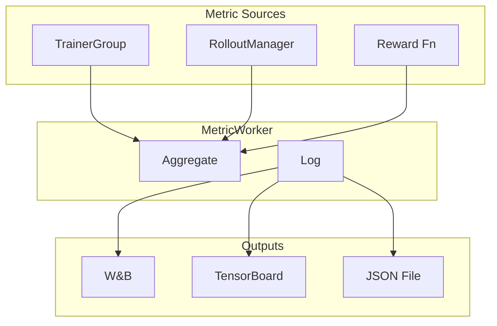

# 指标与监控

*监控训练进度的可用指标、日志后端配置与验证设置说明。*

## 日志后端

!!! tip "核心要点"
    训练过程中最有价值的单个指标是 `reward/mean`——它应该呈上升趋势。如果 50 步以上仍然持平，先检查奖励函数和学习率，再调整其他设置。对于 agentic 训练，还要关注 `rollout/env_turns_mean`：如果接近 0 或 1，说明 agent 没有在使用工具。尽早设置 `trainer.test_freq=10`——默认值为 `-1`（禁用），不显式启用就不会有验证指标。

``` yaml
trainer:
  logger: ["console", "wandb"]    # 默认：同时使用 console 和 WandB
  project_name: siirl_examples
  experiment_name: my_experiment
```

支持的后端：`console`、`wandb`

## 指标收集流水线



*图 1: 指标收集流水线*

## 核心训练指标

| 指标                 | 说明                               |
| ------------------ | -------------------------------- |
| `reward/mean`      | 每步平均奖励                           |
| `reward/std`       | 奖励标准差                            |
| `actor/loss`       | Actor 策略损失（Dual-clip PPO 或 GRPO） |
| `actor/clip_ratio` | 被裁剪更新的比例                         |
| `critic/loss`      | Critic 价值损失（仅 PPO）               |
| `kl/mean`          | 与参考模型的 KL 散度                     |
| `lr`               | 当前学习率                            |

## Rollout 指标

| 指标                             | 说明            |
| ------------------------------ | ------------- |
| `rollout/generation_duration`  | LLM 生成耗时（秒）   |
| `rollout/reward_duration`      | 奖励计算耗时（秒）     |
| `rollout/total_tokens`         | 生成的总 token 数  |
| `rollout/response_length_mean` | 平均响应长度（token） |

对于 agentic（多轮）训练，可能会出现额外指标：

| 指标                       | 说明           |
| ------------------------ | ------------ |
| `rollout/env_turns_mean` | 每个样本平均工具交互轮数 |
| `rollout/env_duration`   | 工具调用耗时       |

## 验证配置

``` yaml
trainer:
  test_freq: 10                # 每 N 步验证一次（默认值：-1 = 禁用）
  val_before_train: true       # 首步训练前先验证（默认值：true）
  log_val_generations: 5       # 记录 N 个验证样本生成结果（默认值：0）

data:
  val_batch_size: null         # null = 使用完整验证集（默认值：null）
```

!!! warning "计划中的功能"
    `log_val_generations` 在 `TrainingArguments` 中定义，但**尚未被任何代码路径消费**。该参数为验证样本日志记录到 WandB 的未来实现预留。请查看版本说明了解可用性。

## MetricWorker 实现细节

!!! tip "MetricWorker 是独立的 Ray actor"
    指标以异步方式收集，不会阻塞训练循环。

`MetricWorker` 在 `siirl/async_train.py` 启动时以 `MetricWorker.remote()` 的方式初始化——作为一个专用 Ray actor。关键实现细节：

-   位于 `siirl/utils/metrics/`
-   以 `MetricWorker.remote()` 方式创建——独立的 Ray actor，与训练循环解耦
-   `MetricTracker` 实例**只在 rank 0** 上创建，避免重复上报
-   处理训练指标（loss、梯度、学习率）和 rollout 指标（生成时间、奖励）
-   验证行为由 `val_before_train=True`（默认值）和 `test_freq=-1`（默认禁用）控制

## 指标解读

### 健康训练的表现

- `reward/mean` 应随时间逐步上升
- `actor/loss` 应下降（但可能波动）
- `kl/mean` 应保持有界（通常 < 15）
- `actor/clip_ratio` 应非零但不宜过高（0.1-0.3 为正常范围）

### 警告信号

| 指标模式                             | 可能原因         | 应对措施                     |
| -------------------------------- | ------------ | ------------------------ |
| `reward/mean` 持平                 | 奖励函数问题或学习率过低 | 检查奖励函数，提高学习率             |
| `kl/mean` > 20                   | 策略偏离过快       | 降低学习率，启用 KL loss         |
| `actor/clip_ratio` > 0.5         | 裁剪比例过松       | 减小 `clip_ratio`          |
| `critic/loss` 上升                 | Critic 学习率过高 | 降低 `critic.optim.lr`     |
| `rollout/generation_duration` 上升 | 模型生成更长的响应    | 检查 `max_response_length` |

## 验证与评估扩展

### 验证配置

```yaml
trainer:
  test_freq: 10                    # 每 N 个训练步执行一次验证（-1 = 禁用）
  val_before_train: true           # 首步训练前先执行验证（默认：true）
  validate_reuse_train_gpus: false # 将训练 GPU 复用于验证 rollout（仅限 separated 模式）
  log_val_generations: 5           # 记录 N 个验证样本输出（计划中，尚未激活）

data:
  val_batch_size: null             # null = 使用完整验证集（默认）
```

!!! note "val_batch_size: null"
    设置 `val_batch_size: null` 会在整个验证数据集上运行验证。对于大型数据集，这可能耗时较长。设置明确的值（例如 `val_batch_size: 256`）可以限制验证成本。

### 验证采样参数

验证 rollout 使用与训练 rollout 不同的采样参数，以衡量贪婪（确定性）性能：

```yaml
rollout:
  val_temperature: 0.0        # 验证使用贪婪解码（默认：0.0）
  val_top_p: 1.0              # 验证不使用核采样
  val_n: 1                    # 每个 prompt 只生成单个响应（不用多样本）
```

设置 `val_temperature: 0.0` 确保验证指标反映模型的最优推理性能，而非随机采样结果。这与大多数基准测试的报告方式一致。

### Separated 模式下的 GPU 复用

在 separated 模式下，你可以选择将训练 GPU 复用于验证 rollout，从而避免需要专用的验证资源：

```yaml
trainer:
  validate_reuse_train_gpus: true   # 仅适用于 colocate: false
```

启用后，TrainerGroup 会暂停，其 GPU 被临时让给 RolloutManager 用于验证。这减少了 GPU 需求，但会增加验证步骤的延迟。

!!! warning "colocated 模式不支持"
    当 `trainer.colocate: true` 时，`validate_reuse_train_gpus` 会自动禁用。Colocated 模式已经在训练和 rollout 之间共享 GPU——没有独立的"训练 GPU 池"可供复用。

### 验证故障排查

| 现象                       | 原因                   | 解决方案                                                     |
| ------------------------ | -------------------- | -------------------------------------------------------- |
| 验证从不执行                   | `test_freq: -1`（默认值） | 设置 `test_freq: 10` 或其他正数                                 |
| `val_before_train` 耗时过长  | 验证集过大                | 设置 `data.val_batch_size: 256` 限制范围                       |
| 验证时 OOM                  | 与训练相同的 GPU 内存压力      | 减小 `data.val_batch_size` 或启用 `validate_reuse_train_gpus` |
| `log_val_generations` 无效 | 功能尚未实现               | 无需操作——这是计划中的功能                                           |
| 验证指标未出现在 WandB           | `logger` 中缺少 `wandb` | 添加 `trainer.logger: ["console", "wandb"]`                |

## 常见错误

| 错误                                      | 现象                     | 解决方案                                  |
| --------------------------------------- | ---------------------- | ------------------------------------- |
| 保留 `test_freq: -1`（默认值）                 | 不出现验证指标                | 训练前设置 `trainer.test_freq=10`          |
| 不设置 `experiment_name`                   | 所有运行共享同一 WandB 运行名称    | 每次运行设置唯一的 `trainer.experiment_name`   |
| 脱离上下文解读 `kl/mean`                       | KL 为 10 看起来很高但训练初期是正常的 | 基准预期：KL < 15 为健康状态；> 20 需要采取行动        |
| 忽略 agentic 运行的 `rollout/env_turns_mean` | 漏掉工具未被调用的信号            | 追踪此指标；接近 0 表示 agent 未在使用工具            |
| 大型验证集使用 `val_batch_size: null`          | 验证耗时比预期长 10 倍          | 设置 `data.val_batch_size: 256` 以限制验证成本 |

## 下一步

- [最佳实践](../reference/best_practices.md) — 应用生产检查清单，确保实验追踪和验证配置正确
- [性能调优](performance_tuning.md) — 利用已建立的指标体系来诊断 rollout 和训练瓶颈
- [常见问题与排障](../reference/troubleshooting.md) — 解读指标异常并排查常见训练故障
