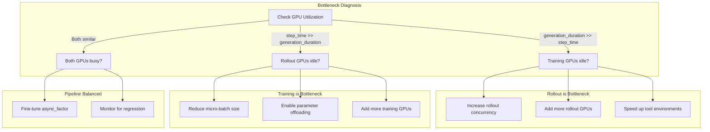
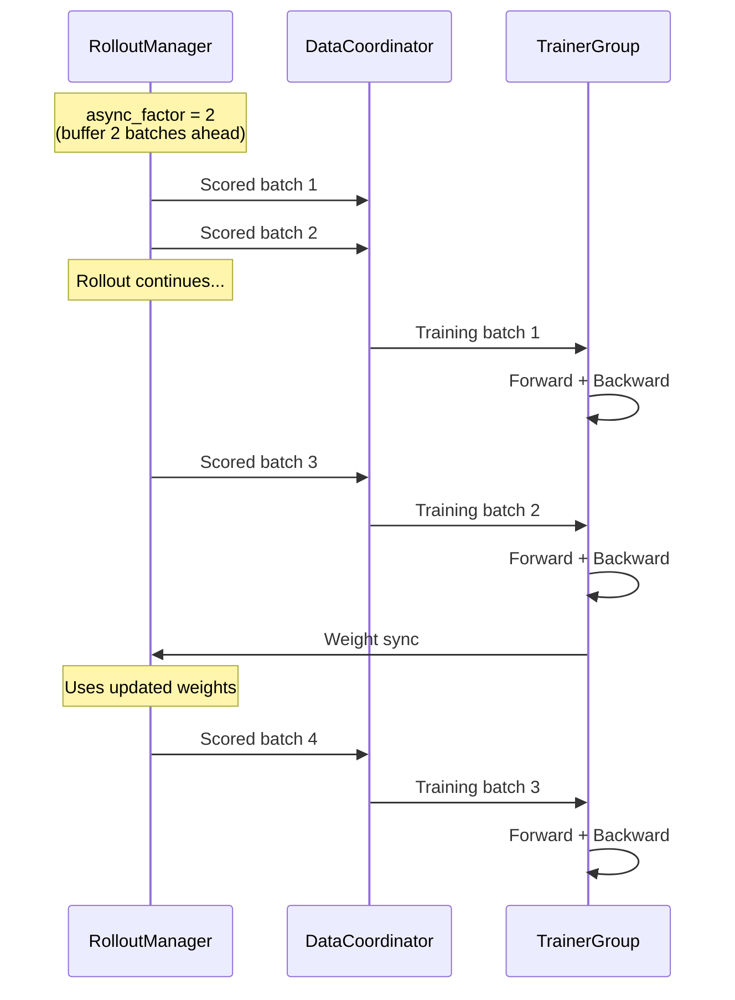

# 性能调优

*诊断瓶颈并针对异步流水线、rollout 并发度、内存和 agentic 任务负载应用调优策略。*

## 瓶颈诊断

!!! tip "核心要点"
    在修改任何性能设置之前，先看两个指标：`rollout/generation_duration` 和训练步时间。如果生成时间是训练步时间的 3 倍，rollout 是瓶颈——增加 rollout GPU 或提高 `rollout.train_server_concurrency`。如果两者大致相等，流水线已经平衡，此时 `async_factor=2` 能带来最大收益。在确认哪一侧是瓶颈之前，不要调整内存设置。

在调优之前，先识别瓶颈：



*图 1：瓶颈决策树*

关键指标：

| 指标                            | 含义                           |
| ----------------------------- | ---------------------------- |
| `rollout/generation_duration` | LLM 推理耗时——如果高，增加 rollout GPU |
| `rollout/env_duration`        | 工具调用耗时——如果高，扩展 AIO           |
| `rollout/reward_duration`     | 奖励计算耗时——如果高，优化奖励函数           |
| 训练步耗时 vs rollout 耗时           | 哪一侧是瓶颈                       |

## 异步流水线时序

下图展示了 rollout 和训练在异步流水线中如何重叠：



*图 2：`async_factor=2` 时的异步流水线时序*

## 流水线吞吐量

### 异步因子（async_factor）

``` yaml
trainer:
  async_factor: 2                     # 预缓冲 2 个 rollout 批次（默认：1）
  param_sync_buffer_size: 536870912   # 权重同步缓冲区大小（字节，默认：512MB）
  param_sync_rpc_timeout_s: 120       # 权重同步 RPC 超时时间（默认：120s）
```

`async_factor` 越大，rollout 和训练的解耦程度越高，但 off-policy 数据陈旧度也越高。如果训练 GPU 经常空等 rollout，设置为 2-3。

`param_sync_buffer_size` 控制训练器与 rollout 引擎之间权重同步的暂存缓冲区。对于 13B+ 模型，若同步时出现超时错误，可增大到 1GB。

### Off-Policy 训练

``` yaml
trainer:
  off_policy_step: 2       # 接受 [当前-2, 当前] 版本范围内的数据（默认：0）
```

允许在略微陈旧的数据上训练，在长 agentic rollout 期间最大化 GPU 利用率。当 `off_policy_step=0`（默认）时，训练严格 on-policy。

## Rollout 并发度

``` yaml
rollout:
  train_server_concurrency: 256    # 每个引擎的并发请求数（默认：256）
  max_num_seqs: 0                  # 0 = 自动（4 × 并发数）
```

对于含工具调用的 agentic 任务，增大并发度可在单个请求等待工具响应时保持引擎繁忙。

!!! tip "Agentic 并发"
    在多轮 rollout 中，每个样本会交替进行多次 LLM 调用和工具调用。更高的 `train_server_concurrency` 允许更多样本共享 GPU——当一个样本等待工具响应时，其他样本可以生成。这是异步多轮的关键性能优势。

### 并发度钳制

在 colocated 模式下，框架会自动钳制：

- `gpu_memory_utilization` 限制为 0.45
- 如果检测到内存压力，`train_server_concurrency` 可能被降低

## 内存优化

### 参数卸载（Megatron 后端）

``` yaml
actor_ref:
  actor:
    megatron:
      param_offload: true       # 在 rollout 期间将参数卸载到 CPU
      grad_offload: true        # 梯度卸载到 CPU
      optimizer_offload: true   # 优化器状态卸载到 CPU
```

这允许在更少的 GPU 上训练更大的模型，代价是 CPU↔GPU 传输时间。

### 动态批处理

``` yaml
actor_ref:
  actor:
    use_dynamic_batch: true       # 基于 token 数量的动态批处理（而非固定批次）
    max_tokens_per_gpu: 4096      # 每 GPU 每 micro-batch 最大 token 数
    use_workload_balance: true    # 基于 FLOPs 的跨 GPU 负载均衡
    denominator_scope: "local"    # Loss 分母范围："local" 或 "dp_global"
```

动态批处理高效打包变长序列，避免 padding 浪费。对于轨迹长度差异显著的 agentic 训练特别有用。

`denominator_scope` 控制 loss 分母在数据并行 rank 间的计算方式：
- `"local"`（默认值）：每个 rank 用自己的 token 数归一化
- `"dp_global"`：用所有 DP rank 的总 token 数归一化（变长序列场景更精确）

### SGLang 内存

``` yaml
rollout:
  gpu_memory_utilization: 0.7    # SGLang GPU 内存占比（默认：0.5）
```

如果 rollout GPU 有余量可以增大。在 colocated 模式下，会自动钳制到 0.45。

## 多节点扩展

``` yaml
trainer:
  nnodes: 4
  n_gpus_per_node: 8
  actor_gpus: 16    # 2 个节点用于训练
  rollout_gpus: 16  # 2 个节点用于 rollout
```

### 扩展指南

| 模型大小    | 推荐配置                         | 备注               |
| ------- | ---------------------------- | ---------------- |
| 1.5B–3B | 1 节点，2 训练 + 6 rollout        | 更多 rollout 以加速生成 |
| 7B–8B   | 1 节点，4 训练 + 4 rollout        | 均衡分配             |
| 13B–14B | 1 节点，4 训练 + 4 rollout (TP=4) | 两侧都用 TP          |
| 70B+    | 2+ 节点，8+ 训练 + 8+ rollout     | 需要多节点            |

## Agentic 专项调优

### 工具调用并行

``` yaml
rollout:
  multiturn:
    max_parallel_calls: 4     # 每个样本的并发工具调用数（默认：1）
```

更高的值可以降低每个样本的延迟（如果工具支持并发执行），但会增加工具服务器的负载。

### 工具响应长度

``` yaml
rollout:
  multiturn:
    max_env_response_length: 512    # 字符数，不是 token 数（默认：256）
    env_response_truncate_side: middle
```

更短的工具响应 = 更少的 token = 更快的训练。使用 "middle" 截断可以保留长输出的开头和结尾（例如测试结果）。

### 响应长度预算

``` yaml
data:
  max_response_length: 8192   # 所有轮次的总 token 预算
```

对于多轮任务，此值必须足够容纳所有 assistant + tool 轮次。监控 `rollout/response_length_mean`——如果接近 `max_response_length`，说明轨迹正在被截断。

## 常见错误

| 错误                                           | 现象                    | 解决方案                                                     |
| -------------------------------------------- | --------------------- | -------------------------------------------------------- |
| 未找到瓶颈就调优 `async_factor`                      | 无改善甚至性能下降             | 先确认 rollout/训练哪侧更慢，再调优                                   |
| colocated 模式下设置 `gpu_memory_utilization=0.9` | 权重同步切换时 OOM           | colocated 模式下框架自动限制为 0.45，不要覆盖                           |
| 长 agentic rollout 时保持 `off_policy_step=0`    | 训练 GPU 40-60% 时间空闲    | 设置 `off_policy_step=2` 允许在略旧数据上训练                        |
| 多轮训练时保留 `max_response_length=512`            | 轨迹在 1-2 轮后被截断         | Agentic 任务设置为 4096+；监控 `rollout/response_length_mean`    |
| 轨迹长度差异大时使用固定批次                               | padding 浪费严重，GPU 利用率低 | 启用 `use_dynamic_batch=true`，配合 `max_tokens_per_gpu=4096` |

## 快速性能分析命令

!!! tip
    先用 nvidia-smi 监控，确认瓶颈在训练侧还是 rollout 侧。

### GPU 监控

使用 `nvidia-smi dmon` 持续监控 GPU 利用率：

``` bash
# 每 5 秒采样一次：SM 利用率、显存、编码器使用率
nvidia-smi dmon -s u -d 5
```

| 列      | 含义          | 关注要点                           |
| ------ | ----------- | ------------------------------ |
| `SM%`  | 流式多处理器利用率   | 训练前向/反向时应 >80%，rollout 时应 >60% |
| `Mem%` | GPU 显存带宽利用率 | 持续高值可能表示显存带宽受限                 |
| `Enc%` | 编码器利用率      | LLM 负载应接近 0%（非零说明有意外的视频/编码操作）  |

也可以用 `nvidia-smi --query-gpu=utilization.gpu,utilization.memory,memory.used --format=csv -l 5` 获取 CSV 格式输出，便于自动化采集。

### Ray 状态

监控 Ray actor 健康状态和资源分配：

``` bash
# 检查集群资源和 actor 状态
ray status

# 导出 chrome-trace 时间线用于可视化分析
ray timeline --output=timeline.json
# 在 chrome://tracing 中打开 timeline.json 查看每个 actor 的执行时序
```

使用 `ray status` 确认所有预期的训练和 rollout actor 都存活。缺失的 actor 表示静默崩溃，会降低吞吐量但不会产生显式错误。

### WandB 计时指标

框架在 WandB 中的 `perf/delta_time/*` 下记录了详细的每步计时。需要关注的关键指标：

| WandB 指标                      | 数据来源                                        | 含义                         |
| ----------------------------- | ------------------------------------------- | -------------------------- |
| `rollout/generation_duration` | `Sample.timing_info["generation_duration"]` | 每批次 LLM 推理耗时               |
| `rollout/reward_duration`     | `Sample.timing_info["reward_duration"]`     | 每批次奖励计算耗时                  |
| `rollout/rollout_duration`    | `Sample.timing_info["rollout_duration"]`    | 总 rollout 时间（推理 + 奖励 + 环境） |
| 训练步耗时                         | 框架级别计时器                                     | 前向 + 反向 + 优化器步骤            |

对比 `generation_duration` 和训练步耗时来判断瓶颈在哪一侧。`Sample.timing_info` 字典还包含 `rollout_start_at` 和 `rollout_end_at` 时间戳，用于绝对时间分析。

## GPU 利用率目标

!!! tip
    以下参考值帮助你判断流水线是否健康。

| 阶段              | 健康范围        | 警戒阈值      | 处理措施                                                                |
| --------------- | ----------- | --------- | ------------------------------------------------------------------- |
| 训练前向/反向         | >80% SM 利用率 | <60%      | 检查数据流水线阻塞，增大 `ppo_micro_batch_size_per_gpu` 或启用 `use_dynamic_batch` |
| Rollout（SGLang） | >60% SM 利用率 | <40%      | 增大 batch 或 `rollout.train_server_concurrency`（默认：256）               |
| 权重同步            | 短暂峰值后空闲     | 持续高利用率    | 检查网络带宽，减小 `trainer.tensor_model_parallel_size`                      |
| 步间空闲间隙          | <10% 总步时间   | >20% 总步时间 | 增大 `trainer.async_factor`（默认：1）以重叠 rollout 和训练                      |

当两侧利用率都健康但吞吐量仍低时，用 `htop` 或 `py-spy` 检查 CPU 瓶颈（奖励计算、数据预处理）。

## 延迟预算分解

!!! tip
    了解每个训练步的时间分配有助于精准定位优化目标。

| 组件         | 典型占比   | 关键参数                                                          | 优化方法                                       |
| ---------- | ------ | ------------------------------------------------------------- | ------------------------------------------ |
| Rollout 生成 | 40–60% | `rollout.n`（默认：1）、`data.max_response_length`                  | 减小响应长度预算，减少每个 prompt 的采样数                  |
| 奖励计算       | 5–15%  | 奖励函数复杂度                                                       | 简化奖励函数，批量评估，使用沙箱缓存                         |
| 训练前向+反向    | 20–30% | `actor_ref.actor.ppo_micro_batch_size_per_gpu`                | 增大 micro-batch，启用 `use_dynamic_batch=true` |
| 权重同步       | 5–10%  | `trainer.colocate`、`trainer.param_sync_buffer_size`（默认：512MB） | 单节点使用 colocate 模式；大模型增大缓冲区                 |
| 数据传输/开销    | 2–5%   | `trainer.async_factor`（默认：1）                                  | 设置 `async_factor=2` 使数据传输与计算重叠             |

对于 agentic 负载，工具环境延迟（`rollout/env_duration`）可能占主导。如果工具调用占 rollout 时间 >30%，应先扩展 AIO 并发或优化工具服务器响应时间，再调整 LLM 推理参数。

## 下一步

- [部署模式](deployment_modes.md) — 以 GPU 拓扑选择作为性能优化的基础
- [指标与监控](metrics_and_evaluation.md) — 设置瓶颈诊断所需的指标追踪
- [配置参考](../reference/config_reference.md) — 查找所有性能相关设置的精确参数名和默认值
