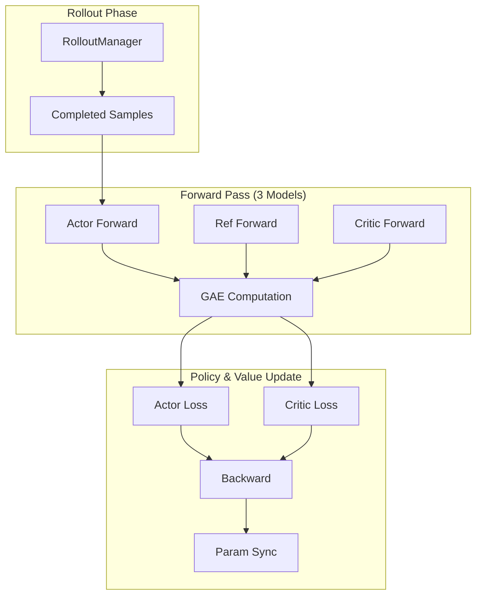
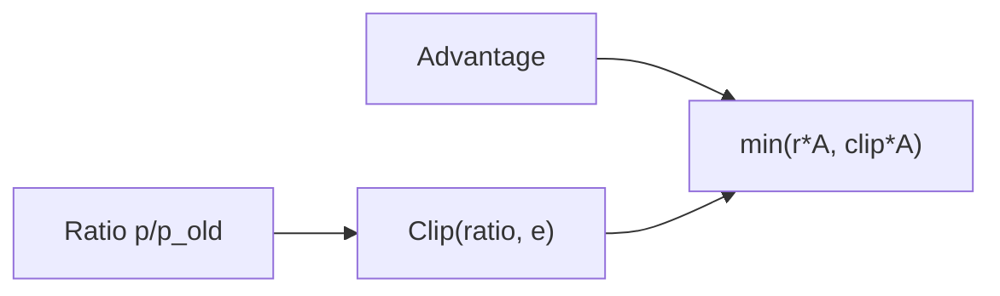

# PPO 训练

*配置近端策略优化（PPO）、了解双裁剪实现细节，并调优 Actor-Critic 设置。*

## 概述

!!! tip "核心要点"
    PPO 与 Actor 并行训练 Critic（价值函数），与 GRPO 的组相对方法相比，可提供方差更低的优势估计。代价是：PPO 需要约 50% 更多 GPU 内存（3 个模型 vs 2 个），且需要仔细调整 Critic 学习率——建议初始值设为 Actor lr 的 10 倍（如 `actor lr=1e-6`，`critic lr=1e-5`）。PPO 使用 `rollout.n=1`；每个 prompt 多个样本不适用于 PPO。

siirl-agentic 中的 PPO 训练使用三个模型：

-   **Actor** — 被优化的策略模型
-   **Reference** — 冻结的参考副本，用于计算 KL 散度
-   **Critic** — 价值函数估计器，用于计算优势值

!!! note "Dual-Clip PPO"
    siirl-agentic 实现的是 **Dual-clip PPO**，而非标准（单裁剪）PPO。除了标准的上限裁剪比例之外，Dual-clip PPO 还对负优势值使用 `clip_ratio_c` 应用下限裁剪约束。这可以防止策略在负方向上做出过大的更新，从而提高训练稳定性。详见下方"Dual-Clip 参数"章节。

## PPO 专属配置

``` yaml
actor_ref:
  algorithm:
    adv_estimator: ppo           # 使用 PPO 优势估计
    gamma: 1.0                   # 折扣因子
    lam: 1.0                     # GAE lambda
    kl_penalty: kl               # KL 惩罚类型

  actor:
    ppo_mini_batch_size: 256     # 小批量大小
    ppo_micro_batch_size_per_gpu: 8  # 每 GPU 微批量
    clip_ratio: 0.2              # PPO 裁剪比例（上限）
    clip_ratio_low: null         # 下限裁剪（null = 与 clip_ratio 对称）
    clip_ratio_high: null        # 上限裁剪（null = 使用 clip_ratio）
    clip_ratio_c: 3.0            # 负优势值的 Dual-clip 下限
    ppo_epochs: 1                # 每批次 PPO 更新轮数
    entropy_coeff: 0.0           # 熵正则化
    use_kl_loss: false           # 是否添加额外 KL loss
    kl_loss_coef: 0.0            # KL loss 系数（use_kl_loss=true 时生效）
    kl_loss_type: low_var_kl     # KL loss 变体："kl" 或 "low_var_kl"
    loss_agg_mode: token-mean    # Loss 聚合方式："token-mean" 或 "seq-mean"

  ref:
    log_prob_micro_batch_size_per_gpu: 8  # 参考模型前向批量

critic:
  ppo_mini_batch_size: 256
  ppo_micro_batch_size_per_gpu: 8
  ppo_epochs: 1
  cliprange_value: 0.5          # 价值函数裁剪范围
  optim:
    lr: 1e-5                    # Critic 学习率（通常高于 Actor）

rollout:
  n: 1                          # PPO 每个 prompt 只生成 1 个样本
```

## 最小可运行示例

``` bash
export MODEL_PATH=/path/to/Qwen3-8B
export TRAIN_DATA_PATH=/path/to/train.parquet
export TEST_DATA_PATH=/path/to/test.parquet

bash examples/ppo_train/run_qwen3_8b_separated.sh
```

## PPO 训练流程



*图 1: PPO 训练数据流*

## Dual-Clip PPO 详解

标准 PPO 将概率比率裁剪到 `[1 - clip_ratio, 1 + clip_ratio]` 范围内。Dual-clip PPO 为负优势值增加了额外的下限约束：

- 当优势 > 0 时：比率被裁剪到 `[1 - clip_ratio, 1 + clip_ratio]`（与标准 PPO 相同）
- 当优势 < 0 时：比率额外被裁剪到最大值 `clip_ratio_c`（默认：3.0），防止模型对降低不良响应概率做出过大的更新



*图 2: Dual-clip PPO 目标函数*

由以下三个参数控制：

| 参数                      | 默认值  | 说明                                 |
| ----------------------- | ---- | ---------------------------------- |
| `actor.clip_ratio`      | 0.2  | 标准对称裁剪范围                           |
| `actor.clip_ratio_c`    | 3.0  | 负优势值的 Dual-clip 下限                 |
| `actor.clip_ratio_low`  | null | 覆盖下限裁剪（null = 使用 `1 - clip_ratio`） |
| `actor.clip_ratio_high` | null | 覆盖上限裁剪（null = 使用 `1 + clip_ratio`） |

## 关键参数

| 参数                           | 影响                | 推荐范围        |
| ---------------------------- | ----------------- | ----------- |
| `actor_ref.actor.optim.lr`   | 策略学习率             | 1e-7 到 1e-5 |
| `critic.optim.lr`            | 价值函数学习率           | 1e-6 到 1e-4 |
| `actor_ref.actor.clip_ratio` | PPO 裁剪范围          | 0.1 到 0.3   |
| `critic.cliprange_value`     | 价值裁剪范围            | 0.2 到 0.5   |
| `actor_ref.algorithm.gamma`  | 折扣因子              | 0.99 到 1.0  |
| `actor_ref.algorithm.lam`    | GAE lambda        | 0.95 到 1.0  |
| `trainer.critic_warmup`      | Critic 预热步数（默认：0） | 0 到 10      |

## PPO vs GRPO

| 维度          | PPO                  | GRPO        |
| ----------- | -------------------- | ----------- |
| 模型数量        | Actor + Ref + Critic | Actor + Ref |
| GPU 占用      | 较高（3 个模型）            | 较低（2 个模型）   |
| `rollout.n` | 1（单样本）               | 8+（分组采样）    |
| 优势估计        | Critic 的 GAE 值       | 组内相对奖励      |
| 稳定性         | 更稳定                  | 更简单，但方差较大   |

## 实现细节

!!! tip "双裁剪参数的实际默认值"
    完整的双裁剪参数及其实际默认值：

```yaml
actor_ref:
  actor:
    clip_ratio: 0.2        # 标准对称裁剪（在 1.0 附近 ±0.2）
    clip_ratio_low: 0.2    # 显式下限（默认与 clip_ratio 相同）
    clip_ratio_high: 0.2   # 显式上限（默认与 clip_ratio 相同）
    clip_ratio_c: 3.0      # 负优势值的双裁剪常数
```

将 `clip_ratio_c` 增大至默认值 3.0 以上可允许对负优势样本进行更大幅度的更新。

### GAE 默认值

```yaml
actor_ref:
  algorithm:
    gamma: 1.0   # 折扣因子 — 1.0 = 不折扣（适合情节式任务）
    lam: 1.0     # GAE lambda — 1.0 = 蒙特卡罗回报（无偏差）
```

`gamma=1.0` 和 `lam=1.0` 的 GAE 退化为普通蒙特卡罗优势估计，适用于有明确边界的 agentic 情节式任务。

### 价值损失：裁剪 MSE

Critic 损失使用裁剪 MSE 来防止价值函数大幅更新：

```python
# Critic 价值损失伪代码
v_clipped = old_value + clip(new_value - old_value, -cliprange_value, +cliprange_value)
loss = max(MSE(new_value, returns), MSE(v_clipped, returns))
```

`cliprange_value=0.5` 表示价值函数每步更新幅度不超过 0.5。

### CriticWorker

Critic 模型实现为 `siirl/worker/actor/trainer.py` 中的 `CriticWorker` 类。它使用与 Actor 相同的基础模型架构，但附加了标量价值头。在 separated 模式下，Critic 占用独立的 GPU 分区。

### ppo_epochs

`ppo_epochs=1`（默认值）表示每个收集的批次只进行一次梯度步。更高的值（2–4）可提高样本效率，但由于数据变得陈旧，策略散度风险增加。

## 常见问题

| 现象             | 原因                     | 解决方案                                           |
| -------------- | ---------------------- | ---------------------------------------------- |
| Value loss 发散  | Critic 学习率过高           | 降低 `critic.optim.lr`                           |
| 奖励无提升          | clip_ratio 过小          | 增大 `actor_ref.actor.clip_ratio`                |
| Critic OOM     | 微批量过大                  | 减小 `critic.ppo_micro_batch_size_per_gpu`       |
| KL 散度突增        | 学习率过高                  | 降低 `actor_ref.actor.optim.lr`，启用 `use_kl_loss` |
| Critic 预测常数价值  | Critic lr 过低或缺少预热      | 使用 `trainer.critic_warmup=5` 预训练 critic        |
| Critic 预热前策略更新 | `critic_warmup=0`（默认值） | 设置 `trainer.critic_warmup` 为 3–10 步            |
| Actor loss 震荡  | `ppo_epochs` 过高        | agentic 任务保持默认值 1                              |

## 下一步

- [GRPO 训练](grpo_training.md) — 了解无 Critic 的分组采样方案，与 PPO 的 Actor-Critic 方式对比
- [性能调优](performance_tuning.md) — 针对 PPO 设置优化 GPU 利用率和训练吞吐量
- [最佳实践](../reference/best_practices.md) — 长时间训练前的飞行前检查清单和常见陷阱
