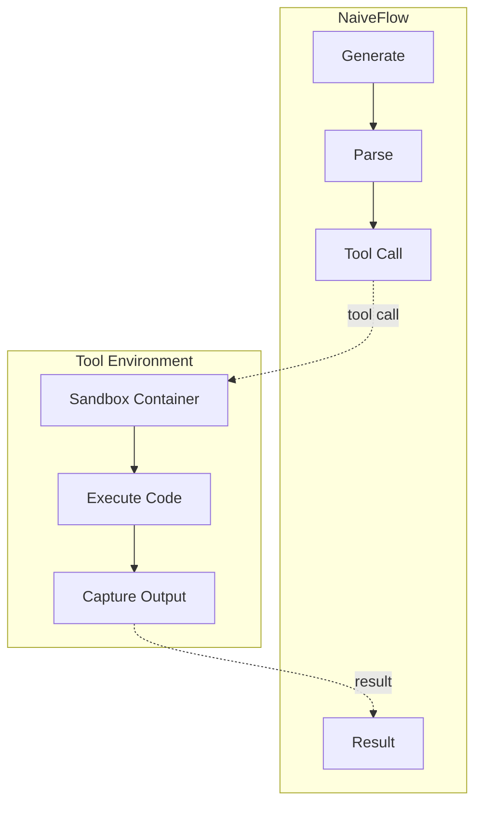
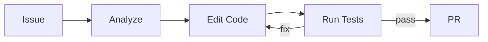

# 工具环境

*配置和实现 SWE-bench 及类似编程任务的工具环境，涵盖注册系统与自定义工具开发。*

## 概述

!!! tip "核心要点"
    每个工具环境必须定义两件事：实现 `create()` 和 `step()` 的 Python 类，以及告诉 siirl-agentic 加载哪个类及其 OpenAI function schema 的 YAML 配置。Schema 通过 `tokenizer.apply_chat_template(tools=...)` 传递给模型——如果 schema 与模型期望不匹配，工具调用将无法生成。大多数模型使用 Hermes 格式（`env_kwargs.tool_format: hermes`）；只有针对 GPT 风格工具 token 训练的模型才切换到 `gpt-oss`。

siirl-agentic 支持在 SWE 风格任务上进行 agentic 训练，模型与代码沙箱、文件系统和测试运行器进行交互。工具环境系统为这些交互提供统一接口。

## 工具环境架构



*图 1: 工具环境架构*

## 核心类

### EnvManager（`siirl/environment/__init__.py`）

`EnvManager` 是一个 dataclass，持有所有注册的工具：

``` python
@dataclass
class EnvManager:
    env_list: list          # 所有 ToolEnv 实例
    env_name: dict          # {tool_name: ToolEnv} 用于分派的映射
    tool_schemas: list      # OpenAI 函数工具 schema，用于 chat template
    tool_parser: ToolParser # 将模型输出解析为 FunctionCall 对象
    tool_parser_name: str   # "hermes" 或 "gpt-oss"
```

它由 `initialize_env(config)` 创建，从工具配置 YAML 文件（`env_path`）读取。

### ToolEnv 基类（`siirl/environment/tool_env/base_tool_env.py`）

``` python
class ToolEnv(BasEnvironment):
    def __init__(self, config, tool_schema: OpenAIFunctionToolSchema):
        self.config = config
        self.tool_schema = tool_schema or self.get_openai_tool_schema()
        self.name = self.tool_schema.function.name   # 用于 EnvManager 中的分派
        self._instance_dict = {}

    def get_openai_tool_schema(self) -> OpenAIFunctionToolSchema:
        """返回工具 schema（可覆盖）。"""
        return self.tool_schema

    async def release(self, instance_id: str):
        """释放工具实例。覆盖此方法以添加清理逻辑。"""
        pass
```

子类必须实现：

- `async def create(self, create_kwargs=None, **kwargs) -> tuple[str, EnvResponse]` — 创建工具实例
- `async def step(self, action: dict) -> EnvResponse` — 执行工具动作

### EnvResponse（`siirl/environment/base.py`）

``` python
class EnvResponse(BaseModel):
    text: str | None = None        # 工具返回的文本响应
    image: list[Any] | None = None # 图像输出（用于 VLA 任务）
    video: list[Any] | None = None # 视频输出（用于 VLA 任务）
    rewards: float | None = None   # 可选的逐步奖励
    complete: bool = False         # True = 终止轨迹
    metrics: dict | None = None    # 可选的日志指标
```

### FunctionCall（`siirl/environment/tool_env/utils/tool_parser.py`）

``` python
class FunctionCall(BaseModel):
    name: str         # 工具函数名
    arguments: str    # JSON 编码的参数字符串
```

## 工具注册系统

### 工具注册流程



*图 2: 工具注册流程*

### 工具配置 YAML

工具通过 YAML 配置文件注册（由 `rollout.multiturn.env_path` 引用）：

``` yaml
tools:
  - class_name: siirl.environment.tool_env.aio_search_env.AIOSearchEnv
    config:
      type: native          # ToolType: "native" 或 "mcp"
      # ... 工具特定配置
    tool_schema:
      type: function
      function:
        name: search
        description: "Search for information"
        parameters:
          type: object
          properties:
            query_list:
              type: array
              items:
                type: string
          required: ["query_list"]
```

### 注册原理（`siirl/environment/tool_env/utils/tool_register.py`）

`initialize_tools_from_config(tools_config_file)`：

1. 使用 `OmegaConf.load()` 加载 YAML 配置
2. 对每个工具条目：
   - 通过 `class_name`（例如 `module.path.ClassName`）动态导入类
   - 验证 `config.type` 为 `ToolType` 枚举（`"native"` 或 `"mcp"`）
   - 将 `tool_schema` 解析为 `OpenAIFunctionToolSchema` Pydantic 模型
   - 实例化工具：`tool_cls(config=..., tool_schema=...)`
3. 返回 `(tool_list, tool_name_dict, tool_schemas)` — 用于构建 `EnvManager`

### ToolParser 注册表

`ToolParser` 使用类级别的 `_registry` 字典和 `@ToolParser.register(name)` 装饰器：

``` python
# 内置解析器：
@ToolParser.register("hermes")
class HermesToolParser(ToolParser): ...

@ToolParser.register("gpt-oss")
class GptOssToolParser(ToolParser): ...
```

获取解析器：`ToolParser.get_tool_parser("hermes", tokenizer)`

## 内置工具环境

### AIO 搜索环境

用于检索增强型任务，使用 AIO 分布式工具基础设施：

``` yaml
rollout:
  multiturn:
    env_type: tool_env
    env_path: /path/to/search_tools.yaml
    env_kwargs:
      tool_format: hermes
```

关键文件：`siirl/environment/tool_env/aio_search_env.py`

`AIOSearchEnv` 连接到 AIO Proxy 服务器以分派搜索查询。部署详情参见 [AIO 工具基础设施](aio_tool_infrastructure.md)。

## 实现自定义工具环境

### 第一步：定义工具类

``` python
# my_tools/sandbox_tool.py
from siirl.environment.tool_env.base_tool_env import ToolEnv
from siirl.environment.base import EnvResponse
from siirl.environment.tool_env.utils.schemas import OpenAIFunctionToolSchema

class SandboxTool(ToolEnv):
    def __init__(self, config, tool_schema: OpenAIFunctionToolSchema):
        super().__init__(config, tool_schema)
        self.sandbox_url = config.get("sandbox_url", "http://localhost:9000")

    async def create(self, create_kwargs=None, **kwargs):
        """创建沙箱实例。"""
        instance_id = await self._provision_sandbox(create_kwargs or {})
        return instance_id, EnvResponse()

    async def step(self, action: dict) -> EnvResponse:
        """在沙箱中执行代码。"""
        instance_id = action.pop("instance_id")
        code = action.get("code", "")
        result = await self._run_code(instance_id, code)
        return EnvResponse(
            text=result.output,
            rewards=1.0 if result.tests_passed else 0.0,
            complete=result.all_tests_passed,
        )

    async def release(self, instance_id: str):
        """销毁沙箱实例。"""
        await self._destroy_sandbox(instance_id)
```

### 第二步：创建工具配置 YAML

``` yaml
# tools_config.yaml
tools:
  - class_name: my_tools.sandbox_tool.SandboxTool
    config:
      type: native
      sandbox_url: http://sandbox-host:9000
    tool_schema:
      type: function
      function:
        name: execute_code
        description: "Execute Python code in a sandbox"
        parameters:
          type: object
          properties:
            code:
              type: string
              description: "Python code to execute"
          required: ["code"]
```

### 第三步：配置训练

``` yaml
rollout:
  flow_function: naive
  multiturn:
    env_type: tool_env
    env_path: tools_config.yaml
    max_env_turns: 10
    max_assistant_turns: 20
    max_env_response_length: 1024
    env_kwargs:
      tool_format: hermes

data:
  max_response_length: 16384   # SWE 任务需要长上下文
```

## SWE-Bench 配置

用于 SWE-bench 风格的代码编辑与测试执行任务：

``` yaml
rollout:
  flow_function: naive
  multiturn:
    env_type: tool_env
    env_path: /path/to/swe_tools.yaml
    max_env_turns: 10
    max_assistant_turns: 20
    max_parallel_calls: 1        # SWE 任务使用顺序工具调用
    max_env_response_length: 1024
    env_response_truncate_side: middle  # 保留长输出的首尾部分
    env_kwargs:
      tool_format: hermes

data:
  max_response_length: 16384   # SWE 任务生成长轨迹
  max_prompt_length: 4096      # SWE 提示可能较长（issue + 代码上下文）
```

!!! tip "用于 SWE 的 AgentFlow"
    siirl-agentic 还包含一个内置的 SWE AgentFlow，位于 `siirl/execution/rollout/agentflow/swe/`。这是一个独立于 NaiveFlow 的系统，使用 AgentFlow Protocol 实现更灵活的 SWE 任务定义。使用 `rollout.agentflow.name=swe` 激活。

## 工具目录（`siirl/environment/tool_env/utils/`）

| 文件                        | 说明                                                                         |
| ------------------------- | -------------------------------------------------------------------------- |
| `tool_parser.py`          | `ToolParser` ABC 及注册表、`HermesToolParser`、`GptOssToolParser`、`FunctionCall` |
| `tool_register.py`        | `initialize_tools_from_config()`、`ToolType` 枚举、动态类加载                       |
| `schemas.py`              | `OpenAIFunctionToolSchema` Pydantic 模型，用于工具 API schema                     |
| `tool_call.py`            | 工具调用实用函数                                                                   |
| `sandbox_fusion_utils.py` | 沙箱专用工具函数                                                                   |

## 工具环境正常运行的标志

工具环境配置正确时，应呈现以下表现：

| 指标                         | 健康状态                   | 问题信号                   |
| -------------------------- | ---------------------- | ---------------------- |
| 工具解析成功率                    | >95% 含工具调用的模型输出可被正确解析  | 过低 = `tool_format` 不匹配 |
| `EnvResponse.complete` 比例  | 训练中逐步提高                | 始终为 0 = 任务从未完成         |
| `rollout/env_duration`     | 延迟稳定（搜索 < 2s，代码 < 10s） | 持续增长 = 工具服务器瓶颈         |
| `EnvResponse` 中的 `rewards` | 部分积分任务中非零              | 始终为 0 = 奖励函数未连接        |
| `create()`/`release()` 平衡  | 随时间无实例泄漏               | 泄漏 → 沙箱池耗尽             |

## 常见问题

| 问题                          | 症状                                 | 解决方案                                              |
| --------------------------- | ---------------------------------- | ------------------------------------------------- |
| 沙箱不可访问                      | 工具执行超时                             | 检查 AIO Proxy 连接状态                                 |
| `max_response_length` 过小    | 编辑不完整                              | 增大到 16384+                                        |
| `tool_format` 不匹配           | 工具调用未被解析                           | 与模型期望的格式保持一致                                      |
| 缺少 `env_path`               | `Error: tools_config_file is None` | 指向工具配置 YAML 文件                                    |
| `config.type` 不是 `"native"` | `NotImplementedError`              | 目前仅支持 `native` 类型                                 |
| 工具类无法导入                     | `ModuleNotFoundError`              | 确保 `class_name` 路径在 `PYTHONPATH` 中                |
| 过早返回 `complete=True`        | 任务未解决就终止轨迹                         | 只在明确成功/失败时才设置 `complete=True`                     |
| 未实现 `release()`             | 沙箱实例泄漏                             | 务必实现 `release()` 销毁实例                             |
| 忘记 `arguments` 是 JSON 字符串   | 工具内部 `json.loads()` 报错             | `FunctionCall.arguments` 是 `str`，不是 `dict`，需要手动解析 |

## 下一步

- [AIO 工具基础设施](aio_tool_infrastructure.md) — 使用分布式调度和自动扩缩将工具环境投入生产规模
- [Agentic 多轮训练](agentic_multiturn.md) — 工具环境定义完成后，配置多轮 rollout 参数
- [AgentFlow 协议](../concepts/agentflow_protocol.md) — 构建集成工具环境的完全自定义 rollout 流水线
