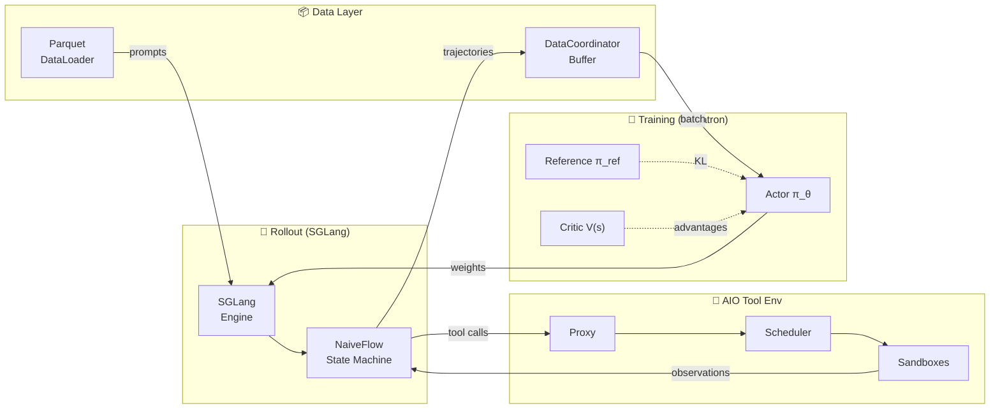

# siirl-agentic

> 异步多轮 Agentic RL 训练框架 — 工具感知、GPU 高效、生产就绪。

## 快速开始

```bash
# 安装
pip install -e "siirl-agentic/[all]"

# 单节点 GRPO 训练（4 张 GPU）
python siirl/async_train.py \
    --config-name grpo_qwen2.5_7b \
    actor_rollout_ref.model.path=Qwen/Qwen2.5-7B-Instruct \
    trainer.n_gpus_per_node=4 \
    trainer.total_epochs=3
```

完整步骤参见 [安装指南](get_started/installation.md) 和 [快速入门](get_started/quickstart.md)。

## 架构一览

系统由三大核心组件通过 Ray 连接：**训练组**（Megatron-LM actors）、**Rollout 管理器**（SGLang 推理引擎）和 **AIO 工具环境**（多轮 Agent 交互）。**DataCoordinator** 缓冲已完成的轨迹并提供训练 batch，异步循环编排整个数据流。



> 详细的组件说明参见 [架构概览](concepts/architecture_overview.md) 和 [异步训练生命周期](concepts/async_training_lifecycle.md)。

## 文档导航

- **快速上手** — [快速入门](get_started/quickstart.md) → [第一个 Agentic 任务](get_started/first_agentic_training_job.md)
- **复现基准结果** — [DeepScaleR GRPO 教程](tutorials/deepscaler_grpo.md) → [算法基线](reference/algorithm_baselines.md)
- **理解架构** — [工作原理](concepts/how_it_works.md) → [架构概览](concepts/architecture_overview.md)
- **训练自定义任务** — [数据准备](guides/data_preparation.md) → [自定义奖励函数](guides/custom_rewards.md)
- **训练带工具的 Agent** — [SWE Agent 教程](tutorials/swe_agent_training.md) → [工具环境](guides/tool_env_and_swe.md)
- **跨多节点部署** — [AIO 基础设施](concepts/aio_infrastructure.md)
- **优化性能** — [性能调优](guides/performance_tuning.md) → [内存溢出处理](guides/handling_oom.md)
- **从 checkpoint 恢复** — [检查点与恢复](guides/checkpoint_resume.md)
- **调试问题** — [调试指南](guides/debugging.md) → [故障排查](reference/troubleshooting.md)
- **扩展框架** — [添加流程](contributing/adding_new_executor_or_flow.md) → [自定义 Agent](guides/custom_agent.md)
- **贡献代码** — [贡献指南](contributing/contributing.md)

## 为什么选择 siirl-agentic？

训练 LLM Agent 使用工具需要**多轮交互** — 模型生成、环境响应、再次生成，可能每个 episode 数十轮。现有 RL 框架将此视为附加功能，siirl-agentic 在架构层面解决：

| 挑战             | 现有框架         | siirl-agentic                                            |
| -------------- | ------------ | -------------------------------------------------------- |
| **多轮轨迹**       | 手动状态管理       | NaiveFlow 状态机 — 逐轮追踪 token、loss mask                    |
| **工具 I/O 阻塞**  | 同步等待，GPU 空闲  | 异步 MPMD — rollout 和训练独立运行，GPU 永不等待                      |
| **工具环境扩缩容**    | 无内置编排        | AIO 三层调度器 + Holt-Winters 自动扩缩容                          |
| **Loss 污染**    | 全序列统一 mask   | 逐轮 mask — 仅模型生成 token 参与梯度计算                            |
| **奖励粒度**       | 每 episode 单一标量 | 逐轮 `EnvResponse.rewards` + `AgentFlow.reward()` 结果奖励     |

## 你可以做什么

???+ example "在 SWE 任务上训练编码 Agent"

    siirl-agentic 内置了一个完整的 SWE agent（`siirl/execution/rollout/agentflow/swe/`），它能读取 GitHub Issue、在沙箱环境中编辑文件，并运行测试来验证补丁。接入你的奖励函数，几分钟内即可开始训练。

    完整流程参见 [Agentic 多轮训练](guides/agentic_multiturn.md)。

???+ example "无需 Critic 模型运行 GRPO 训练"

    GRPO 通过组相对分数计算优势，无需训练或同步价值网络。与 PPO 相比，GPU 显存占用减少约一半，也省去了 value head 预热阶段。

    ```bash
    python siirl/async_train.py \
        --config-name grpo_qwen2.5_7b \
        actor_rollout_ref.model.path=Qwen/Qwen2.5-7B-Instruct \
        algorithm.adv_estimator=grpo \
        actor_rollout_ref.rollout.n=8
    ```

    配置详情参见 [GRPO 训练](guides/grpo_training.md)。

???+ example "弹性工具调度扩展至多节点"

    AIO 工具基础设施作为独立 Ray actor 运行，与训练和 rollout worker 解耦。向 Ray 集群添加节点后，工具调度器自动吸收额外容量，无需修改任何配置。

    扩缩容模型与 placement group 布局参见 [AIO 基础设施](concepts/aio_infrastructure.md)。

???+ example "用 AgentFlow 定义自定义任务流水线"

    AgentFlow 是一个三方法协议 — `preprocess()`、`generate()`、`reward()` — 实现一次后通过配置注入训练循环，无需继承框架特定基类或编写样板代码。

    ```python
    class MyFlow(AgentFlow):
        def preprocess(self, batch): ...
        def generate(self, batch, engine): ...
        def reward(self, trajectories): ...
    ```

    完整契约与注入机制参见 [AgentFlow 协议](concepts/agentflow_protocol.md)。

## 支持的算法

| 算法                | 估计器       | Critic | 适用场景         |
| ----------------- | --------- | ------ | ------------ |
| **Dual-clip PPO** | GAE       | 是      | 密集奖励，精细塑形    |
| **GRPO**          | 组相对       | 否      | 通过/失败奖励，显存受限 |
| **Dr.GRPO**       | 组相对（未归一化） | 否      | 绝对尺度奖励       |

## 下一步

新手？从 [快速入门](get_started/quickstart.md) 开始。已熟悉？直接浏览 [使用指南](guides/configuration_system.md) 或 [配置参考](reference/config_reference.md)。
