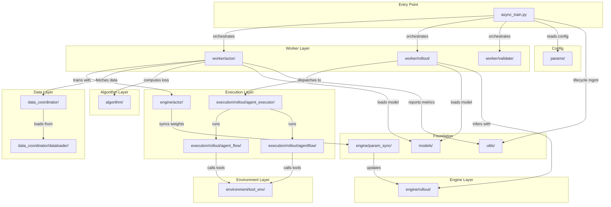

# 模块地图

*顶层目录到其职责和关键文件的快速参考映射。*

## 模块依赖概览

*图 1：模块依赖关系图*

## 顶层结构

    siirl-agentic/
    ├── siirl/                    # 主包
    │   ├── async_train.py        # 入口点：MainRunner Ray Actor
    │   ├── algorithm/            # RL 算法实现
    │   ├── data_coordinator/     # 异步数据缓冲与加载
    │   ├── engine/               # GPU 计算引擎
    │   ├── environment/          # 工具环境与基类
    │   ├── execution/            # Rollout 编排
    │   ├── models/               # 模型加载与权重管理
    │   ├── params/               # 配置数据类
    │   ├── utils/                # 共享工具函数
    │   └── worker/               # Ray Actor 工作进程
    ├── examples/                 # 训练脚本与配置
    ├── scripts/                  # 工具脚本
    ├── tests/                    # 测试套件
    └── docs/                     # 文档（本站）

## 模块详情

### `siirl/async_train.py`

主入口点。将 `MainRunner` 实现为一个 8 阶段生命周期的 Ray Actor：

1.  解析配置 → 2. 分配资源 → 3. 初始化 DataCoordinator → 4. 初始化组件 → 5. 异步训练循环 → 6. 等待 → 7. 检查状态 → 8. 清理

### `siirl/algorithm/`

| 文件              | 说明                               |
| --------------- | -------------------------------- |
| `advantage.py`  | GAE 和组相对优势估计（GRPO/Dr.GRPO）       |
| `loss.py`       | Dual-clip PPO loss、GRPO loss、熵奖励 |
| `kl_penalty.py` | Actor 与 Reference 之间的 KL 散度计算    |

### `siirl/data_coordinator/`

| 文件               | 说明                                                 |                                                         |
| ---------------- | -------------------------------------------------- | ------------------------------------------------------- |
| `data_buffer.py` | `DataCoordinator` Ray Actor — rollout 与训练之间的异步样本缓冲 |                                                         |
| `protocol.py`    | 组件间数据交换协议                                          |                                                         |
| `sample.py`      | `Sample` Pydantic 模型 — 字段为 `np.ndarray             | None`（prompts、responses、response_mask、rollout_log_prob） |
| `dataloader/`    | 数据集加载与批处理逻辑                                        |                                                         |

!!! note "两个 Sample 类"
    `siirl/data_coordinator/sample.py:Sample`（Pydantic，`np.ndarray` 字段）供 NaiveFlow 使用。`siirl/execution/rollout/agentflow/base.py:Sample`（dataclass，`list` 字段）供 AgentFlow 使用。详见[两个 Sample 类](../concepts/architecture_overview.md#two-sample-classes)。

### `siirl/engine/`

| 目录            | 说明                            |
| ------------- | ----------------------------- |
| `actor/`      | Actor 模型引擎（前向/反向，Megatron 集成） |
| `param_sync/` | Actor 与 rollout 引擎之间的参数同步     |
| `rollout/`    | 基于 SGLang 的 rollout 推理引擎      |

### `siirl/environment/`

| 文件                                | 说明                                                            |
| --------------------------------- | ------------------------------------------------------------- |
| `__init__.py`                     | `EnvManager` 数据类、`initialize_env()` — 从配置创建工具                 |
| `base.py`                         | `BasEnvironment` 抽象基类、`EnvResponse` Pydantic 模型               |
| `tool_env/base_tool_env.py`       | `ToolEnv` — 基于 OpenAI 函数调用的工具 schema 基类                       |
| `tool_env/aio_search_env.py`      | `AIOSearchEnv` — 使用 AIO HTTP API 的具体工具环境                      |
| `tool_env/utils/tool_parser.py`   | `ToolParser` 抽象基类（含注册表）、`HermesToolParser`、`GptOssToolParser` |
| `tool_env/utils/tool_register.py` | `initialize_tools_from_config()`、`ToolType` 枚举                |
| `tool_env/utils/schemas.py`       | `OpenAIFunctionToolSchema` Pydantic 模型                        |

### `siirl/execution/rollout/`

| 文件/目录                      | 说明                                                                      |
| -------------------------- | ----------------------------------------------------------------------- |
| `agent_flow/naive_flow.py` | `NaiveFlow` — 多轮 rollout 状态机（生产系统）                                      |
| `agentflow/base.py`        | `AgentFlow` Protocol（`preprocess → generate → reward`）、`Sample`、`Model` |
| `agentflow/__init__.py`    | `load_agentflow(config, model)` — 动态函数注入                                |
| `agentflow/swe/`           | 内置 SWE AgentFlow 实现                                                     |
| `agent_executor/`          | Agent 执行编排器                                                             |
| `utils.py`                 | `AgentData`、`AgentState` 枚举                                             |
| `concurrency.py`           | 并发解析工具函数                                                                |

!!! note "NaiveFlow vs AgentFlow"
    `agent_flow/naive_flow.py`（NaiveFlow）和 `agentflow/`（AgentFlow Protocol）是**两个独立的 rollout 系统**。NaiveFlow 通过 `flow_function: naive` 激活。AgentFlow 通过 `rollout.agentflow.name` 激活。

### `siirl/models/`

| 文件/目录                       | 说明                 |
| --------------------------- | ------------------ |
| `loader.py`                 | 模型权重加载工具           |
| `weight_loader_registry.py` | 权重格式转换器注册表         |
| `mcore/`                    | Megatron-Core 模型实现 |
| `llama/`                    | LLaMA 特定模型工具       |
| `patcher.py`                | 模型架构修补工具           |

### `siirl/params/`

| 文件                 | 说明                                                                                                               |
| ------------------ | ---------------------------------------------------------------------------------------------------------------- |
| `training_args.py` | `SiiRLArguments`（顶层）、`TrainingArguments`                                                                         |
| `model_args.py`    | `ModelArguments`、`ActorArguments`、`RolloutArguments`、`AlgorithmArguments`、`CriticArguments`、`MultiturnArguments` |
| `data_args.py`     | `DataArguments` — 数据集路径、长度、批次大小                                                                                  |
| `parser.py`        | `parse_config()` — 使用 `argparse` + `OmegaConf.from_cli()` 的 CLI 解析器                                              |
| `display_dict.py`  | 配置展示与序列化                                                                                                         |

### `siirl/utils/`

| 文件/目录                  | 说明                                      |
| ---------------------- | --------------------------------------- |
| `task_coordinator.py`  | `TaskCoordinator` Ray Actor — 分布式生命周期管理 |
| `timer.py`             | 训练计时器与性能分析                              |
| `distributed_utils.py` | 分布式通信辅助函数                               |
| `checkpoint/`          | 检查点保存/加载逻辑                              |
| `logger/`              | 日志配置（基于 loguru）                         |
| `megatron/`            | Megatron-Core 集成工具                      |
| `metrics/`             | `MetricWorker` — 训练指标收集与上报（仅 rank 0）    |
| `model_utils/`         | 模型工具函数                                  |
| `net_utils/`           | 网络与端口工具                                 |
| `reward_score/`        | 奖励评分函数（自定义奖励实现）                         |

### `siirl/worker/`

| 目录          | 说明                                                         |
| ----------- | ---------------------------------------------------------- |
| `actor/`    | `TrainerGroup` — 管理 Ray trainer actor 的协调类（本身不是 Ray Actor） |
| `rollout/`  | `RolloutManager` — 编排多个 SGLang 引擎的 Ray Actor               |
| `validate/` | `ValidateProgressMonitor` — 验证进度追踪                         |

## 外部依赖

| 组件     | 包                       | 作用                   |
| ------ | ----------------------- | -------------------- |
| 分布式编排  | `ray`                   | Actor 模型、资源管理        |
| 推理引擎   | `sglang`                | rollout 的高吞吐量 LLM 推理 |
| 模型框架   | `transformers`          | 模型加载、分词              |
| GPU 训练 | `torch` + Megatron-Core | 带张量/流水线并行的分布式训练      |
| 工具调度   | `AIO`（独立仓库）             | 弹性工具实例管理             |
| 配置解析   | `omegaconf`             | CLI 点分语法解析           |

## 相关文档

-   [架构概览](../concepts/architecture_overview.md) — 高层系统设计
-   [代码结构](../contributing/code_structure.md) — 开发者向代码库导览
