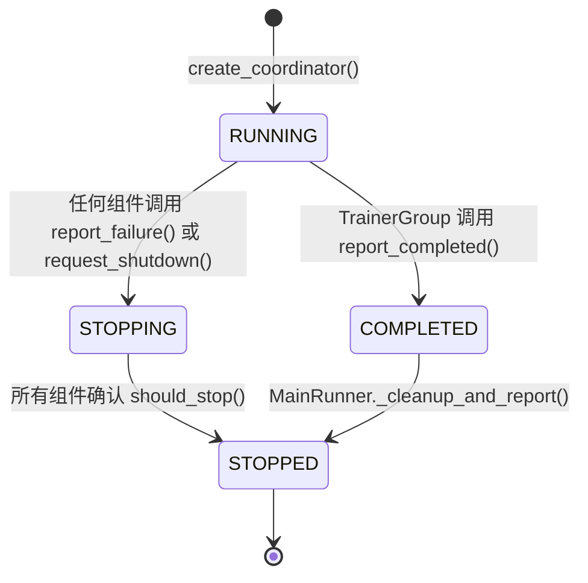

# 常见问题与排障

*诊断并解决 siirl-agentic 训练过程中最常见的故障模式。*

## 快速诊断指南

使用此表格快速定位问题类别并跳转到解决方案：

| 现象                 | 类别      | 快速修复                                              |
| -------------------- | --------- | ----------------------------------------------------- |
| Ray 连接失败         | 初始化    | `ray stop --force && ray start --head`                |
| GPU 分配错误         | 初始化    | 减少 `actor_gpus` + `rollout_gpus` 匹配可用数量      |
| SGLang 启动失败      | 初始化    | 降低 `rollout.gpu_memory_utilization`                 |
| CUDA OOM             | 训练      | 减小 `ppo_micro_batch_size_per_gpu` 或启用 `param_offload` |
| 训练无进展           | 训练      | 检查 tool env 日志和 DataCoordinator buffer           |
| 奖励始终为 0         | 多轮      | 确认 `data_source` 匹配奖励函数                      |
| 工具调用未检测到     | 多轮      | 设置 `tool_format: hermes` 或 `gpt-oss`              |
| AIO 连接失败         | 多轮      | 检查 AIO Proxy 健康端点                               |
| 工具超时             | 多轮      | 扩容 AIO 实例或增加超时时间                           |
| Rollout 过短         | 轨迹      | 增加 `max_env_turns` 和 `max_assistant_turns`         |
| 恢复失败             | 检查点    | 检查 `resume_mode` 和检查点路径                       |
| 磁盘满               | 检查点    | 设置 `max_actor_ckpt_to_keep: 5`                      |

## 常见报错

### `CUDA out of memory`

**最可能的原因：** `rollout.n` 过大，或在大模型下使用 colocate 模式。

**修复（按优先级）：**
1. 减小 `rollout.n`（先减半）
2. 从 colocated 切换到 separated 模式（`trainer.colocate: false`）
3. 启用参数卸载：`actor_ref.actor.megatron.param_offload: true`
4. 减小 `data.max_response_length`

在 colocated 模式下，框架自动将 `rollout.gpu_memory_utilization` 钳制到 0.45——不要覆盖此值。完整缓解清单见下方[训练 OOM](#训练-oom)。

### `SGLang server not responding`

**最可能的原因：** SGLang 在权重同步时崩溃，或权重更新后 GPU 内存不足。

**修复：**
1. 检查 SGLang 日志：`grep -i "error\|oom\|cuda" siirl_logs/*.log`
2. 如果是 OOM，增大 `rollout.gpu_memory_utilization`：设置为 0.6–0.7（默认 0.5），给 SGLang 更多显存余量
3. 如果 SGLang 服务器在长时间运行后内存碎片化，降低 `mem_fraction_static`
4. 检查 GPU 内存泄漏：重启前运行 `nvidia-smi`

SGLang 引擎崩溃**不会**自动恢复，必须重新启动完整的训练任务。

### `reward/mean` 始终为 0.0

**最可能的原因：** 奖励函数对所有样本返回 0，或工具环境静默失败。

**修复：**
1. 检查 rollout 日志中的 `ToolEnvError` 或工具调用解析失败
2. 用已知正确的样本对奖励函数做单元测试
3. 检查 `data.reward_fn_key` 与数据集列名是否匹配
4. 多轮场景：确认奖励函数能处理含工具轮次的轨迹（检查 `response_mask`）
5. 启用调试日志：`LOGURU_LEVEL=DEBUG python -m siirl.async_train ...`，查找奖励计算相关日志行

## 初始化故障

### Ray 连接问题

**现象：** `ConnectionError: Ray is not initialized`

**根因：** Ray 集群未启动或存在冲突的 Ray 进程。

**诊断：**

``` bash
ray status
```

**解决方案：**

``` bash
ray stop
ray start --head
```

### GPU 资源分配失败

**现象：** `ValueError: Not enough GPUs` 或 `actor_gpus + rollout_gpus > available`

**根因：** 请求的 GPU 数量超过可用资源。

**解决方案：** 确保 `trainer.actor_gpus + trainer.rollout_gpus <= 总 GPU 数`：

``` yaml
trainer:
  actor_gpus: 4       # 默认：2
  rollout_gpus: 4     # 默认：6
  # 总和必须 <= N_GPUS_PER_NODE × NNODES
```

### SGLang 引擎启动失败

**现象：** RolloutManager 初始化时 `TimeoutError`

**根因：** SGLang 引擎启动失败（模型加载、内存问题）。

**诊断：**

``` bash
# 检查 SGLang 日志
grep -i "error\|oom\|cuda" siirl_logs/*.log
```

**解决方案：**

- 降低 `rollout.gpu_memory_utilization`（默认：0.5）
- 确认模型路径正确且可访问
- 检查 CUDA 版本兼容性

## 训练循环问题

### 训练 OOM { #训练-oom }

**现象：** `torch.cuda.OutOfMemoryError`

**根因：** 批次对于可用 GPU 内存来说过大。

**按优先级解决：**

1. 减小 `actor_ref.actor.ppo_micro_batch_size_per_gpu`
2. 启用 `actor_ref.actor.megatron.param_offload: true`
3. 减小 `data.max_response_length`
4. 增加训练 GPU 数（`trainer.actor_gpus`）

### Colocated 模式 OOM

**现象：** rollout↔train 切换时 OOM

**根因：** 权重卸载后内存仍不足。

**解决方案：**

- 框架自动将 `rollout.gpu_memory_utilization` 钳制到 0.45——不要覆盖
- 增大 `trainer.colocate_timeout_s` 以适应慢速卸载（默认：60）

### 训练停滞/无进展

**现象：** 长时间无训练步日志

**根因：** Rollout 未产出样本（工具超时、所有样本失败）。

**诊断：**

``` bash
# 检查 DataCoordinator 状态
grep "DataCoordinator\|DataBuffer" siirl_logs/*.log | tail -20
```

**解决方案：**

- 检查工具环境是否可用（AIO Proxy 是否运行）
- 增大 `rollout.train_server_concurrency`
- 检查 `data.max_response_length` 是否过小

### 奖励始终为零

**现象：** 所有步骤 `reward/mean = 0.0`

**根因：** 奖励函数与期望格式不匹配。

**解决方案：**

- 验证自定义奖励函数返回非零值
- 检查 `data.reward_fn_key` 与数据集列名匹配
- 多轮场景：确认奖励函数兼容工具交互轨迹

## 多轮 / Agentic 问题

### 工具调用未被检测

**现象：** 模型生成了工具调用语法但 rollout 未执行工具

**根因：** 工具解析器格式不匹配。

**解决方案：**

``` yaml
rollout:
  multiturn:
    env_kwargs:
      tool_format: hermes    # 必须与模型的工具调用格式匹配
```

支持的格式：`hermes`（默认）、`gpt-oss`

### AIO Proxy 连接失败

**现象：** `Error: Exception occurred while getting server from master node`

**根因：** AIO Proxy 未运行或不可达。

**解决方案：**

``` bash
# 验证 AIO Proxy 是否运行
curl http://PROXY_HOST:PROXY_PORT/health

# 如果未运行则启动
python -m aio.Scheduler.proxy --config aio_config.yaml
```

### 工具环境超时

**现象：** 工具执行期间 `TimeoutError`

**根因：** 工具实例过载或无响应。

**解决方案：**

- 增加 AIO 配置中的工具实例数量
- 检查 AIO ResourcePool 容量：`curl http://proxy/status`
- 减小 `rollout.multiturn.max_parallel_calls`

### 轨迹过短

**现象：** 大多数 rollout 在第 1 轮就终止

**根因：** `max_assistant_turns=1` 或 `max_env_turns=1`（两者默认均为 1）

**解决方案：**

``` yaml
rollout:
  multiturn:
    max_env_turns: 5          # 默认：1
    max_assistant_turns: 10   # 默认：1
```

### 工具响应被意外截断

**现象：** 工具响应包含 `...(truncated)` 标记

**根因：** `max_env_response_length` 以**字符**为单位，不是 token。

**解决方案：**

``` yaml
rollout:
  multiturn:
    max_env_response_length: 1024   # 字符数，默认：256
```

## 检查点问题

### 恢复失败

**现象：** 恢复时 `FileNotFoundError`

**根因：** 检查点路径不存在或格式不兼容。

**解决方案：**

``` yaml
trainer:
  resume_mode: auto              # 自动检测最新检查点（默认）
  # 或明确指定：
  resume_mode: resume_path
  resume_from_path: /path/to/checkpoint
```

### 检查点过大 / 磁盘已满

**现象：** 保存/加载缓慢，磁盘已满

**根因：** `max_actor_ckpt_to_keep` 默认为 100——旧检查点可能累积。

**解决方案：**

``` yaml
trainer:
  max_actor_ckpt_to_keep: 5      # 只保留最新 5 个（默认：100）

actor_ref:
  checkpoint:
    save_contents: ["model"]      # 跳过优化器和额外状态
```

## 性能问题

### GPU 利用率低

**现象：** `nvidia-smi` 显示 <50% GPU 使用率

**根因：** Rollout 瓶颈（工具慢）或数据管道停滞。

**解决方案：**

- 增大 `trainer.async_factor` 以缓冲更多 rollout 批次（默认：1）
- 启用 off-policy：`trainer.off_policy_step: 2`（默认：0）
- 增加 rollout GPU 数
- 扩展 AIO 工具实例

### 参数同步慢

**现象：** 训练步之间有明显停顿

**根因：** 模型权重大、网络慢。

**解决方案：**

- 检查 `param_sync` 日志中的耗时详情
- 确保节点间使用 NVLink/InfiniBand 连接

## 故障传播与优雅关停

### TaskCoordinator 状态机

所有分布式故障处理都通过 `TaskCoordinator` Ray actor（`siirl/utils/task_coordinator.py`）流转。其状态机有三个终态：



*图：TaskCoordinator 状态机*

任何组件——`MainRunner`、`TrainerGroup`、`RolloutManager` 或 `DataCoordinator`——都可以通过以下调用触发关停：

```python
coordinator.report_failure(source="RolloutManager", reason="SGLang engine OOM")
# 或
coordinator.request_shutdown(reason="Manual stop", source="user")
```

一旦上报任何故障或关停请求，所有轮询 `coordinator.should_stop()` 的组件都会在下一个轮询周期（通常在 1–2 秒内）收到 `True`。

### 常见故障场景

#### TrainerGroup 中的 CUDA OOM

**发生过程：**
1. trainer Ray actor 内部抛出 `torch.cuda.OutOfMemoryError`
2. Ray 在 actor 边界捕获异常
3. 如果 actor 内部未捕获：Ray 将该 actor 标记为死亡；`MainRunner` 通过 `ray.get()` 超时检测到死亡 actor
4. `MainRunner` 调用 `coordinator.report_failure("TrainerGroup", "OOM")`
5. 所有组件收到 `should_stop() = True`

**调试技巧：** OOM 信息会出现在 Ray actor 日志中。通过以下命令查找：
```bash
grep -r "OutOfMemoryError\|CUDA out of memory" /tmp/ray/session_latest/logs/
```

#### SGLang 引擎崩溃

**发生过程：**
1. SGLang 引擎进程意外退出
2. `RolloutManager` 在下一次请求时检测到崩溃（连接拒绝或超时）
3. `RolloutManager` 调用 `coordinator.report_failure("RolloutManager", "SGLang crash")`
4. 训练优雅停止

**注意：** 当前实现**不会**自动重启崩溃的 SGLang 引擎。你必须重新启动完整的训练任务。

**调试技巧：** SGLang 日志写入 rollout worker 的 stdout。在以下位置查找：
```bash
grep -i "sglang\|engine\|crash" siirl_logs/*.log
```

#### DataCoordinator 饥饿

**发生过程：**
1. `DataCoordinator` 缓冲区降至零（没有已完成的 rollout 样本）
2. `TrainerGroup` 阻塞等待 `DataCoordinator.get_batch()`
3. 如果 `RolloutManager` 也卡住（所有工具调用超时），则没有新样本到来
4. 在 `trainer.data_starvation_timeout_s` 秒后（默认：未设置），训练可能看起来已冻结

**现象：** 长时间没有训练步骤日志。

**调试：**
```bash
# 检查 DataCoordinator 是否有样本
grep "DataCoordinator\|buffer.*empty\|waiting for batch" siirl_logs/*.log | tail -20

# 检查 RolloutManager 是否在产生样本
grep "RolloutManager\|submitted.*samples\|rollout.*complete" siirl_logs/*.log | tail -20
```

**解决方案：** 通常是所有工具调用都超时导致的。检查 AIO Proxy 健康状态：
```bash
curl http://PROXY_HOST:PROXY_PORT/health
curl http://PROXY_HOST:PROXY_PORT/status
```

### 调试技巧

**启用详细日志：**
```bash
LOGURU_LEVEL=DEBUG python -m siirl.async_train ...
```

**查找 Ray actor 日志：**
```bash
# 当前 Ray 会话的所有日志
ls /tmp/ray/session_latest/logs/

# 过滤特定组件
grep -r "RolloutManager\|TaskCoordinator" /tmp/ray/session_latest/logs/ | tail -50
```

**事后检查 TaskCoordinator 事件：**

`TaskCoordinator` 记录所有生命周期事件。训练结束后（无论成功与否），`MainRunner._cleanup_and_report()` 会打印摘要。查找如下日志行：
```
[TaskCoordinator] FAILURE reported by RolloutManager: SGLang engine timeout at step 142
```

**识别首个故障组件：**

在级联故障中，多个组件可能调用 `report_failure()`。`TaskCoordinator` 记录带有来源和原因的*首个*故障报告。这是根本原因；后续故障是其后果。

## 获取帮助

如果以上方案无法解决你的问题：

1.  检查 `siirl_logs/` 目录中的日志
2.  设置 `LOGURU_LEVEL=DEBUG` 获取详细日志
3.  在 <https://github.com/sii-research/siirl-agentic/issues> 提交 Issue

## 下一步

- [最佳实践](best_practices.md) — 回顾生产检查清单，从源头预防本指南中描述的问题
- [部署模式](../guides/deployment_modes.md) — 如果遇到 Ray actor 分配或内存错误，重新审视 GPU 拓扑配置
