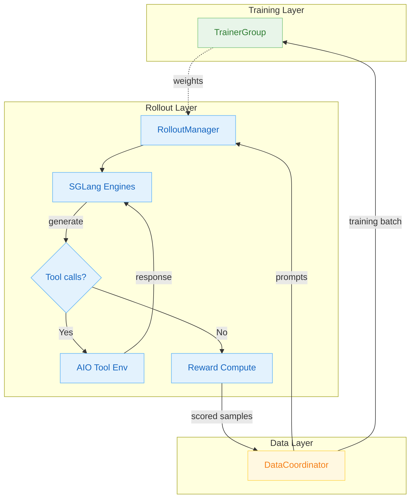
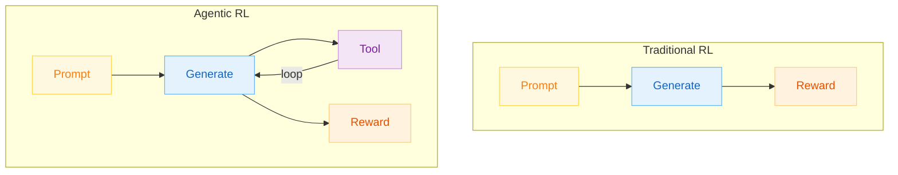
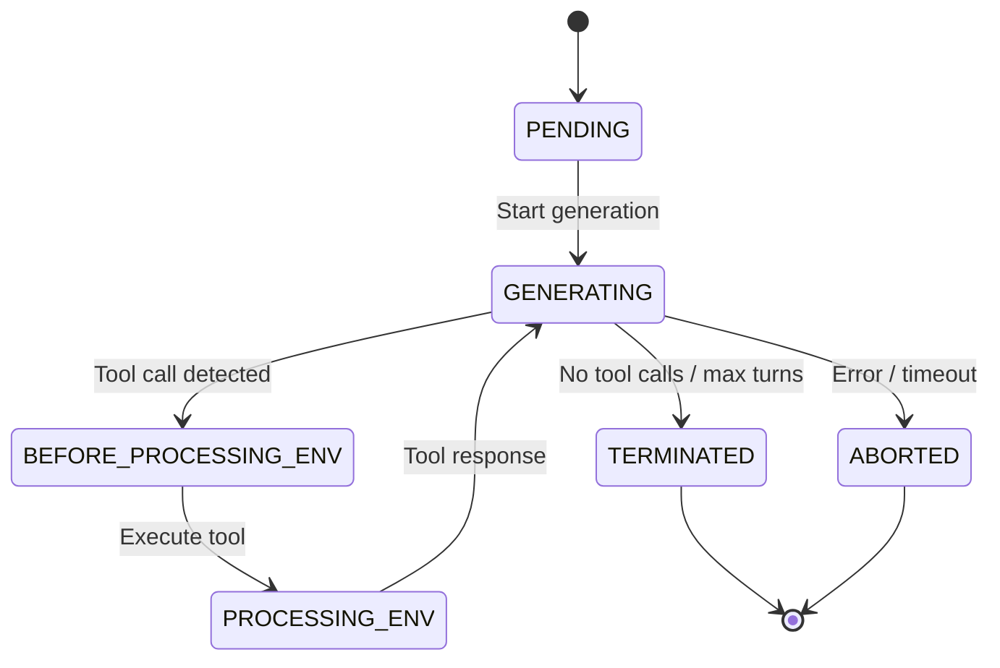
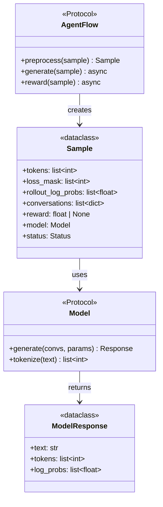
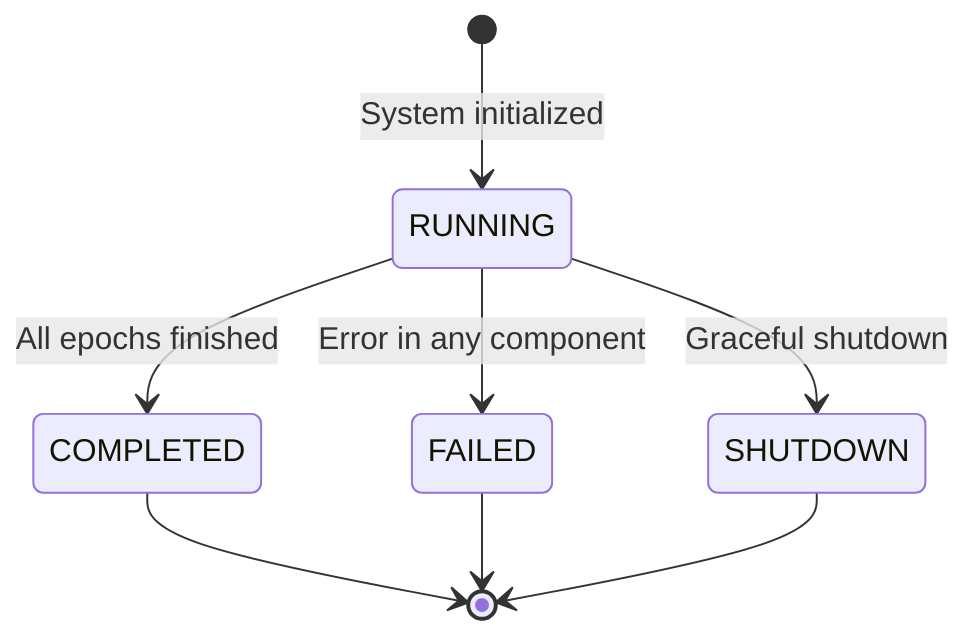

# SVG to Mermaid Migration Plan

> **For agentic workers:** REQUIRED: Use superpowers:subagent-driven-development or superpowers:executing-plans to implement this plan. Steps use checkbox (`- [ ]`) syntax for tracking.

**Goal:** Replace 55 SVG diagram references with inline Mermaid code blocks in all mkdocs documentation pages, while keeping 4 high-quality SVG diagrams for the architecture overview page.

**Architecture:** Copy 4 gold-standard SVGs from `docs/diagrams/` into mkdocs for `concepts/architecture_overview.md`. For all other 27 pages (en+zh = 54 markdown files), replace `` references with ` ```mermaid ``` ` code blocks. SVG files are retained on disk but no longer referenced.

**Tech Stack:** Mermaid.js (already configured in mkdocs via pymdownx.superfences), mkdocs-material theme

---

## Global Conventions

### Mermaid Diagram Type Mapping

| SVG Pattern | Mermaid Type |
|-------------|-------------|
| Boxes with arrows (architecture/flow) | `flowchart TD` or `flowchart LR` |
| Lifelines with messages (timing/sequence) | `sequenceDiagram` |
| State circles/ovals with transitions | `stateDiagram-v2` |
| Class boxes with methods/fields | `classDiagram` |

### Mermaid Styling Rules

1. **No `%%{init}%%` directives** — rely on global `mermaid-config.json` (theme: base, white background)
2. **Node styling** — use `classDef` for colored nodes:
   ```
   classDef blue fill:#E3F2FD,stroke:#64B5F6,color:#1565C0
   classDef green fill:#E8F5E9,stroke:#81C784,color:#2E7D32
   classDef amber fill:#FFF8E1,stroke:#FFD54F,color:#F57F17
   classDef purple fill:#F3E5F5,stroke:#CE93D8,color:#7B1FA2
   classDef gray fill:#F5F5F5,stroke:#BDBDBD,color:#616161
   classDef red fill:#FFEBEE,stroke:#EF9A9A,color:#C62828
   ```
3. **Subgraphs** — use for containers/groups (replaces SVG container rects)
4. **Keep diagram captions** — add `*Figure N: description*` as italic text below the code block
5. **White background** — already the default in light mode with base theme

### Replacement Pattern

For each SVG reference in markdown, replace:

```markdown
  { loading=lazy }
```

With:

````markdown
```mermaid
flowchart TD
    ...diagram content...
```

*Figure N: Description*
````

### File Locations

- **English docs:** `/root/code/agentic-rl/siirl-agentic/docs/mkdocs/docs/en/`
- **Chinese docs:** `/root/code/agentic-rl/siirl-agentic/docs/mkdocs/docs/zh/`
- **SVG source dir:** `/root/code/agentic-rl/siirl-agentic/docs/mkdocs/docs/assets/images/diagrams/`
- **High-quality SVGs:** `/root/code/agentic-rl/docs/diagrams/`

---

## Task 0: Copy High-Quality SVGs + Update Architecture Overview

**Files:**
- Copy from: `docs/diagrams/architecture_overview_{1,2,3,4}.svg`
- Copy to: `siirl-agentic/docs/mkdocs/docs/assets/images/diagrams/conceptsarchitecture_overview_{1,2,3,4}.svg`

- [ ] **Step 1: Copy 4 SVGs to mkdocs diagrams directory (overwrite existing)**

```bash
cp /root/code/agentic-rl/docs/diagrams/architecture_overview_1.svg /root/code/agentic-rl/siirl-agentic/docs/mkdocs/docs/assets/images/diagrams/conceptsarchitecture_overview_1.svg
cp /root/code/agentic-rl/docs/diagrams/architecture_overview_2.svg /root/code/agentic-rl/siirl-agentic/docs/mkdocs/docs/assets/images/diagrams/conceptsarchitecture_overview_2.svg
cp /root/code/agentic-rl/docs/diagrams/architecture_overview_3.svg /root/code/agentic-rl/siirl-agentic/docs/mkdocs/docs/assets/images/diagrams/conceptsarchitecture_overview_3.svg
cp /root/code/agentic-rl/docs/diagrams/architecture_overview_4.svg /root/code/agentic-rl/siirl-agentic/docs/mkdocs/docs/assets/images/diagrams/conceptsarchitecture_overview_4.svg
```

- [ ] **Step 2: Verify the copies match source**

```bash
md5sum /root/code/agentic-rl/docs/diagrams/architecture_overview_*.svg /root/code/agentic-rl/siirl-agentic/docs/mkdocs/docs/assets/images/diagrams/conceptsarchitecture_overview_*.svg
```

Expected: Matching checksums for each pair.

No markdown changes needed — `concepts/architecture_overview.md` already references `conceptsarchitecture_overview_{1,2,3,4}.svg`.

---

## Task 1: Overview + Concepts (9 SVGs → Mermaid)

**Pages (en + zh = 8 markdown files):**
- `overview.md` — 2 SVGs (overview_1.svg, overview_2.svg)
- `concepts/async_training_lifecycle.md` — 4 SVGs
- `concepts/design_philosophy.md` — 2 SVGs
- `faq/troubleshooting.md` — 1 SVG

**For each SVG:** Read the SVG file from the diagrams directory, understand its structure, then write the equivalent Mermaid code block in the markdown file (replacing the `` line). Do this for both `en/` and `zh/` versions of each page.

### overview_1.svg → flowchart TD

Read `/root/code/agentic-rl/siirl-agentic/docs/mkdocs/docs/assets/images/diagrams/overview_1.svg` and convert to:



### overview_2.svg → sequenceDiagram

Read the SVG and convert to sequenceDiagram with participants and message arrows.

### conceptsasync_training_lifecycle_{1,2,3,4}.svg

- `_1.svg` → `flowchart LR` (initialization flow states)
- `_2.svg` → `sequenceDiagram` (training iteration sequence with 5 participants)
- `_3.svg` → `flowchart TD` (async loop with overlapping rollout/training)
- `_4.svg` → `flowchart TD` (weight sync between clusters)

### conceptsdesign_philosophy_{1,2}.svg

- `_1.svg` → `flowchart TD` (design principles hierarchy)
- `_2.svg` → `flowchart TD` (sync vs async comparison with 2 subgraphs)

### faqtroubleshooting_1.svg → flowchart TD

Decision tree with 5 problem categories branching to solutions.

**Modification targets:**
- `en/overview.md` lines 81, 88
- `zh/overview.md` lines 81, 88
- `en/concepts/async_training_lifecycle.md` lines 20, 53, 60, 106
- `zh/concepts/async_training_lifecycle.md` lines 20, 53, 60, 106
- `en/concepts/design_philosophy.md` lines 24, 78
- `zh/concepts/design_philosophy.md` lines 24, 78
- `en/faq/troubleshooting.md` line 12
- `zh/faq/troubleshooting.md` line 12

---

## Task 2: Highlights (11 SVGs → Mermaid)

**Pages (en + zh = 10 markdown files):**
- `highlights/why_agentic_rl.md` — 2 SVGs
- `highlights/aio_elastic_agentic_tool_infrastructure.md` — 2 SVGs
- `highlights/mpmd_async_execution_engine.md` — 2 SVGs
- `highlights/native_agentic_trajectory_training.md` — 2 SVGs
- `highlights/pluggable_agentflow_protocol.md` — 3 SVGs

### highlightswhy_agentic_rl_{1,2}.svg

- `_1.svg` → `flowchart TD` with 2 subgraphs (Traditional RL vs Agentic RL)

Example conversion for `_1.svg`:


- `_2.svg` → `flowchart TD` (4 benefit pillars)

### highlightsaio_elastic_{1,2}.svg

- `_1.svg` → `flowchart TD` (3-layer AIO architecture with subgraphs)
- `_2.svg` → `flowchart LR` (tool execution pipeline)

### highlightsmpmd_async_{1,2}.svg

- `_1.svg` → `flowchart TD` (MPMD architecture with 5 components)
- `_2.svg` → `sequenceDiagram` (async execution timeline)

### highlightsnative_agentic_{1,2}.svg

- `_1.svg` → `stateDiagram-v2` (sample state machine)

Example:


- `_2.svg` → `flowchart TD` (trajectory data structure)

### highlightspluggable_agentflow_{1,2,3}.svg

- `_1.svg` → `classDiagram` (AgentFlow protocol + Sample + Model + ModelResponse)

Example:


- `_2.svg` → `flowchart TD` (NaiveFlow implementation)
- `_3.svg` → `classDiagram` (AgentFlow extension hierarchy)

**Modification targets:**
- `en/highlights/why_agentic_rl.md` lines 25, 39
- `en/highlights/aio_elastic_agentic_tool_infrastructure.md` lines 75, 91
- `en/highlights/mpmd_async_execution_engine.md` lines 65, 72
- `en/highlights/native_agentic_trajectory_training.md` lines 58, 74
- `en/highlights/pluggable_agentflow_protocol.md` lines 62, 93, 102
- (Same line numbers for `zh/` counterparts)

---

## Task 3: Developer Guide (8 SVGs → Mermaid)

**Pages (en + zh = 6 markdown files):**
- `developer_guide/code_structure.md` — 5 SVGs
- `developer_guide/adding_new_executor_or_flow.md` — 2 SVGs
- `developer_guide/contributing.md` — 1 SVG

### developer_guidecode_structure_{1,2,3,4,5}.svg

- `_1.svg` → `flowchart TD` (training step data flow: MainRunner → TrainerGroup → forward → advantage → loss → backward)
- `_2.svg` → `flowchart TD` (NaiveFlow state machine with tool interaction loop)
- `_3.svg` → `flowchart TD` (AgentFlow loading + 3-stage protocol)
- `_4.svg` → `flowchart LR` (config parsing: CLI → parser → OmegaConf → SiiRLArguments tree)
- `_5.svg` → `flowchart TD` (5 extension points mapping to core components)

### developer_guideadding_new_{1,2}.svg

- `_1.svg` → `classDiagram` (AgentFlow protocol + data classes)
- `_2.svg` → `flowchart TD` (3-stage pipeline with tool decision diamond)

### developer_guidecontributing_1.svg → flowchart TD

4-phase workflow: Prepare → Validate → Submit → Review (with approval decision).

**Modification targets:**
- `en/developer_guide/code_structure.md` lines 29, 36, 43, 50, 57
- `en/developer_guide/adding_new_executor_or_flow.md` lines 16, 56
- `en/developer_guide/contributing.md` line 83
- (Same for `zh/` counterparts)

---

## Task 4: User Guide Part 1 (10 SVGs → Mermaid)

**Pages (en + zh = 10 markdown files):**
- `user_guide/deployment_modes.md` — 4 SVGs
- `user_guide/agentic_multiturn.md` — 2 SVGs
- `user_guide/aio_tool_infrastructure.md` — 2 SVGs
- `user_guide/ppo_training.md` — 2 SVGs

### user_guidedeployment_modes_{1,2,3,4}.svg

- `_1.svg` → `flowchart TD` (separated mode GPU topology)
- `_2.svg` → `flowchart TD` (colocated mode GPU topology)
- `_3.svg` → `flowchart TD` with 2 subgraphs (separated vs colocated comparison)
- `_4.svg` → `flowchart TD` or `sequenceDiagram` (colocated execution timeline)

### user_guideagentic_multiturn_{1,2}.svg

- `_1.svg` → `stateDiagram-v2` (NaiveFlow state transitions)
- `_2.svg` → `sequenceDiagram` (multi-turn conversation with T=0,1,2,3 markers)

### user_guideaio_tool_{1,2}.svg

- `_1.svg` → `flowchart TD` (AIO 3-tier architecture)
- `_2.svg` → `sequenceDiagram` (tool call dispatch/execute/return)

### user_guideppo_training_{1,2}.svg

- `_1.svg` → `flowchart TD` (PPO data flow: rollout → 3 forward passes → GAE → loss → update)
- `_2.svg` → `flowchart TD` (dual-clip PPO objective visualization)

**Modification targets:**
- `en/user_guide/deployment_modes.md` lines 19, 46, 61, 68
- `en/user_guide/agentic_multiturn.md` lines 18, 101
- `en/user_guide/aio_tool_infrastructure.md` lines 18, 95
- `en/user_guide/ppo_training.md` lines 70, 82
- (Same for `zh/` counterparts)

---

## Task 5: User Guide Part 2 (10 SVGs → Mermaid)

**Pages (en + zh = 10 markdown files):**
- `user_guide/grpo_training.md` — 2 SVGs
- `user_guide/configuration_system.md` — 2 SVGs
- `user_guide/validate_reuse_and_eval_scaling.md` — 2 SVGs
- `user_guide/tool_env_and_swe.md` — 2 SVGs
- `user_guide/checkpoint_resume.md` — 2 SVGs

### user_guidegrpo_training_{1,2}.svg

- `_1.svg` → `flowchart TD` (GRPO pipeline: 1 prompt → N responses → group advantage → update)
- `_2.svg` → `flowchart TD` (group advantage computation with normalization variants)

### user_guideconfiguration_system_{1,2}.svg

- `_1.svg` → `flowchart TD` (SiiRLArguments hierarchy tree)
- `_2.svg` → `flowchart TD` (config parsing pipeline)

### user_guidevalidate_reuse_{1,2}.svg

- `_1.svg` → `flowchart TD` (validate-reuse GPU flow with 2 GPU groups)
- `_2.svg` → `flowchart LR` (GPU utilization timeline)

### user_guidetool_env_and_swe_{1,2}.svg

- `_1.svg` → `flowchart TD` (tool env architecture: NaiveFlow → ToolParser → EnvManager → ToolEnv)
- `_2.svg` → `flowchart TD` (tool registration workflow)

### user_guidecheckpoint_resume_{1,2}.svg

- `_1.svg` → `flowchart TD` (checkpoint contents: 4 components)
- `_2.svg` → `flowchart LR` (4-step resume workflow)

**Modification targets:**
- `en/user_guide/grpo_training.md` lines 52, 68
- `en/user_guide/configuration_system.md` lines 17, 38
- `en/user_guide/validate_reuse_and_eval_scaling.md` lines 20, 34
- `en/user_guide/tool_env_and_swe.md` lines 14, 85
- `en/user_guide/checkpoint_resume.md` lines 10, 50
- (Same for `zh/` counterparts)

---

## Task 6: Advanced + Reference (7 SVGs → Mermaid)

**Pages (en + zh = 6 markdown files):**
- `advanced/failure_propagation.md` — 3 SVGs
- `advanced/performance_tuning.md` — 2 SVGs
- `reference/module_map.md` — 1 SVG
- `user_guide/metrics_and_evaluation.md` — 1 SVG

### advancedfailure_propagation_{1,2,3}.svg

- `_1.svg` → `stateDiagram-v2` (training system state machine: RUNNING → COMPLETED/FAILED/SHUTDOWN)

Example:


- `_2.svg` → `sequenceDiagram` (CUDA OOM failure propagation across 5 Ray actors)
- `_3.svg` → `flowchart TD` (error origin → propagation → graceful shutdown)

### advancedperformance_tuning_{1,2}.svg

- `_1.svg` → `flowchart TD` (GPU bottleneck decision tree)
- `_2.svg` → `sequenceDiagram` (async pipeline with async_factor=2 buffering)

### referencemodule_map_1.svg → flowchart TD

Module dependency graph (entry point → workers → execution/data/algo/engine layers).

### user_guidemetrics_and_evaluation_1.svg → flowchart TD

Metrics collection pipeline (4 sources → MetricWorker → rank 0 → backends).

**Modification targets:**
- `en/advanced/failure_propagation.md` lines 23, 32, 92
- `en/advanced/performance_tuning.md` lines 12, 30
- `en/reference/module_map.md` line 10
- `en/user_guide/metrics_and_evaluation.md` line 21
- (Same for `zh/` counterparts)

---

## Execution Instructions

**Tasks 1-6 are fully independent and MUST be executed in parallel.**

Each agent should:

1. **Read the SVG file** from the diagrams directory to understand exact structure
2. **Write equivalent Mermaid** using the type mapping and styling rules above
3. **Replace the SVG reference** in the English markdown file with the Mermaid code block + caption
4. **Replace the same SVG reference** in the Chinese markdown file (same line numbers, same Mermaid code)
5. **Verify** the Mermaid syntax is valid (no unclosed quotes, correct arrow syntax)

**Task 0 should run first** (or in parallel — it only copies files, no conflict with Tasks 1-6).

**Important:**
- Do NOT delete any SVG files
- Do NOT modify `concepts/architecture_overview.md` — it keeps its SVG references
- Each Mermaid block must faithfully represent the information in the original SVG
- Use subgraphs for visual grouping where the SVG had container boxes
- Keep the Figure N numbering and caption text from the original SVG/markdown
